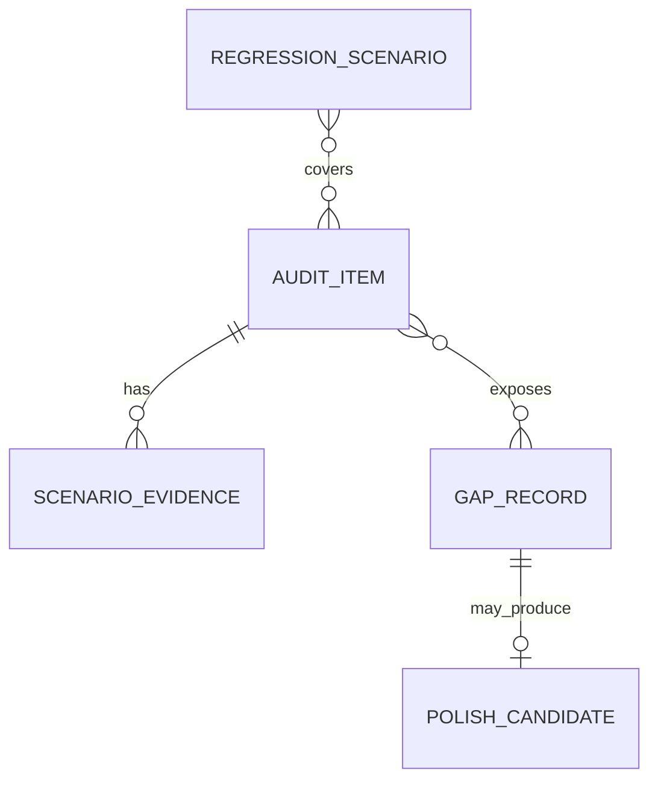

# Data Model: UI Functional Audit

Feature này không tạo bảng database mới. Các entity dưới đây là mô hình tài liệu để bảo đảm audit có cấu trúc và truy xuất được.

## AuditItem

Đại diện cho một route/menu/hành động được công bố.

| Field | Type | Rules |
|---|---|---|
| `id` | string | Duy nhất, dạng `AUD-###` |
| `area` | enum | `PUBLIC`, `CUSTOMER`, `ADMIN`, `MANAGEMENT`, `ERROR` |
| `actor` | string | Actor/role cần để thực thi |
| `route` | string | Route Angular chuẩn, ghi redirect nếu có |
| `menuLabel` | string? | Nhãn menu nếu route được công bố qua navigation |
| `component` | string | Angular component hoặc lazy component |
| `primaryAction` | string | Kết quả người dùng cần hoàn thành |
| `storyIds` | string[] | User story liên quan, ví dụ `US1`, `US2` |
| `requirementIds` | string[] | Requirement/success criteria liên quan, ví dụ `FR-006`, `SC-002` |
| `dependencies` | string[] | API, permission, property context, account/data |
| `status` | AuditStatus | Một trong năm trạng thái chuẩn |
| `evidenceIds` | string[] | Ít nhất một evidence khi không `BLOCKED` |
| `gapIds` | string[] | Bắt buộc khi `PARTIAL`, `MISSING`, `BLOCKED`, `BROKEN` |

## ScenarioEvidence

Ghi bằng chứng cho primary, alternate, error, recovery hoặc permission scenario.

| Field | Type | Rules |
|---|---|---|
| `id` | string | Dạng `EVD-###` |
| `auditItemId` | string | Tham chiếu `AuditItem` |
| `scenarioType` | enum | `PRIMARY`, `ALTERNATE`, `ERROR`, `RECOVERY`, `PERMISSION`, `RESPONSIVE`, `ACCESSIBILITY` |
| `viewport` | string? | `375`, `768`, `1024`, `1440` hoặc kích thước thực |
| `preconditions` | string | Account, role, property, data/config |
| `steps` | string[] | Có thể lặp lại, không chứa secret |
| `expected` | string | Kết quả theo spec/API/business rule |
| `actual` | string | Kết quả quan sát được |
| `result` | enum | `PASS`, `FAIL`, `BLOCKED` |
| `artifact` | string? | Screenshot, console/network note hoặc command output |
| `feedbackLatencyMs` | number? | Thời gian từ tương tác tới loading/progress feedback khi kiểm tra FR-017 |
| `testedAt` | datetime | Thời điểm kiểm thử |

## GapRecord

Một vấn đề có thể hành động, liên kết tới một hoặc nhiều audit item.

| Field | Type | Rules |
|---|---|---|
| `id` | string | Dạng `GAP-###` |
| `title` | string | Ngắn, mô tả failure cụ thể |
| `category` | enum | `UI_UX`, `RESPONSIVE`, `ACCESSIBILITY`, `NAVIGATION`, `PERMISSION`, `API_CONTRACT`, `DATA`, `BUSINESS_RULE`, `TESTABILITY` |
| `severity` | enum | `BLOCKER`, `HIGH`, `MEDIUM`, `LOW` |
| `auditItemIds` | string[] | Ít nhất một item hoặc lý do feature missing |
| `reproduction` | string[] | Bắt buộc cho P1/P2 |
| `expected` | string | Kết quả đúng |
| `actual` | string | Kết quả hiện tại |
| `evidenceIds` | string[] | Bằng chứng runtime/source |
| `disposition` | enum | `FIX_NOW`, `DEFER_FEATURE`, `BLOCKED_PREREQUISITE`, `ACCEPTED_LIMITATION` |
| `nextStep` | string | Task/file/feature spec tiếp theo |
| `resolution` | string? | Thay đổi và verification khi đã sửa |

## PolishCandidate

Ghi cải tiến UI trước khi đưa vào implementation.

| Field | Type | Rules |
|---|---|---|
| `surface` | string | Shared component, shell hoặc page |
| `problem` | string | Failure về hierarchy, clarity, state, density hoặc responsiveness |
| `tokenOrPattern` | string | Existing LuxeStay token/shared component cần dùng |
| `impact` | enum | `SYSTEM_WIDE`, `MULTI_PAGE`, `PAGE_ONLY` |
| `priority` | enum | `P1`, `P2`, `P3` |
| `acceptance` | string | Có thể kiểm tra bằng browser |

## RegressionScenario

| Field | Type | Rules |
|---|---|---|
| `id` | string | Dạng `REG-###` |
| `journey` | string | Hành trình có giá trị nghiệp vụ |
| `actor` | string | Actor thực thi |
| `routes` | string[] | Chuỗi route liên quan |
| `risk` | string | Điều có thể hồi quy |
| `preconditions` | string | Data/account/config |
| `steps` | string[] | Kịch bản ngắn, lặp lại được |
| `passCriteria` | string | Kết quả rõ ràng |

## Relationships

## State Transitions

```mermaid
stateDiagram-v2
    [*] --> BLOCKED: prerequisite missing
    [*] --> BROKEN: exposed action fails
    [*] --> PARTIAL: core works but gap remains
    [*] --> MISSING: no usable implementation
    BLOCKED --> COMPLETE: prerequisite supplied and all scenarios pass
    BLOCKED --> PARTIAL: prerequisite supplied; secondary gaps remain
    BROKEN --> COMPLETE: fix verified
    BROKEN --> PARTIAL: primary fix verified; secondary gap remains
    PARTIAL --> COMPLETE: remaining acceptance criteria verified
```

Không chuyển sang `COMPLETE` chỉ vì code đã được sửa; bắt buộc có evidence sau sửa.
