# BÁO CÁO KHÓA LUẬN TỐT NGHIỆP

## XÂY DỰNG HỆ THỐNG QUẢN LÝ VÀ ĐẶT PHÒNG KHÁCH SẠN LUXESTAY

**Sinh viên thực hiện:** Ngô Võ Tuấn An - 24TX810001; Trần Trọng Tân - 24TX810025; Nguyễn Khôi Nguyên - 24TX810011  
**Giảng viên hướng dẫn:** Huỳnh Xuân Phụng  
**Thời điểm đối chiếu mã nguồn:** 09/08/2026

# LỜI CẢM ƠN

Nhóm tác giả trân trọng cảm ơn giảng viên hướng dẫn và quý thầy cô Khoa Công nghệ Thông tin đã định hướng chuyên môn, cung cấp nền tảng kiến thức và góp ý trong quá trình thực hiện đề tài. Nhóm tiếp cận LuxeStay như một hệ thống có khả năng vận hành thực tế, vì vậy nội dung báo cáo được đối chiếu với mã nguồn, migration, cấu hình triển khai, kiểm thử và ảnh giao diện thay vì chỉ dựa vào tài liệu mô tả cũ.

# LỜI CAM ĐOAN

Nhóm cam đoan nội dung báo cáo phản ánh trạng thái dự án tại thời điểm rà soát. Các số liệu kỹ thuật được sinh từ mã nguồn hiện hành gồm **89 route frontend, 254 endpoint backend, 56 thực thể JPA, 59 migration Flyway và 356 tệp kiểm thử**. Những luồng chưa có đủ bằng chứng end-to-end được ghi nhận là hạn chế, không được trình bày như chức năng đã hoàn thiện.

# TÓM TẮT

LuxeStay là nền tảng web hỗ trợ tìm kiếm, đặt chỗ và quản lý hoạt động lưu trú. Hệ thống phục vụ khách hàng, chủ cơ sở, nhân viên vận hành và quản trị viên nền tảng thông qua các không gian giao diện và phạm vi dữ liệu tách biệt. Frontend sử dụng Angular, backend sử dụng Java và Spring Boot, dữ liệu được lưu trong SQL Server và quản lý thay đổi bằng Flyway. Ngoài luồng đặt phòng, hệ thống còn bao phủ xác thực, phân quyền, thanh toán sandbox, hóa đơn, hoàn tiền, vận hành lưu trú, housekeeping, quản lý nhiều cơ sở, subscription, audit và hỗ trợ trực tuyến.

# CHƯƠNG 1 - TỔNG QUAN ĐỀ TÀI

## 1.1. Đặt vấn đề

Hoạt động kinh doanh lưu trú đồng thời chứa bài toán thương mại điện tử và bài toán vận hành nội bộ. Khách hàng cần tìm đúng địa điểm, xác định phòng trống, giá, chính sách và hoàn thành đặt chỗ. Đơn vị lưu trú cần quản lý loại phòng, phòng vật lý, nhân sự, dịch vụ, check-in, check-out, doanh thu và lịch sử thay đổi. Nếu các nghiệp vụ được xử lý bằng nhiều công cụ rời rạc, dữ liệu dễ mất đồng bộ, khó truy vết và tăng nguy cơ bán vượt tồn phòng.

Đề tài đặt ra yêu cầu xây dựng một nền tảng thống nhất, trong đó backend giữ vai trò nguồn sự thật cho trạng thái phòng, booking, thanh toán và quyền truy cập; frontend cung cấp trải nghiệm phù hợp cho từng nhóm người dùng; cơ sở dữ liệu bảo toàn lịch sử nghiệp vụ; hệ thống triển khai có thể cấu hình theo môi trường.

## 1.2. Lý do chọn đề tài

LuxeStay được lựa chọn vì bài toán có tính thực tiễn, nhiều actor, nhiều trạng thái và yêu cầu kỹ thuật liên ngành. Đề tài tạo điều kiện vận dụng phân tích yêu cầu, thiết kế cơ sở dữ liệu, phát triển API, giao diện responsive, bảo mật, kiểm thử và container hóa trong cùng một sản phẩm.

## 1.3. Mục tiêu nghiên cứu

- Xây dựng trải nghiệm tìm kiếm và đặt phòng theo dữ liệu thực tế của hệ thống.
- Quản lý xuyên suốt vòng đời booking, thanh toán, hủy, hoàn tiền, hóa đơn và lưu trú.
- Cung cấp khu vực quản trị nền tảng và khu vực quản lý theo từng cơ sở.
- Áp dụng JWT, RBAC và kiểm tra phạm vi property ở backend.
- Quản lý schema bằng migration và xây dựng bằng chứng kiểm thử có thể lặp lại.

## 1.4. Phạm vi đề tài

### 1.4.1. Phạm vi thực hiện

Phạm vi gồm website công khai, tài khoản khách hàng, tìm kiếm cơ sở, chi tiết phòng, checkout, thanh toán sandbox/demo, lịch sử booking, hóa đơn, hoàn tiền, đăng ký đối tác, quản trị người dùng và tài sản, quản lý phòng, housekeeping, dịch vụ, doanh thu, gói dịch vụ, phân quyền, audit và chat hỗ trợ.

### 1.4.2. Nội dung ngoài phạm vi

Đề tài chưa khẳng định thanh toán tiền thật trong môi trường production, chưa chứng minh tải lớn và khả năng phục hồi thảm họa ở quy mô doanh nghiệp, chưa có ứng dụng mobile native và chưa có bằng chứng end-to-end hoàn chỉnh cho mọi thao tác quản trị. Các tích hợp bên ngoài chỉ được coi là hoàn thiện khi có khóa hợp lệ và bằng chứng sandbox tương ứng.

### 1.4.3. Đánh giá phạm vi nghiên cứu

Phạm vi hiện tại lớn hơn một website đặt phòng cơ bản vì bao phủ đồng thời marketplace, vận hành cơ sở và quản trị nền tảng. Điều này làm tăng giá trị học thuật nhưng cũng đòi hỏi giới hạn kết luận theo bằng chứng: giao diện render được không đồng nghĩa toàn bộ CRUD hoặc tích hợp ngoài đã thành công.

## 1.5. Phương pháp thực hiện

### 1.5.1. Khảo sát yêu cầu và phân tích hệ thống

Nhóm rà soát route Angular, controller, service, repository, entity, migration, cấu hình security và test để xác định chức năng thực tế. Tài liệu cũ chỉ được dùng như chỉ mục, không được xem là nguồn sự thật nếu mâu thuẫn với code.

### 1.5.2. Mô hình hóa hệ thống (Use Case, ERD)

Actor và use case được suy ra từ route, quyền, service và phạm vi dữ liệu. ERD được đối chiếu giữa entity JPA và migration Flyway. Các luồng đặt phòng, thanh toán, lưu trú và phân quyền được mô tả bằng activity/sequence diagram.

### 1.5.3. Kiến trúc ba tầng

Presentation layer sử dụng Angular; application layer sử dụng Spring Boot với controller, service và security; data layer sử dụng JPA, repository, SQL Server và Flyway. Các tích hợp ngoài được cô lập qua service/gateway và cấu hình môi trường.

### 1.5.4. Kiểm thử và đánh giá hệ thống

Việc đánh giá kết hợp unit test, controller/security test, integration test, build production, kiểm tra cấu trúc tài liệu và quan sát giao diện đã triển khai. Kết quả được phân loại PASS, PARTIAL hoặc BLOCKED để tránh suy diễn.

# CHƯƠNG 2 - CƠ SỞ LÝ THUYẾT VÀ CÔNG NGHỆ

## 2.1. Tổng quan lĩnh vực đặt phòng trực tuyến

Nền tảng đặt phòng trực tuyến kết nối nhu cầu lưu trú với dữ liệu cung ứng theo thời gian. Ba dữ liệu quan trọng nhất là khoảng ngày, sức chứa và tồn phòng. Kết quả tìm kiếm chỉ có ý nghĩa khi backend tái kiểm tra tồn tại thời điểm tạo booking. Giá, chính sách, thuế/phí và trạng thái thanh toán cần được lưu dưới dạng snapshot để bảo toàn lịch sử giao dịch.

## 2.2. Kiến trúc hệ thống

### 2.2.1. KIẾN TRÚC ỨNG DỤNG WEB NHIỀU TẦNG

Hệ thống được tổ chức thành frontend, backend và tầng dữ liệu. Frontend Angular chịu trách nhiệm trình bày và tương tác [1]. Backend Spring Boot cung cấp REST API, xác thực, phân quyền và xử lý nghiệp vụ [8]. Tầng dữ liệu lưu trữ trạng thái bền vững và thực thi các ràng buộc toàn vẹn.

Cách phân chia này giúp giảm phụ thuộc giữa giao diện và nghiệp vụ, hỗ trợ kiểm thử từng tầng, đồng thời cho phép thay đổi cách trình bày mà không làm thay đổi quy tắc nghiệp vụ cốt lõi.

### 2.3.1. REST API VÀ DTO

REST tổ chức tài nguyên qua URL và sử dụng phương thức HTTP để biểu diễn thao tác. LuxeStay dùng DTO cho dữ liệu trao đổi nhằm tránh lộ cấu trúc thực thể, hạn chế JSON đệ quy và kiểm soát dữ liệu đầu vào, đầu ra.

Các mã trạng thái chính gồm:

- `200 OK`: yêu cầu thành công.
- `201 Created`: tạo tài nguyên thành công.
- `400 Bad Request`: dữ liệu đầu vào không hợp lệ.
- `401 Unauthorized`: chưa xác thực hoặc token không hợp lệ.
- `403 Forbidden`: không đủ quyền hoặc vượt giới hạn gói.
- `404 Not Found`: không tìm thấy tài nguyên.
- `409 Conflict`: xung đột tồn phòng hoặc trạng thái nghiệp vụ.

### 2.3.2. XÁC THỰC JWT VÀ PHÂN QUYỀN

JWT là chuỗi token có chữ ký, chứa thông tin nhận dạng và thời hạn. Sau khi đăng nhập, client gửi token trong tiêu đề `Authorization`. Backend xác minh chữ ký, thời hạn và dựng ngữ cảnh bảo mật cho từng yêu cầu.

Hệ thống kết hợp ba lớp kiểm soát:

1. **Role:** xác định nhóm người dùng.
2. **Permission và Action Mask:** xác định hành động VIEW, CREATE, UPDATE, DELETE, EXPORT hoặc APPROVE trên chức năng.
3. **Feature Gate:** giới hạn tài nguyên theo gói đăng ký.

Backend là nơi quyết định quyền cuối cùng. Route Guard phía Angular chỉ hỗ trợ trải nghiệm và không thay thế kiểm tra tại máy chủ. Các cơ chế filter chain và method authorization được triển khai theo mô hình của Spring Security [9].

### 2.3.3. QUẢN LÝ TỒN PHÒNG VÀ GIAO DỊCH

Tồn phòng được xác định theo loại phòng, khoảng ngày và số lượng đã giữ bởi các booking có hiệu lực. Khi tạo booking, backend phải kiểm tra lại giá, sức chứa và số phòng còn lại thay vì tin dữ liệu từ client.

Giao dịch cơ sở dữ liệu bảo đảm chuỗi thao tác được hoàn thành toàn bộ hoặc hoàn tác. Khóa bản ghi khi xử lý thanh toán, hủy booking và cập nhật tài nguyên giúp giảm nguy cơ hai yêu cầu đồng thời tạo dữ liệu không nhất quán.

### 2.3.4. IDEMPOTENCY TRONG THANH TOÁN

Một callback thanh toán có thể được cổng thanh toán gửi nhiều lần. Idempotency bảo đảm cùng một giao dịch chỉ tạo một kết quả nghiệp vụ. LuxeStay dùng mã giao dịch duy nhất và ràng buộc cơ sở dữ liệu để chống ghi nhận trùng.

Hoàn tiền được lưu bằng giao dịch âm có mã xác định từ giao dịch gốc. Cách lưu này giữ được lịch sử thay vì sửa hoặc xóa giao dịch đã thành công.

### 2.3.5. UNICODE VÀ TÌM KIẾM TIẾNG VIỆT

Dữ liệu tiếng Việt cần được lưu bằng kiểu Unicode. Hệ thống sử dụng các cột `NVARCHAR`, đọc dữ liệu nhập bằng UTF-8 và xử lý BOM. Giá trị tìm kiếm được chuẩn hóa để người dùng có thể nhập có dấu hoặc không dấu.

Mô hình địa giới gồm tỉnh/thành phố và phường/xã, không dùng quận/huyện. Cấu trúc này phù hợp tập dữ liệu hiện hành của dự án và giảm số bước chọn địa điểm.

### 2.3.6. CÔNG NGHỆ SỬ DỤNG

**Bảng 2.1. Công nghệ chính của hệ thống**

| Tầng | Công nghệ | Vai trò |
|---|---|---|
| Backend | Java 21, Spring Boot 3.2.5 | REST API và nghiệp vụ [5], [8] |
| Bảo mật | Spring Security, JWT | Xác thực và phân quyền [9] |
| Dữ liệu | Spring Data JPA, Hibernate | Ánh xạ và truy cập dữ liệu |
| Migration | Flyway | Quản lý thay đổi schema [4] |
| API | springdoc-openapi | Tài liệu và kiểm tra endpoint |
| Frontend | Angular 22, TypeScript 6 | Giao diện ứng dụng [1] |
| UI | PrimeNG 21, Tailwind CSS 3 | Thành phần và định dạng [7] |
| Biểu đồ | Chart.js 4 | Trực quan hóa số liệu [2] |
| Kiểm thử | JUnit, Mockito, Spring Test, Playwright | Kiểm thử tự động [6], [8] |
| Triển khai | Docker Compose | Khởi tạo các dịch vụ [3] |

Bảng 2.1 cho thấy hệ thống sử dụng các công nghệ phổ biến, có hệ sinh thái kiểm thử và hỗ trợ tốt cho kiến trúc web nhiều tầng.

---

## 2.3. Công nghệ và thư viện sử dụng

Công nghệ được liệt kê theo cấu hình thực tế gồm Java 21, Spring Boot 3.2.5, Spring MVC, Spring Data JPA, Spring Security, JWT, Bean Validation, Flyway, SQL Server, Maven, Angular 22, TypeScript, RxJS, Angular Router, Forms, PrimeNG, STOMP/SockJS, Docker Compose và Nginx. Các tích hợp gồm VNPay sandbox/demo, social login, SMTP và trợ lý AI theo cấu hình môi trường.

# CHƯƠNG 3 - PHÂN TÍCH VÀ THIẾT KẾ HỆ THỐNG

## 3.1. Phân tích yêu cầu chức năng

### 3.1.1. Actor và phạm vi dữ liệu

| Actor | Chức năng chính | Phạm vi dữ liệu |
|---|---|---|
| Khách vãng lai | Tìm kiếm, xem chi tiết cơ sở, đăng ký và đăng nhập | Dữ liệu công khai |
| Khách hàng | Đặt/hủy phòng, thanh toán, hóa đơn, hoàn tiền, yêu thích, hỗ trợ | Tài khoản của chính người dùng |
| Chủ cơ sở | Quản lý cơ sở, phòng, nhân sự, dịch vụ, doanh thu và cấu hình | Các property được cấp quyền |
| Nhân viên | Check-in, check-out, dịch vụ phát sinh, housekeeping | Property và nhiệm vụ được phân công |
| Quản trị hệ thống | Người dùng, vai trò, quyền, duyệt cơ sở, gói dịch vụ, audit | Toàn nền tảng theo quyền |

### 3.1.2. Các luồng nghiệp vụ chính

Ngày rà soát: 2026-08-05 
Tổng số luồng chính được chuẩn hóa: **12**.

### 1. Quy ước trạng thái

- **PASS**: luồng cốt lõi có bằng chứng thực thi phù hợp.
- **PARTIAL**: luồng có thể đi qua một phần nhưng còn lỗi, permission, cấu hình ngoài hoặc thiếu kiểm chứng end-to-end.
- **BLOCKED**: không thể hoàn tất vì thiếu key/project/dịch vụ ngoài.
- Mọi chuyển trạng thái phải được backend xác nhận; UI không phải nguồn sự thật cho booking, payment hoặc permission.

### 2. Ma trận luồng chính

| ID | Luồng | Actor chính | Điểm vào | Kết quả mong đợi | Trạng thái audit |
|---|---|---|---|---|---|
| BF-01 | Đăng ký, xác minh, đăng nhập và duy trì phiên | Guest/Customer/Admin | `/register`, `/login`, `/admin/login` | Tài khoản hợp lệ và phiên được kiểm soát | PASS |
| BF-02 | Tìm kiếm khách sạn và xem chi tiết | Guest/Customer | Trang chủ, search result | Danh sách và chi tiết theo tiêu chí | PASS |
| BF-03 | Kiểm tra phòng trống và tạo booking hold | Customer | Hotel detail/checkout | Giữ chỗ có TTL, chống vượt tồn | PARTIAL |
| BF-04 | Checkout và thanh toán | Customer/Provider | Booking checkout | Giao dịch được tạo, callback xác minh, booking cập nhật | BLOCKED |
| BF-05 | Hủy booking và hoàn tiền | Customer/Staff/Provider | Booking history/admin | Hủy đúng policy, refund idempotent | PARTIAL |
| BF-06 | Check-in, lưu trú và check-out | Staff | Reservation/stay management | Stay lifecycle hợp lệ, phòng được giải phóng | PARTIAL |
| BF-07 | Đăng ký và phê duyệt đối tác/property | Partner/Admin | Partner register/property approvals | Property được kiểm duyệt trước publish | PARTIAL |
| BF-08 | Quản lý loại phòng, phòng, giá và tồn | Property staff/Owner | Management rooms/room types | Catalog và inventory nhất quán | PARTIAL |
| BF-09 | Housekeeping và dịch vụ phát sinh | Staff | Management housekeeping/services | Nhiệm vụ và charge được theo dõi | PARTIAL |
| BF-10 | Quản lý role và permission | System admin | Admin roles/permissions | Quyền UI/API nhất quán, least privilege | PARTIAL |
| BF-11 | Gói dịch vụ và subscription billing | Owner/System admin | Plans/subscription billing | Subscription và giới hạn sử dụng chính xác | PARTIAL |
| BF-12 | Dashboard, doanh thu, audit và chat | Admin/Owner/Staff | Dashboard/reports/audit/chat | Số liệu truy xuất được và có audit trail | PARTIAL |

### 3. Chi tiết từng luồng

#### BF-01 - Đăng ký, xác minh, đăng nhập và duy trì phiên

**Actor:** Guest, Customer, Admin; Google/Facebook là actor ngoài tùy chọn. 
**Tiền điều kiện:** email/username hợp lệ; account active; JWT secret hợp lệ; SMTP/OAuth chỉ cần cho nhánh tương ứng.

Luồng chuẩn:

1. Người dùng đăng ký bằng credential; backend chuẩn hóa định danh và kiểm tra trùng.
2. Backend tạo user/role mặc định, phát token xác minh email và ghi mail outbox nếu bật.
3. Người dùng đăng nhập; backend kiểm tra trạng thái account và cấp access token cùng refresh cookie.
4. Angular lưu access token theo tab, interceptor gắn bearer token và làm mới một lần khi cần.
5. Logout/password change/account disable thu hồi phiên theo policy.

Nhánh lỗi: sai mật khẩu, account suspended, token hết hạn/replay, email trùng, OAuth audience không hợp lệ. 
**Bằng chứng:** các route auth, `AuthService`, Spring Security/JWT, refresh token migrations và các capability `AUTH-*` trong inventory. 
**Còn thiếu:** SMTP/OAuth sandbox thực chưa được xác minh; Google browser flow phát sinh FedCM/network warning.

#### BF-02 - Tìm kiếm khách sạn và xem chi tiết

**Actor:** Guest, Customer. 
**Tiền điều kiện:** dữ liệu location/property đã seed/import và property được publish.

1. Người dùng nhập địa điểm, ngày nhận/trả, số khách/phòng.
2. Frontend chuẩn hóa query và gọi public search API.
3. Backend lọc property, availability, capacity và trạng thái publish.
4. Người dùng mở hotel detail, xem ảnh, tiện ích, dịch vụ, loại phòng và giá.
5. Hệ thống hiển thị lựa chọn phù hợp hoặc trạng thái empty/error.

**Bằng chứng thực thi:** `UI-001` đến `UI-004`; public API tại backend E2E trả HTTP 200. 
**Rủi ro:** cần E2E regression cho timezone, ranh giới ngày, đồng thời nhiều người đặt và dữ liệu location lớn.

#### BF-03 - Kiểm tra phòng trống và tạo booking hold

**Actor:** Customer. 
**Tiền điều kiện:** đăng nhập, ngày hợp lệ, inventory còn đủ.

1. Customer chọn loại phòng và số lượng.
2. Backend tái kiểm tra availability thay vì tin dữ liệu UI.
3. Backend tạo hold với TTL (`RESERVATION_HOLD_TTL_MINUTES`, mặc định 15 phút).
4. Checkout nhận snapshot giá/phí/chính sách và thông tin khách.
5. Hold hết hạn được scheduler giải phóng nếu chưa hoàn tất.

**Bằng chứng:** màn chi tiết và checkout đã render; cấu hình hold ở `application.yml`. 
**Trạng thái PARTIAL:** chưa có bằng chứng tải đồng thời/oversell và toàn bộ backend regression đang không xanh.

#### BF-04 - Checkout và thanh toán

**Actor:** Customer, backend payment orchestration, VNPay/MoMo/ZaloPay hoặc simulator.

1. Customer xác nhận booking và chọn phương thức thanh toán.
2. Backend tạo payment attempt/idempotency context và redirect URL đã ký.
3. Provider xử lý sandbox, redirect browser về payment result và gửi callback/IPN server-to-server.
4. Backend xác minh chữ ký, amount, merchant, trạng thái và chống replay.
5. Transaction/booking được cập nhật nguyên tử; recovery job query lại giao dịch chưa rõ kết quả.

**Callback hiện thấy trong source:**

- `/api/payments/vnpay-callback`, `/api/payments/vnpay-ipn`
- `/api/payments/momo-ipn`
- `/api/payments/zalopay-callback`
- `/api/payment-providers/property/{provider}/callback`
- `/api/payment-providers/platform/{provider}/callback`
- `/api/payment-providers/property/{provider}/refund-callback`
- `/api/payment-providers/platform/{provider}/refund-callback`

**Trạng thái BLOCKED:** simulator không có signed token chỉ hiển thị invalid session đúng thiết kế; VNPay/MoMo/ZaloPay chưa có bằng chứng merchant sandbox và callback public. MoMo còn thiếu contract biến môi trường trong `.env.example`.

#### BF-05 - Hủy booking và hoàn tiền

**Actor:** Customer, property staff, system admin, payment provider.

1. Actor yêu cầu hủy; backend tải booking và policy hiện hành.
2. Backend kiểm tra quyền, thời hạn, trạng thái stay và số tiền có thể hoàn.
3. Booking chuyển sang trạng thái hủy phù hợp; refund request dùng idempotency key.
4. Provider trả kết quả đồng bộ hoặc callback; recovery query xử lý trạng thái chưa chắc chắn.
5. Invoice/revenue/audit được điều chỉnh, customer xem lịch sử hoàn tiền.

**Bằng chứng UI:** `UI-012`, `UI-037`; route management refund bị 403 với owner fixture. 
**Rủi ro:** test backend còn lỗi ở manual transfer confirmation/property payment configuration; cần xác minh double-refund và partial refund.

#### BF-06 - Check-in, lưu trú và check-out

**Actor:** Receptionist/Staff/Manager.

1. Nhân viên tìm booking đã xác nhận và kiểm tra ngày/guest/payment.
2. Gán phòng thực tế, xác nhận check-in và chuyển room/stay status.
3. Trong thời gian lưu trú, dịch vụ và housekeeping phát sinh được ghi nhận.
4. Check-out tổng hợp charge, thanh toán còn lại và cập nhật invoice.
5. Room chuyển qua trạng thái cần dọn, sau đó available khi housekeeping hoàn tất.

**Trạng thái PARTIAL:** source có domain/API liên quan nhưng bộ ảnh chưa bao phủ đầy đủ thao tác check-in/out và test regression không xanh.

#### BF-07 - Đăng ký và phê duyệt đối tác/property

**Actor:** Partner/Owner, System admin.

1. Partner đăng ký và gửi thông tin pháp lý/property.
2. Backend lưu hồ sơ ở trạng thái chờ duyệt.
3. Admin xem hàng đợi, approve/reject với lý do và audit.
4. Sau khi duyệt, owner nhận role/property context và mới được cấu hình catalog/publish.

**Bằng chứng UI:** `UI-008`, `UI-030`. 
**Rủi ro:** frontend test còn lỗi tại partner approval action; cần E2E cho reject/resubmit và giới hạn tenant.

#### BF-08 - Quản lý loại phòng, phòng, giá và tồn

**Actor:** Property owner/manager/staff; system admin trong phạm vi hỗ trợ.

1. Actor chọn property trong tenant context.
2. Tạo/cập nhật loại phòng, sức chứa, tiện ích, ảnh và chính sách.
3. Tạo phòng vật lý và trạng thái vận hành.
4. Cấu hình giá/tồn theo ngày; backend kiểm tra overlap và quyền property.
5. Public search chỉ nhận catalog đã publish và còn inventory.

**Bằng chứng UI:** `UI-018`, `UI-019`, `UI-032`, `UI-033`. 
**Rủi ro:** cần kiểm thử isolation giữa property, bulk update, concurrent booking và dữ liệu giá lịch sử.

#### BF-09 - Housekeeping và dịch vụ phát sinh

**Actor:** Housekeeping staff, reception, manager.

1. Check-out hoặc yêu cầu nội bộ tạo housekeeping task.
2. Nhân viên nhận việc, cập nhật tiến độ và kết quả.
3. Dịch vụ được đặt cho booking/stay, áp giá và ghi charge.
4. Hoàn tất housekeeping cập nhật room status; charge đi vào invoice.

**Bằng chứng UI:** `UI-021`, `UI-034`, `UI-035`. 
**Trạng thái PARTIAL:** cần E2E cho assignment race, cancellation, offline retry và invoice reconciliation.

#### BF-10 - Quản lý role và permission

**Actor:** System admin.

1. Admin tạo/sửa role và tập permission.
2. Gán role cho user trong scope hợp lệ.
3. Frontend guard/menu chỉ hiển thị route được phép.
4. Backend vẫn kiểm tra permission/tenant cho mọi request.
5. Thay đổi quyền được audit và có hiệu lực theo session policy.

**Bằng chứng UI:** `UI-023`, `UI-024`. 
**Trạng thái PARTIAL:** bốn route management bị 403 với owner fixture, cần đối chiếu menu/guard/API authority và test matrix role x route x endpoint.

#### BF-11 - Gói dịch vụ và subscription billing

**Actor:** System admin, property owner.

1. Admin quản lý plan, giới hạn và giá.
2. Owner chọn/nâng/hạ gói; backend kiểm tra chu kỳ và hiệu lực.
3. Usage được đo và enforcement theo property/subscription.
4. Billing/payment tạo invoice và cập nhật subscription sau xác nhận.

**Bằng chứng UI:** `UI-025`, `UI-039`. 
**Trạng thái PARTIAL:** route subscription billing trả 403 cho owner fixture; frontend test còn lỗi assertion về subscription policy text.

#### BF-12 - Dashboard, doanh thu, audit và chat

**Actor:** System admin, owner, manager, staff.

1. Dashboard tải KPI theo time range và tenant scope.
2. Báo cáo doanh thu tổng hợp booking/payment/refund/invoice.
3. Audit log ghi actor, action, target, thời gian và correlation context.
4. Chat/notification dùng WebSocket với xác thực và origin allowlist.

**Bằng chứng UI:** `UI-015`, `UI-027` đến `UI-029`, `UI-031`, `UI-038`, `UI-040`, `UI-041`. 
**Rủi ro:** backend test có lỗi financial performance; frontend có lỗi chat setup và thiếu mock `listSocialIdentities()`; management audit log trả 403.

### 4. Business rule xuyên luồng

#### P0-02G - Read access và subscription growth gate

- `GET /api/v1/hotels/my-hotels` là read-only principal-owned discovery: authenticated user nhận 200 kể cả khi chưa có growth quota.
- P0-02H giữ nguyên security flow: `/api/auth/email-verification/confirm` và các discovery/spotlight/promotion/quote route dưới `/api/public/**` là public có chủ đích; `/api/v1/hotels/my-hotels` đi qua authenticated fallback và chỉ truy vấn theo principal `userId`. Architecture allowlist chỉ được mở theo từng method, không theo controller/package.
- Subscription feature không thay thế role/property authorization. Mutation probe đúng role nhưng thiếu `MAX_PROPERTIES` trả 403; có feature nhưng sai role vẫn trả 403.
- `MAX_PROPERTIES` chỉ áp dụng khi tạo/claim thêm cơ sở; property-scoped room/type/image mutation dùng entitlement của target property theo T198.
- Luồng này giữ fail-closed cho mutation trả phí nhưng không khóa read/recovery access khi subscription hết hoặc thiếu feature.

| Rule | Yêu cầu |
|---|---|
| BR-01 | Mọi booking/payment/refund transition phải do backend xác nhận và có audit |
| BR-02 | Không cho oversell; availability phải được kiểm tra lại trong transaction/locking strategy |
| BR-03 | Callback payment phải xác minh chữ ký, merchant, amount, currency, replay và idempotency |
| BR-04 | Tenant/property scope phải được kiểm tra ở API và query, không chỉ route guard |
| BR-05 | Secret chỉ đi qua secret store/environment; frontend ID công khai không được nhầm với secret |
| BR-06 | Trạng thái phòng phải phù hợp với booking/stay/housekeeping lifecycle |
| BR-07 | Refund không được vượt số tiền đã thu trừ phần đã hoàn trước đó |
| BR-08 | Báo cáo tài chính phải truy xuất được về transaction/invoice/refund nguồn |

### 5. Acceptance gate cho demo

1. Given một customer fixture hợp lệ, when tìm kiếm đến checkout, then luồng chạy lại ổn định không có console/API error chặn thao tác.
2. Given từng role demo, when mở menu đã công bố, then route và API tương ứng trả đúng quyền, không có 403 ngoài dự kiến.
3. Given payment simulator có token hợp lệ, when hoàn tất success/fail/cancel, then booking/payment hiển thị trạng thái nhất quán và idempotent.
4. Given test environment sạch, when chạy toàn bộ frontend/backend test, then không có failure/error/unhandled exception thuộc phạm vi demo.
5. Given cấu hình sandbox provider, when callback qua URL HTTPS public, then chữ ký được xác minh và audit/recovery hoạt động.

## 3.2. Thiết kế cơ sở dữ liệu

Hệ thống có 56 lớp entity được kiểm kê. Danh sách dưới đây thể hiện tên lớp, bảng ánh xạ và vị trí mã nguồn; mô tả chi tiết thuộc tính và quan hệ được triển khai trực tiếp trong các entity và migration tương ứng.

| STT | Entity | Bảng | Tệp nguồn |
|---|---|---|---|
| 1 | AccountSubscription | account_subscriptions | backend/src/main/java/com/hotel/entities/AccountSubscription.java |
| 2 | AppFunction | app_function | backend/src/main/java/com/hotel/entities/AppFunction.java |
| 3 | AppModule | app_module | backend/src/main/java/com/hotel/entities/AppModule.java |
| 4 | AuditableEntity | Lớp cơ sở/không ánh xạ bảng | backend/src/main/java/com/hotel/entities/AuditableEntity.java |
| 5 | ChatMessage | chat_messages | backend/src/main/java/com/hotel/entities/ChatMessage.java |
| 6 | CustomerMembership | customer_memberships | backend/src/main/java/com/hotel/entities/CustomerMembership.java |
| 7 | DemoSeedProgress | demo_seed_progress | backend/src/main/java/com/hotel/entities/DemoSeedProgress.java |
| 8 | EmailVerificationToken | email_verification_tokens | backend/src/main/java/com/hotel/entities/EmailVerificationToken.java |
| 9 | Hotel | hotels | backend/src/main/java/com/hotel/entities/Hotel.java |
| 10 | HotelService | services | backend/src/main/java/com/hotel/entities/HotelService.java |
| 11 | HousekeepingTask | housekeeping_tasks | backend/src/main/java/com/hotel/entities/HousekeepingTask.java |
| 12 | Invoice | invoices | backend/src/main/java/com/hotel/entities/Invoice.java |
| 13 | LandmarkImportIssue | landmark_import_issues | backend/src/main/java/com/hotel/entities/LandmarkImportIssue.java |
| 14 | Location | locations | backend/src/main/java/com/hotel/entities/Location.java |
| 15 | LocationImportRun | location_import_runs | backend/src/main/java/com/hotel/entities/LocationImportRun.java |
| 16 | MembershipTier | membership_tiers | backend/src/main/java/com/hotel/entities/MembershipTier.java |
| 17 | Notification | notifications | backend/src/main/java/com/hotel/entities/Notification.java |
| 18 | OperationalAuditEvent | operational_audit_events | backend/src/main/java/com/hotel/entities/OperationalAuditEvent.java |
| 19 | PasswordResetToken | password_reset_tokens | backend/src/main/java/com/hotel/entities/PasswordResetToken.java |
| 20 | Payment | payments | backend/src/main/java/com/hotel/entities/Payment.java |
| 21 | PaymentSession | payment_sessions | backend/src/main/java/com/hotel/entities/PaymentSession.java |
| 22 | PlanFeature | plan_features | backend/src/main/java/com/hotel/entities/PlanFeature.java |
| 23 | PromotionCampaign | promotion_campaigns | backend/src/main/java/com/hotel/entities/PromotionCampaign.java |
| 24 | PromotionRedemption | promotion_redemptions | backend/src/main/java/com/hotel/entities/PromotionRedemption.java |
| 25 | PropertyClaimRequest | property_claim_requests | backend/src/main/java/com/hotel/entities/PropertyClaimRequest.java |
| 26 | PropertyExternalPhoto | property_external_photos | backend/src/main/java/com/hotel/entities/PropertyExternalPhoto.java |
| 27 | PropertyImage | property_images | backend/src/main/java/com/hotel/entities/PropertyImage.java |
| 28 | PropertyImportBatch | property_import_batches | backend/src/main/java/com/hotel/entities/PropertyImportBatch.java |
| 29 | PropertyImportItem | property_import_items | backend/src/main/java/com/hotel/entities/PropertyImportItem.java |
| 30 | RefreshTokenSession | auth_refresh_tokens | backend/src/main/java/com/hotel/entities/RefreshTokenSession.java |
| 31 | RefundProviderAttempt | refund_provider_attempts | backend/src/main/java/com/hotel/entities/RefundProviderAttempt.java |
| 32 | RefundRequest | refund_requests | backend/src/main/java/com/hotel/entities/RefundRequest.java |
| 33 | Reservation | reservations | backend/src/main/java/com/hotel/entities/Reservation.java |
| 34 | ReservationDetail | reservation_details | backend/src/main/java/com/hotel/entities/ReservationDetail.java |
| 35 | ReservationHold | reservation_holds | backend/src/main/java/com/hotel/entities/ReservationHold.java |
| 36 | ReservationRoom | reservation_rooms | backend/src/main/java/com/hotel/entities/ReservationRoom.java |
| 37 | ReservationServiceItem | reservation_services | backend/src/main/java/com/hotel/entities/ReservationServiceItem.java |
| 38 | Role | app_role | backend/src/main/java/com/hotel/entities/Role.java |
| 39 | RolePermission | app_role_permission | backend/src/main/java/com/hotel/entities/RolePermission.java |
| 40 | of | app_role_permission_audit | backend/src/main/java/com/hotel/entities/RolePermissionAudit.java |
| 41 | Room | rooms | backend/src/main/java/com/hotel/entities/Room.java |
| 42 | RoomImage | room_images | backend/src/main/java/com/hotel/entities/RoomImage.java |
| 43 | RoomType | room_types | backend/src/main/java/com/hotel/entities/RoomType.java |
| 44 | RoomTypeImage | room_type_images | backend/src/main/java/com/hotel/entities/RoomTypeImage.java |
| 45 | SocialIdentity | social_identities | backend/src/main/java/com/hotel/entities/SocialIdentity.java |
| 46 | SoftwareContract | software_contracts | backend/src/main/java/com/hotel/entities/SoftwareContract.java |
| 47 | SponsoredPlacement | sponsored_placements | backend/src/main/java/com/hotel/entities/SponsoredPlacement.java |
| 48 | SubscriptionFeature | subscription_features | backend/src/main/java/com/hotel/entities/SubscriptionFeature.java |
| 49 | SubscriptionHistory | subscription_histories | backend/src/main/java/com/hotel/entities/SubscriptionHistory.java |
| 50 | SubscriptionOrder | subscription_orders | backend/src/main/java/com/hotel/entities/SubscriptionOrder.java |
| 51 | SubscriptionPayment | subscription_payments | backend/src/main/java/com/hotel/entities/SubscriptionPayment.java |
| 52 | SubscriptionPlan | subscription_plans | backend/src/main/java/com/hotel/entities/SubscriptionPlan.java |
| 53 | SupportConversation | support_conversations | backend/src/main/java/com/hotel/entities/SupportConversation.java |
| 54 | SupportConversationEvent | support_conversation_events | backend/src/main/java/com/hotel/entities/SupportConversationEvent.java |
| 55 | User | users | backend/src/main/java/com/hotel/entities/User.java |
| 56 | UserProperty | user_properties | backend/src/main/java/com/hotel/entities/UserProperty.java |

## 3.3. Thiết kế giao diện phía khách hàng

Khu vực khách hàng gồm trang chủ, tìm kiếm, chi tiết cơ sở, đăng nhập, đăng ký, hồ sơ, lịch sử booking, hóa đơn, hoàn tiền, cài đặt tài khoản và checkout. Thiết kế ưu tiên responsive, trạng thái tải/lỗi rõ ràng và không cho phép UI tự quyết định trạng thái nghiệp vụ nhạy cảm.

## 3.4. Thiết kế hệ thống quản trị

Khu vực quản trị được tách thành system admin và property management. System admin quản lý toàn nền tảng theo quyền; property management chỉ thao tác trong phạm vi cơ sở được cấp. Backend phải kiểm tra permission và property scope cho từng thao tác thay vì chỉ ẩn nút trên giao diện.

## 3.5. Phân tích và thiết kế kỹ thuật chi tiết

### 3.1. PHÂN TÍCH TÁC NHÂN VÀ CHỨC NĂNG

**Bảng 3.1. Tác nhân và nhóm chức năng**

| Tác nhân | Nhóm chức năng |
|---|---|
| Khách chưa đăng nhập | Tìm kiếm, xem cơ sở, xem phòng |
| Khách hàng | Đặt phòng, thanh toán, hủy booking, xem lịch sử và hóa đơn |
| Chủ cơ sở | Quản lý cơ sở, loại phòng, phòng và giới hạn gói |
| Quản lý/Lễ tân | Quản lý booking, gán phòng, check-in, check-out |
| Nhân viên | Thực hiện chức năng được cấp trong phạm vi cơ sở |
| Quản trị viên | Người dùng, role, permission, cơ sở, import, claim và subscription |

Bảng 3.1 thể hiện chức năng được tách theo trách nhiệm. Quyền thực tế còn phụ thuộc Action Mask, phạm vi cơ sở và trạng thái subscription.

#### 3.1.1. Use Case tổng quát

Hình 3.1. Sơ đồ Use Case tổng quát

Mục đích của Hình 3.1 là xác định ranh giới chức năng theo tác nhân. Khách hàng tương tác với luồng thương mại; nhân viên xử lý lưu trú; chủ cơ sở quản lý tài nguyên; quản trị viên kiểm soát nền tảng. Kết quả phân tích cho thấy mọi thao tác ghi dữ liệu cần được kiểm tra cả quyền và phạm vi tài nguyên.

### 3.2. KIẾN TRÚC TỔNG THỂ

Hình 3.2. Kiến trúc tổng thể của hệ thống

Hình 3.2 mô tả đường đi của yêu cầu từ giao diện đến dữ liệu. Controller tiếp nhận và chuẩn hóa yêu cầu; Service thực thi nghiệp vụ; Repository truy cập dữ liệu. Spring Security chặn yêu cầu trước Controller. Flyway quản lý phiên bản schema. Kiến trúc này giúp quy tắc nghiệp vụ không phụ thuộc giao diện.

### 3.3. THIẾT KẾ XÁC THỰC VÀ PHÂN QUYỀN

#### 3.3.1. Biểu đồ lớp phân quyền

Hình 3.3. Biểu đồ lớp phân hệ xác thực và phân quyền

Mục đích của Hình 3.3 là mô tả cấu trúc RBAC động. `RolePermission` liên kết vai trò với chức năng và lưu `actionMask`. Bit mask cho phép kết hợp nhiều hành động trong một giá trị. `JwtTokenProvider` chịu trách nhiệm phát hành và xác minh token. Thiết kế hỗ trợ thay đổi menu và quyền từ dữ liệu mà không phải mã hóa cứng toàn bộ trong giao diện.

#### 3.3.2. Trình tự xác thực yêu cầu

Hình 3.4. Biểu đồ tuần tự xác thực và gọi API

Hình 3.4 cho thấy JWT được kiểm tra trên từng yêu cầu. Token hợp lệ chỉ chứng minh danh tính; endpoint vẫn phải kiểm tra role, permission và phạm vi cơ sở. Kết luận, bảo vệ route phía client không phải lớp bảo mật cuối cùng.

#### 3.3.3. Chat hỗ trợ khách hàng trung tâm

Chat hỗ trợ được thiết kế là một hàng đợi CSKH ở cấp nền tảng, thuộc module `SYSTEM` với function `AI_CHAT`. Hệ thống không gán hội thoại cho một cơ sở khi chưa có quan hệ conversation-property-reservation đầy đủ. Customer message được lưu với `receiver_id = 0` để biểu diễn hàng đợi trung tâm; reply vẫn lưu ID thật của nhân viên và khách hàng.

Kết nối chat dùng endpoint SockJS/STOMP riêng. HTTP handshake chỉ phục vụ quá trình nâng cấp kết nối, còn STOMP `CONNECT` phải mang JWT. Backend lấy sender từ principal đã xác thực, kiểm tra `AI_CHAT:VIEW` khi nhân viên đọc hàng đợi và `AI_CHAT:CREATE` khi reply. Customer chỉ đọc lịch sử của chính mình và nhận tin qua `/user/queue/messages`; do đó ID trong local storage hoặc payload giao diện không phải nguồn quyết định quyền.

Thiết kế này giữ kiến trúc nhỏ nhất phù hợp với phạm vi hiện có, loại bỏ phụ thuộc `adminId = 1` và tránh tạo mô hình chat theo tenant khi chưa có quy tắc assignment. Nếu sau này cần trao đổi theo cơ sở hoặc booking, hệ thống phải bổ sung conversation aggregate, property ownership và routing rule trong một feature riêng.

### 3.4. THIẾT KẾ DỮ LIỆU NGHIỆP VỤ

Hình 3.5. Sơ đồ ERD rút gọn của hệ thống

Mục đích của Hình 3.5 là thể hiện các quan hệ dữ liệu quan trọng. `ReservationDetail` giữ loại phòng và số lượng khi đặt. `ReservationRoom` chỉ được tạo khi nhân viên gán phòng vật lý. Sự tách biệt này cho phép bán theo loại phòng trước khi biết số phòng cụ thể.

`UserProperty` giới hạn phạm vi cơ sở mà chủ sở hữu hoặc nhân viên được thao tác. `AccountSubscription` tách trạng thái gói khỏi trạng thái tài khoản và cơ sở. `Payment` giữ lịch sử giao dịch, kể cả hoàn tiền. Thiết kế bảo đảm dữ liệu vận hành không bị xóa khi subscription hết hạn.

### 3.5. THIẾT KẾ QUY TRÌNH ĐẶT VÀ HỦY PHÒNG

#### 3.5.1. Activity Diagram đặt phòng

Hình 3.6. Biểu đồ hoạt động đặt phòng

Hình 3.6 mô tả hai lớp kiểm tra. Frontend phản hồi sớm cho lỗi nhập liệu; backend kiểm tra lại dữ liệu tại biên tin cậy. HTTP 409 được dùng khi tài nguyên đã thay đổi giữa lúc tìm kiếm và xác nhận.

#### 3.5.2. Trình tự hủy và hoàn tiền

Hình 3.7. Biểu đồ tuần tự hủy booking và hoàn tiền

Mục đích của Hình 3.7 là bảo đảm hủy booking thuộc đúng khách hàng và hoàn tiền không bị lặp. Mã `REFUND-{paymentId}` cùng kiểm tra giao dịch tồn tại giúp thao tác hoàn tiền idempotent. Lịch sử tài chính được bảo toàn bằng bản ghi âm thay vì sửa giao dịch gốc.

### 3.6. THIẾT KẾ QUY TRÌNH VẬN HÀNH LƯU TRÚ

Hình 3.8. Sơ đồ trạng thái phòng trong quy trình lưu trú

Hình 3.8 phân biệt booking với trạng thái phòng vật lý. Check-in chặn phòng sai loại, sai cơ sở, đang có khách hoặc bảo trì. Check-out tạo hóa đơn, chuyển phòng sang `DIRTY` và tạo tác vụ dọn phòng. Phòng chỉ trở lại `AVAILABLE` sau khi housekeeping hoàn tất.

### 3.7. THIẾT KẾ TÌM KIẾM VÀ DỮ LIỆU ĐỊA GIỚI

Tìm kiếm công khai sử dụng mô hình tỉnh và phường/xã. Autocomplete trả kết quả theo nhóm và hỗ trợ điều hướng bàn phím. Search State giữ địa điểm, ngày, số khách và số phòng khi chuyển từ trang chủ sang kết quả.

Hệ thống chuẩn hóa chuỗi tiếng Việt để so khớp có dấu và không dấu. Kết quả có thể lọc theo tỉnh, phường/xã, loại cơ sở, giá, hạng sao và điểm đánh giá; sắp xếp và phân trang được thực hiện phía server.

### 3.8. THIẾT KẾ MULTI-PROPERTY VÀ SUBSCRIPTION

`UserProperty` ánh xạ tài khoản với cơ sở và loại quan hệ. Mọi truy vấn quản trị theo cơ sở phải dùng Active Property Context hoặc phạm vi được gán. Chủ cơ sở không được truy cập tài nguyên của cơ sở khác bằng cách thay ID trên URL.

Feature Gate kiểm tra trạng thái gói và lượng tài nguyên đã sử dụng. Các trạng thái hiện có gồm `FREE`, `NO_PLAN`, `STANDARD`, `BUSINESS`, `LIFETIME` và `EXPIRED`. Khi vượt giới hạn, backend trả HTTP 403 cùng thông báo nâng cấp; dữ liệu hiện có không bị xóa.

Contract REST hiện hành chỉ gồm `GET /api/subscriptions/plans`, `GET /api/subscriptions/me` và `GET /api/subscriptions/me/features`. Các thao tác register, activate, renew, upgrade, downgrade, cancel, revoke và history chưa có controller mapping đầy đủ nên không được trình bày là đã hoàn tất.

### 3.9. THIẾT KẾ DỮ LIỆU DEMO VÀ IMPORT

Dữ liệu demo dùng địa giới đã nhập làm nguồn, được đánh dấu `is_demo`, `data_source=DEMO` và `seed_key` duy nhất. Seeder dùng cơ chế upsert, có thể chạy lại và không sửa cơ sở thật. Chế độ STANDARD tạo tập hữu hạn phục vụ local; không được hiểu là bao phủ toàn bộ phường/xã.

Quy trình import dữ liệu mở đưa kết quả vào vùng tạm, thực hiện chống trùng theo mã ngoài, tên và địa giới, điện thoại, website và khoảng cách. Quản trị viên xem xét trước khi nhập chính thức. Cơ sở nhập chưa mặc nhiên có phòng, giá hoặc chủ sở hữu; chủ cơ sở phải gửi yêu cầu claim và được duyệt.

Luồng import có controller/service và staging entity. Riêng claim hiện còn rủi ro: `PropertyClaimController` dùng requester/reviewer ID cố định thay vì lấy từ principal đã xác thực. Vì vậy phần claim chỉ được đánh giá `PARTIAL/BLOCKED` cho tới khi sửa identity mapping và có integration test.

### 3.10. THIẾT KẾ GIAO DIỆN

Giao diện public ưu tiên tìm kiếm, xem cơ sở và đặt phòng trên desktop lẫn mobile. Các trạng thái loading, empty, error và retry được thể hiện rõ. Ảnh local có fallback khi tài nguyên lỗi.

Khu vực quản trị dùng sidebar, bảng dữ liệu và form nhất quán. Menu được tạo từ dữ liệu quyền thay vì hiển thị cố định. Những thành phần dùng chung gồm bảng dữ liệu, thẻ thống kê và hộp thoại xác nhận nhằm giảm mã lặp và chuẩn hóa thao tác.

---

## 3.6. Sơ đồ UML và ERD đối chiếu mã nguồn

### Kiến trúc tổng thể LuxeStay

### Use Case tổng quát

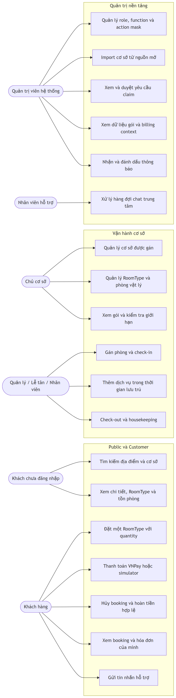

### Biểu đồ xác thực và phân quyền

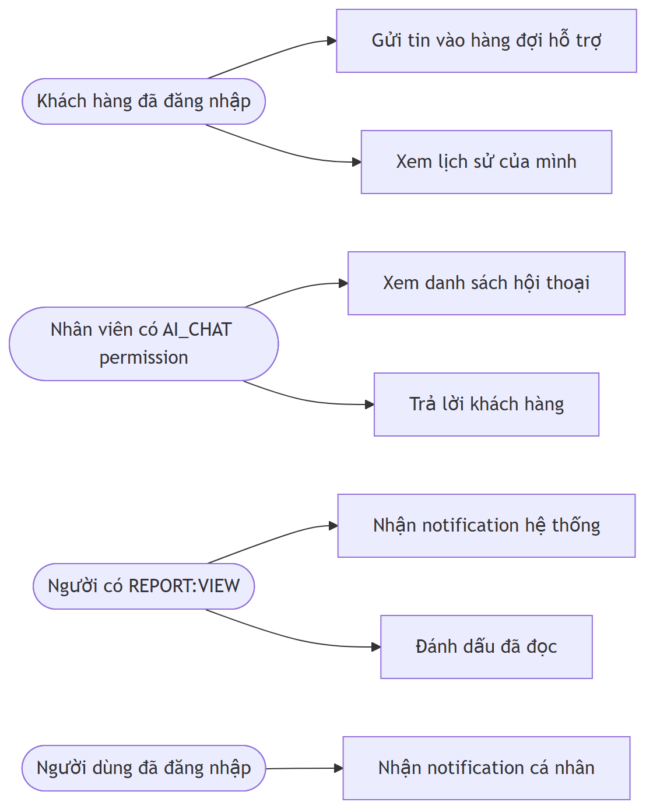

### Luồng đặt phòng

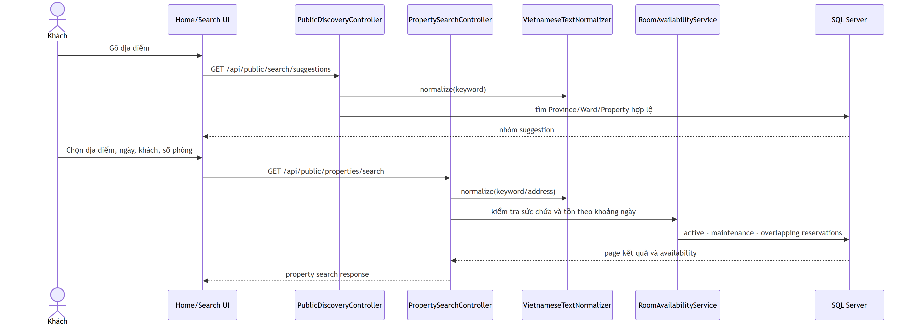

### Luồng hủy và hoàn tiền

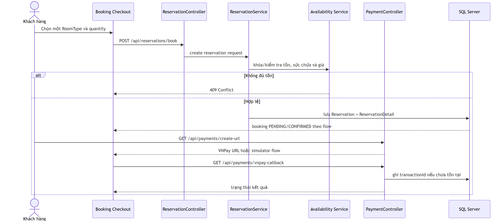

### Luồng vận hành lưu trú

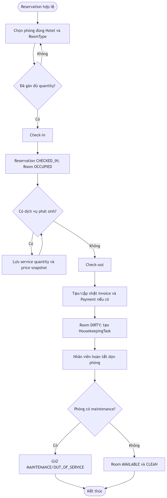

### ERD nhóm người dùng và phân quyền

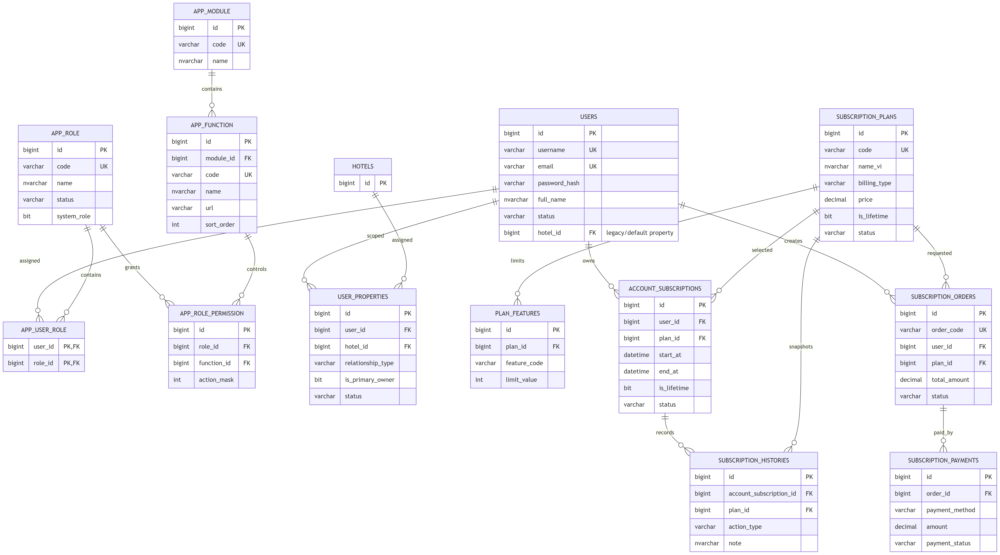

### ERD nhóm cơ sở và phòng

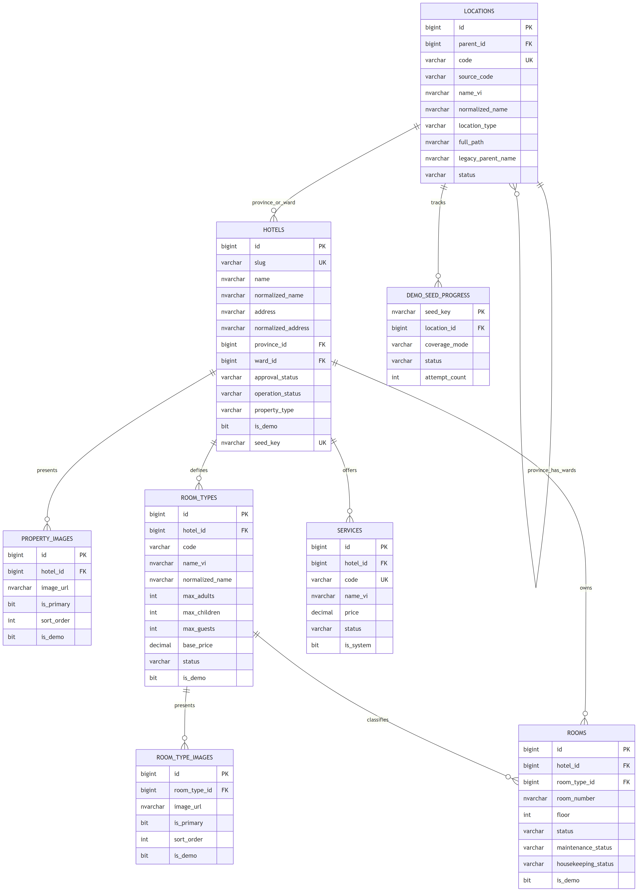

### ERD nhóm booking và thanh toán

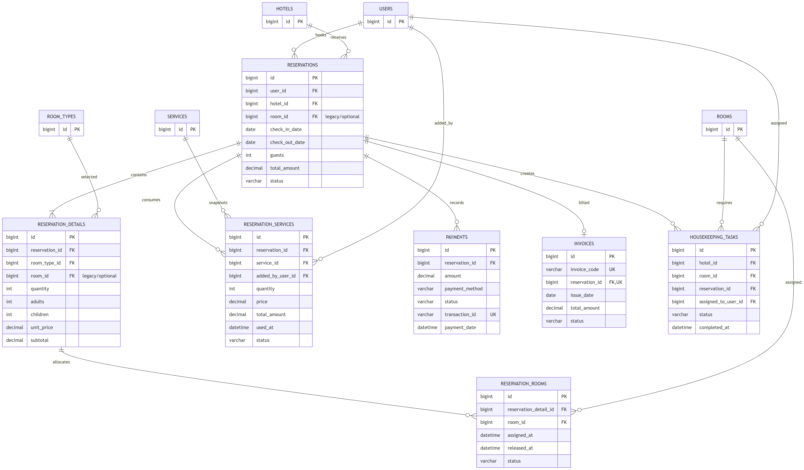

## 3.7. Thiết kế API

Backend công bố 254 ánh xạ endpoint. Bảng sau tổng hợp số endpoint theo controller; danh mục đầy đủ nằm tại Phụ lục A.

| Controller | Số endpoint |
|---|---|
| ReservationController | 16 |
| PlatformBillingController | 15 |
| ManagementPortalController | 13 |
| UserController | 13 |
| AuthController | 12 |
| AdminPartnerController | 11 |
| HotelController | 11 |
| PaymentController | 9 |
| RoomController | 8 |
| PropertyInvoiceController | 7 |
| AppFunctionController | 6 |
| HousekeepingController | 6 |
| PropertyCheckoutController | 6 |
| PropertyPaymentController | 6 |
| PropertyRefundController | 6 |
| RoomTypeController | 6 |
| SponsoredPlacementController | 6 |
| AppModuleController | 5 |
| ChatController | 5 |
| HotelServiceController | 5 |
| PlatformRefundController | 5 |
| PromotionController | 5 |
| PropertyClaimController | 5 |
| PublicDiscoveryController | 5 |
| RoleController | 5 |
| EmailOutboxController | 4 |
| InvoiceController | 4 |
| LocationController | 4 |
| PropertyImportController | 4 |
| SubscriptionController | 4 |
| AiController | 3 |
| EmailVerificationController | 3 |
| FavoriteController | 3 |
| FinancialSimulatorController | 3 |
| PropertyPaymentConfigurationController | 3 |
| FileUploadController | 2 |
| NotificationController | 2 |
| OperationalAuditController | 2 |
| PlatformRevenueController | 2 |
| PropertyRegistrationController | 2 |
| PropertyRevenueController | 2 |
| PublicPromotionController | 2 |
| RolePermissionController | 2 |
| AnalyticsController | 1 |
| MockPaymentController | 1 |
| PlatformPaymentCallbackController | 1 |
| PropertySearchController | 1 |
| PublicHomeSpotlightController | 1 |
| PublicQuoteController | 1 |

# CHƯƠNG 4 - KẾT QUẢ, KIỂM THỬ VÀ ĐÁNH GIÁ

## 4.1. Kết quả đạt được

Hệ thống đã hình thành đầy đủ các lớp frontend, backend và dữ liệu; có luồng công khai, khách hàng, quản lý cơ sở và quản trị nền tảng; có migration, kiểm thử và cấu hình triển khai. Các kết quả được mô tả chi tiết theo từng nhóm chức năng trong phần dưới đây.

### 4.1. CẤU TRÚC CÀI ĐẶT

Backend được tổ chức theo các nhóm `controllers`, `services`, `repositories`, `entities`, `dtos` và `security`. Controller không chứa nghiệp vụ phức tạp; Service điều phối giao dịch và kiểm tra quy tắc; Repository đóng gói truy vấn dữ liệu.

Frontend tổ chức theo `core`, `shared` và `features`. Core chứa dịch vụ dùng toàn ứng dụng, interceptor và guard. Shared chứa thành phần trình bày dùng lại. Features chứa màn hình theo nghiệp vụ.

Flyway quản lý các thay đổi schema. Các migration hiện hành bao gồm chuẩn hóa Unicode, ràng buộc tồn phòng theo phạm vi, dữ liệu demo, chỉ mục tìm kiếm, dữ liệu role/menu và ràng buộc idempotency cho payment.

### 4.2. CÀI ĐẶT XÁC THỰC VÀ PHÂN QUYỀN

Endpoint đăng nhập phát hành JWT sau khi kiểm tra thông tin tài khoản. Bộ lọc bảo mật đọc token và tạo `Authentication`. Annotation `@Permission` kiểm tra chức năng và hành động. Các endpoint nhạy cảm còn dùng `@PreAuthorize` để giới hạn role.

Menu của người dùng được trả từ API `my-menu`. Frontend chỉ dựng route và mục điều hướng được cấp, trong khi backend tiếp tục kiểm tra độc lập. `SUPER_ADMIN` có quyền nền tảng; yêu cầu thiếu quyền nhận HTTP 403.

### 4.3. CÀI ĐẶT TÌM KIẾM VÀ ĐẶT PHÒNG

Trang chủ cung cấp autocomplete theo địa điểm và cơ sở. Trang kết quả nhận bộ lọc, sắp xếp và phân trang từ URL hoặc Search State. Giá được hiển thị theo số đêm và số lượng phòng.

Khi xác nhận booking, backend kiểm tra:

- Ngày nhận và trả phòng.
- Số người lớn, trẻ em và sức chứa.
- RoomType thuộc đúng cơ sở.
- Số lượng phòng còn lại.
- Giá hiện hành và tổng tiền.

Booking hiện hỗ trợ một RoomType với `quantity > 1`. Nếu không đủ tồn phòng, API trả HTTP 409.

### 4.4. CÀI ĐẶT THANH TOÁN, HỦY VÀ HOÀN TIỀN

Hệ thống hỗ trợ tạo payment, URL VNPay, callback VNPay và callback simulator. Callback chỉ ghi nhận thành công khi mã giao dịch chưa tồn tại. Migration `V10__payment_idempotency_constraint.sql` bổ sung ràng buộc dữ liệu chống giao dịch trùng.

Khách hàng hủy booking qua endpoint chuyên biệt. Service kiểm tra quyền sở hữu, trạng thái được phép hủy, khóa reservation và tạo giao dịch hoàn tiền âm cho các payment thành công. Việc gọi lại không tạo thêm refund cho cùng payment.

### 4.5. CÀI ĐẶT VẬN HÀNH LƯU TRÚ

Nhân viên có thể xem phòng còn trống, gán nhiều phòng vật lý và thực hiện check-in. Backend từ chối phòng không thuộc cơ sở, sai RoomType, `OCCUPIED` hoặc `MAINTENANCE`.

Dịch vụ phát sinh được thêm trong thời gian lưu trú và lưu snapshot đơn giá. Check-out tổng hợp chi phí, tạo hóa đơn, cập nhật phòng thành `DIRTY` và tạo housekeeping task. Khi tác vụ hoàn tất, phòng chuyển thành `AVAILABLE/CLEAN`.

### 4.6. CÀI ĐẶT MULTI-PROPERTY VÀ FEATURE GATE

Active Property Context xác định cơ sở đang được quản lý. Repository và Service lọc dữ liệu theo các quan hệ trong `user_properties`. Feature Gate kiểm tra `AccountSubscription` và giới hạn của gói trước thao tác tạo tài nguyên.

Thiết kế này ngăn hai lỗi độc lập: người dùng thao tác ngoài phạm vi cơ sở và người dùng tạo vượt hạn mức gói. Việc chỉ ẩn nút trên frontend không được xem là kiểm soát hợp lệ.

### 4.7. GIAO DIỆN ĐÃ CÀI ĐẶT

**Bảng 4.1. Nhóm màn hình chính**

| Nhóm màn hình | Chức năng | Vai trò |
|---|---|---|
| Trang chủ và kết quả | Tìm kiếm, lọc, sắp xếp | Công khai |
| Chi tiết cơ sở | Xem ảnh, RoomType, giá và tồn phòng | Công khai |
| Checkout | Xác nhận khách, số phòng và chi phí | Khách hàng |
| Payment Simulator | Mô phỏng callback và kết quả thanh toán | Khách hàng/Test |
| Hồ sơ cá nhân | Thông tin, mật khẩu, booking và hóa đơn | Khách hàng |
| Dashboard quản trị | Chỉ số và điều hướng nghiệp vụ | Nhân viên quản trị |
| Role và Permission | Role, Action Mask và menu | Quản trị viên |
| RoomType và Room | Quản lý tài nguyên lưu trú | Chủ cơ sở/Nhân viên |
| Reservation | Gán phòng, check-in, dịch vụ, check-out | Lễ tân/Quản lý |
| Import và Claim | Staging, chống trùng, duyệt claim; claim còn identity gap | Quản trị viên/Người dùng |
| Subscription | Xem plan, subscription ACTIVE và feature limit | Chủ cơ sở/Quản trị viên |
| Support Chat | Hàng đợi hội thoại trung tâm qua STOMP | Khách hàng/CSKH |
| Notification | Nhận personal/admin destination và đánh dấu đã đọc | Người dùng có quyền |

Bảng 4.1 tổng hợp màn hình đã có trong mã nguồn. Mỗi màn hình chỉ hiển thị chức năng phù hợp vai trò, nhưng quyền cuối cùng vẫn do backend quyết định. Dòng claim, chat và notification phải được đọc cùng trạng thái `PARTIAL/BLOCKED`, không phải cam kết E2E hoàn tất.

Các giao diện tiêu biểu được minh họa ngay sau phần mô tả chức năng tương ứng. Mỗi hình có chú thích để người đọc đối chiếu giữa thiết kế và kết quả cài đặt.

#### 4.7.1. Phạm vi xác minh khu vực Admin

Khu vực quản trị hiện có 29 route nghiệp vụ, bao gồm quản lý người dùng, phòng, đặt phòng, hóa đơn, phân quyền, cơ sở lưu trú, import và subscription. Một số luồng cập nhật và kiểm tra quyền vẫn cần được kiểm thử thêm với dữ liệu thực.

| Nhóm | Route/chức năng | Kết luận hiện tại |
|---|---|---|
| Core quản trị | dashboard, users, customers, room-types, rooms, services, reservations, invoices, roles, role-permissions, modules, chat | Cần chạy lại data-backed read/mutation/authorization; giữ `BLOCKED_RUNTIME` khi backend LuxeStay chưa cô lập |
| Property/import/claim | properties, property-imports, property-claims | Có source và một số unit; cần xác minh guard, tenant scope, import/approve/reject trên fixture |
| Partner overview | 10 route báo cáo chủ cơ sở, đăng ký, phê duyệt, nhân sự, phòng, subscription, hợp đồng | Component có chế độ đọc/approve nhưng 10 route chưa có guard tĩnh; cần policy/backend authorization review |
| Subscription | plans và purchase | Danh sách plan/subscription có API; `purchase()` hiện chỉ hiển thị thông báo chuyển hướng, nên trạng thái là `PARTIAL`, không mô tả thanh toán đã hoàn tất |
| Profile | profile admin | Có API đọc/sửa hồ sơ và đổi mật khẩu; chỉ kế thừa authGuard, cần chốt policy quyền |

### 4.8. CHIẾN LƯỢC KIỂM THỬ

Kiểm thử được chia thành:

- **Unit test:** kiểm tra Service với dependency giả lập.
- **Integration test:** khởi tạo Spring context, MockMvc và H2.
- **Frontend unit test:** kiểm tra component và service.
- **E2E test:** Playwright chạy các luồng public, customer, payment và admin.
- **Build verification:** biên dịch production để phát hiện lỗi kiểu và đóng gói.

Các trường hợp quan trọng gồm quyền truy cập, tìm kiếm Unicode, tồn phòng, booking nhiều phòng cùng loại, gán phòng đúng phạm vi, payment idempotency, hủy booking, hoàn tiền và giới hạn subscription.

### 4.9. KẾT QUẢ KIỂM THỬ

**Bảng 4.2. Kết quả kiểm thử của phiên bản báo cáo**

| Hạng mục | Kết quả | Đánh giá |
|---|---:|---|
| Backend Maven test | 123/123 | Đạt |
| Frontend unit test | 73/73 | Đạt |
| Angular production build | Build thành công | Đạt, còn cảnh báo không làm dừng build |
| Playwright smoke test | 2 đạt, 3 bỏ qua | Một phần |
| Playwright toàn bộ hệ thống | Chưa hoàn tất | Bị ảnh hưởng bởi môi trường và dữ liệu kiểm thử |
| Admin data-backed E2E | Chưa hoàn tất | Cần bổ sung dữ liệu, tài khoản và kiểm tra phân quyền |

Kết quả cho thấy backend và frontend đã vượt qua các bộ kiểm thử tự động hiện có. Kiểm thử đầu cuối chưa đủ để khẳng định toàn bộ khu vực quản trị hoạt động hoàn chỉnh vì một số kịch bản còn phụ thuộc môi trường chạy, dữ liệu mẫu và tài khoản theo vai trò.

### 4.10. ĐÁNH GIÁ KẾT QUẢ

Kết quả cài đặt đáp ứng các nghiệp vụ cốt lõi gồm xác thực, tìm kiếm, đặt phòng, thanh toán, quản lý tồn phòng và vận hành lưu trú. Các kiểm thử backend và frontend cho thấy những quy tắc nghiệp vụ chính hoạt động ổn định trong phạm vi đã kiểm chứng.

Hạn chế lớn nhất nằm ở kiểm thử đầu cuối của khu vực quản trị. Một số kịch bản cần dữ liệu mẫu, tài khoản theo vai trò và môi trường backend riêng. Đây là nội dung cần hoàn thiện trước khi triển khai hệ thống trong môi trường thực tế.

---

## 4.2. Kiểm thử xác thực và tài khoản

Kịch bản bao gồm đăng ký hợp lệ/trùng định danh, xác minh email, đăng nhập sai/đúng mật khẩu, refresh token, logout, tài khoản bị khóa và liên kết social identity. Backend phải từ chối tài khoản không đủ điều kiện; frontend phải xử lý lỗi nhất quán và không lưu refresh token trong vùng JavaScript có thể đọc trực tiếp.

## 4.3. Kiểm thử tìm kiếm, chi tiết và tồn phòng

Kịch bản bao gồm tìm theo địa giới tiếng Việt, dữ liệu có dấu/không dấu, khoảng ngày hợp lệ, sức chứa, kết quả rỗng, mở chi tiết và tái kiểm tra availability. Kết quả quan sát cho thấy luồng public render được; vấn đề autocomplete chậm đã được truy nguyên tới enrichment N+1 và tối ưu ở mã nguồn local.

## 4.4. Kiểm thử đặt phòng và thanh toán

Kịch bản gồm tạo hold, gửi lại request với cùng idempotency key, hold hết hạn, callback hợp lệ/không hợp lệ, thanh toán thất bại và replay callback. Luồng simulator thể hiện cơ chế fail-closed khi thiếu signed token; thanh toán provider production không được coi là đã nghiệm thu.

## 4.5. Kiểm thử hủy, hoàn tiền và hóa đơn

Kịch bản kiểm tra quyền hủy, chính sách theo trạng thái, lý do hủy, refund lặp lại, cập nhật hóa đơn và lịch sử giao dịch. Kết quả hiện có chứng minh cấu trúc chức năng và một phần test; provider refund sandbox vẫn cần bằng chứng end-to-end.

## 4.6. Kiểm thử vận hành cơ sở

Kịch bản gồm gán phòng, check-in, thêm dịch vụ, check-out, chuyển trạng thái phòng và tạo/hoàn thành housekeeping task. Các màn hình vận hành đã render nhưng một số luồng mutation và concurrency chưa được chứng minh đầy đủ.

## 4.7. Kiểm thử quản trị và phân quyền

Kịch bản gồm CRUD người dùng, cơ sở, loại phòng, phòng, dịch vụ, role/permission, duyệt property và kiểm tra truy cập chéo tenant. Bốn route management từng ghi nhận 403; đây là bằng chứng quan trọng để phân biệt giao diện tồn tại với quyền nghiệp vụ đã đúng.

## 4.8. Tổng kết kết quả kiểm thử

Danh mục ảnh ghi nhận 41 màn hình: 13 PASS, 24 PARTIAL và 4 FAIL tại thời điểm chụp. Kết luận kiểm thử tuân theo bằng chứng; trạng thái PARTIAL/FAIL được giữ nguyên trong báo cáo thay vì che giấu. Chi tiết trạng thái và giới hạn quan sát:

Ngày chụp/đối chiếu: 2026-08-05 
Tổng số file ảnh: **41**. Trong đó **37 route-specific screen đã render** và **4 ảnh ghi nhận permission denied (403)**.

### 1. Cách hiểu trạng thái

- **PASS:** route/màn hình mục tiêu render được và thể hiện chức năng chính tại thời điểm chụp.
- **PARTIAL:** màn hình render nhưng luồng chưa hoàn tất, dùng fixture, thiếu token/provider, hoặc có runtime console error cần điều tra.
- **FAIL:** route mục tiêu không render được; ảnh ghi nhận lỗi/403.
- Trạng thái ảnh không thay thế trạng thái capability trong `02-functional-inventory.md` và không chứng minh mọi thao tác CRUD/API đều hoạt động.

Trong phiên browser, điều hướng admin/management nhiều lần phát sinh `SyntaxError: Unexpected token '<'`, thường là dấu hiệu một request mong JSON/JavaScript nhưng nhận HTML. Vì vậy các màn admin/management được đánh dấu PARTIAL dù phần giao diện nhìn thấy đã render.

### 2. Public và customer

| Mã ảnh | Tên chức năng | Đường dẫn ảnh | Mô tả ngắn | Trạng thái | Ghi chú |
|---|---|---|---|---|---|
| UI-001 | Trang chủ desktop | `screenshots/UI-001-home-desktop.png` | Hero tìm kiếm và nội dung public trên viewport desktop | PASS | Có bằng chứng render thực tế |
| UI-002 | Trang chủ mobile | `screenshots/UI-002-home-mobile.png` | Trang chủ ở viewport mobile | PASS | Bằng chứng responsive, không thay thế accessibility audit |
| UI-003 | Kết quả tìm kiếm | `screenshots/UI-003-search-results.png` | Danh sách khách sạn theo tiêu chí hợp lệ | PASS | Public search API đã phản hồi trong E2E runtime |
| UI-004 | Chi tiết khách sạn | `screenshots/UI-004-hotel-detail.png` | Thông tin khách sạn, phòng và lựa chọn đặt | PASS | Luồng tiếp tục được đến checkout |
| UI-005 | Đăng nhập | `screenshots/UI-005-login.png` | Form đăng nhập customer | PASS | OAuth ngoài chưa được tính là PASS |
| UI-006 | Đăng ký | `screenshots/UI-006-register.png` | Form đăng ký tài khoản | PASS | SMTP preview tiếng Việt đã xác minh 9/9 trong P0-SMTP-VERIFY |
| UI-007 | Payment simulator | `screenshots/UI-007-payment-simulator.png` | Simulator hiển thị trạng thái session không hợp lệ khi thiếu signed token | PARTIAL | Fail-closed đúng kỳ vọng; chưa có signed success/fail/cancel flow |
| UI-008 | Đăng ký đối tác | `screenshots/UI-008-partner-register.png` | Form onboarding đối tác/property | PASS | Frontend regression còn lỗi partner approval action ở nhánh admin |
| UI-009 | Hồ sơ khách hàng | `screenshots/UI-009-customer-profile.png` | Thông tin hồ sơ customer | PASS | Dùng fixture/session kiểm thử |
| UI-010 | Lịch sử booking | `screenshots/UI-010-booking-history.png` | Danh sách booking của customer | PASS | Chưa chứng minh toàn bộ status/action |
| UI-011 | Hóa đơn của tôi | `screenshots/UI-011-my-invoices.png` | Danh sách hóa đơn customer | PASS | Chưa kiểm chứng export/reconciliation |
| UI-011A | PDF hóa đơn E2E | `fix-progress/evidence/P0-SMTP-VERIFY-invoice-page1.png`, `P0-SMTP-VERIFY-invoice-page2.png` | Render invoice attachment | PASS | 2 trang A4, 5.105 byte; line items, payment, refund và totals đầy đủ |
| UI-012 | Lịch sử hoàn tiền | `screenshots/UI-012-refund-history.png` | Danh sách refund customer | PASS | Provider refund sandbox chưa E2E |
| UI-013 | Cài đặt tài khoản | `screenshots/UI-013-account-settings.png` | Màn hình account/password settings | PASS | Social identity mock còn lỗi trong frontend test khác |
| UI-014 | Booking checkout | `screenshots/UI-014-booking-checkout.png` | Form xác nhận khách, phòng và thanh toán | PASS | Checkout render; provider payment chưa hoàn tất |

### 3. System admin

| Mã ảnh | Tên chức năng | Đường dẫn ảnh | Mô tả ngắn | Trạng thái | Ghi chú |
|---|---|---|---|---|---|
| UI-015 | Admin dashboard | `screenshots/UI-015-admin-dashboard.png` | KPI và điều hướng quản trị | PARTIAL | Màn render; phiên có console parse error cần xử lý |
| UI-016 | Quản lý người dùng | `screenshots/UI-016-admin-users.png` | Danh sách/quản lý user | PARTIAL | Màn render; chưa chạy CRUD E2E đầy đủ |
| UI-017 | Quản lý khách sạn | `screenshots/UI-017-admin-properties.png` | Danh sách property phía platform | PARTIAL | Màn render; cần test tenant/publish action |
| UI-018 | Quản lý loại phòng | `screenshots/UI-018-admin-room-types.png` | Loại phòng phía admin | PARTIAL | Màn render; cần test validation/tenant |
| UI-019 | Quản lý phòng | `screenshots/UI-019-admin-rooms.png` | Phòng vật lý phía admin | PARTIAL | Màn render; cần test lifecycle/inventory |
| UI-020 | Quản lý booking | `screenshots/UI-020-admin-reservations.png` | Danh sách reservation/booking | PARTIAL | Màn render; backend regression chưa xanh |
| UI-021 | Quản lý dịch vụ | `screenshots/UI-021-admin-services.png` | Danh mục/dịch vụ khách sạn | PARTIAL | Màn render; chưa kiểm tra charge E2E |
| UI-022 | Quản lý hóa đơn | `screenshots/UI-022-admin-invoices.png` | Danh sách hóa đơn platform | PARTIAL | Màn render; chưa kiểm chứng reconciliation/export |
| UI-023 | Quản lý role | `screenshots/UI-023-admin-roles.png` | Danh sách role | PARTIAL | Cần test mutation và protected role |
| UI-024 | Phân quyền role | `screenshots/UI-024-admin-role-permissions.png` | Ánh xạ permission cho role | PARTIAL | Cần đối chiếu route/API matrix |
| UI-025 | Quản lý plan | `screenshots/UI-025-admin-plans.png` | Gói dịch vụ/subscription plans | PARTIAL | Frontend test còn lỗi policy wording |
| UI-026 | Cấu hình thanh toán | `screenshots/UI-026-admin-payment-config.png` | Payment configuration phía platform | PARTIAL | Provider credential/sandbox chưa đầy đủ |
| UI-027 | Doanh thu nền tảng | `screenshots/UI-027-admin-platform-revenue.png` | Báo cáo doanh thu platform | PARTIAL | Backend financial performance test còn lỗi |
| UI-028 | Audit log | `screenshots/UI-028-admin-audit-log.png` | Nhật ký hoạt động platform | PARTIAL | Màn render; cần test filter/export/retention |
| UI-029 | Admin chat | `screenshots/UI-029-admin-chat.png` | Chat/notification phía admin | PARTIAL | Frontend chat setup test còn lỗi |
| UI-030 | Phê duyệt property | `screenshots/UI-030-admin-property-approvals.png` | Hàng đợi duyệt đối tác/property | PARTIAL | Partner approval action test còn lỗi |

### 4. Property management

| Mã ảnh | Tên chức năng | Đường dẫn ảnh | Mô tả ngắn | Trạng thái | Ghi chú |
|---|---|---|---|---|---|
| UI-031 | Management dashboard | `screenshots/UI-031-management-dashboard.png` | Dashboard property trên desktop | PARTIAL | Màn render với owner fixture; console parse error cần điều tra |
| UI-032 | Management loại phòng | `screenshots/UI-032-management-room-types.png` | Quản lý loại phòng trong property scope | PARTIAL | Chưa chạy mutation E2E |
| UI-033 | Management phòng | `screenshots/UI-033-management-rooms.png` | Quản lý phòng trong property scope | PARTIAL | Chưa chạy inventory/status E2E |
| UI-034 | Housekeeping | `screenshots/UI-034-management-housekeeping.png` | Danh sách/nhiệm vụ housekeeping | PARTIAL | Chưa kiểm tra assignment race/lifecycle |
| UI-035 | Management dịch vụ | `screenshots/UI-035-management-services.png` | Quản lý dịch vụ property | PARTIAL | Chưa kiểm tra charge/invoice E2E |
| UI-036 | Payment configuration của property | `screenshots/UI-036-management-payment-config.png` | Ảnh ghi nhận route bị từ chối | FAIL | Owner fixture bị redirect/trả 403; cần chốt permission |
| UI-037 | Management refunds | `screenshots/UI-037-management-refunds.png` | Ảnh ghi nhận route refund bị từ chối | FAIL | Owner fixture bị redirect/trả 403 |
| UI-038 | Doanh thu property | `screenshots/UI-038-management-property-revenue.png` | Báo cáo doanh thu theo property | PARTIAL | Màn render; financial test còn lỗi |
| UI-039 | Subscription billing | `screenshots/UI-039-management-subscription-billing.png` | Ảnh ghi nhận route subscription bị từ chối | FAIL | Owner fixture bị redirect/trả 403 |
| UI-040 | Management audit log | `screenshots/UI-040-management-audit-log.png` | Ảnh ghi nhận route audit log bị từ chối | FAIL | Owner fixture bị redirect/trả 403 |
| UI-041 | Management dashboard mobile | `screenshots/UI-041-management-dashboard-mobile.png` | Dashboard property ở viewport mobile | PARTIAL | Responsive render; console issue và behavior sâu chưa kiểm chứng |

### 5. Thống kê ảnh

| Nhóm | Số ảnh | PASS | PARTIAL | FAIL |
|---|---:|---:|---:|---:|
| Public/customer | 14 | 13 | 1 | 0 |
| System admin | 16 | 0 | 16 | 0 |
| Property management | 11 | 0 | 7 | 4 |
| **Tổng** | **41** | **13** | **24** | **4** |

### 6. Khoảng trống cần chụp thêm sau khi sửa

- Payment simulator với signed token cho success, failure, cancel và replay.
- VNPay/MoMo/ZaloPay sandbox return/callback result của provider được chọn.
- CRUD success/error cho user, property, room type, room, booking, service và role/permission.
- Check-in, in-house charge, check-out và housekeeping completion.
- Bốn route management sau khi sửa permission.
- Error/empty/loading states quan trọng và accessibility keyboard/focus evidence.

## 4.9. Hình ảnh minh họa toàn bộ giao diện

### UI 001 home desktop

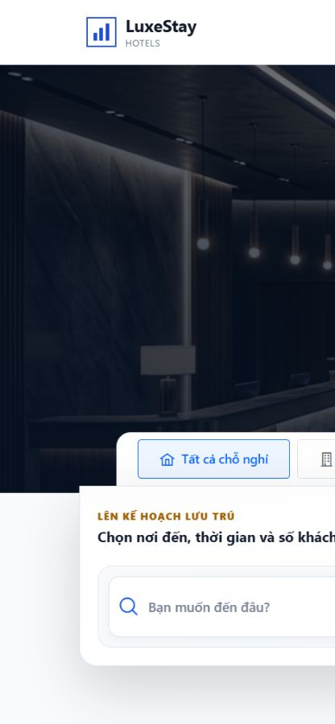

Hình minh họa được chụp từ tuyến giao diện tương ứng. Trạng thái PASS/PARTIAL/FAIL và giới hạn kiểm chứng được đối chiếu trong danh mục ảnh giao diện của dự án.
### UI 002 home mobile

Hình minh họa được chụp từ tuyến giao diện tương ứng. Trạng thái PASS/PARTIAL/FAIL và giới hạn kiểm chứng được đối chiếu trong danh mục ảnh giao diện của dự án.
### UI 003 search results

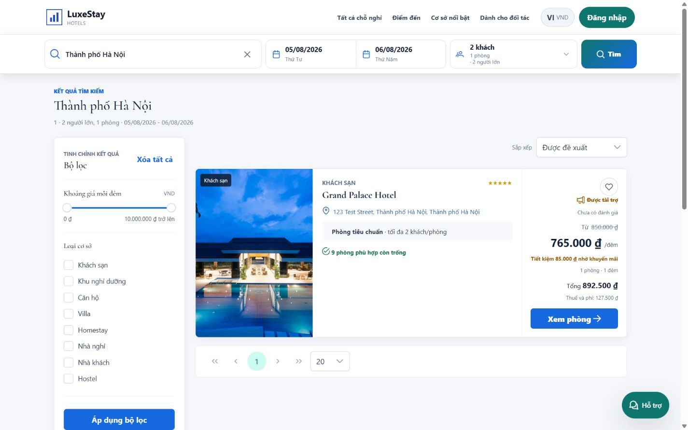

Hình minh họa được chụp từ tuyến giao diện tương ứng. Trạng thái PASS/PARTIAL/FAIL và giới hạn kiểm chứng được đối chiếu trong danh mục ảnh giao diện của dự án.
### UI 004 hotel detail

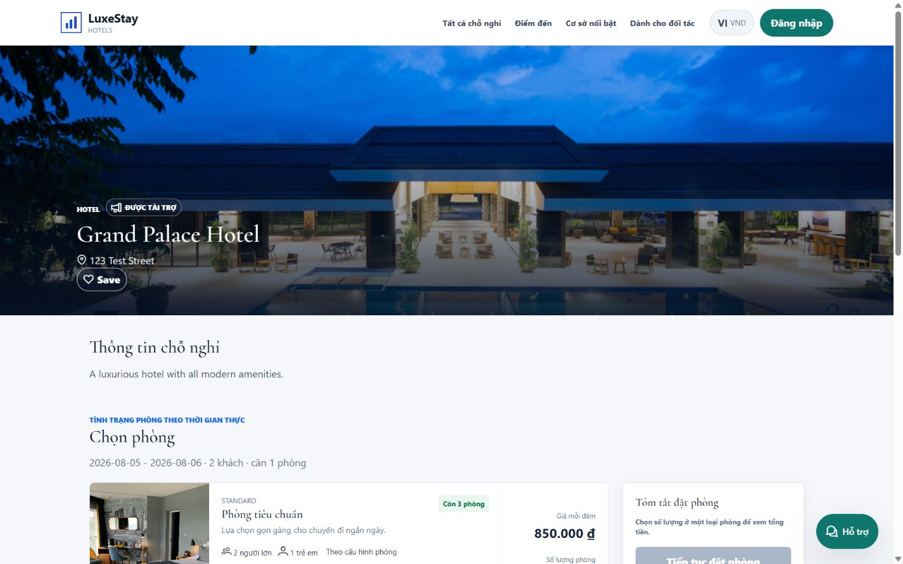

Hình minh họa được chụp từ tuyến giao diện tương ứng. Trạng thái PASS/PARTIAL/FAIL và giới hạn kiểm chứng được đối chiếu trong danh mục ảnh giao diện của dự án.
### UI 005 login

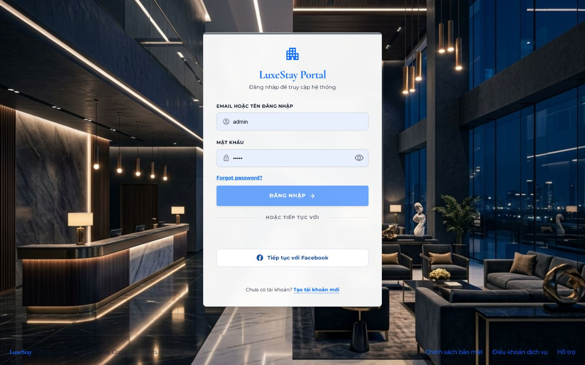

Hình minh họa được chụp từ tuyến giao diện tương ứng. Trạng thái PASS/PARTIAL/FAIL và giới hạn kiểm chứng được đối chiếu trong danh mục ảnh giao diện của dự án.
### UI 006 register

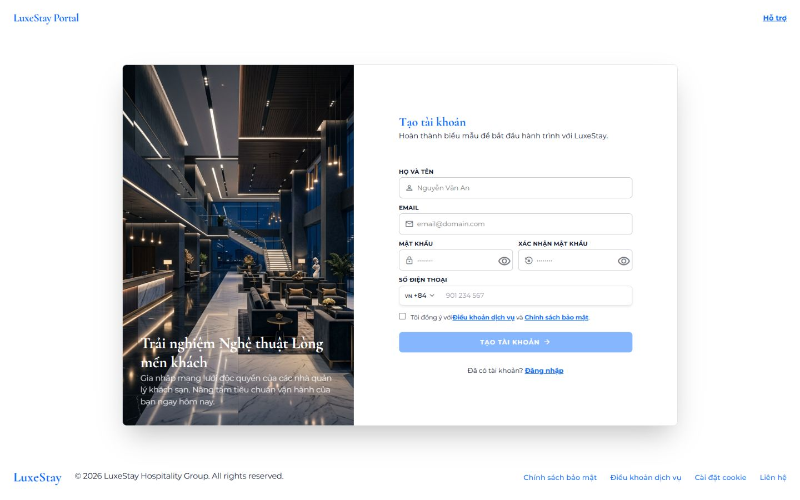

Hình minh họa được chụp từ tuyến giao diện tương ứng. Trạng thái PASS/PARTIAL/FAIL và giới hạn kiểm chứng được đối chiếu trong danh mục ảnh giao diện của dự án.
### UI 007 payment simulator

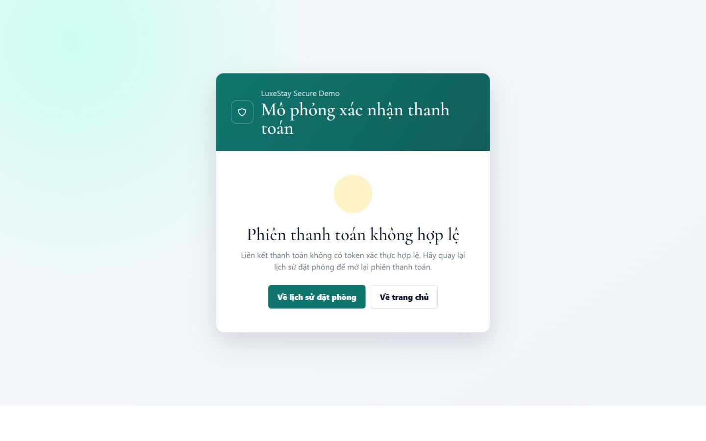

Hình minh họa được chụp từ tuyến giao diện tương ứng. Trạng thái PASS/PARTIAL/FAIL và giới hạn kiểm chứng được đối chiếu trong danh mục ảnh giao diện của dự án.
### UI 008 partner register

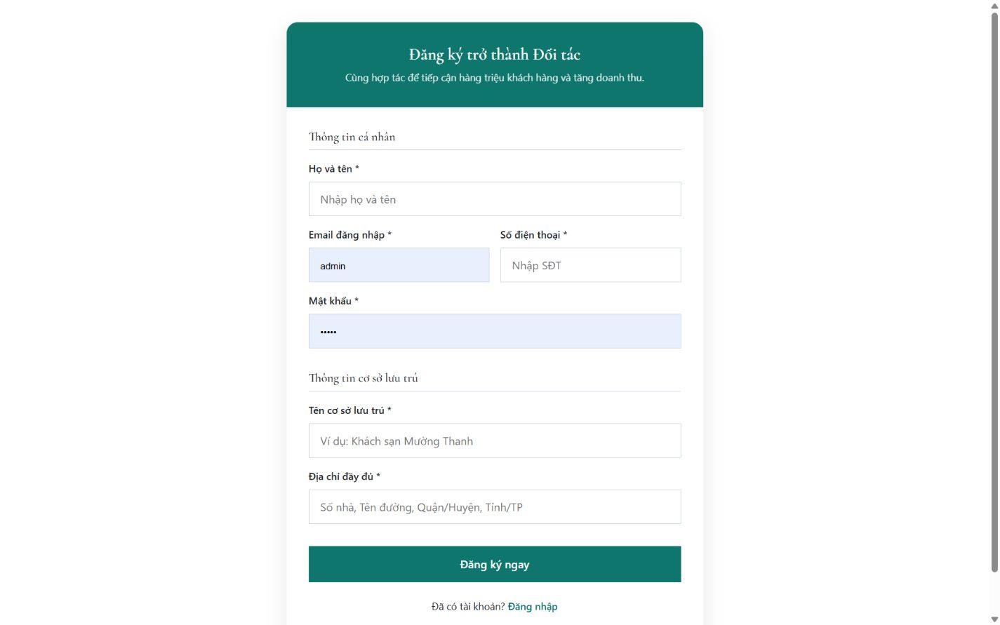

Hình minh họa được chụp từ tuyến giao diện tương ứng. Trạng thái PASS/PARTIAL/FAIL và giới hạn kiểm chứng được đối chiếu trong danh mục ảnh giao diện của dự án.
### UI 009 customer profile

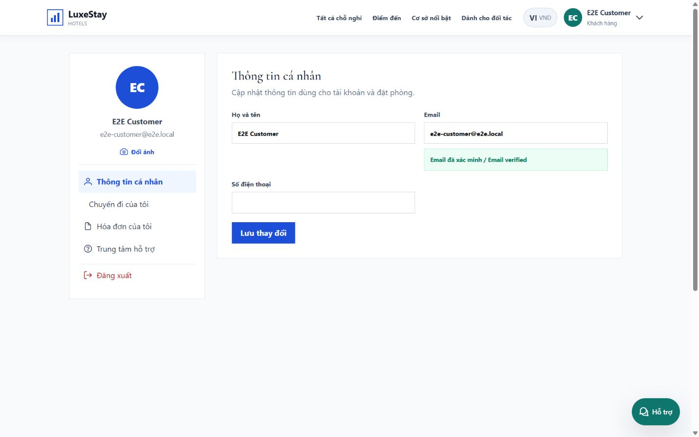

Hình minh họa được chụp từ tuyến giao diện tương ứng. Trạng thái PASS/PARTIAL/FAIL và giới hạn kiểm chứng được đối chiếu trong danh mục ảnh giao diện của dự án.
### UI 010 booking history

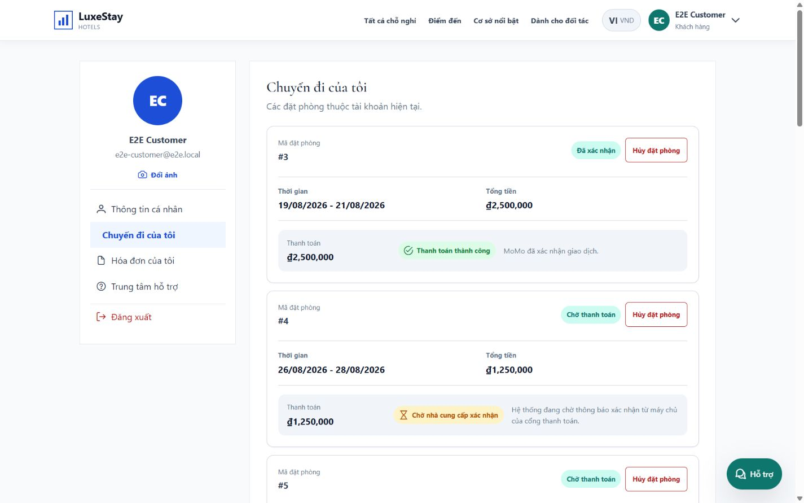

Hình minh họa được chụp từ tuyến giao diện tương ứng. Trạng thái PASS/PARTIAL/FAIL và giới hạn kiểm chứng được đối chiếu trong danh mục ảnh giao diện của dự án.
### UI 011 my invoices

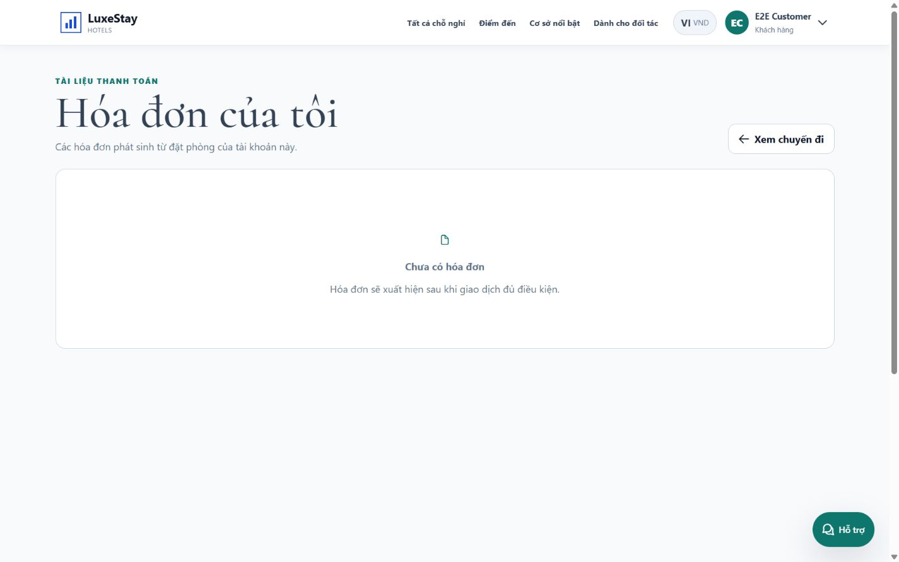

Hình minh họa được chụp từ tuyến giao diện tương ứng. Trạng thái PASS/PARTIAL/FAIL và giới hạn kiểm chứng được đối chiếu trong danh mục ảnh giao diện của dự án.
### UI 012 refund history

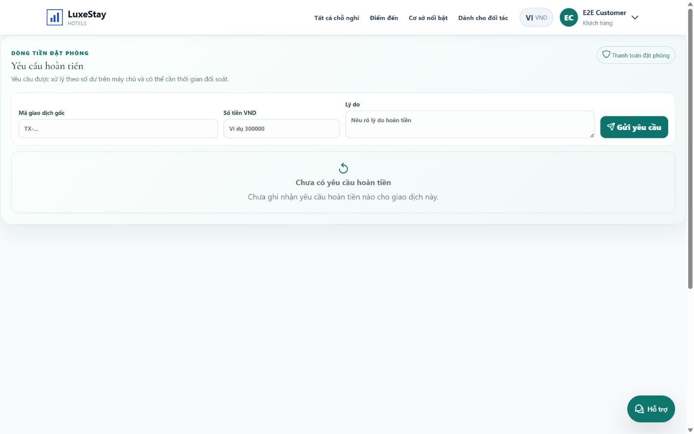

Hình minh họa được chụp từ tuyến giao diện tương ứng. Trạng thái PASS/PARTIAL/FAIL và giới hạn kiểm chứng được đối chiếu trong danh mục ảnh giao diện của dự án.
### UI 013 account settings

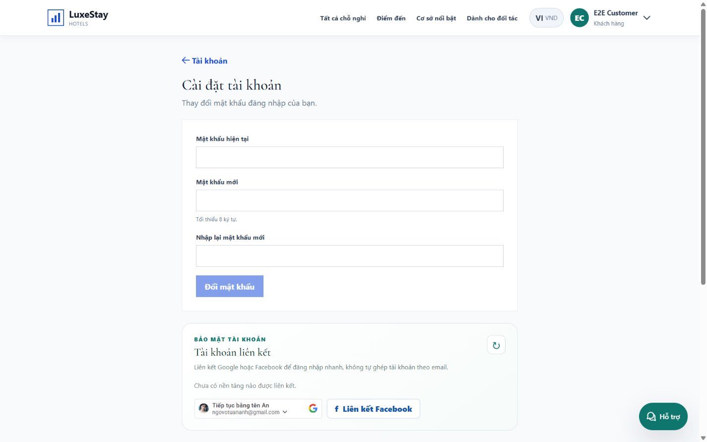

Hình minh họa được chụp từ tuyến giao diện tương ứng. Trạng thái PASS/PARTIAL/FAIL và giới hạn kiểm chứng được đối chiếu trong danh mục ảnh giao diện của dự án.
### UI 014 booking checkout

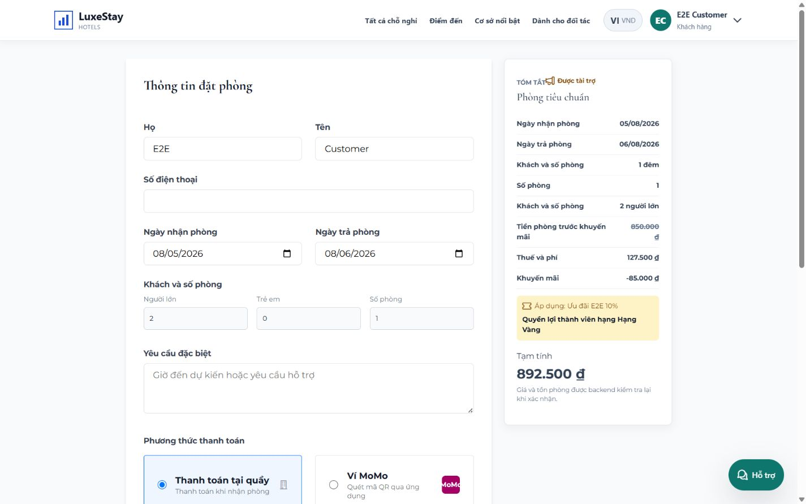

Hình minh họa được chụp từ tuyến giao diện tương ứng. Trạng thái PASS/PARTIAL/FAIL và giới hạn kiểm chứng được đối chiếu trong danh mục ảnh giao diện của dự án.
### UI 015 admin dashboard

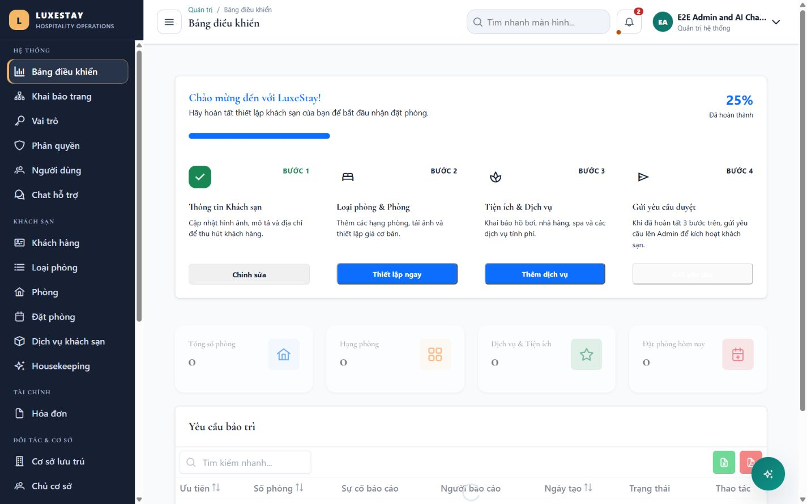

Hình minh họa được chụp từ tuyến giao diện tương ứng. Trạng thái PASS/PARTIAL/FAIL và giới hạn kiểm chứng được đối chiếu trong danh mục ảnh giao diện của dự án.
### UI 016 admin users

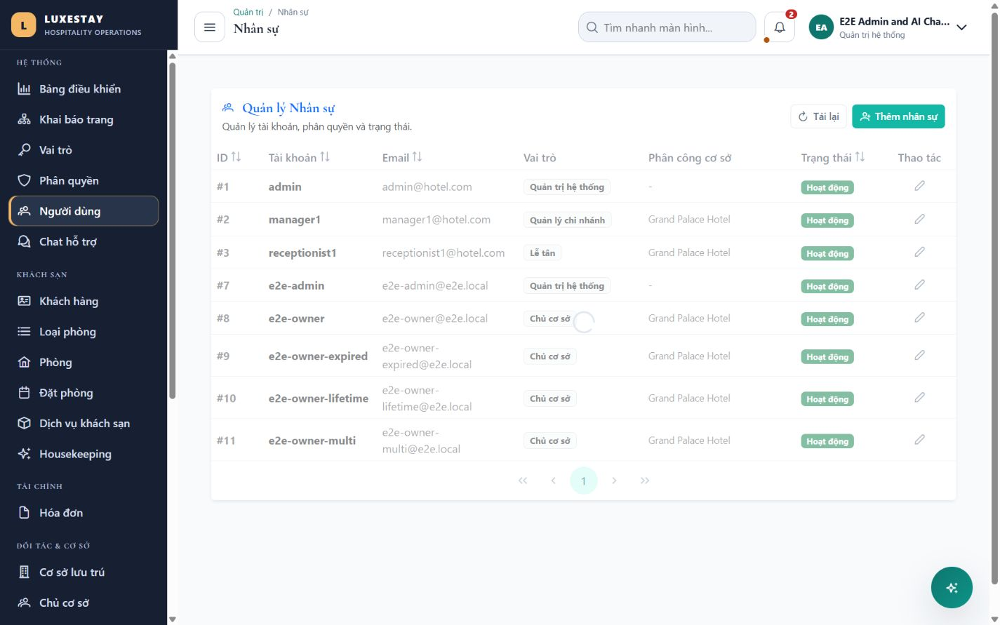

Hình minh họa được chụp từ tuyến giao diện tương ứng. Trạng thái PASS/PARTIAL/FAIL và giới hạn kiểm chứng được đối chiếu trong danh mục ảnh giao diện của dự án.
### UI 017 admin properties

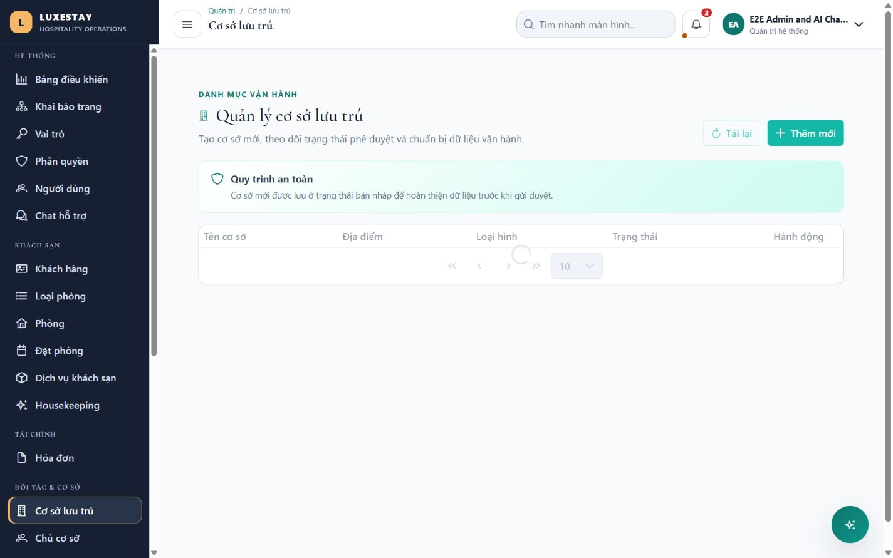

Hình minh họa được chụp từ tuyến giao diện tương ứng. Trạng thái PASS/PARTIAL/FAIL và giới hạn kiểm chứng được đối chiếu trong danh mục ảnh giao diện của dự án.
### UI 018 admin room types

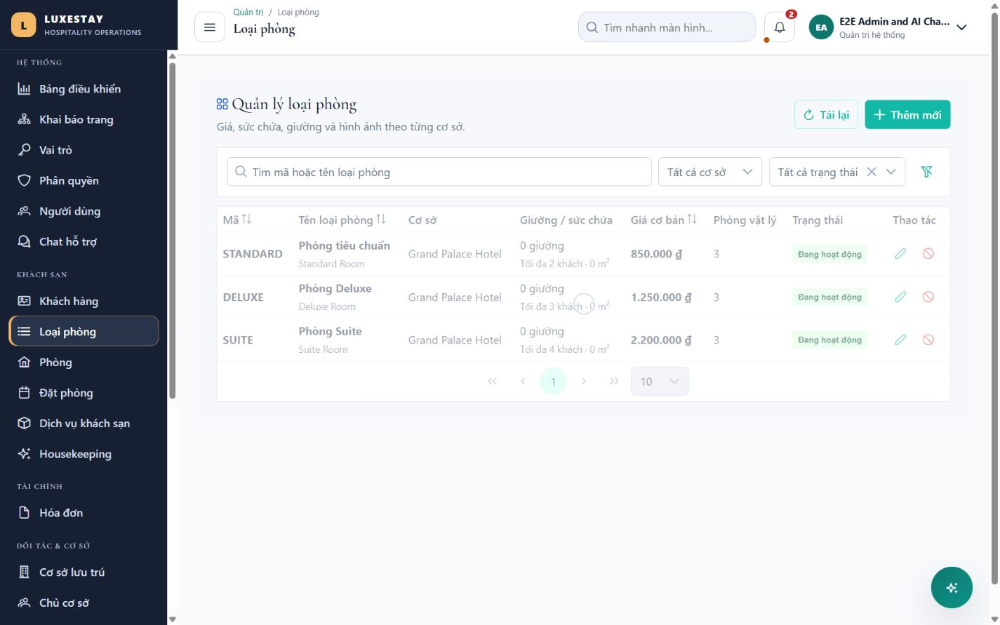

Hình minh họa được chụp từ tuyến giao diện tương ứng. Trạng thái PASS/PARTIAL/FAIL và giới hạn kiểm chứng được đối chiếu trong danh mục ảnh giao diện của dự án.
### UI 019 admin rooms

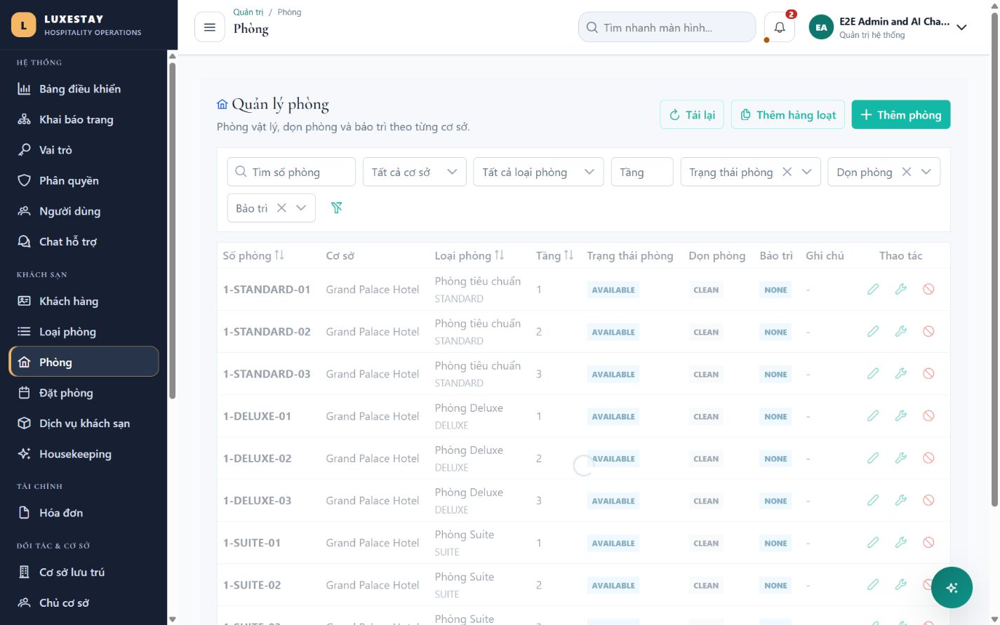

Hình minh họa được chụp từ tuyến giao diện tương ứng. Trạng thái PASS/PARTIAL/FAIL và giới hạn kiểm chứng được đối chiếu trong danh mục ảnh giao diện của dự án.
### UI 020 admin reservations

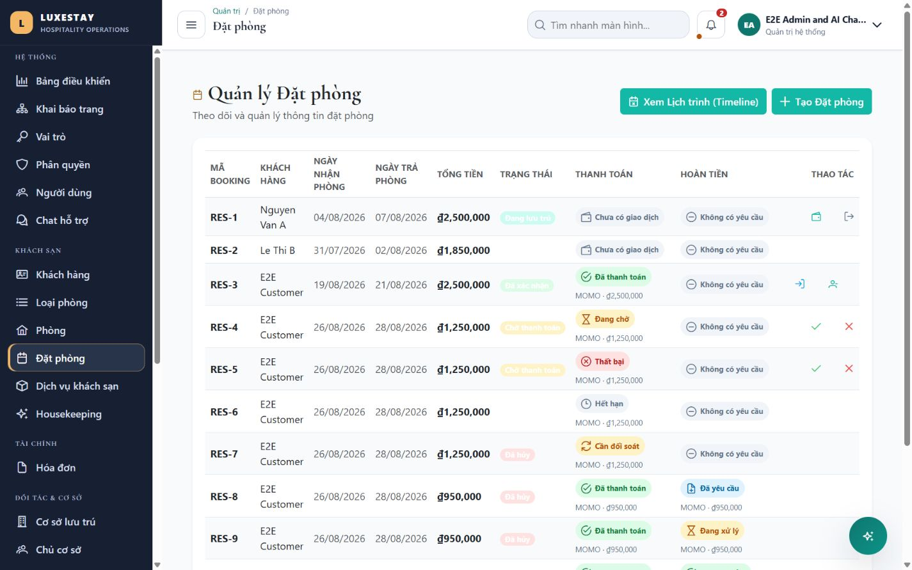

Hình minh họa được chụp từ tuyến giao diện tương ứng. Trạng thái PASS/PARTIAL/FAIL và giới hạn kiểm chứng được đối chiếu trong danh mục ảnh giao diện của dự án.
### UI 021 admin services

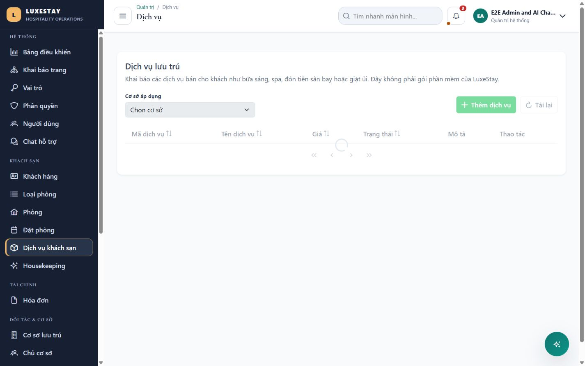

Hình minh họa được chụp từ tuyến giao diện tương ứng. Trạng thái PASS/PARTIAL/FAIL và giới hạn kiểm chứng được đối chiếu trong danh mục ảnh giao diện của dự án.
### UI 022 admin invoices

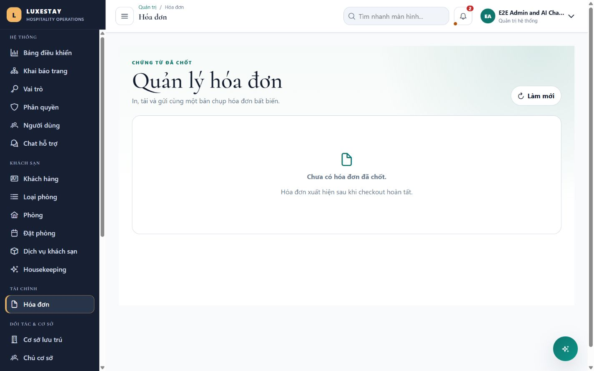

Hình minh họa được chụp từ tuyến giao diện tương ứng. Trạng thái PASS/PARTIAL/FAIL và giới hạn kiểm chứng được đối chiếu trong danh mục ảnh giao diện của dự án.
### UI 023 admin roles

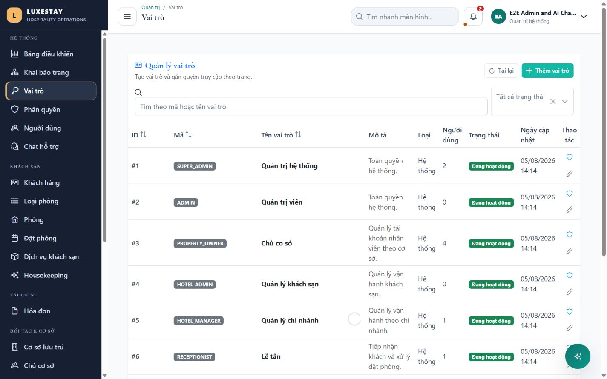

Hình minh họa được chụp từ tuyến giao diện tương ứng. Trạng thái PASS/PARTIAL/FAIL và giới hạn kiểm chứng được đối chiếu trong danh mục ảnh giao diện của dự án.
### UI 024 admin role permissions

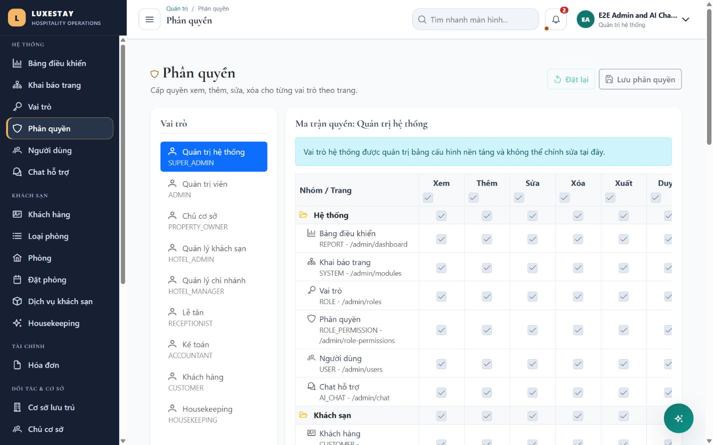

Hình minh họa được chụp từ tuyến giao diện tương ứng. Trạng thái PASS/PARTIAL/FAIL và giới hạn kiểm chứng được đối chiếu trong danh mục ảnh giao diện của dự án.
### UI 025 admin plans

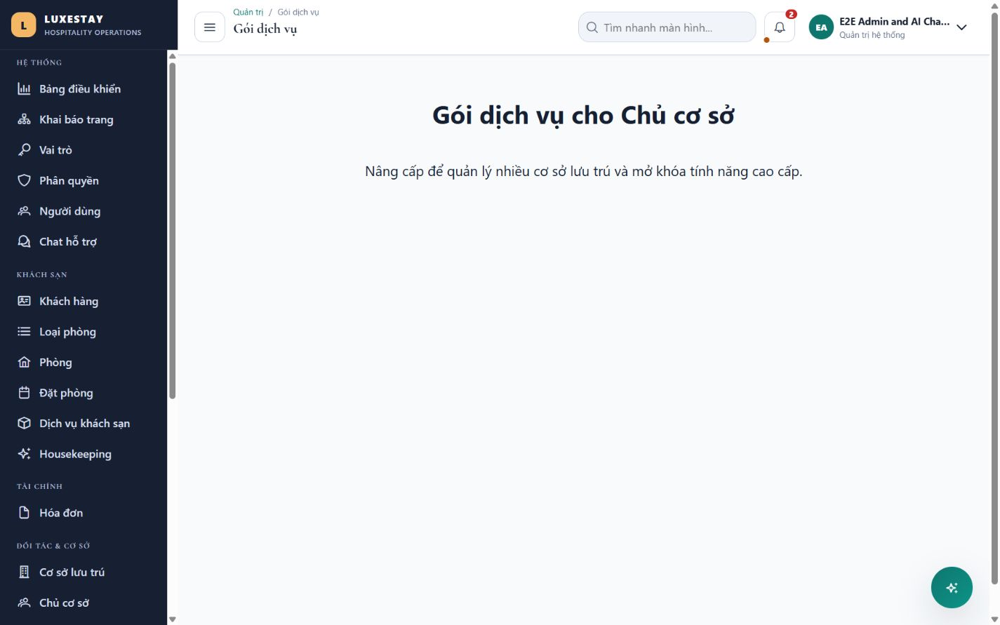

Hình minh họa được chụp từ tuyến giao diện tương ứng. Trạng thái PASS/PARTIAL/FAIL và giới hạn kiểm chứng được đối chiếu trong danh mục ảnh giao diện của dự án.
### UI 026 admin payment config

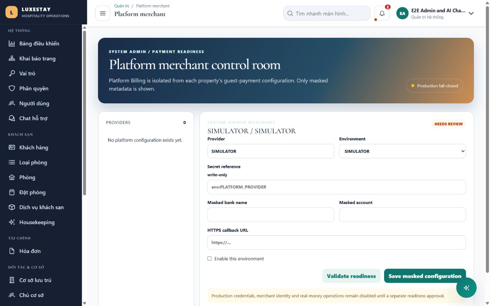

Hình minh họa được chụp từ tuyến giao diện tương ứng. Trạng thái PASS/PARTIAL/FAIL và giới hạn kiểm chứng được đối chiếu trong danh mục ảnh giao diện của dự án.
### UI 027 admin platform revenue

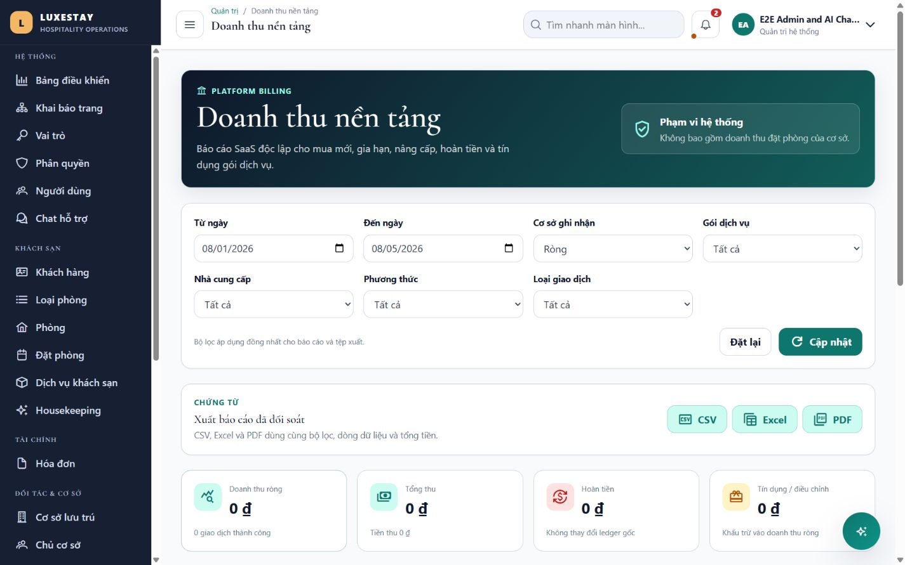

Hình minh họa được chụp từ tuyến giao diện tương ứng. Trạng thái PASS/PARTIAL/FAIL và giới hạn kiểm chứng được đối chiếu trong danh mục ảnh giao diện của dự án.
### UI 028 admin audit log

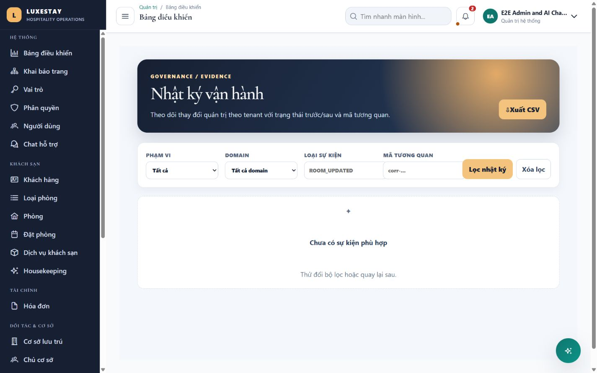

Hình minh họa được chụp từ tuyến giao diện tương ứng. Trạng thái PASS/PARTIAL/FAIL và giới hạn kiểm chứng được đối chiếu trong danh mục ảnh giao diện của dự án.
### UI 029 admin chat

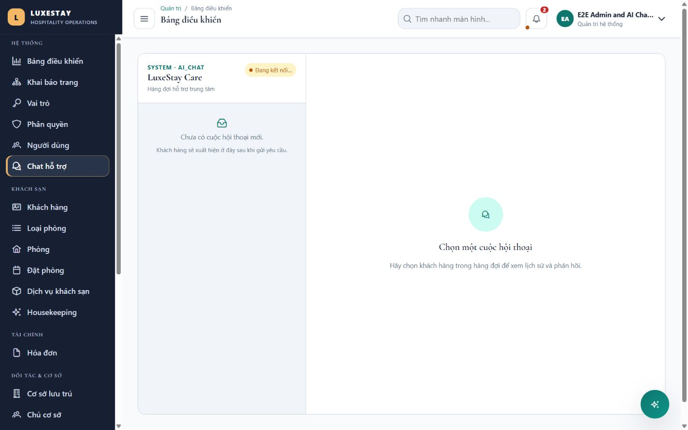

Hình minh họa được chụp từ tuyến giao diện tương ứng. Trạng thái PASS/PARTIAL/FAIL và giới hạn kiểm chứng được đối chiếu trong danh mục ảnh giao diện của dự án.
### UI 030 admin property approvals

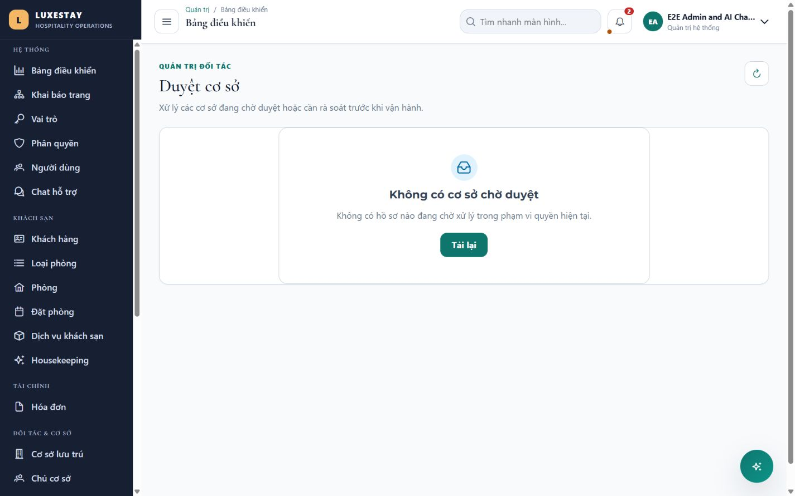

Hình minh họa được chụp từ tuyến giao diện tương ứng. Trạng thái PASS/PARTIAL/FAIL và giới hạn kiểm chứng được đối chiếu trong danh mục ảnh giao diện của dự án.
### UI 031 management dashboard

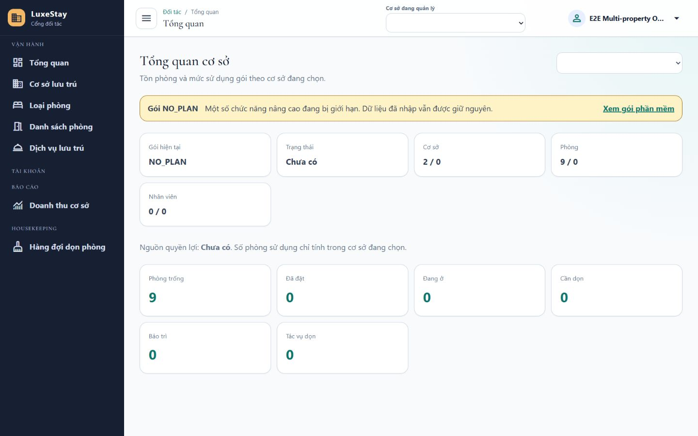

Hình minh họa được chụp từ tuyến giao diện tương ứng. Trạng thái PASS/PARTIAL/FAIL và giới hạn kiểm chứng được đối chiếu trong danh mục ảnh giao diện của dự án.
### UI 032 management room types

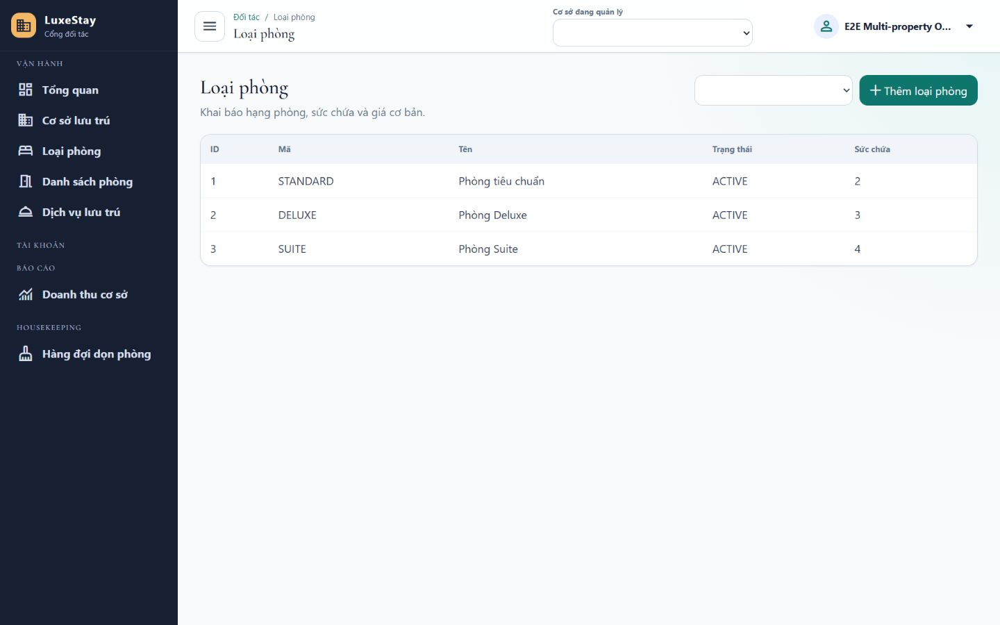

Hình minh họa được chụp từ tuyến giao diện tương ứng. Trạng thái PASS/PARTIAL/FAIL và giới hạn kiểm chứng được đối chiếu trong danh mục ảnh giao diện của dự án.
### UI 033 management rooms

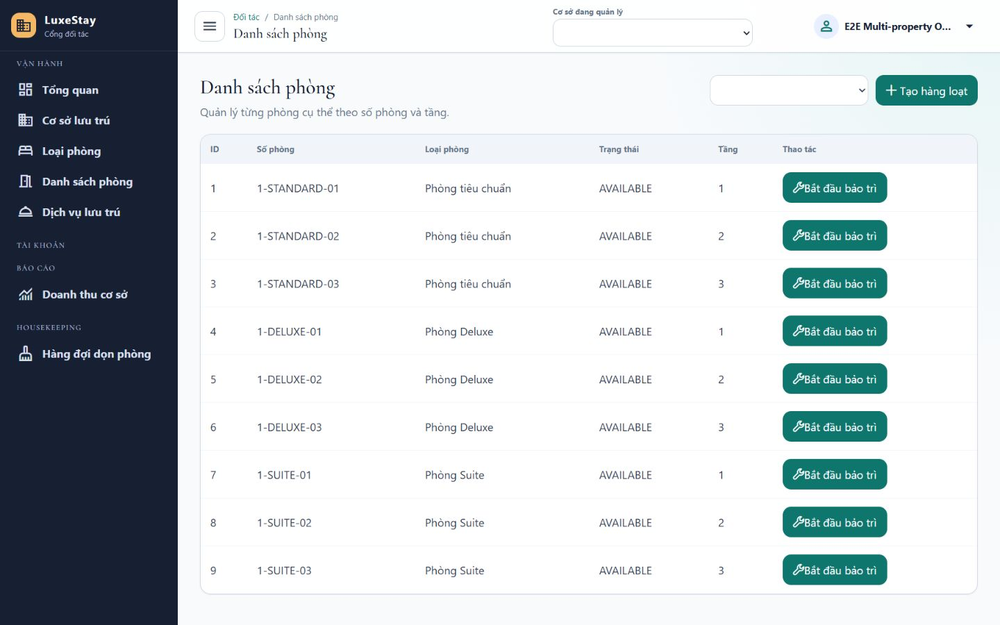

Hình minh họa được chụp từ tuyến giao diện tương ứng. Trạng thái PASS/PARTIAL/FAIL và giới hạn kiểm chứng được đối chiếu trong danh mục ảnh giao diện của dự án.
### UI 034 management housekeeping

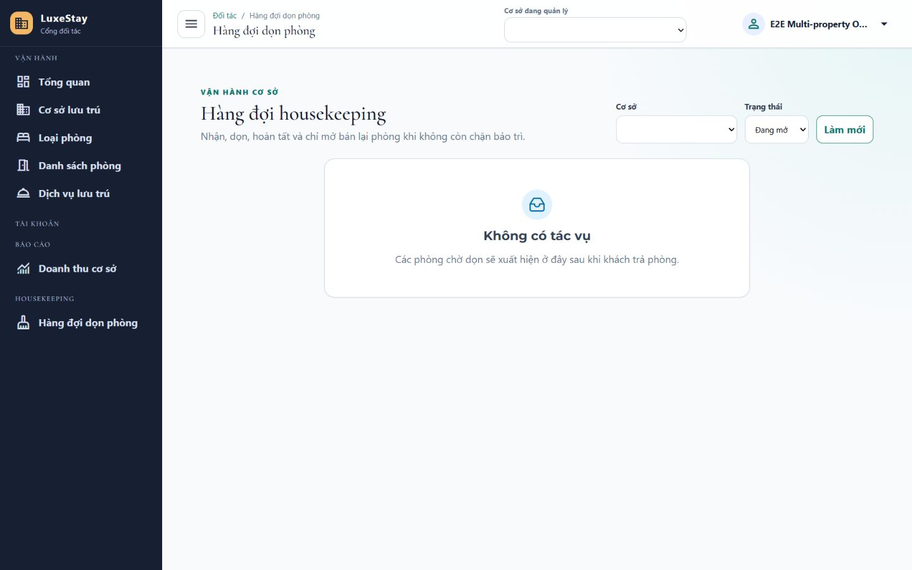

Hình minh họa được chụp từ tuyến giao diện tương ứng. Trạng thái PASS/PARTIAL/FAIL và giới hạn kiểm chứng được đối chiếu trong danh mục ảnh giao diện của dự án.
### UI 035 management services

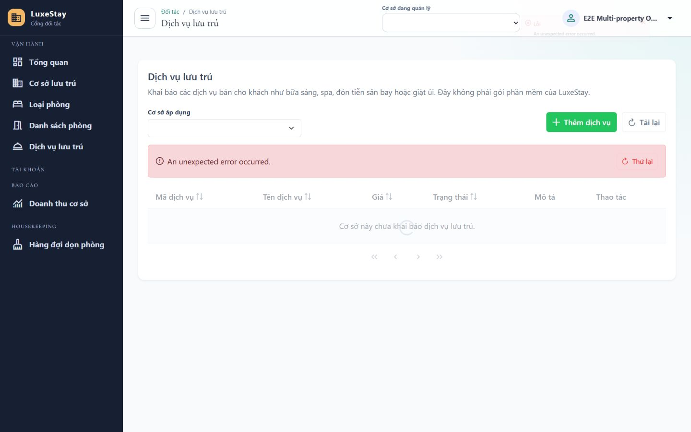

Hình minh họa được chụp từ tuyến giao diện tương ứng. Trạng thái PASS/PARTIAL/FAIL và giới hạn kiểm chứng được đối chiếu trong danh mục ảnh giao diện của dự án.
### UI 036 management payment config

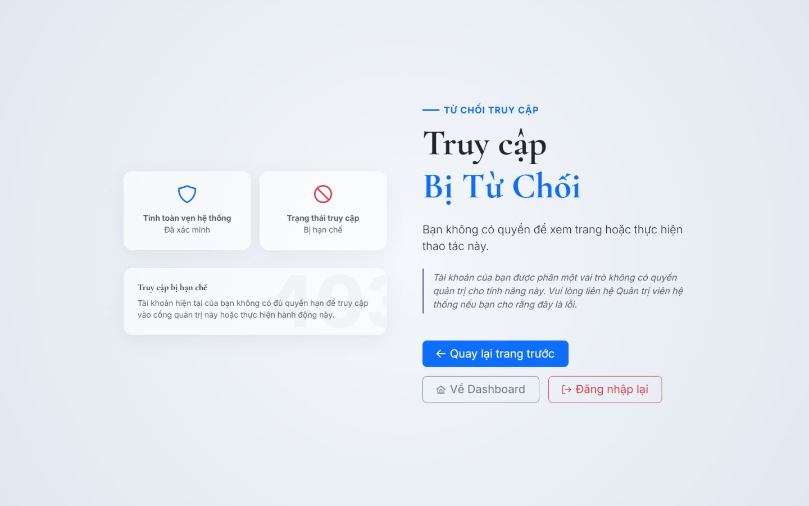

Hình minh họa được chụp từ tuyến giao diện tương ứng. Trạng thái PASS/PARTIAL/FAIL và giới hạn kiểm chứng được đối chiếu trong danh mục ảnh giao diện của dự án.
### UI 037 management refunds

Hình minh họa được chụp từ tuyến giao diện tương ứng. Trạng thái PASS/PARTIAL/FAIL và giới hạn kiểm chứng được đối chiếu trong danh mục ảnh giao diện của dự án.
### UI 038 management property revenue

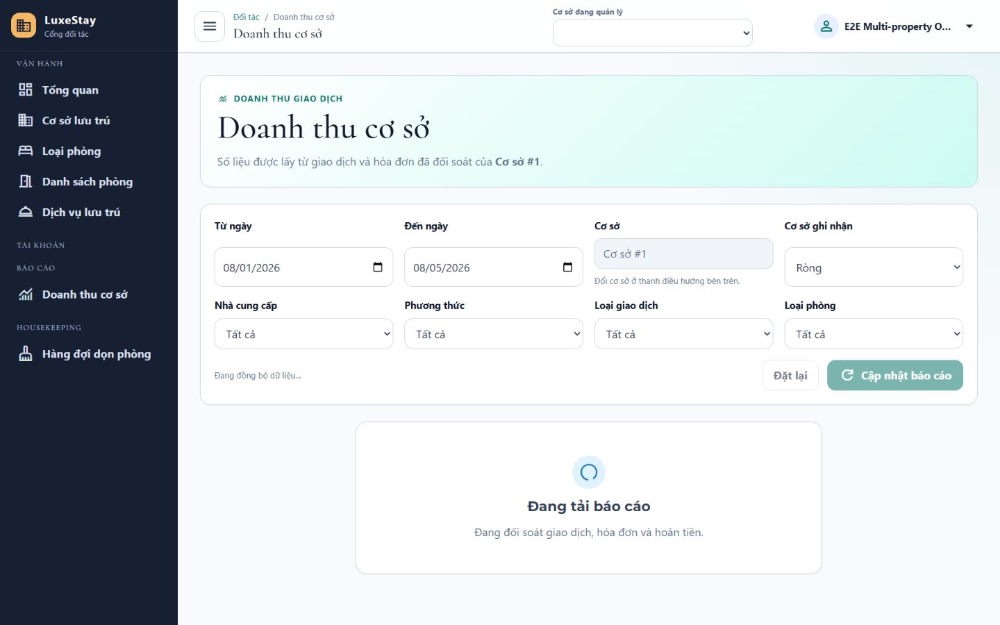

Hình minh họa được chụp từ tuyến giao diện tương ứng. Trạng thái PASS/PARTIAL/FAIL và giới hạn kiểm chứng được đối chiếu trong danh mục ảnh giao diện của dự án.
### UI 039 management subscription billing

Hình minh họa được chụp từ tuyến giao diện tương ứng. Trạng thái PASS/PARTIAL/FAIL và giới hạn kiểm chứng được đối chiếu trong danh mục ảnh giao diện của dự án.
### UI 040 management audit log

Hình minh họa được chụp từ tuyến giao diện tương ứng. Trạng thái PASS/PARTIAL/FAIL và giới hạn kiểm chứng được đối chiếu trong danh mục ảnh giao diện của dự án.
### UI 041 management dashboard mobile

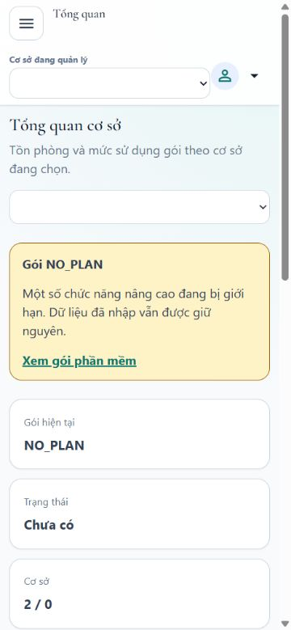

Hình minh họa được chụp từ tuyến giao diện tương ứng. Trạng thái PASS/PARTIAL/FAIL và giới hạn kiểm chứng được đối chiếu trong danh mục ảnh giao diện của dự án.

# CHƯƠNG 5 - KẾT LUẬN

## 5.1. KẾT LUẬN

Đề tài đã xây dựng được hệ thống quản lý khách sạn và đặt phòng trực tuyến trên kiến trúc Angular và Spring Boot. Hệ thống hỗ trợ tìm kiếm tiếng Việt, đặt nhiều phòng cùng loại, quản lý tồn phòng, gán phòng vật lý, check-in, dịch vụ phát sinh, check-out, hóa đơn và housekeeping.

Phân hệ bảo mật kết hợp JWT, role, Action Mask, phạm vi cơ sở và Feature Gate. Mô hình này phù hợp nền tảng nhiều cơ sở vì quyền thao tác và giới hạn thương mại được kiểm tra độc lập.

Dữ liệu địa giới, tìm kiếm Unicode và seeder demo giúp hệ thống có dữ liệu trình diễn có thể lặp lại mà không sao chép từ OTA hoặc sửa cơ sở thật. Các báo cáo và mã nguồn cũng phân biệt rõ dữ liệu STANDARD với phạm vi bao phủ toàn bộ.

## 5.2. HẠN CHẾ

- Một booking mới hỗ trợ một RoomType với số lượng nhiều phòng.
- Khách chưa chọn dịch vụ bổ sung ngay tại checkout.
- Favorites và Customer Reviews chưa hoàn thiện.
- Điểm đánh giá chưa được tổng hợp từ quy trình review thật.
- Subscription chưa có đầy đủ lịch sử activate, renew, upgrade, downgrade và revoke.
- Đối soát thanh toán và báo cáo tài chính chuyên sâu chưa hoàn chỉnh.
- Giao diện Owner chưa bao phủ toàn bộ ảnh, nhân viên, dịch vụ và vận hành.
- `/admin/plans` hiện có luồng đọc plan/subscription nhưng thao tác purchase chỉ là thông báo mô phỏng; không coi là thanh toán hoàn chỉnh.
- Báo cáo doanh thu và công suất chưa đầy đủ theo cơ sở và khoảng ngày.
- Một số cảnh báo build và cấu hình JPA cần được xử lý trước triển khai production.

## 5.3. HƯỚNG PHÁT TRIỂN

1. Hỗ trợ nhiều RoomType trong cùng một booking bằng cấu trúc giỏ phòng.
2. Bổ sung dịch vụ tùy chọn tại checkout và chính sách giá theo ngày.
3. Xây dựng Favorites, Review, duyệt nội dung và điểm đánh giá xác thực.
4. Hoàn thiện vòng đời subscription và lịch sử thay đổi gói.
5. Bổ sung đối soát payment, webhook có chữ ký và nhật ký kiểm toán.
6. Hoàn thiện Owner Portal cho ảnh, nhân viên, dịch vụ và báo cáo.
7. Xây dựng báo cáo doanh thu, công suất, tỷ lệ hủy theo cơ sở và thời gian.
8. Bổ sung lịch sử trạng thái phòng và tiện nghi theo RoomType.
9. Tăng kiểm thử đồng thời cho tồn phòng, callback và hoàn tiền.
10. Chuẩn hóa pipeline CI để chạy backend, frontend, build và Playwright trên mỗi thay đổi.

---

# TÀI LIỆU THAM KHẢO

1. Angular Team, Angular Documentation, https://angular.dev/.
2. Spring, Spring Boot Reference Documentation, https://docs.spring.io/spring-boot/.
3. Spring, Spring Security Reference, https://docs.spring.io/spring-security/.
4. Microsoft, SQL Server Documentation, https://learn.microsoft.com/sql/.
5. Redgate, Flyway Documentation, https://documentation.red-gate.com/flyway/.
6. Docker, Docker Compose Documentation, https://docs.docker.com/compose/.
7. OWASP Foundation, Application Security Verification Standard.
8. IETF RFC 7519, JSON Web Token.

# PHỤ LỤC A - DANH MỤC API BACKEND

| STT | HTTP | Đường dẫn | Controller | Quyền/annotation |
|---|---|---|---|---|
| 1 | GET | /api/admin/properties | AdminPartnerController | @PreAuthorize("hasAnyAuthority('SUPER_ADMIN','ADMIN')") |
| 2 | GET | /api/admin/property-owners | AdminPartnerController |  |
| 3 | GET | /api/admin/property-registrations | AdminPartnerController |  |
| 4 | GET | /api/admin/property-owners/unsubscribed | AdminPartnerController |  |
| 5 | GET | /api/admin/property-approvals | AdminPartnerController |  |
| 6 | GET | /api/admin/property-staff | AdminPartnerController |  |
| 7 | GET | /api/admin/subscription-orders | AdminPartnerController |  |
| 8 | GET | /api/admin/subscription-payments | AdminPartnerController |  |
| 9 | GET | /api/admin/software-contracts | AdminPartnerController |  |
| 10 | GET | /api/admin/property-room-types | AdminPartnerController |  |
| 11 | GET | /api/admin/property-rooms | AdminPartnerController |  |
| 12 | POST | /api/ai/chat | AiController |  |
| 13 | POST | /api/ai/customer/chat | AiController | @Permission(function = FunctionCode.AI_CHAT, action = ActionCode.CREATE) |
| 14 | POST | /api/ai/customer/chat/stream | AiController |  |
| 15 | GET | /api/analytics/dashboard | AnalyticsController |  |
| 16 | GET | /api/functions | AppFunctionController |  |
| 17 | GET | /api/functions/module/{moduleId | AppFunctionController | @Permission(function = FunctionCode.SYSTEM, action = ActionCode.VIEW) |
| 18 | GET | /api/functions/{id | AppFunctionController | @Permission(function = FunctionCode.SYSTEM, action = ActionCode.VIEW) |
| 19 | POST | /api/functions | AppFunctionController | @Permission(function = FunctionCode.SYSTEM, action = ActionCode.VIEW) |
| 20 | PUT | /api/functions/{id | AppFunctionController | @Permission(function = FunctionCode.SYSTEM, action = ActionCode.CREATE) |
| 21 | DELETE | /api/functions/{id | AppFunctionController | @Permission(function = FunctionCode.SYSTEM, action = ActionCode.UPDATE) |
| 22 | GET | /api/modules | AppModuleController |  |
| 23 | GET | /api/modules/{id | AppModuleController | @Permission(function = FunctionCode.SYSTEM, action = ActionCode.VIEW) |
| 24 | POST | /api/modules | AppModuleController | @Permission(function = FunctionCode.SYSTEM, action = ActionCode.VIEW) |
| 25 | PUT | /api/modules/{id | AppModuleController | @Permission(function = FunctionCode.SYSTEM, action = ActionCode.CREATE) |
| 26 | DELETE | /api/modules/{id | AppModuleController | @Permission(function = FunctionCode.SYSTEM, action = ActionCode.UPDATE) |
| 27 | POST | /api/auth/login | AuthController |  |
| 28 | POST | /api/auth/google | AuthController |  |
| 29 | POST | /api/auth/facebook | AuthController |  |
| 30 | GET | /api/auth/social-identities | AuthController |  |
| 31 | POST | /api/auth/social-identities/{provider | AuthController |  |
| 32 | DELETE | /api/auth/social-identities/{provider | AuthController |  |
| 33 | POST | /api/auth/refresh | AuthController |  |
| 34 | POST | /api/auth/logout | AuthController |  |
| 35 | POST | /api/auth/register | AuthController |  |
| 36 | POST | /api/auth/forgot-password | AuthController |  |
| 37 | POST | /api/auth/reset-password | AuthController |  |
| 38 | GET | /api/auth/my-menu | AuthController |  |
| 39 | GET | /api/chat/me/history | ChatController |  |
| 40 | GET | /api/chat/support/conversations | ChatController | @PreAuthorize("isAuthenticated()") |
| 41 | GET | /api/chat/support/conversations/{conversationId | ChatController | @Permission(function = FunctionCode.AI_CHAT, action = ActionCode.VIEW) |
| 42 | POST | /api/chat/support/conversations/{conversationId | ChatController | @Permission(function = FunctionCode.AI_CHAT, action = ActionCode.VIEW) |
| 43 | POST | /api/chat/support/conversations/{conversationId | ChatController | @Permission(function = FunctionCode.AI_CHAT, action = ActionCode.CREATE) |
| 44 | GET | /api/admin/email-outbox/failures | EmailOutboxController |  |
| 45 | GET | /api/admin/email-outbox/{id | EmailOutboxController | @Permission(function = FunctionCode.AUDIT_LOG, action = ActionCode.VIEW) |
| 46 | POST | /api/admin/email-outbox/{id | EmailOutboxController | @Permission(function = FunctionCode.AUDIT_LOG, action = ActionCode.VIEW) |
| 47 | POST | /api/admin/email-outbox/{id | EmailOutboxController | @Permission(function = FunctionCode.AUDIT_LOG, action = ActionCode.UPDATE) |
| 48 | POST | /api/auth/email-verification/confirm | EmailVerificationController |  |
| 49 | POST | /api/users/me/email-verification/resend | EmailVerificationController | @PreAuthorize("isAuthenticated()") |
| 50 | POST | /api/users/me/email-change | EmailVerificationController | @PreAuthorize("isAuthenticated()") |
| 51 | POST | /api/uploads/image | FileUploadController | @PreAuthorize("isAuthenticated()") |
| 52 | GET | /api/public/uploads/{filename:.+ | FileUploadController |  |
| 53 | GET | /api/v1/hotels/public/search | HotelController |  |
| 54 | GET | /api/v1/hotels/public/{id | HotelController |  |
| 55 | GET | /api/v1/hotels/my-hotels | HotelController |  |
| 56 | GET | /api/v1/hotels/accessible | HotelController | @PreAuthorize("isAuthenticated()") |
| 57 | GET | /api/v1/hotels | HotelController | @PreAuthorize("hasAuthority('SUPER_ADMIN')") |
| 58 | POST | /api/v1/hotels | HotelController | @PreAuthorize("hasAuthority('SUPER_ADMIN')") |
| 59 | PUT | /api/v1/hotels/{id | HotelController | @PreAuthorize("hasAuthority('SUPER_ADMIN')") |
| 60 | DELETE | /api/v1/hotels/{id | HotelController | @PreAuthorize("hasAuthority('SUPER_ADMIN')") |
| 61 | POST | /api/v1/hotels/{id | HotelController | @PreAuthorize("hasAnyAuthority('PROPERTY_OWNER', 'SUPER_ADMIN')") |
| 62 | POST | /api/v1/hotels/{id | HotelController | @PreAuthorize("hasAuthority('SUPER_ADMIN')") |
| 63 | POST | /api/v1/hotels/{id | HotelController | @PreAuthorize("hasAuthority('SUPER_ADMIN')") |
| 64 | GET | /api/services | HotelServiceController |  |
| 65 | GET | /api/services/{id | HotelServiceController | @Permission(function = FunctionCode.HOTEL_SERVICE, action = ActionCode.VIEW) |
| 66 | POST | /api/services | HotelServiceController | @Permission(function = FunctionCode.HOTEL_SERVICE, action = ActionCode.VIEW) |
| 67 | PUT | /api/services/{id | HotelServiceController | @Permission(function = FunctionCode.HOTEL_SERVICE, action = ActionCode.CREATE) |
| 68 | DELETE | /api/services/{id | HotelServiceController | @Permission(function = FunctionCode.HOTEL_SERVICE, action = ActionCode.UPDATE) |
| 69 | GET | /api/invoices | InvoiceController |  |
| 70 | GET | /api/legacy/invoices/{id | InvoiceController |  |
| 71 | GET | /api/invoices/reservation/{reservationId | InvoiceController | @Permission(function = FunctionCode.INVOICE, action = ActionCode.VIEW) |
| 72 | POST | /api/invoices/reservation/{reservationId | InvoiceController | @Permission(function = FunctionCode.INVOICE, action = ActionCode.VIEW) |
| 73 | GET | /api/public/locations/provinces | LocationController |  |
| 74 | GET | /api/public/locations/provinces/{provinceId | LocationController |  |
| 75 | GET | /api/public/locations/search | LocationController |  |
| 76 | GET | /api/public/locations/provinces/popular | LocationController |  |
| 77 | GET | /api/management/context | ManagementPortalController | @PreAuthorize("hasAnyAuthority('PROPERTY_OWNER','HOTEL_ADMIN','HOTEL_MANAGER','HOUSEKEEPING','SUPER_ADMIN','ADMIN')") |
| 78 | GET | /api/management/properties | ManagementPortalController |  |
| 79 | POST | /api/management/properties | ManagementPortalController |  |
| 80 | GET | /api/management/room-types | ManagementPortalController |  |
| 81 | POST | /api/management/room-types | ManagementPortalController |  |
| 82 | PUT | /api/management/room-types/{id | ManagementPortalController |  |
| 83 | GET | /api/management/rooms | ManagementPortalController |  |
| 84 | POST | /api/management/rooms | ManagementPortalController |  |
| 85 | POST | /api/management/rooms/bulk | ManagementPortalController |  |
| 86 | PUT | /api/management/rooms/{id | ManagementPortalController |  |
| 87 | POST | /api/management/rooms/{id | ManagementPortalController |  |
| 88 | POST | /api/management/rooms/{id | ManagementPortalController |  |
| 89 | POST | /api/management/housekeeping/{taskId | ManagementPortalController |  |
| 90 | POST | /api/payments/simulator/confirm | MockPaymentController |  |
| 91 | GET | /api/notifications | NotificationController |  |
| 92 | POST | /api/notifications/{id | NotificationController | @Permission(function = FunctionCode.REPORT, action = ActionCode.VIEW) |
| 93 | GET | /api/admin/audit-events | OperationalAuditController |  |
| 94 | GET | /api/admin/audit-events/export | OperationalAuditController |  |
| 95 | GET | /api/payments/reservation/{reservationId | PaymentController |  |
| 96 | POST | /api/payments | PaymentController | @Permission(function = FunctionCode.FINANCE, action = ActionCode.VIEW) |
| 97 | POST | /api/payments/sessions | PaymentController |  |
| 98 | GET | /api/payments/sessions/{sessionId | PaymentController |  |
| 99 | GET | /api/payments/create-url | PaymentController | @PreAuthorize("hasAuthority('CUSTOMER')") |
| 100 | GET | /api/payments/vnpay-callback | PaymentController |  |
| 101 | GET | /api/payments/vnpay-ipn | PaymentController |  |
| 102 | POST | /api/payments/momo-ipn | PaymentController |  |
| 103 | POST | /api/payments/zalopay-callback | PaymentController |  |
| 104 | GET | /api/promotions | PromotionController | @PreAuthorize("hasAnyAuthority('SUPER_ADMIN','PROPERTY_OWNER','HOTEL_ADMIN','HOTEL_MANAGER')") |
| 105 | POST | /api/promotions | PromotionController | @PreAuthorize("hasAnyAuthority('SUPER_ADMIN','PROPERTY_OWNER','HOTEL_ADMIN','HOTEL_MANAGER')") |
| 106 | PUT | /api/promotions/{id | PromotionController |  |
| 107 | POST | /api/promotions/{id | PromotionController |  |
| 108 | POST | /api/promotions/{id | PromotionController |  |
| 109 | POST | /api/properties/{propertyId | PropertyClaimController |  |
| 110 | GET | /api/admin/property-claims | PropertyClaimController |  |
| 111 | POST | /api/admin/property-claims/{id | PropertyClaimController | @PreAuthorize("hasAuthority('PROPERTY_CLAIM_VIEW') or hasAuthority('SUPER_ADMIN')") |
| 112 | POST | /api/admin/property-claims/{id | PropertyClaimController | @PreAuthorize("hasAuthority('PROPERTY_CLAIM_APPROVE') or hasAuthority('SUPER_ADMIN')") |
| 113 | POST | /api/property-claims/{id | PropertyClaimController | @PreAuthorize("hasAuthority('PROPERTY_CLAIM_APPROVE') or hasAuthority('SUPER_ADMIN')") |
| 114 | POST | /api/admin/property-imports/search | PropertyImportController |  |
| 115 | GET | /api/admin/property-imports | PropertyImportController | @PreAuthorize("hasAuthority('PROPERTY_IMPORT_CREATE') or hasRole('SUPER_ADMIN')") |
| 116 | GET | /api/admin/property-imports/{batchId | PropertyImportController | @PreAuthorize("hasAuthority('PROPERTY_IMPORT_VIEW') or hasRole('SUPER_ADMIN')") |
| 117 | POST | /api/admin/property-imports/{batchId | PropertyImportController | @PreAuthorize("hasAuthority('PROPERTY_IMPORT_VIEW') or hasRole('SUPER_ADMIN')") |
| 118 | POST | /register | PropertyRegistrationController |  |
| 119 | GET | /registration-status | PropertyRegistrationController | @PreAuthorize("isAuthenticated()") |
| 120 | GET | /api/public/properties/search | PropertySearchController |  |
| 121 | GET | /api/public/search/suggestions | PublicDiscoveryController |  |
| 122 | GET | /api/public/popular-destinations | PublicDiscoveryController |  |
| 123 | GET | /api/public/home/recommendation-destinations | PublicDiscoveryController |  |
| 124 | GET | /api/public/home/recommendations | PublicDiscoveryController |  |
| 125 | GET | /api/public/properties/{hotelId | PublicDiscoveryController |  |
| 126 | GET | /api/public/home/spotlights | PublicHomeSpotlightController |  |
| 127 | GET | /api/public/promotions | PublicPromotionController |  |
| 128 | GET | /api/public/promotions/membership | PublicPromotionController |  |
| 129 | POST | /api/public/quotes | PublicQuoteController |  |
| 130 | POST | /api/reservations | ReservationController |  |
| 131 | GET | /api/reservations | ReservationController |  |
| 132 | GET | /api/reservations/{id | ReservationController | @Permission(function = FunctionCode.RESERVATION, action = ActionCode.VIEW) |
| 133 | GET | /api/reservations/my-bookings | ReservationController | @PreAuthorize("hasAnyAuthority('CUSTOMER','PROPERTY_OWNER','HOTEL_MANAGER','RECEPTIONIST','HOTEL_ADMIN','SUPER_ADMIN','ADMIN')") |
| 134 | POST | /api/reservations/{id | ReservationController | @PreAuthorize("hasAuthority('CUSTOMER')") |
| 135 | PUT | /api/reservations/{id | ReservationController |  |
| 136 | PUT | /api/reservations/{id | ReservationController | @Permission(function = FunctionCode.RESERVATION, action = ActionCode.UPDATE) |
| 137 | GET | /api/reservations/{id | ReservationController | @Permission(function = FunctionCode.RESERVATION_ASSIGNMENT, action = ActionCode.UPDATE) |
| 138 | POST | /api/reservations/{id | ReservationController | @Permission(function = FunctionCode.RESERVATION_ASSIGNMENT, action = ActionCode.VIEW) |
| 139 | POST | /api/reservations/{id | ReservationController | @Permission(function = FunctionCode.RESERVATION_ASSIGNMENT, action = ActionCode.UPDATE) |
| 140 | POST | /api/reservations/{id | ReservationController | @Permission(function = FunctionCode.CHECKIN, action = ActionCode.UPDATE) |
| 141 | POST | /api/reservations/{id | ReservationController | @Permission(function = FunctionCode.RESERVATION_CANCEL, action = ActionCode.UPDATE) |
| 142 | POST | /api/reservations/{id | ReservationController | @Permission(function = FunctionCode.RESERVATION_NO_SHOW, action = ActionCode.UPDATE) |
| 143 | POST | /api/reservations/public/book | ReservationController | @Permission(function = FunctionCode.CHECKOUT, action = ActionCode.CREATE) |
| 144 | POST | /api/reservations/book | ReservationController |  |
| 145 | POST | /api/reservations/{id | ReservationController |  |
| 146 | GET | /api/roles | RoleController |  |
| 147 | GET | /api/roles/{id | RoleController | @Permission(function = FunctionCode.ROLE, action = ActionCode.VIEW) |
| 148 | POST | /api/roles | RoleController | @Permission(function = FunctionCode.ROLE, action = ActionCode.VIEW) |
| 149 | PUT | /api/roles/{id | RoleController | @Permission(function = FunctionCode.ROLE, action = ActionCode.CREATE) |
| 150 | DELETE | /api/roles/{id | RoleController | @Permission(function = FunctionCode.ROLE, action = ActionCode.UPDATE) |
| 151 | GET | /api/role-permissions/tree/{roleId | RolePermissionController |  |
| 152 | POST | /api/role-permissions/{roleId | RolePermissionController | @Permission(function = FunctionCode.ROLE_PERMISSION, action = ActionCode.VIEW) |
| 153 | GET | /api/rooms | RoomController |  |
| 154 | GET | /api/rooms/{id | RoomController | @Permission(function = FunctionCode.ROOM, action = ActionCode.VIEW) |
| 155 | POST | /api/rooms | RoomController | @Permission(function = FunctionCode.ROOM, action = ActionCode.VIEW) |
| 156 | POST | /api/rooms/bulk | RoomController | @Permission(function = FunctionCode.ROOM, action = ActionCode.CREATE) |
| 157 | PUT | /api/rooms/{id | RoomController | @Permission(function = FunctionCode.ROOM, action = ActionCode.CREATE) |
| 158 | POST | /api/rooms/{id | RoomController | @Permission(function = FunctionCode.ROOM, action = ActionCode.UPDATE) |
| 159 | POST | /api/rooms/{id | RoomController | @Permission(function = FunctionCode.ROOM, action = ActionCode.UPDATE) |
| 160 | DELETE | /api/rooms/{id | RoomController | @Permission(function = FunctionCode.ROOM, action = ActionCode.UPDATE) |
| 161 | GET | /api/room-types | RoomTypeController |  |
| 162 | GET | /api/room-types/{id | RoomTypeController | @Permission(function = FunctionCode.ROOM_TYPE, action = ActionCode.VIEW) |
| 163 | POST | /api/room-types | RoomTypeController | @Permission(function = FunctionCode.ROOM_TYPE, action = ActionCode.VIEW) |
| 164 | PUT | /api/room-types/{id | RoomTypeController | @Permission(function = FunctionCode.ROOM_TYPE, action = ActionCode.CREATE) |
| 165 | DELETE | /api/room-types/{id | RoomTypeController | @Permission(function = FunctionCode.ROOM_TYPE, action = ActionCode.UPDATE) |
| 166 | GET | /api/room-types/public/hotel/{hotelId | RoomTypeController | @Permission(function = FunctionCode.ROOM_TYPE, action = ActionCode.DELETE) |
| 167 | GET | /api/sponsored-placements | SponsoredPlacementController | @PreAuthorize("hasAnyAuthority('SUPER_ADMIN','PROPERTY_OWNER','HOTEL_ADMIN','HOTEL_MANAGER')") |
| 168 | POST | /api/sponsored-placements | SponsoredPlacementController | @PreAuthorize("hasAnyAuthority('SUPER_ADMIN','PROPERTY_OWNER','HOTEL_ADMIN','HOTEL_MANAGER')") |
| 169 | PUT | /api/sponsored-placements/{id | SponsoredPlacementController |  |
| 170 | POST | /api/sponsored-placements/{id | SponsoredPlacementController |  |
| 171 | POST | /api/sponsored-placements/{id | SponsoredPlacementController | @PreAuthorize("hasAuthority('SUPER_ADMIN')") |
| 172 | POST | /api/sponsored-placements/{id | SponsoredPlacementController | @PreAuthorize("hasAuthority('SUPER_ADMIN')") |
| 173 | GET | /api/subscriptions/plans | SubscriptionController |  |
| 174 | GET | /api/subscriptions/me | SubscriptionController | @PreAuthorize("isAuthenticated()") |
| 175 | GET | /api/subscriptions/me/features | SubscriptionController | @PreAuthorize("isAuthenticated()") |
| 176 | GET | /api/subscriptions/me/usage | SubscriptionController | @PreAuthorize("isAuthenticated()") |
| 177 | GET | /api/users | UserController |  |
| 178 | GET | /api/users/customers | UserController | @Permission(function = FunctionCode.USER, action = ActionCode.VIEW) |
| 179 | GET | /api/users/property-guests | UserController | @Permission(function = FunctionCode.CUSTOMER, action = ActionCode.VIEW) |
| 180 | POST | /api/users/customers | UserController | @Permission(function = FunctionCode.CUSTOMER, action = ActionCode.VIEW) |
| 181 | PUT | /api/users/customers/{id | UserController |  |
| 182 | GET | /api/users/{id | UserController |  |
| 183 | POST | /api/users | UserController | @Permission(function = FunctionCode.USER, action = ActionCode.VIEW) |
| 184 | PUT | /api/users/{id | UserController |  |
| 185 | POST | /api/users/{id | UserController |  |
| 186 | POST | /api/users/{id | UserController | @Permission(function = FunctionCode.USER, action = ActionCode.DELETE) |
| 187 | GET | /api/users/me | UserController | @PreAuthorize("isAuthenticated()") |
| 188 | PUT | /api/users/me | UserController | @PreAuthorize("isAuthenticated()") |
| 189 | PUT | /api/users/me/password | UserController | @PreAuthorize("isAuthenticated()") |
| 190 | GET | /api/favorites | FavoriteController | @PreAuthorize("hasAuthority('CUSTOMER')") |
| 191 | POST | /api/favorites/{hotelId | FavoriteController | @PreAuthorize("hasAuthority('CUSTOMER')") |
| 192 | DELETE | /api/favorites/{hotelId | FavoriteController |  |
| 193 | GET | /api/housekeeping/tasks | HousekeepingController |  |
| 194 | GET | /api/housekeeping/assignees | HousekeepingController | @Permission(function = FunctionCode.HOUSEKEEPING, action = ActionCode.VIEW) |
| 195 | POST | /api/housekeeping/tasks/{taskId | HousekeepingController | @Permission(function = FunctionCode.HOUSEKEEPING, action = ActionCode.VIEW) |
| 196 | POST | /api/housekeeping/tasks/{taskId | HousekeepingController | @Permission(function = FunctionCode.HOUSEKEEPING, action = ActionCode.UPDATE) |
| 197 | POST | /api/housekeeping/tasks/{taskId | HousekeepingController | @Permission(function = FunctionCode.HOUSEKEEPING, action = ActionCode.UPDATE) |
| 198 | POST | /api/housekeeping/tasks/{taskId | HousekeepingController | @Permission(function = FunctionCode.HOUSEKEEPING, action = ActionCode.UPDATE) |
| 199 | GET | /api/platform/subscription-plans | PlatformBillingController |  |
| 200 | POST | /api/platform/subscription-orders | PlatformBillingController | @PreAuthorize("isAuthenticated()") |
| 201 | GET | /api/platform/subscription-orders/{orderId | PlatformBillingController |  |
| 202 | POST | /api/platform/subscription-orders/{orderId | PlatformBillingController | @Permission(function = FunctionCode.PLATFORM_BILLING, action = ActionCode.VIEW) |
| 203 | POST | /api/platform/subscription-orders/{orderId | PlatformBillingController |  |
| 204 | POST | /api/platform/subscriptions/{targetHotelId | PlatformBillingController | @Permission(function = FunctionCode.PLATFORM_BILLING, action = ActionCode.UPDATE) |
| 205 | POST | /api/platform/subscriptions/{targetHotelId | PlatformBillingController | @Permission(function = FunctionCode.PLATFORM_BILLING, action = ActionCode.CREATE) |
| 206 | POST | /api/platform/subscriptions/{targetHotelId | PlatformBillingController |  |
| 207 | GET | /api/platform/subscriptions/{targetHotelId | PlatformBillingController |  |
| 208 | GET | /api/platform/subscriptions/{targetHotelId | PlatformBillingController | @Permission(function = FunctionCode.PLATFORM_BILLING, action = ActionCode.VIEW) |
| 209 | GET | /api/platform/subscription-policies | PlatformBillingController | @Permission(function = FunctionCode.PLATFORM_BILLING, action = ActionCode.VIEW) |
| 210 | GET | /api/platform/payment-configuration | PlatformBillingController | @Permission(function = FunctionCode.PLATFORM_BILLING, action = ActionCode.VIEW) |
| 211 | PUT | /api/platform/payment-configuration | PlatformBillingController | @Permission(function = FunctionCode.PAYMENT_READINESS, action = ActionCode.VIEW) |
| 212 | POST | /api/platform/payment-configuration/validate | PlatformBillingController | @Permission(function = FunctionCode.PAYMENT_READINESS, action = ActionCode.UPDATE) |
| 213 | GET | /api/platform/payment-configuration/{provider | PlatformBillingController | @Permission(function = FunctionCode.PAYMENT_READINESS, action = ActionCode.UPDATE) |
| 214 | POST | /api/financial-simulator/property-payment-attempts/{attemptId | FinancialSimulatorController |  |
| 215 | POST | /api/financial-simulator/platform-orders/{orderId | FinancialSimulatorController |  |
| 216 | POST | /api/financial-simulator/property-refunds/{refundId | FinancialSimulatorController |  |
| 217 | POST | /api/payment-providers/platform/{provider | PlatformPaymentCallbackController |  |
| 218 | POST | /api/platform-payments/{transactionId | PlatformRefundController |  |
| 219 | POST | /api/platform-refunds/{refundId | PlatformRefundController |  |
| 220 | POST | /api/platform-refunds/{refundId | PlatformRefundController | @Permission(function = FunctionCode.PLATFORM_REFUND, action = ActionCode.APPROVE) |
| 221 | GET | /api/platform-refunds/{refundId | PlatformRefundController |  |
| 222 | POST | /api/payment-providers/platform/{provider | PlatformRefundController | @Permission(function = FunctionCode.PLATFORM_REFUND, action = ActionCode.VIEW) |
| 223 | GET | /api/admin/reports/platform-revenue | PlatformRevenueController |  |
| 224 | GET | /api/admin/reports/platform-revenue/export | PlatformRevenueController |  |
| 225 | POST | /api/management/reservations/{reservationId}/charges/services | PropertyCheckoutController |  |
| 226 | POST | /api/management/reservations/{reservationId}/charges/surcharges | PropertyCheckoutController |  |
| 227 | GET | /api/management/reservations/{reservationId}/charges/adjustments | PropertyCheckoutController |  |
| 228 | POST | /api/management/reservations/{reservationId}/checkout-preview | PropertyCheckoutController | @Permission(function = FunctionCode.RESERVATION_SURCHARGE, action = ActionCode.VIEW) |
| 229 | POST | /api/management/reservations/{reservationId}/checkout-override | PropertyCheckoutController | @Permission(function = FunctionCode.CHECKOUT, action = ActionCode.VIEW) |
| 230 | POST | /api/management/reservations/{reservationId}/checkout | PropertyCheckoutController |  |
| 231 | GET | /api/management/properties/{propertyId}/payment-configuration | PropertyPaymentConfigurationController |  |
| 232 | PUT | /api/management/properties/{propertyId}/payment-configuration | PropertyPaymentConfigurationController | @Permission(function = FunctionCode.PROPERTY_PAYMENT_CONFIG, action = ActionCode.VIEW) |
| 233 | POST | /api/management/properties/{propertyId}/payment-configuration/validate | PropertyPaymentConfigurationController | @Permission(function = FunctionCode.PROPERTY_PAYMENT_CONFIG, action = ActionCode.UPDATE) |
| 234 | GET | /api/invoices/{invoiceId | PropertyInvoiceController |  |
| 235 | GET | /api/management/invoices/finalized | PropertyInvoiceController |  |
| 236 | GET | /api/management/reservations/{reservationId | PropertyInvoiceController |  |
| 237 | GET | /api/invoices/finalized/my | PropertyInvoiceController | @Permission(function = FunctionCode.INVOICE, action = ActionCode.VIEW) |
| 238 | GET | /api/invoices/{invoiceId | PropertyInvoiceController |  |
| 239 | POST | /api/invoices/{invoiceId | PropertyInvoiceController |  |
| 240 | POST | /api/management/invoices/{invoiceId | PropertyInvoiceController |  |
| 241 | GET | /api/reservations/{reservationId | PropertyPaymentController |  |
| 242 | POST | /api/reservations/{reservationId | PropertyPaymentController |  |
| 243 | GET | /api/payment-attempts/{attemptId | PropertyPaymentController |  |
| 244 | POST | /api/payment-attempts/{attemptId | PropertyPaymentController |  |
| 245 | POST | /api/management/payment-attempts/{attemptId | PropertyPaymentController |  |
| 246 | POST | /api/payment-providers/property/{provider | PropertyPaymentController |  |
| 247 | POST | /api/property-payments/{transactionId | PropertyRefundController |  |
| 248 | POST | /api/property-refunds/{refundId | PropertyRefundController |  |
| 249 | GET | /api/property-refunds | PropertyRefundController | @Permission(function = FunctionCode.PROPERTY_REFUND, action = ActionCode.APPROVE) |
| 250 | POST | /api/property-refunds/{refundId | PropertyRefundController | @Permission(function = FunctionCode.PROPERTY_REFUND, action = ActionCode.VIEW) |
| 251 | GET | /api/property-refunds/{refundId | PropertyRefundController |  |
| 252 | POST | /api/payment-providers/property/{provider | PropertyRefundController |  |
| 253 | GET | /api/management/reports/property-revenue | PropertyRevenueController |  |
| 254 | GET | /api/management/reports/property-revenue/export | PropertyRevenueController |  |

# PHỤ LỤC B - DANH MỤC ROUTE FRONTEND

| STT | Route | Component/loader | Tệp |
|---|---|---|---|
| 1 | (root) | () => import('./layout/client-layout/client-layout').then(m => m.ClientLayout) | frontend/src/app/app.routes.ts |
| 2 | (root) | () => import('./features/client/home/home').then(m => m.HomeComponent) | frontend/src/app/app.routes.ts |
| 3 | search | () => import('./features/property-search/pages/property-search-page/property-search-page').then(m => m.PropertySearchPageComponent) | frontend/src/app/app.routes.ts |
| 4 | hotel/:id | () => import('./features/client/hotel-detail/hotel-detail.component').then(m => m.HotelDetailComponent) | frontend/src/app/app.routes.ts |
| 5 | booking/:roomTypeId | () => import('./features/client/booking-checkout/booking-checkout.component').then(m => m.BookingCheckoutComponent) | frontend/src/app/app.routes.ts |
| 6 | profile | () => import('./features/client/profile/profile.component').then(m => m.ProfileComponent) | frontend/src/app/app.routes.ts |
| 7 | favorites | () => import('./features/client/favorites/favorites-page.component').then(m => m.FavoritesPageComponent) | frontend/src/app/app.routes.ts |
| 8 | refunds | () => import('./features/client/profile/refund-history.component').then(m => m.RefundHistoryComponent) | frontend/src/app/app.routes.ts |
| 9 | booking-history | () => import('./features/client/profile/profile.component').then(m => m.ProfileComponent) | frontend/src/app/app.routes.ts |
| 10 | my-invoices | () => import('./features/client/my-invoices/my-invoices.component').then(m => m.MyInvoicesComponent) | frontend/src/app/app.routes.ts |
| 11 | settings | () => import('./features/client/account-settings/account-settings.component').then(m => m.AccountSettingsComponent) | frontend/src/app/app.routes.ts |
| 12 | terms | () => import('./features/auth/legal-support/public-information-page.component').then(m => m.PublicInformationPageComponent) | frontend/src/app/app.routes.ts |
| 13 | privacy | () => import('./features/auth/legal-support/public-information-page.component').then(m => m.PublicInformationPageComponent) | frontend/src/app/app.routes.ts |
| 14 | cookies | () => import('./features/auth/legal-support/public-information-page.component').then(m => m.PublicInformationPageComponent) | frontend/src/app/app.routes.ts |
| 15 | contact | () => import('./features/auth/legal-support/public-information-page.component').then(m => m.PublicInformationPageComponent) | frontend/src/app/app.routes.ts |
| 16 | support | () => import('./features/auth/legal-support/public-information-page.component').then(m => m.PublicInformationPageComponent) | frontend/src/app/app.routes.ts |
| 17 | payment-simulator | () => import('./features/client/payment-simulator/payment-simulator').then(m => m.PaymentSimulatorComponent) | frontend/src/app/app.routes.ts |
| 18 | payment-result | () => import('./features/client/payment-result/payment-result').then(m => m.PaymentResultComponent) | frontend/src/app/app.routes.ts |
| 19 | forgot-password | () => import('./features/auth/forgot-password/forgot-password.component').then(m => m.ForgotPasswordComponent) | frontend/src/app/app.routes.ts |
| 20 | reset-password | () => import('./features/auth/reset-password/reset-password.component').then(m => m.ResetPasswordComponent) | frontend/src/app/app.routes.ts |
| 21 | verify-email | () => import('./features/auth/verify-email/verify-email.component').then(m => m.VerifyEmailComponent) | frontend/src/app/app.routes.ts |
| 22 | login | () => import('./features/auth/login/login.component').then(m => m.LoginComponent) | frontend/src/app/app.routes.ts |
| 23 | register | () => import('./features/auth/register/register.component').then(m => m.RegisterComponent) | frontend/src/app/app.routes.ts |
| 24 | partner/register | () => import('./features/client/partner-register/partner-register.component').then(m => m.PartnerRegisterComponent) | frontend/src/app/app.routes.ts |
| 25 | partner/registration-status | () => import('./features/client/partner-registration-status/partner-registration-status.component').then(m => m.PartnerRegistrationStatusComponent) | frontend/src/app/app.routes.ts |
| 26 | admin/login | () => import('./features/auth/admin-login/admin-login.component').then(m => m.AdminLoginComponent) | frontend/src/app/app.routes.ts |
| 27 | admin | () => import('./layout/admin-layout/admin-layout').then(m => m.AdminLayout) | frontend/src/app/app.routes.ts |
| 28 | dashboard | () => import('./features/admin/dashboard/dashboard').then(m => m.Dashboard) | frontend/src/app/app.routes.ts |
| 29 | profile | () => import('./features/admin/profile/profile.component').then(m => m.AdminProfileComponent) | frontend/src/app/app.routes.ts |
| 30 | users | () => import('./features/admin/user-management/user-management').then(m => m.UserManagement) | frontend/src/app/app.routes.ts |
| 31 | customers | () => import('./features/admin/user-management/user-management').then(m => m.UserManagement) | frontend/src/app/app.routes.ts |
| 32 | room-types | () => import('./features/admin/room-type-management/room-type-management').then(m => m.RoomTypeManagement) | frontend/src/app/app.routes.ts |
| 33 | rooms | () => import('./features/admin/room-management/room-management').then(m => m.RoomManagement) | frontend/src/app/app.routes.ts |
| 34 | services | () => import('./features/admin/service-management/service-management').then(m => m.ServiceManagement) | frontend/src/app/app.routes.ts |
| 35 | reservations | () => import('./features/admin/reservation-management/reservation-management').then(m => m.ReservationManagement) | frontend/src/app/app.routes.ts |
| 36 | refunds | () => import('./features/admin/reservation-management/refund-management.component').then(m => m.RefundManagementComponent) | frontend/src/app/app.routes.ts |
| 37 | platform-refunds | () => import('./features/admin/platform-refunds/platform-refunds.component').then(m => m.PlatformRefundsComponent) | frontend/src/app/app.routes.ts |
| 38 | platform-revenue | () => import('./features/admin/platform-revenue/platform-revenue.component').then(m => m.PlatformRevenueComponent) | frontend/src/app/app.routes.ts |
| 39 | reservations/timeline | () => import('./features/admin/reservation-timeline/reservation-timeline.component').then(m => m.ReservationTimelineComponent) | frontend/src/app/app.routes.ts |
| 40 | reservations/create | () => import('./features/admin/reservation-create/reservation-create').then(m => m.ReservationCreate) | frontend/src/app/app.routes.ts |
| 41 | invoices | () => import('./features/admin/invoice-management/invoice-management').then(m => m.InvoiceManagement) | frontend/src/app/app.routes.ts |
| 42 | modules | () => import('./features/system/module-management/module-management').then(m => m.ModuleManagementComponent) | frontend/src/app/app.routes.ts |
| 43 | chat | () => import('./features/admin/chat-dashboard/chat-dashboard').then(m => m.ChatDashboardComponent) | frontend/src/app/app.routes.ts |
| 44 | properties | () => import('./features/admin/property-management/property-management').then(m => m.PropertyManagementComponent) | frontend/src/app/app.routes.ts |
| 45 | plans | () => import('./features/admin/subscription-plans/subscription-plans').then(m => m.SubscriptionPlansComponent) | frontend/src/app/app.routes.ts |
| 46 | platform-payment-configuration | () => import('./features/admin/platform-payment-configuration/platform-payment-configuration.component').then(m => m.PlatformPaymentConfigurationComponent) | frontend/src/app/app.routes.ts |
| 47 | roles | () => import('./features/admin/role-management/role-management.component').then(m => m.RoleManagementComponent) | frontend/src/app/app.routes.ts |
| 48 | role-permissions | () => import('./features/admin/role-permission/role-permission.component').then(m => m.RolePermissionComponent) | frontend/src/app/app.routes.ts |
| 49 | audit-log | () => import('./features/admin/audit-log/audit-log.component').then(m => m.AuditLogComponent) | frontend/src/app/app.routes.ts |
| 50 | email-outbox | () => import('./features/admin/email-outbox/email-outbox.component').then(m => m.EmailOutboxComponent) | frontend/src/app/app.routes.ts |
| 51 | property-imports | () => import('./features/admin/property-imports/property-imports.component').then(m => m.PropertyImportsComponent) | frontend/src/app/app.routes.ts |
| 52 | property-claims | () => import('./features/admin/property-claims/property-claims.component').then(m => m.PropertyClaimsComponent) | frontend/src/app/app.routes.ts |
| 53 | property-owners | () => import('./features/admin/partner-overview/partner-overview.component').then(m => m.PartnerOverviewComponent) | frontend/src/app/app.routes.ts |
| 54 | property-registrations | () => import('./features/admin/partner-overview/partner-overview.component').then(m => m.PartnerOverviewComponent) | frontend/src/app/app.routes.ts |
| 55 | unsubscribed-owners | () => import('./features/admin/partner-overview/partner-overview.component').then(m => m.PartnerOverviewComponent) | frontend/src/app/app.routes.ts |
| 56 | property-approvals | () => import('./features/admin/partner-overview/partner-overview.component').then(m => m.PartnerOverviewComponent) | frontend/src/app/app.routes.ts |
| 57 | property-staff | () => import('./features/admin/partner-overview/partner-overview.component').then(m => m.PartnerOverviewComponent) | frontend/src/app/app.routes.ts |
| 58 | property-room-types | () => import('./features/admin/partner-overview/partner-overview.component').then(m => m.PartnerOverviewComponent) | frontend/src/app/app.routes.ts |
| 59 | property-rooms | () => import('./features/admin/partner-overview/partner-overview.component').then(m => m.PartnerOverviewComponent) | frontend/src/app/app.routes.ts |
| 60 | subscription-orders | () => import('./features/admin/partner-overview/partner-overview.component').then(m => m.PartnerOverviewComponent) | frontend/src/app/app.routes.ts |
| 61 | subscription-payments | () => import('./features/admin/partner-overview/partner-overview.component').then(m => m.PartnerOverviewComponent) | frontend/src/app/app.routes.ts |
| 62 | software-contracts | () => import('./features/admin/partner-overview/partner-overview.component').then(m => m.PartnerOverviewComponent) | frontend/src/app/app.routes.ts |
| 63 | role | () => import('./features/error/not-found/not-found.component').then(m => m.NotFoundComponent) | frontend/src/app/app.routes.ts |
| 64 | roles-management | () => import('./features/error/not-found/not-found.component').then(m => m.NotFoundComponent) | frontend/src/app/app.routes.ts |
| 65 | permissions/roles | () => import('./features/error/not-found/not-found.component').then(m => m.NotFoundComponent) | frontend/src/app/app.routes.ts |
| 66 | room-type | () => import('./features/error/not-found/not-found.component').then(m => m.NotFoundComponent) | frontend/src/app/app.routes.ts |
| 67 | manage-rooms | () => import('./features/error/not-found/not-found.component').then(m => m.NotFoundComponent) | frontend/src/app/app.routes.ts |
| 68 | 404 | () => import('./features/error/not-found/not-found.component').then(m => m.NotFoundComponent) | frontend/src/app/app.routes.ts |
| 69 | (root) | () => import('./layout/management-layout/management-layout').then(m => m.ManagementLayout) | frontend/src/app/app.routes.ts |
| 70 | ** | () => import('./layout/management-layout/management-layout').then(m => m.ManagementLayout) | frontend/src/app/app.routes.ts |
| 71 | management | () => import('./layout/management-layout/management-layout').then(m => m.ManagementLayout) | frontend/src/app/app.routes.ts |
| 72 | dashboard | () => import('./features/management/dashboard/management-dashboard.component').then(m => m.ManagementDashboardComponent) | frontend/src/app/app.routes.ts |
| 73 | properties | () => import('./features/management/dashboard/management-dashboard.component').then(m => m.ManagementDashboardComponent) | frontend/src/app/app.routes.ts |
| 74 | room-types | () => import('./features/management/inventory/management-inventory.component').then(m => m.ManagementInventoryComponent) | frontend/src/app/app.routes.ts |
| 75 | rooms | () => import('./features/management/inventory/management-inventory.component').then(m => m.ManagementInventoryComponent) | frontend/src/app/app.routes.ts |
| 76 | housekeeping | () => import('./features/management/housekeeping/housekeeping.component').then(m => m.HousekeepingComponent) | frontend/src/app/app.routes.ts |
| 77 | services | () => import('./features/admin/service-management/service-management').then(m => m.ServiceManagement) | frontend/src/app/app.routes.ts |
| 78 | payment-configuration | () => import('./features/management/property-payment-configuration/property-payment-configuration.component').then(m => m.PropertyPaymentConfigurationComponent) | frontend/src/app/app.routes.ts |
| 79 | refunds | () => import('./features/admin/reservation-management/refund-management.component').then(m => m.RefundManagementComponent) | frontend/src/app/app.routes.ts |
| 80 | property-revenue | () => import('./features/management/property-revenue/property-revenue.component').then(m => m.PropertyRevenueComponent) | frontend/src/app/app.routes.ts |
| 81 | audit-log | () => import('./features/admin/audit-log/audit-log.component').then(m => m.AuditLogComponent) | frontend/src/app/app.routes.ts |
| 82 | billing | () => import('./features/management/subscription-billing/subscription-billing.component').then(m => m.SubscriptionBillingComponent) | frontend/src/app/app.routes.ts |
| 83 | subscription | () => import('./features/error/forbidden/forbidden.component').then(m => m.ForbiddenComponent) | frontend/src/app/app.routes.ts |
| 84 | (root) | () => import('./features/error/forbidden/forbidden.component').then(m => m.ForbiddenComponent) | frontend/src/app/app.routes.ts |
| 85 | 403 | () => import('./features/error/forbidden/forbidden.component').then(m => m.ForbiddenComponent) | frontend/src/app/app.routes.ts |
| 86 | ** |  | frontend/src/app/app.routes.ts |
| 87 | /api/test |  | frontend/src/app/core/interceptors/error-interceptor.spec.ts |
| 88 | /api/users/me |  | frontend/src/app/core/interceptors/error-interceptor.spec.ts |
| 89 | /api/payments |  | frontend/src/app/core/interceptors/financial-request.interceptor.spec.ts |

# PHỤ LỤC C - MIGRATION CƠ SỞ DỮ LIỆU

| STT | version | description | file |
|---|---|---|---|
| 1 | 10 | payment idempotency constraint | backend/src/main/resources/db/migration/V10__payment_idempotency_constraint.sql |
| 2 | 11 | landmark discovery | backend/src/main/resources/db/migration/V11__landmark_discovery.sql |
| 3 | 12 | landmark catalog provenance | backend/src/main/resources/db/migration/V12__landmark_catalog_provenance.sql |
| 4 | 13 | current province lookup index | backend/src/main/resources/db/migration/V13__current_province_lookup_index.sql |
| 5 | 14 | canonical booking payment statuses | backend/src/main/resources/db/migration/V14__canonical_booking_payment_statuses.sql |
| 6 | 15 | reservation holds | backend/src/main/resources/db/migration/V15__reservation_holds.sql |
| 7 | 16 | payment sessions | backend/src/main/resources/db/migration/V16__payment_sessions.sql |
| 8 | 17 | payment session checkout url | backend/src/main/resources/db/migration/V17__payment_session_checkout_url.sql |
| 9 | 18 | landmark import audit | backend/src/main/resources/db/migration/V18__landmark_import_audit.sql |
| 10 | 19 | refund lifecycle | backend/src/main/resources/db/migration/V19__refund_lifecycle.sql |
| 11 | 1 | unicode search inventory | backend/src/main/resources/db/migration/V1__unicode_search_inventory.sql |
| 12 | 20 | tenant support conversations | backend/src/main/resources/db/migration/V20__tenant_support_conversations.sql |
| 13 | 21 | property commerce foundation | backend/src/main/resources/db/migration/V21__property_commerce_foundation.sql |
| 14 | 22 | property checkout invoice | backend/src/main/resources/db/migration/V22__property_checkout_invoice.sql |
| 15 | 23 | property refund audit | backend/src/main/resources/db/migration/V23__property_refund_audit.sql |
| 16 | 24 | platform billing foundation | backend/src/main/resources/db/migration/V24__platform_billing_foundation.sql |
| 17 | 25 | platform contract refund | backend/src/main/resources/db/migration/V25__platform_contract_refund.sql |
| 18 | 26 | financial context backfill | backend/src/main/resources/db/migration/V26__financial_context_backfill.sql |
| 19 | 27 | financial integrity indexes | backend/src/main/resources/db/migration/V27__financial_integrity_indexes.sql |
| 20 | 28 | financial permissions | backend/src/main/resources/db/migration/V28__financial_permissions.sql |
| 21 | 29 | financial idempotency | backend/src/main/resources/db/migration/V29__financial_idempotency.sql |
| 22 | 2 | scoped inventory constraints | backend/src/main/resources/db/migration/V2__scoped_inventory_constraints.sql |
| 23 | 30 | booking deposit policy snapshot | backend/src/main/resources/db/migration/V30__booking_deposit_policy_snapshot.sql |
| 24 | 31 | property attempt transfer content uniqueness | backend/src/main/resources/db/migration/V31__property_attempt_transfer_content_uniqueness.sql |
| 25 | 32 | credit note line tenant ownership | backend/src/main/resources/db/migration/V32__credit_note_line_tenant_ownership.sql |
| 26 | 33 | housekeeping checkout idempotency | backend/src/main/resources/db/migration/V33__housekeeping_checkout_idempotency.sql |
| 27 | 34 | legacy subscription entitlement projection | backend/src/main/resources/db/migration/V34__legacy_subscription_entitlement_projection.sql |
| 28 | 35 | staff assignment lifecycle audit | backend/src/main/resources/db/migration/V35__staff_assignment_lifecycle_audit.sql |
| 29 | 36 | role permission governance | backend/src/main/resources/db/migration/V36__role_permission_governance.sql |
| 30 | 37 | authoritative room state | backend/src/main/resources/db/migration/V37__authoritative_room_state.sql |
| 31 | 38 | social identity linking | backend/src/main/resources/db/migration/V38__social_identity_linking.sql |
| 32 | 39 | tenant service catalog scope | backend/src/main/resources/db/migration/V39__tenant_service_catalog_scope.sql |
| 33 | 3 | remaining unicode columns | backend/src/main/resources/db/migration/V3__remaining_unicode_columns.sql |
| 34 | 40 | reservation booking idempotency | backend/src/main/resources/db/migration/V40__reservation_booking_idempotency.sql |
| 35 | 41 | reservation room date guard | backend/src/main/resources/db/migration/V41__reservation_room_date_guard.sql |
| 36 | 42 | reservation lifecycle permissions | backend/src/main/resources/db/migration/V42__reservation_lifecycle_permissions.sql |
| 37 | 43 | legacy service charge reconciliation | backend/src/main/resources/db/migration/V43__legacy_service_charge_reconciliation.sql |
| 38 | 44 | legacy payment reconciliation | backend/src/main/resources/db/migration/V44__legacy_payment_reconciliation.sql |
| 39 | 45 | promotion membership sponsored placement | backend/src/main/resources/db/migration/V45__promotion_membership_sponsored_placement.sql |
| 40 | 46 | reservation promotion quote snapshot | backend/src/main/resources/db/migration/V46__reservation_promotion_quote_snapshot.sql |
| 41 | 47 | operational audit log | backend/src/main/resources/db/migration/V47__operational_audit_log.sql |
| 42 | 48 | credential identity constraints | backend/src/main/resources/db/migration/V48__credential_identity_constraints.sql |
| 43 | 49 | refresh token rotation | backend/src/main/resources/db/migration/V49__refresh_token_rotation.sql |
| 44 | 4 | repair legacy service unicode | backend/src/main/resources/db/migration/V4__repair_legacy_service_unicode.sql |
| 45 | 50 | auth session revocation | backend/src/main/resources/db/migration/V50__auth_session_revocation.sql |
| 46 | 51 | password reset tokens | backend/src/main/resources/db/migration/V51__password_reset_tokens.sql |
| 47 | 52 | email verification | backend/src/main/resources/db/migration/V52__email_verification.sql |
| 48 | 53 | customer favorites | backend/src/main/resources/db/migration/V53__customer_favorites.sql |
| 49 | 54 | housekeeping queue assignment | backend/src/main/resources/db/migration/V54__housekeeping_queue_assignment.sql |
| 50 | 55 | email outbox delivery audit | backend/src/main/resources/db/migration/V55__email_outbox_delivery_audit.sql |
| 51 | 56 | housekeeping completion permission | backend/src/main/resources/db/migration/V56__housekeeping_completion_permission.sql |
| 52 | 57 | enable demo property vnpay sandbox | backend/src/main/resources/db/migration/V57__enable_demo_property_vnpay_sandbox.sql |
| 53 | 58 | add reservation cancellation reason | backend/src/main/resources/db/migration/V58__add_reservation_cancellation_reason.sql |
| 54 | 59 | restore property refund permissions | backend/src/main/resources/db/migration/V59__restore_property_refund_permissions.sql |
| 55 | 5 | nationwide demo owner operations | backend/src/main/resources/db/migration/V5__nationwide_demo_owner_operations.sql |
| 56 | 6 | public discovery index | backend/src/main/resources/db/migration/V6__public_discovery_index.sql |
| 57 | 7 | demo media pricing quality | backend/src/main/resources/db/migration/V7__demo_media_pricing_quality.sql |
| 58 | 8 | classify legacy demo properties | backend/src/main/resources/db/migration/V8__classify_legacy_demo_properties.sql |
| 59 | 9 | admin menu role inventory | backend/src/main/resources/db/migration/V9__admin_menu_role_inventory.sql |

# PHỤ LỤC D - DANH MỤC TỆP KIỂM THỬ

| STT | kind | file |
|---|---|---|
| 1 | backend | backend/src/test/java/com/hotel/controllers/ChatControllerTest.java |
| 2 | backend | backend/src/test/java/com/hotel/controllers/FinancialErrorContractTest.java |
| 3 | backend | backend/src/test/java/com/hotel/controllers/LegacyPaymentRetirementTest.java |
| 4 | backend | backend/src/test/java/com/hotel/controllers/LegacyServiceChargeRetirementTest.java |
| 5 | backend | backend/src/test/java/com/hotel/controllers/OperationalAuditControllerTest.java |
| 6 | backend | backend/src/test/java/com/hotel/controllers/PropertyOperationalErrorContractTest.java |
| 7 | backend | backend/src/test/java/com/hotel/controllers/ReservationControllerIdempotencyTest.java |
| 8 | backend | backend/src/test/java/com/hotel/controllers/ReservationLifecyclePermissionMatrixTest.java |
| 9 | backend | backend/src/test/java/com/hotel/controllers/UserControllerCurrentProfileTest.java |
| 10 | backend | backend/src/test/java/com/hotel/emailoutbox/EmailOutboxControllerContractTest.java |
| 11 | backend | backend/src/test/java/com/hotel/emailoutbox/EmailOutboxServiceTest.java |
| 12 | backend | backend/src/test/java/com/hotel/emailoutbox/EmailOutboxWorkerTest.java |
| 13 | backend | backend/src/test/java/com/hotel/emailoutbox/JavaMailEmailDeliveryAdapterTest.java |
| 14 | backend | backend/src/test/java/com/hotel/favorites/CustomerFavoriteRepositoryTest.java |
| 15 | backend | backend/src/test/java/com/hotel/favorites/FavoriteControllerTest.java |
| 16 | backend | backend/src/test/java/com/hotel/favorites/FavoriteServiceTest.java |
| 17 | backend | backend/src/test/java/com/hotel/housekeeping/HousekeepingCompletionPermissionTest.java |
| 18 | backend | backend/src/test/java/com/hotel/housekeeping/HousekeepingQueueServiceTest.java |
| 19 | backend | backend/src/test/java/com/hotel/integration/AdminUserControllerIntegrationTest.java |
| 20 | backend | backend/src/test/java/com/hotel/integration/AuthControllerIntegrationTest.java |
| 21 | backend | backend/src/test/java/com/hotel/integration/AuthRefreshTokenIntegrationTest.java |
| 22 | backend | backend/src/test/java/com/hotel/integration/AvatarUploadIntegrationTest.java |
| 23 | backend | backend/src/test/java/com/hotel/integration/ChatControllerIntegrationTest.java |
| 24 | backend | backend/src/test/java/com/hotel/integration/ChatWebSocketIntegrationTest.java |
| 25 | backend | backend/src/test/java/com/hotel/integration/CredentialRegistrationIntegrationTest.java |
| 26 | backend | backend/src/test/java/com/hotel/integration/E2eFixtureInitializerIntegrationTest.java |
| 27 | backend | backend/src/test/java/com/hotel/integration/EmailVerificationControllerIntegrationTest.java |
| 28 | backend | backend/src/test/java/com/hotel/integration/FinancialBackfillSafetyIntegrationTest.java |
| 29 | backend | backend/src/test/java/com/hotel/integration/FinancialMigrationIntegrationTest.java |
| 30 | backend | backend/src/test/java/com/hotel/integration/FinancialRefundConcurrencyIntegrationTest.java |
| 31 | backend | backend/src/test/java/com/hotel/integration/FinancialRefundSecurityIntegrationTest.java |
| 32 | backend | backend/src/test/java/com/hotel/integration/FinancialReportingSecurityIntegrationTest.java |
| 33 | backend | backend/src/test/java/com/hotel/integration/FinancialTenantFilterIntegrationTest.java |
| 34 | backend | backend/src/test/java/com/hotel/integration/HotelControllerIntegrationTest.java |
| 35 | backend | backend/src/test/java/com/hotel/integration/LegacyPaymentMigrationTest.java |
| 36 | backend | backend/src/test/java/com/hotel/integration/LegacyServiceChargeMigrationTest.java |
| 37 | backend | backend/src/test/java/com/hotel/integration/MockPaymentControllerIntegrationTest.java |
| 38 | backend | backend/src/test/java/com/hotel/integration/NotificationControllerIntegrationTest.java |
| 39 | backend | backend/src/test/java/com/hotel/integration/NotificationWebSocketIntegrationTest.java |
| 40 | backend | backend/src/test/java/com/hotel/integration/PackagedLocationImportIntegrationTest.java |
| 41 | backend | backend/src/test/java/com/hotel/integration/PasswordChangeControllerIntegrationTest.java |
| 42 | backend | backend/src/test/java/com/hotel/integration/PasswordResetControllerIntegrationTest.java |
| 43 | backend | backend/src/test/java/com/hotel/integration/PaymentControllerIntegrationTest.java |
| 44 | backend | backend/src/test/java/com/hotel/integration/PaymentSessionConcurrencyIntegrationTest.java |
| 45 | backend | backend/src/test/java/com/hotel/integration/ProductionPaymentSafetyIntegrationTest.java |
| 46 | backend | backend/src/test/java/com/hotel/integration/PromotionPriceConsistencyIntegrationTest.java |
| 47 | backend | backend/src/test/java/com/hotel/integration/PropertyClaimControllerIntegrationTest.java |
| 48 | backend | backend/src/test/java/com/hotel/integration/PropertySearchControllerIntegrationTest.java |
| 49 | backend | backend/src/test/java/com/hotel/integration/PublicDiscoveryControllerIntegrationTest.java |
| 50 | backend | backend/src/test/java/com/hotel/integration/RefundLifecycleConcurrencyIntegrationTest.java |
| 51 | backend | backend/src/test/java/com/hotel/integration/ReservationAssignmentConcurrencyIntegrationTest.java |
| 52 | backend | backend/src/test/java/com/hotel/integration/ReservationConcurrencyIntegrationTest.java |
| 53 | backend | backend/src/test/java/com/hotel/integration/ReservationHoldIntegrationTest.java |
| 54 | backend | backend/src/test/java/com/hotel/integration/SubscriptionControllerIntegrationTest.java |
| 55 | backend | backend/src/test/java/com/hotel/integration/SupportConversationIsolationIntegrationTest.java |
| 56 | backend | backend/src/test/java/com/hotel/integration/TenantIsolationIntegrationTest.java |
| 57 | backend | backend/src/test/java/com/hotel/integration/UnicodeAndInventoryIntegrationTest.java |
| 58 | backend | backend/src/test/java/com/hotel/integration/UserProfileUpdateIntegrationTest.java |
| 59 | backend | backend/src/test/java/com/hotel/observability/CorrelationIdFilterTest.java |
| 60 | backend | backend/src/test/java/com/hotel/observability/EmailObservabilityTest.java |
| 61 | backend | backend/src/test/java/com/hotel/observability/ObservabilityEndpointIntegrationTest.java |
| 62 | backend | backend/src/test/java/com/hotel/observability/ObservingTaskSchedulerTest.java |
| 63 | backend | backend/src/test/java/com/hotel/observability/OperationalMetricsTest.java |
| 64 | backend | backend/src/test/java/com/hotel/observability/StompObservabilityInterceptorTest.java |
| 65 | backend | backend/src/test/java/com/hotel/paymentprovider/PlatformProviderContractTest.java |
| 66 | backend | backend/src/test/java/com/hotel/paymentprovider/PropertyProviderContractTest.java |
| 67 | backend | backend/src/test/java/com/hotel/performance/FinancialPerformanceIntegrationTest.java |
| 68 | backend | backend/src/test/java/com/hotel/platformbilling/PlatformBillingControllerTest.java |
| 69 | backend | backend/src/test/java/com/hotel/platformbilling/PlatformBillingModelTest.java |
| 70 | backend | backend/src/test/java/com/hotel/platformbilling/PlatformBillingQueryServiceTest.java |
| 71 | backend | backend/src/test/java/com/hotel/platformbilling/PlatformBillingSecurityIntegrationTest.java |
| 72 | backend | backend/src/test/java/com/hotel/platformbilling/PlatformCallbackConcurrencyIntegrationTest.java |
| 73 | backend | backend/src/test/java/com/hotel/platformbilling/PlatformPaymentAttemptServiceTest.java |
| 74 | backend | backend/src/test/java/com/hotel/platformbilling/PlatformPaymentCallbackServiceTest.java |
| 75 | backend | backend/src/test/java/com/hotel/platformbilling/PlatformPaymentConfigurationServiceTest.java |
| 76 | backend | backend/src/test/java/com/hotel/platformbilling/SubscriptionOrderServiceTest.java |
| 77 | backend | backend/src/test/java/com/hotel/repositories/PromotionCampaignRepositoryTest.java |
| 78 | backend | backend/src/test/java/com/hotel/repositories/SocialIdentityRepositoryTest.java |
| 79 | backend | backend/src/test/java/com/hotel/security/AccountStatusPolicyTest.java |
| 80 | backend | backend/src/test/java/com/hotel/security/AuthExceptionIntegrationTest.java |
| 81 | backend | backend/src/test/java/com/hotel/security/ChatChannelInterceptorTest.java |
| 82 | backend | backend/src/test/java/com/hotel/security/CustomUserDetailsServiceAccountStatusTest.java |
| 83 | backend | backend/src/test/java/com/hotel/security/EndpointSecurityArchitectureTest.java |
| 84 | backend | backend/src/test/java/com/hotel/security/FeatureGateIntegrationTest.java |
| 85 | backend | backend/src/test/java/com/hotel/security/FinancialPermissionIntegrationTest.java |
| 86 | backend | backend/src/test/java/com/hotel/security/JwtAuthFilterAccountStatusTest.java |
| 87 | backend | backend/src/test/java/com/hotel/security/NotificationChannelInterceptorTest.java |
| 88 | backend | backend/src/test/java/com/hotel/security/PaymentCallbackAbuseIntegrationTest.java |
| 89 | backend | backend/src/test/java/com/hotel/security/PermissionInterceptorTest.java |
| 90 | backend | backend/src/test/java/com/hotel/security/TenantFilterArchitectureTest.java |
| 91 | backend | backend/src/test/java/com/hotel/services/AiServiceTest.java |
| 92 | backend | backend/src/test/java/com/hotel/services/AuthServiceTest.java |
| 93 | backend | backend/src/test/java/com/hotel/services/BookingConfirmationEmailTest.java |
| 94 | backend | backend/src/test/java/com/hotel/services/BookingLifecyclePolicyTest.java |
| 95 | backend | backend/src/test/java/com/hotel/services/ChatServiceTest.java |
| 96 | backend | backend/src/test/java/com/hotel/services/EmailServiceTest.java |
| 97 | backend | backend/src/test/java/com/hotel/services/EmailVerificationMailerTest.java |
| 98 | backend | backend/src/test/java/com/hotel/services/EmailVerificationServiceTest.java |
| 99 | backend | backend/src/test/java/com/hotel/services/FileUploadServiceTest.java |
| 100 | backend | backend/src/test/java/com/hotel/services/HomeRecommendationServiceTest.java |
| 101 | backend | backend/src/test/java/com/hotel/services/HomeSpotlightServiceTest.java |
| 102 | backend | backend/src/test/java/com/hotel/services/HotelServiceLogicImplTest.java |
| 103 | backend | backend/src/test/java/com/hotel/services/LocationImportServiceTest.java |
| 104 | backend | backend/src/test/java/com/hotel/services/ManagementPortalServiceTest.java |
| 105 | backend | backend/src/test/java/com/hotel/services/NotificationServiceTest.java |
| 106 | backend | backend/src/test/java/com/hotel/services/OperationalAuditServiceTest.java |
| 107 | backend | backend/src/test/java/com/hotel/services/PasswordChangeServiceTest.java |
| 108 | backend | backend/src/test/java/com/hotel/services/PasswordResetServiceTest.java |
| 109 | backend | backend/src/test/java/com/hotel/services/PaymentProviderRecoveryServiceTest.java |
| 110 | backend | backend/src/test/java/com/hotel/services/PaymentServiceImplTest.java |
| 111 | backend | backend/src/test/java/com/hotel/services/PaymentSessionServiceTest.java |
| 112 | backend | backend/src/test/java/com/hotel/services/PromotionCampaignManagementServiceTest.java |
| 113 | backend | backend/src/test/java/com/hotel/services/PromotionQuoteServiceTest.java |
| 114 | backend | backend/src/test/java/com/hotel/services/PropertyAccessServiceTest.java |
| 115 | backend | backend/src/test/java/com/hotel/services/PropertyClaimPrivacySerializationTest.java |
| 116 | backend | backend/src/test/java/com/hotel/services/PropertyClaimServiceTest.java |
| 117 | backend | backend/src/test/java/com/hotel/services/PropertyOwnershipLifecycleServiceTest.java |
| 118 | backend | backend/src/test/java/com/hotel/services/PropertyRegistrationServiceTest.java |
| 119 | backend | backend/src/test/java/com/hotel/services/PropertySubscriptionEntitlementServiceTest.java |
| 120 | backend | backend/src/test/java/com/hotel/services/ProvinceCompatibilityServiceTest.java |
| 121 | backend | backend/src/test/java/com/hotel/services/PublicInventoryEligibilityPolicyTest.java |
| 122 | backend | backend/src/test/java/com/hotel/services/PublicPlacementDisclosureServiceTest.java |
| 123 | backend | backend/src/test/java/com/hotel/services/PublicPromotionServiceTest.java |
| 124 | backend | backend/src/test/java/com/hotel/services/RefreshTokenServiceTest.java |
| 125 | backend | backend/src/test/java/com/hotel/services/RefundServiceTest.java |
| 126 | backend | backend/src/test/java/com/hotel/services/ReservationCheckoutTransactionTest.java |
| 127 | backend | backend/src/test/java/com/hotel/services/ReservationHoldExpirySchedulerTest.java |
| 128 | backend | backend/src/test/java/com/hotel/services/ReservationHoldServiceTest.java |
| 129 | backend | backend/src/test/java/com/hotel/services/ReservationLifecycleLockingTest.java |
| 130 | backend | backend/src/test/java/com/hotel/services/ReservationLifecyclePropertyIdorTest.java |
| 131 | backend | backend/src/test/java/com/hotel/services/ReservationServiceTest.java |
| 132 | backend | backend/src/test/java/com/hotel/services/RolePermissionServiceTest.java |
| 133 | backend | backend/src/test/java/com/hotel/services/RoomAvailabilityServiceTest.java |
| 134 | backend | backend/src/test/java/com/hotel/services/RoomServiceImplTest.java |
| 135 | backend | backend/src/test/java/com/hotel/services/RoomStatePolicyTest.java |
| 136 | backend | backend/src/test/java/com/hotel/services/RoomTypeServiceImplTest.java |
| 137 | backend | backend/src/test/java/com/hotel/services/SocialAccountLinkServiceTest.java |
| 138 | backend | backend/src/test/java/com/hotel/services/SocialAccountProvisioningServiceTest.java |
| 139 | backend | backend/src/test/java/com/hotel/services/SocialAuthPermissionContextTest.java |
| 140 | backend | backend/src/test/java/com/hotel/services/SponsoredPlacementManagementServiceTest.java |
| 141 | backend | backend/src/test/java/com/hotel/services/SubscriptionCatalogServiceTest.java |
| 142 | backend | backend/src/test/java/com/hotel/services/SubscriptionFeatureServiceTest.java |
| 143 | backend | backend/src/test/java/com/hotel/services/UserCurrentProfileServiceTest.java |
| 144 | backend | backend/src/test/java/com/hotel/services/UserProfileUpdateServiceTest.java |
| 145 | backend | backend/src/test/java/com/hotel/services/UserServiceTest.java |
| 146 | backend | backend/src/test/java/com/hotel/util/FuzzySearchMatcherTest.java |
| 147 | backend | backend/src/test/java/com/hotel/paymentprovider/adapters/PaymentProviderAdaptersTest.java |
| 148 | backend | backend/src/test/java/com/hotel/paymentprovider/audit/FinancialAuditServiceTest.java |
| 149 | backend | backend/src/test/java/com/hotel/paymentprovider/config/PaymentEnvironmentGuardTest.java |
| 150 | backend | backend/src/test/java/com/hotel/paymentprovider/domain/FinancialTransitionPolicyTest.java |
| 151 | backend | backend/src/test/java/com/hotel/paymentprovider/domain/VndMoneyTest.java |
| 152 | backend | backend/src/test/java/com/hotel/paymentprovider/idempotency/BookingIdempotencyPersistenceIntegrationTest.java |
| 153 | backend | backend/src/test/java/com/hotel/paymentprovider/idempotency/FinancialIdempotencyServiceTest.java |
| 154 | backend | backend/src/test/java/com/hotel/paymentprovider/idempotency/MutationIdempotencyServiceTest.java |
| 155 | backend | backend/src/test/java/com/hotel/paymentprovider/reporting/FinancialReconciliationServiceTest.java |
| 156 | backend | backend/src/test/java/com/hotel/paymentprovider/reporting/RevenueExportIntegrationTest.java |
| 157 | backend | backend/src/test/java/com/hotel/paymentprovider/reporting/RevenueExportServiceTest.java |
| 158 | backend | backend/src/test/java/com/hotel/paymentprovider/reporting/RevenueReportModelsTest.java |
| 159 | backend | backend/src/test/java/com/hotel/platformbilling/payment/PlatformPaymentCallbackControllerTest.java |
| 160 | backend | backend/src/test/java/com/hotel/platformbilling/refund/PlatformRefundServiceTest.java |
| 161 | backend | backend/src/test/java/com/hotel/platformbilling/reporting/PlatformRevenueControllerTest.java |
| 162 | backend | backend/src/test/java/com/hotel/platformbilling/reporting/PlatformRevenueReconciliationIntegrationTest.java |
| 163 | backend | backend/src/test/java/com/hotel/platformbilling/reporting/PlatformRevenueRepositoryTest.java |
| 164 | backend | backend/src/test/java/com/hotel/platformbilling/reporting/PlatformRevenueServiceTest.java |
| 165 | backend | backend/src/test/java/com/hotel/platformbilling/subscription/SubscriptionApplicationServiceTest.java |
| 166 | backend | backend/src/test/java/com/hotel/platformbilling/subscription/SubscriptionPolicyServiceTest.java |
| 167 | backend | backend/src/test/java/com/hotel/platformbilling/subscription/SubscriptionRenewalServiceTest.java |
| 168 | backend | backend/src/test/java/com/hotel/platformbilling/subscription/SubscriptionUpgradeServiceTest.java |
| 169 | backend | backend/src/test/java/com/hotel/propertycommerce/booking/BookingFinancialSummaryServiceTest.java |
| 170 | backend | backend/src/test/java/com/hotel/propertycommerce/booking/DepositPolicySnapshotTest.java |
| 171 | backend | backend/src/test/java/com/hotel/propertycommerce/checkout/CheckoutBalanceIntegrationTest.java |
| 172 | backend | backend/src/test/java/com/hotel/propertycommerce/checkout/CheckoutOperationsServiceTest.java |
| 173 | backend | backend/src/test/java/com/hotel/propertycommerce/checkout/CheckoutOverrideServiceTest.java |
| 174 | backend | backend/src/test/java/com/hotel/propertycommerce/checkout/CheckoutPersistenceRollbackIntegrationTest.java |
| 175 | backend | backend/src/test/java/com/hotel/propertycommerce/checkout/CheckoutPreviewServiceTest.java |
| 176 | backend | backend/src/test/java/com/hotel/propertycommerce/checkout/CheckoutRollbackIntegrationTest.java |
| 177 | backend | backend/src/test/java/com/hotel/propertycommerce/checkout/PropertyCheckoutServiceChargeControllerTest.java |
| 178 | backend | backend/src/test/java/com/hotel/propertycommerce/config/PropertyPaymentConfigurationIntegrationTest.java |
| 179 | backend | backend/src/test/java/com/hotel/propertycommerce/config/PropertyPaymentConfigurationServiceTest.java |
| 180 | backend | backend/src/test/java/com/hotel/propertycommerce/folio/FolioCalculationServiceTest.java |
| 181 | backend | backend/src/test/java/com/hotel/propertycommerce/folio/ReservationChargeIdempotencyPersistenceIntegrationTest.java |
| 182 | backend | backend/src/test/java/com/hotel/propertycommerce/folio/ReservationChargeLineTest.java |
| 183 | backend | backend/src/test/java/com/hotel/propertycommerce/folio/ReservationChargeServiceTest.java |
| 184 | backend | backend/src/test/java/com/hotel/propertycommerce/folio/SurchargeServiceTest.java |
| 185 | backend | backend/src/test/java/com/hotel/propertycommerce/invoice/CreditNoteServiceTest.java |
| 186 | backend | backend/src/test/java/com/hotel/propertycommerce/invoice/InvoiceAccessIntegrationTest.java |
| 187 | backend | backend/src/test/java/com/hotel/propertycommerce/invoice/InvoiceFinalizationServiceTest.java |
| 188 | backend | backend/src/test/java/com/hotel/propertycommerce/invoice/InvoiceImmutabilityIntegrationTest.java |
| 189 | backend | backend/src/test/java/com/hotel/propertycommerce/invoice/LegacyInvoiceCompatibilityControllerTest.java |
| 190 | backend | backend/src/test/java/com/hotel/propertycommerce/invoice/PropertyCreditNoteModelTest.java |
| 191 | backend | backend/src/test/java/com/hotel/propertycommerce/invoice/PropertyInvoiceDocumentServiceTest.java |
| 192 | backend | backend/src/test/java/com/hotel/propertycommerce/invoice/PropertyInvoiceModelTest.java |
| 193 | backend | backend/src/test/java/com/hotel/propertycommerce/payment/LegacyPropertyPaymentAdapterTest.java |
| 194 | backend | backend/src/test/java/com/hotel/propertycommerce/payment/ManualTransferConfirmationIntegrationTest.java |
| 195 | backend | backend/src/test/java/com/hotel/propertycommerce/payment/ManualTransferConfirmationServiceTest.java |
| 196 | backend | backend/src/test/java/com/hotel/propertycommerce/payment/PropertyPaymentAttemptServiceTest.java |
| 197 | backend | backend/src/test/java/com/hotel/propertycommerce/payment/PropertyPaymentCallbackConcurrencyIntegrationTest.java |
| 198 | backend | backend/src/test/java/com/hotel/propertycommerce/payment/PropertyPaymentCallbackCredentialsResolverTest.java |
| 199 | backend | backend/src/test/java/com/hotel/propertycommerce/payment/PropertyPaymentCallbackServiceTest.java |
| 200 | backend | backend/src/test/java/com/hotel/propertycommerce/payment/PropertyPaymentControllerTest.java |
| 201 | backend | backend/src/test/java/com/hotel/propertycommerce/payment/PropertyPaymentModelTest.java |
| 202 | backend | backend/src/test/java/com/hotel/propertycommerce/payment/PropertyPaymentPersistenceIntegrationTest.java |
| 203 | backend | backend/src/test/java/com/hotel/propertycommerce/refund/PropertyRefundServiceTest.java |
| 204 | backend | backend/src/test/java/com/hotel/propertycommerce/reporting/PropertyRevenueControllerTest.java |
| 205 | backend | backend/src/test/java/com/hotel/propertycommerce/reporting/PropertyRevenueReconciliationIntegrationTest.java |
| 206 | backend | backend/src/test/java/com/hotel/propertycommerce/reporting/PropertyRevenueRepositoryTest.java |
| 207 | backend | backend/src/test/java/com/hotel/propertycommerce/reporting/PropertyRevenueServiceTest.java |
| 208 | backend | backend/src/test/java/com/hotel/services/payment/DemoPaymentTokenServiceTest.java |
| 209 | backend | backend/src/test/java/com/hotel/services/payment/MomoPaymentGatewayTest.java |
| 210 | backend | backend/src/test/java/com/hotel/services/payment/VnpayPaymentGatewayTest.java |
| 211 | backend | backend/src/test/java/com/hotel/services/payment/ZaloPayPaymentGatewayTest.java |
| 212 | backend | backend/src/test/java/com/hotel/services/social/FacebookIdentityVerifierTest.java |
| 213 | backend | backend/src/test/java/com/hotel/services/social/GoogleIdentityVerifierTest.java |
| 214 | frontend/e2e | frontend/src/app/core/auth/access-token-session.store.spec.ts |
| 215 | frontend/e2e | frontend/src/app/core/guards/role-guard.spec.ts |
| 216 | frontend/e2e | frontend/src/app/core/i18n/locale.service.spec.ts |
| 217 | frontend/e2e | frontend/src/app/core/i18n/translation-key-parity.spec.ts |
| 218 | frontend/e2e | frontend/src/app/core/interceptors/auth-refresh.interceptor.spec.ts |
| 219 | frontend/e2e | frontend/src/app/core/interceptors/error-interceptor.spec.ts |
| 220 | frontend/e2e | frontend/src/app/core/interceptors/financial-request.interceptor.spec.ts |
| 221 | frontend/e2e | frontend/src/app/core/interceptors/jwt-interceptor.spec.ts |
| 222 | frontend/e2e | frontend/src/app/core/services/admin-inventory.service.spec.ts |
| 223 | frontend/e2e | frontend/src/app/core/services/async-action-coordinator.service.spec.ts |
| 224 | frontend/e2e | frontend/src/app/core/services/auth-session-lifecycle.spec.ts |
| 225 | frontend/e2e | frontend/src/app/core/services/auth-social-identities.spec.ts |
| 226 | frontend/e2e | frontend/src/app/core/services/chat.service.spec.ts |
| 227 | frontend/e2e | frontend/src/app/core/services/client-observability.service.spec.ts |
| 228 | frontend/e2e | frontend/src/app/core/services/email-outbox.service.spec.ts |
| 229 | frontend/e2e | frontend/src/app/core/services/favorite.service.spec.ts |
| 230 | frontend/e2e | frontend/src/app/core/services/hotel-service.service.spec.ts |
| 231 | frontend/e2e | frontend/src/app/core/services/housekeeping.service.spec.ts |
| 232 | frontend/e2e | frontend/src/app/core/services/invoice.service.spec.ts |
| 233 | frontend/e2e | frontend/src/app/core/services/notification.service.spec.ts |
| 234 | frontend/e2e | frontend/src/app/core/services/platform-billing.service.spec.ts |
| 235 | frontend/e2e | frontend/src/app/core/services/property-checkout.service.spec.ts |
| 236 | frontend/e2e | frontend/src/app/core/services/property-payment.service.spec.ts |
| 237 | frontend/e2e | frontend/src/app/core/services/refund.service.spec.ts |
| 238 | frontend/e2e | frontend/src/app/core/services/reservation-lifecycle.service.spec.ts |
| 239 | frontend/e2e | frontend/src/app/core/services/revenue-report.service.spec.ts |
| 240 | frontend/e2e | frontend/src/app/core/services/user-avatar-upload.service.spec.ts |
| 241 | frontend/e2e | frontend/src/app/features/ai-assistant/ai-assistant.spec.ts |
| 242 | frontend/e2e | frontend/src/app/features/auth/password-recovery-flow.spec.ts |
| 243 | frontend/e2e | frontend/src/app/features/auth/remember-me-removal.spec.ts |
| 244 | frontend/e2e | frontend/src/app/features/admin/audit-log/audit-log.component.spec.ts |
| 245 | frontend/e2e | frontend/src/app/features/admin/chat-dashboard/chat-dashboard.spec.ts |
| 246 | frontend/e2e | frontend/src/app/features/admin/email-outbox/email-outbox.component.spec.ts |
| 247 | frontend/e2e | frontend/src/app/features/admin/invoice-management/invoice-management.spec.ts |
| 248 | frontend/e2e | frontend/src/app/features/admin/partner-overview/partner-overview.component.spec.ts |
| 249 | frontend/e2e | frontend/src/app/features/admin/platform-payment-configuration/platform-payment-configuration.component.spec.ts |
| 250 | frontend/e2e | frontend/src/app/features/admin/platform-revenue/platform-revenue.component.spec.ts |
| 251 | frontend/e2e | frontend/src/app/features/admin/property-claims/property-claims.component.spec.ts |
| 252 | frontend/e2e | frontend/src/app/features/admin/property-management/property-management.spec.ts |
| 253 | frontend/e2e | frontend/src/app/features/admin/reservation-management/reservation-checkout.component.spec.ts |
| 254 | frontend/e2e | frontend/src/app/features/admin/reservation-management/reservation-lifecycle-permissions.spec.ts |
| 255 | frontend/e2e | frontend/src/app/features/admin/reservation-management/reservation-management.spec.ts |
| 256 | frontend/e2e | frontend/src/app/features/admin/room-management/room-management.spec.ts |
| 257 | frontend/e2e | frontend/src/app/features/admin/room-type-management/room-type-management.spec.ts |
| 258 | frontend/e2e | frontend/src/app/features/admin/service-management/service-management.spec.ts |
| 259 | frontend/e2e | frontend/src/app/features/admin/user-management/user-management.spec.ts |
| 260 | frontend/e2e | frontend/src/app/features/auth/admin-login/admin-login.component.spec.ts |
| 261 | frontend/e2e | frontend/src/app/features/auth/legal-support/public-information-page.component.spec.ts |
| 262 | frontend/e2e | frontend/src/app/features/auth/login/login-account-status.component.spec.ts |
| 263 | frontend/e2e | frontend/src/app/features/auth/login/login.component.spec.ts |
| 264 | frontend/e2e | frontend/src/app/features/auth/register/register-email-verification.component.spec.ts |
| 265 | frontend/e2e | frontend/src/app/features/auth/register/register-registration-contract.spec.ts |
| 266 | frontend/e2e | frontend/src/app/features/auth/register/register.component.spec.ts |
| 267 | frontend/e2e | frontend/src/app/features/auth/verify-email/verify-email.component.spec.ts |
| 268 | frontend/e2e | frontend/src/app/features/client/account-settings/account-settings.component.spec.ts |
| 269 | frontend/e2e | frontend/src/app/features/client/booking-checkout/booking-checkout.component.spec.ts |
| 270 | frontend/e2e | frontend/src/app/features/client/booking-checkout/property-payment-panel.component.spec.ts |
| 271 | frontend/e2e | frontend/src/app/features/client/chat-widget/chat-widget.spec.ts |
| 272 | frontend/e2e | frontend/src/app/features/client/favorites/favorite-button.component.spec.ts |
| 273 | frontend/e2e | frontend/src/app/features/client/favorites/favorites-page.component.spec.ts |
| 274 | frontend/e2e | frontend/src/app/features/client/home/home.spec.ts |
| 275 | frontend/e2e | frontend/src/app/features/client/hotel-detail/hotel-detail.component.spec.ts |
| 276 | frontend/e2e | frontend/src/app/features/client/my-invoices/my-invoices.component.spec.ts |
| 277 | frontend/e2e | frontend/src/app/features/client/payment-result/payment-result.spec.ts |
| 278 | frontend/e2e | frontend/src/app/features/client/payment-simulator/payment-simulator.spec.ts |
| 279 | frontend/e2e | frontend/src/app/features/client/profile/profile-current-read.component.spec.ts |
| 280 | frontend/e2e | frontend/src/app/features/client/profile/profile-email-verification.component.spec.ts |
| 281 | frontend/e2e | frontend/src/app/features/client/profile/profile-support-link.component.spec.ts |
| 282 | frontend/e2e | frontend/src/app/features/client/profile/profile-update.component.spec.ts |
| 283 | frontend/e2e | frontend/src/app/features/client/profile/profile.component.spec.ts |
| 284 | frontend/e2e | frontend/src/app/features/client/home/services/home-search-state.service.spec.ts |
| 285 | frontend/e2e | frontend/src/app/features/client/home/components/date-range-selector/date-range-selector.component.spec.ts |
| 286 | frontend/e2e | frontend/src/app/features/client/home/components/destination-recommendations/destination-recommendations.component.spec.ts |
| 287 | frontend/e2e | frontend/src/app/features/client/home/components/editorial-slideshow/editorial-slideshow.component.spec.ts |
| 288 | frontend/e2e | frontend/src/app/features/client/home/components/featured-properties/featured-properties.component.spec.ts |
| 289 | frontend/e2e | frontend/src/app/features/client/home/components/guest-room-selector/guest-room-selector.component.spec.ts |
| 290 | frontend/e2e | frontend/src/app/features/client/home/components/partner-spotlight-carousel/partner-spotlight-carousel.component.spec.ts |
| 291 | frontend/e2e | frontend/src/app/features/client/home/components/popular-destinations/popular-destinations.component.spec.ts |
| 292 | frontend/e2e | frontend/src/app/features/client/home/components/promotions/promotions.component.spec.ts |
| 293 | frontend/e2e | frontend/src/app/features/client/home/components/search-service-tabs/search-service-tabs.component.spec.ts |
| 294 | frontend/e2e | frontend/src/app/features/management/dashboard/management-dashboard.component.spec.ts |
| 295 | frontend/e2e | frontend/src/app/features/management/housekeeping/housekeeping.component.spec.ts |
| 296 | frontend/e2e | frontend/src/app/features/management/inventory/management-inventory.component.spec.ts |
| 297 | frontend/e2e | frontend/src/app/features/management/property-payment-configuration/property-payment-configuration.component.spec.ts |
| 298 | frontend/e2e | frontend/src/app/features/management/property-revenue/property-revenue.component.spec.ts |
| 299 | frontend/e2e | frontend/src/app/features/management/subscription-billing/platform-payment-panel.component.spec.ts |
| 300 | frontend/e2e | frontend/src/app/features/management/subscription-billing/subscription-billing.component.spec.ts |
| 301 | frontend/e2e | frontend/src/app/features/property-search/components/property-result-card/property-result-card.spec.ts |
| 302 | frontend/e2e | frontend/src/app/features/property-search/components/search-filter-sidebar/search-filter-sidebar.spec.ts |
| 303 | frontend/e2e | frontend/src/app/features/property-search/pages/property-search-page/property-search-page.spec.ts |
| 304 | frontend/e2e | frontend/src/app/layout/admin-layout/admin-layout.notification.spec.ts |
| 305 | frontend/e2e | frontend/src/app/layout/client-layout/client-layout.spec.ts |
| 306 | frontend/e2e | frontend/src/app/layout/management-layout/management-layout.spec.ts |
| 307 | frontend/e2e | frontend/src/app/layout/sidebar/sidebar.spec.ts |
| 308 | frontend/e2e | frontend/src/app/shared/financial/financial.models.spec.ts |
| 309 | frontend/e2e | frontend/src/app/shared/components/app-select/app-select.spec.ts |
| 310 | frontend/e2e | frontend/src/app/shared/components/confirm-dialog/confirm-dialog.spec.ts |
| 311 | frontend/e2e | frontend/src/app/shared/components/data-table/data-table.spec.ts |
| 312 | frontend/e2e | frontend/src/app/shared/components/date-picker/date-picker.spec.ts |
| 313 | frontend/e2e | frontend/src/app/shared/components/feedback-state/feedback-state.component.spec.ts |
| 314 | frontend/e2e | frontend/src/app/shared/components/filter-panel/filter-panel.spec.ts |
| 315 | frontend/e2e | frontend/src/app/shared/components/form-dialog/form-dialog.spec.ts |
| 316 | frontend/e2e | frontend/src/app/shared/components/stat-card/stat-card.spec.ts |
| 317 | frontend/e2e | frontend/src/app/shared/components/charts/occupancy-chart/occupancy-chart.spec.ts |
| 318 | frontend/e2e | frontend/src/app/shared/components/charts/pie-chart/pie-chart.spec.ts |
| 319 | frontend/e2e | frontend/src/app/shared/components/charts/revenue-chart/revenue-chart.spec.ts |
| 320 | frontend/e2e | frontend/e2e/access-token-session.spec.ts |
| 321 | frontend/e2e | frontend/e2e/admin-core-management.spec.ts |
| 322 | frontend/e2e | frontend/e2e/admin-flows.spec.ts |
| 323 | frontend/e2e | frontend/e2e/async-mutation-retry.spec.ts |
| 324 | frontend/e2e | frontend/e2e/credential-login-logout.spec.ts |
| 325 | frontend/e2e | frontend/e2e/customer-flows.spec.ts |
| 326 | frontend/e2e | frontend/e2e/financial-accessibility.spec.ts |
| 327 | frontend/e2e | frontend/e2e/financial-performance.spec.ts |
| 328 | frontend/e2e | frontend/e2e/financial-reporting.spec.ts |
| 329 | frontend/e2e | frontend/e2e/home-search.spec.ts |
| 330 | frontend/e2e | frontend/e2e/home.spec.ts |
| 331 | frontend/e2e | frontend/e2e/integrated-release-matrix.spec.ts |
| 332 | frontend/e2e | frontend/e2e/localization-motion-performance.spec.ts |
| 333 | frontend/e2e | frontend/e2e/notification-websocket-recovery.spec.ts |
| 334 | frontend/e2e | frontend/e2e/owner-flows.spec.ts |
| 335 | frontend/e2e | frontend/e2e/payment-refund-lifecycle.spec.ts |
| 336 | frontend/e2e | frontend/e2e/payment.spec.ts |
| 337 | frontend/e2e | frontend/e2e/platform-subscription-negative.spec.ts |
| 338 | frontend/e2e | frontend/e2e/platform-subscription-purchase.spec.ts |
| 339 | frontend/e2e | frontend/e2e/property-booking-payment-negative.spec.ts |
| 340 | frontend/e2e | frontend/e2e/property-booking-payment.spec.ts |
| 341 | frontend/e2e | frontend/e2e/property-payment-configuration.spec.ts |
| 342 | frontend/e2e | frontend/e2e/public-customer-quality.spec.ts |
| 343 | frontend/e2e | frontend/e2e/public-flows.spec.ts |
| 344 | frontend/e2e | frontend/e2e/real-environment-smoke.spec.ts |
| 345 | frontend/e2e | frontend/e2e/refund-lifecycle.spec.ts |
| 346 | frontend/e2e | frontend/e2e/search-booking-flow.spec.ts |
| 347 | frontend/e2e | frontend/e2e/search-result.spec.ts |
| 348 | frontend/e2e | frontend/e2e/stay-checkout-invoice.spec.ts |
| 349 | frontend/e2e | frontend/e2e/subscription-entitlements.spec.ts |
| 350 | frontend/e2e | frontend/e2e/support-chat-lifecycle.spec.ts |
| 351 | frontend/e2e | frontend/e2e/ui-admin-incomplete-audit.spec.ts |
| 352 | frontend/e2e | frontend/e2e/ui-management-incomplete-audit.spec.ts |
| 353 | frontend/e2e | frontend/e2e/ui-public-capability-audit.spec.ts |
| 354 | frontend/e2e | frontend/e2e/ui-real-flow-audit.spec.ts |
| 355 | frontend/e2e | frontend/e2e/ui-responsive-accessibility-audit.spec.ts |
| 356 | frontend/e2e | frontend/e2e/ui-source-inventory.spec.ts |
