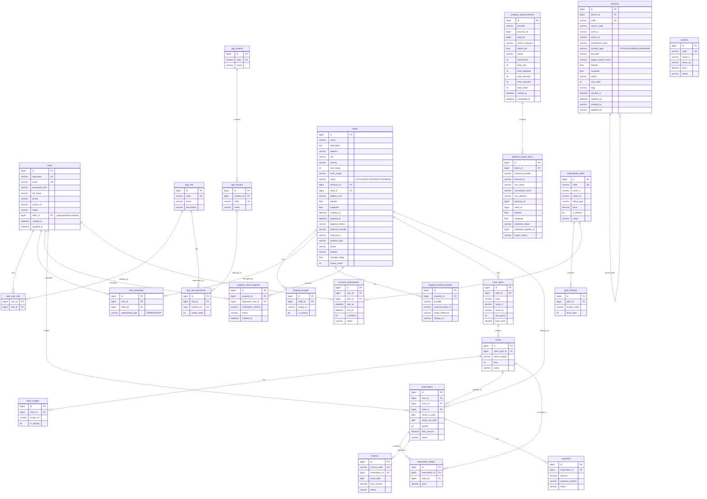
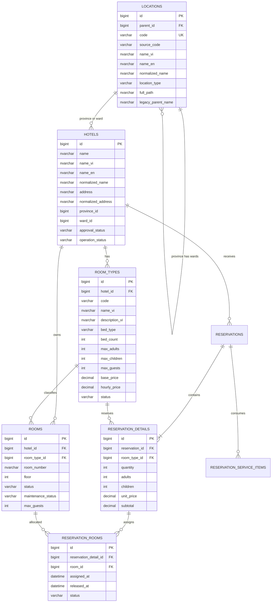
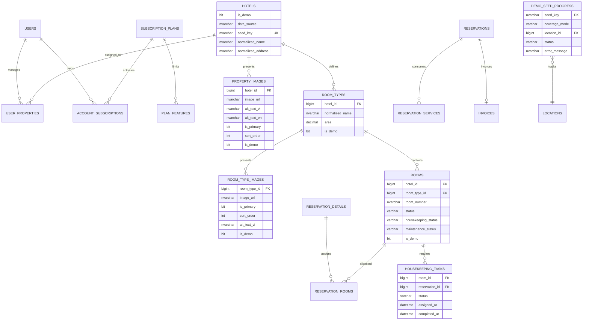

# BẢN ĐỒ THỰC THỂ KẾT HỢP (ERD)

## Hệ thống Quản lý Đa Cơ sở & Gói Dịch vụ

## Giải thích mở rộng (Multi-Property & Subscriptions)

### 1. Quản lý Địa điểm & Cơ sở
- **`locations`**: Quản lý cây địa điểm hành chính (Tỉnh/Thành -> Quận/Huyện -> Phường/Xã).
- **`hotels` (đóng vai trò Property)**: Entity lõi quản lý thông tin cơ sở lưu trú. Đã bổ sung liên kết đến `locations`.
- **`user_properties`**: Mapping giữa người dùng và cơ sở lưu trú, xác định ai là chủ (OWNER), ai là nhân viên (STAFF).

### 2. Gói dịch vụ (Subscription Feature Gate)
- **`subscription_plans`**: Các gói dịch vụ cung cấp (Free, Standard, Premium, Lifetime).
- **`plan_features`**: Cấu hình các tính năng và giới hạn (ví dụ: tối đa 10 phòng, tối đa 5 ảnh).
- **`account_subscriptions`**: Gói dịch vụ hiện tại mà một người dùng (Owner) đang kích hoạt. Hệ thống sẽ kết hợp giữa RBAC (app_role_permission) và bảng này để quyết định có cho phép thực hiện thao tác hay không.

### 3. Tự động Nhập dữ liệu (Automated Property Import)
- **`property_import_batches`**: Các phiên tìm kiếm và thu thập dữ liệu khách sạn từ API ngoài.
- **`property_import_items`**: Dữ liệu thô từ API ngoài trước khi duyệt, được kiểm tra deduplication.
- **`property_external_photos`**: Lưu trữ URL hình ảnh của API ngoài.
- **`property_claim_requests`**: Yêu cầu xác nhận chủ sở hữu từ phía người dùng cho cơ sở đã được hệ thống nhập tự động.
# Bổ sung ERD: Unicode, tìm kiếm và tồn phòng (2026-07-15)

## Nguyên tắc migration

- SQL Server là nguồn dữ liệu chính; cột chứa tiếng Việt dùng `NVARCHAR`, mô tả dài dùng `NVARCHAR(MAX)`.
- Thứ tự bắt buộc: backup, chuyển kiểu/thêm cột nullable, backfill, reimport UTF-8, tạo index, kiểm tra, rồi mới siết `NOT NULL` khi an toàn.
- Không xóa/truncate `locations`. Import upsert theo `(location_type, source_code)`; `code` dùng namespace `P-{sourceCode}` và `W-{sourceCode}` để mã tỉnh không đụng mã phường.
- Địa giới chỉ có `PROVINCE -> WARD`; quận/huyện chỉ là `legacy_parent_name`.

## Mô hình mục tiêu

## Ràng buộc và index

- Unique: `locations(location_type, source_code)`, `room_types(hotel_id, code)`, `rooms(hotel_id, room_number)`.
- `rooms.hotel_id` phải khớp hotel của `room_type_id`; số lượng phòng lấy từ `COUNT(rooms)` vật lý.
- Index: `locations(location_type,parent_id,status)`, `locations(normalized_name)`, `hotels(province_id,ward_id,approval_status,operation_status)`, `hotels(normalized_name)`, `hotels(normalized_address)` với độ dài indexable.

# Bổ sung ERD: dữ liệu demo toàn quốc và vận hành Owner (2026-07-15)

## Baseline và phạm vi migration

- Baseline SQL Server trước phase: 34 Province, 6.283 Ward, 11 Hotel, 33 RoomType, 69 Room và 0 AccountSubscription đang lưu.
- Không đổi tên bảng `hotels`; trong nghiệp vụ bảng này tiếp tục đóng vai trò Property.
- `STANDARD` tạo 3-5 cơ sở theo mỗi tỉnh, không được mô tả là bao phủ toàn bộ Ward. `FULL_COVERAGE` mới tạo tối thiểu một cơ sở theo Ward, chạy theo batch và bị chặn bởi `max-total-properties`.
- Bản ghi thật không được update hoặc delete bởi seeder. Seeder chỉ upsert bản ghi có `is_demo=1`, `data_source='DEMO'` và `seed_key` do hệ thống tạo.

`Room.status` biểu diễn khả năng vận hành (`AVAILABLE`, `RESERVED`, `OCCUPIED`, `MAINTENANCE`, `OUT_OF_SERVICE`); `housekeeping_status` biểu diễn `CLEAN`, `DIRTY`, `CLEANING`; `maintenance_status` được giữ riêng. Check-out chuyển phòng sang `DIRTY`, tạo `housekeeping_tasks`; chỉ khi hoàn tất dọn phòng mới chuyển về `AVAILABLE/CLEAN`.
