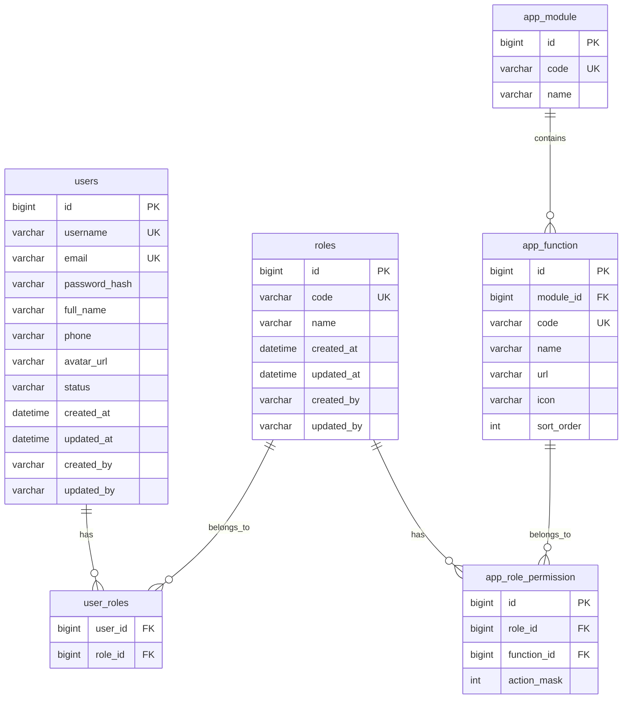

# BẢN ĐỒ THỰC THỂ KẾT HỢP (ERD)

## Phase 1: Authentication, RBAC, User Management

## Toàn bộ cấu trúc các bảng (Legacy Text Format)

### users
* id (PK)
* username
* email
* password_hash
* full_name
* phone
* avatar_url
* status
* created_at
* updated_at
* created_by
* updated_by

### roles
* id
* code
* name
* created_at
* updated_at
* created_by
* updated_by

### app_module
* id (PK)
* code
* name

### app_function
* id (PK)
* module_id (FK)
* code
* name
* url
* icon
* sort_order

### user_roles
* user_id (FK)
* role_id (FK)

### app_role_permission
* id (PK)
* role_id (FK)
* function_id (FK)
* action_mask

### room_types
* id
* code
* name_vi
* name_en
* max_guest
* base_price
* description_vi
* description_en

### rooms
* id
* room_number
* room_type_id
* floor
* status
* description_vi
* description_en

### room_images
* id
* room_id
* image_url

### customers
* id
* user_id
* identity_number
* nationality
* address

### reservations
* id
* reservation_code
* customer_id
* room_id
* checkin_date
* checkout_date
* guest_count
* status
* total_amount

### services
* id
* code
* name_vi
* name_en
* price

### reservation_services
* id
* reservation_id
* service_id
* quantity
* amount

### payments
* id
* reservation_id
* payment_method
* amount
* transaction_code
* payment_status

### invoices
* id
* invoice_no
* reservation_id
* subtotal
* tax_amount
* total_amount
* pdf_url
* created_at

### subscriptions
* id
* code
* name
* monthly_price

### user_subscriptions
* id
* user_id
* subscription_id
* start_date
* end_date
* status

### ai_conversations
* id
* user_id
* title
* created_at

### ai_messages
* id
* conversation_id
* role
* content
* created_at

### audit_logs
* id
* user_id
* action
* entity_name
* entity_id
* created_at
