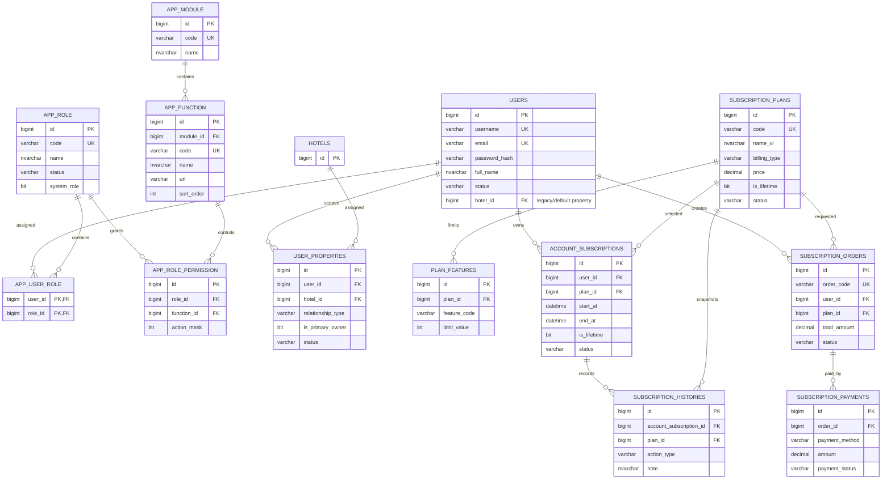
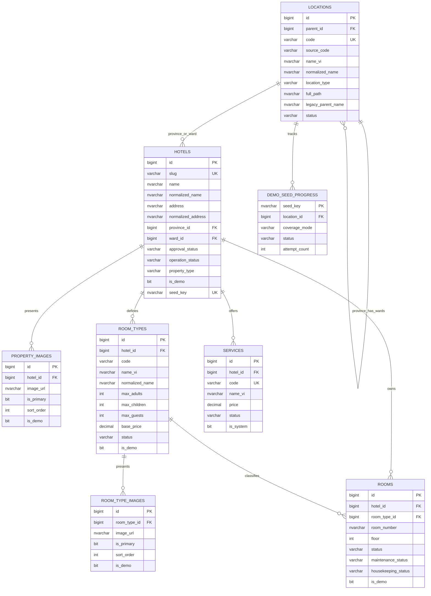
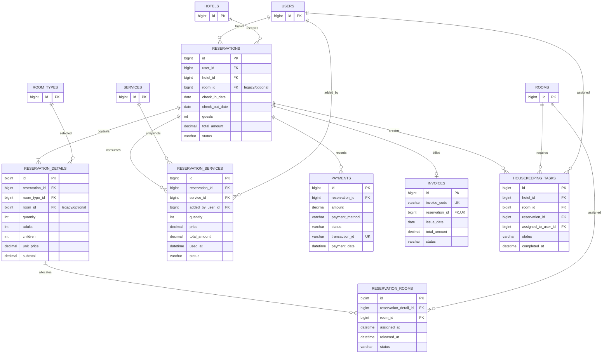
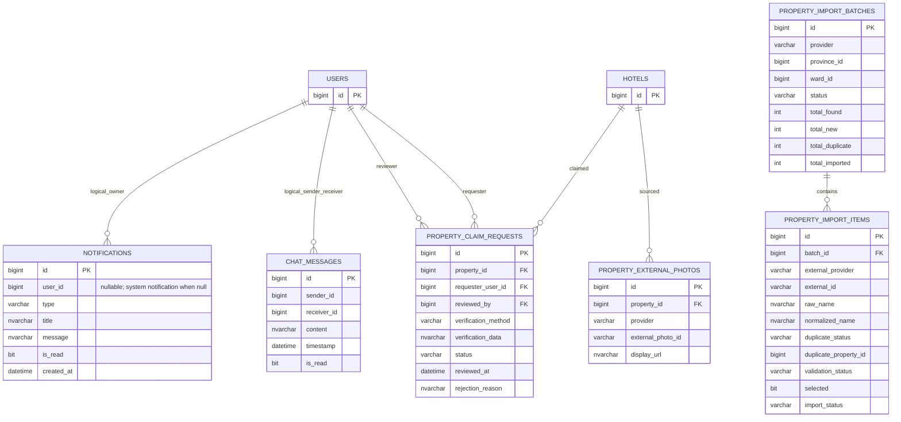
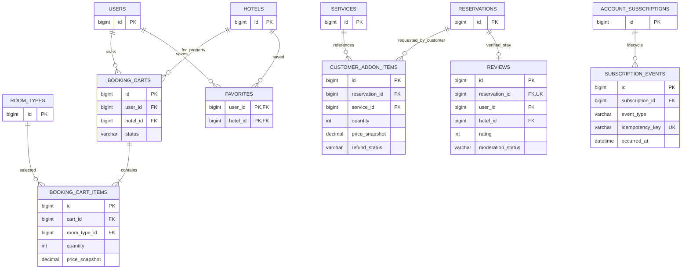
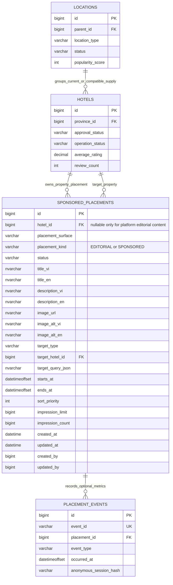

# ERD LuxeStay - schema hiện hành và mô hình mục tiêu

Ngày xác minh: 2026-07-28

Nguồn ưu tiên: JPA entity trong `backend/src/main/java/com/hotel/entities`, Flyway migration trong `backend/src/main/resources/db/migration`, sau đó mới đến tài liệu lịch sử.

Các sơ đồ từ ERD-01 đến ERD-04 mô tả schema hiện hành. ERD-05 là mô hình mục tiêu `DEFERRED`, không phải bảng đang tồn tại. ERD-06 và ERD-07 dưới đây bổ sung các bảng canonical của Feature 007; các bảng `PAYMENTS`, `INVOICES` và subscription legacy vẫn tồn tại như compatibility/backfill surface, nhưng không được dùng để trộn hai bounded context mới.

## 1. Schema hiện hành

### 1.1. Identity, RBAC, tenant scope và subscription

```mermaid
erDiagram
    HOTELS {
        bigint id PK
    }
    USERS {
        bigint id PK
        varchar username UK
        varchar email UK
        varchar password_hash
        nvarchar full_name
        varchar status
        bigint hotel_id FK "legacy/default property"
    }
    APP_ROLE {
        bigint id PK
        varchar code UK
        nvarchar name
        varchar status
        bit system_role
    }
    APP_USER_ROLE {
        bigint user_id PK,FK
        bigint role_id PK,FK
    }
    APP_MODULE {
        bigint id PK
        varchar code UK
        nvarchar name
    }
    APP_FUNCTION {
        bigint id PK
        bigint module_id FK
        varchar code UK
        nvarchar name
        varchar url
        int sort_order
    }
    APP_ROLE_PERMISSION {
        bigint id PK
        bigint role_id FK
        bigint function_id FK
        int action_mask
    }
    USER_PROPERTIES {
        bigint id PK
        bigint user_id FK
        bigint hotel_id FK
        varchar relationship_type
        bit is_primary_owner
        varchar status
    }
    SUBSCRIPTION_PLANS {
        bigint id PK
        varchar code UK
        nvarchar name_vi
        varchar billing_type
        decimal price
        bit is_lifetime
        varchar status
    }
    PLAN_FEATURES {
        bigint id PK
        bigint plan_id FK
        varchar feature_code
        int limit_value
    }
    ACCOUNT_SUBSCRIPTIONS {
        bigint id PK
        bigint user_id FK
        bigint plan_id FK
        datetime start_at
        datetime end_at
        bit is_lifetime
        varchar status
    }
    SUBSCRIPTION_HISTORIES {
        bigint id PK
        bigint account_subscription_id FK
        bigint plan_id FK
        varchar action_type
        nvarchar note
    }
    SUBSCRIPTION_ORDERS {
        bigint id PK
        varchar order_code UK
        bigint user_id FK
        bigint plan_id FK
        decimal total_amount
        varchar status
    }
    SUBSCRIPTION_PAYMENTS {
        bigint id PK
        bigint order_id FK
        varchar payment_method
        decimal amount
        varchar payment_status
    }

    USERS ||--o{ APP_USER_ROLE : assigned
    APP_ROLE ||--o{ APP_USER_ROLE : contains
    APP_MODULE ||--o{ APP_FUNCTION : contains
    APP_ROLE ||--o{ APP_ROLE_PERMISSION : grants
    APP_FUNCTION ||--o{ APP_ROLE_PERMISSION : controls
    USERS ||--o{ USER_PROPERTIES : scoped
    HOTELS ||--o{ USER_PROPERTIES : assigned
    USERS ||--o{ ACCOUNT_SUBSCRIPTIONS : owns
    SUBSCRIPTION_PLANS ||--o{ PLAN_FEATURES : limits
    SUBSCRIPTION_PLANS ||--o{ ACCOUNT_SUBSCRIPTIONS : selected
    ACCOUNT_SUBSCRIPTIONS ||--o{ SUBSCRIPTION_HISTORIES : records
    SUBSCRIPTION_PLANS ||--o{ SUBSCRIPTION_HISTORIES : snapshots
    USERS ||--o{ SUBSCRIPTION_ORDERS : creates
    SUBSCRIPTION_PLANS ||--o{ SUBSCRIPTION_ORDERS : requested
    SUBSCRIPTION_ORDERS ||--o{ SUBSCRIPTION_PAYMENTS : paid_by
```

**Hình ERD-01. Identity, RBAC, property scope và subscription.**

- **Mục đích:** thể hiện hai lớp authorization độc lập: role/action mask và phạm vi cơ sở.
- **Mô tả:** `APP_USER_ROLE` ánh xạ user-role; `APP_ROLE_PERMISSION` lưu bit mask; `USER_PROPERTIES` ánh xạ user-property.
- **Phân tích:** subscription tables đã tồn tại nhưng controller hiện chỉ công khai plan, active subscriptions và active features. Order/payment/history không đồng nghĩa lifecycle REST đầy đủ.
- **Kết luận:** dữ liệu hỗ trợ feature gate hiện hành; activate/renew/upgrade/downgrade/revoke vẫn `PARTIAL/DEFERRED` ở cấp contract.

### 1.2. Location, property và inventory

```mermaid
erDiagram
    LOCATIONS {
        bigint id PK
        bigint parent_id FK
        varchar code UK
        varchar source_code
        nvarchar name_vi
        nvarchar normalized_name
        varchar location_type
        nvarchar full_path
        nvarchar legacy_parent_name
        varchar status
    }
    HOTELS {
        bigint id PK
        varchar slug UK
        nvarchar name
        nvarchar normalized_name
        nvarchar address
        nvarchar normalized_address
        bigint province_id FK
        bigint ward_id FK
        varchar approval_status
        varchar operation_status
        varchar property_type
        bit is_demo
        nvarchar seed_key UK
    }
    PROPERTY_IMAGES {
        bigint id PK
        bigint hotel_id FK
        nvarchar image_url
        bit is_primary
        int sort_order
        bit is_demo
    }
    ROOM_TYPES {
        bigint id PK
        bigint hotel_id FK
        varchar code
        nvarchar name_vi
        nvarchar normalized_name
        int max_adults
        int max_children
        int max_guests
        decimal base_price
        varchar status
        bit is_demo
    }
    ROOM_TYPE_IMAGES {
        bigint id PK
        bigint room_type_id FK
        nvarchar image_url
        bit is_primary
        int sort_order
        bit is_demo
    }
    ROOMS {
        bigint id PK
        bigint hotel_id FK
        bigint room_type_id FK
        nvarchar room_number
        int floor
        varchar status
        varchar maintenance_status
        varchar housekeeping_status
        bit is_demo
    }
    SERVICES {
        bigint id PK
        bigint hotel_id FK
        varchar code UK
        nvarchar name_vi
        decimal price
        varchar status
        bit is_system
    }
    DEMO_SEED_PROGRESS {
        nvarchar seed_key PK
        bigint location_id FK
        varchar coverage_mode
        varchar status
        int attempt_count
    }

    LOCATIONS ||--o{ LOCATIONS : province_has_wards
    LOCATIONS ||--o{ HOTELS : province_or_ward
    HOTELS ||--o{ PROPERTY_IMAGES : presents
    HOTELS ||--o{ ROOM_TYPES : defines
    HOTELS ||--o{ ROOMS : owns
    ROOM_TYPES ||--o{ ROOM_TYPE_IMAGES : presents
    ROOM_TYPES ||--o{ ROOMS : classifies
    HOTELS ||--o{ SERVICES : offers
    LOCATIONS ||--o{ DEMO_SEED_PROGRESS : tracks
```

**Hình ERD-02. Location, property và inventory hiện hành.**

- **Mục đích:** mô tả dữ liệu tìm kiếm Unicode, multi-property và tồn phòng vật lý.
- **Mô tả:** mô hình địa giới dùng `PROVINCE -> WARD`; District chỉ còn là metadata `legacy_parent_name`.
- **Phân tích:** unique quan trọng gồm `room_types(hotel_id, code)` và `rooms(hotel_id, room_number)`. `status`, `maintenance_status` và `housekeeping_status` không được gộp thành một trạng thái.
- **Kết luận:** search và inventory phải dùng các cột normalized/indexed và lọc property `APPROVED + ACTIVE` theo contract.

### 1.3. Reservation, payment, invoice và stay operations

```mermaid
erDiagram
    USERS {
        bigint id PK
    }
    HOTELS {
        bigint id PK
    }
    ROOM_TYPES {
        bigint id PK
    }
    ROOMS {
        bigint id PK
    }
    SERVICES {
        bigint id PK
    }
    RESERVATIONS {
        bigint id PK
        bigint user_id FK
        bigint hotel_id FK
        bigint room_id FK "legacy/optional"
        date check_in_date
        date check_out_date
        int guests
        decimal total_amount
        varchar status
    }
    RESERVATION_DETAILS {
        bigint id PK
        bigint reservation_id FK
        bigint room_type_id FK
        bigint room_id FK "legacy/optional"
        int quantity
        int adults
        int children
        decimal unit_price
        decimal subtotal
    }
    RESERVATION_ROOMS {
        bigint id PK
        bigint reservation_detail_id FK
        bigint room_id FK
        datetime assigned_at
        datetime released_at
        varchar status
    }
    RESERVATION_SERVICES {
        bigint id PK
        bigint reservation_id FK
        bigint service_id FK
        bigint added_by_user_id FK
        int quantity
        decimal price
        decimal total_amount
        datetime used_at
        varchar status
    }
    PAYMENTS {
        bigint id PK
        bigint reservation_id FK
        decimal amount
        varchar payment_method
        varchar status
        varchar transaction_id UK
        datetime payment_date
    }
    INVOICES {
        bigint id PK
        varchar invoice_code UK
        bigint reservation_id FK,UK
        date issue_date
        decimal total_amount
        varchar status
    }
    HOUSEKEEPING_TASKS {
        bigint id PK
        bigint hotel_id FK
        bigint room_id FK
        bigint reservation_id FK
        bigint assigned_to_user_id FK
        varchar status
        datetime completed_at
    }

    USERS ||--o{ RESERVATIONS : books
    HOTELS ||--o{ RESERVATIONS : receives
    RESERVATIONS ||--|{ RESERVATION_DETAILS : contains
    ROOM_TYPES ||--o{ RESERVATION_DETAILS : selected
    RESERVATION_DETAILS ||--o{ RESERVATION_ROOMS : allocates
    ROOMS ||--o{ RESERVATION_ROOMS : assigned
    RESERVATIONS ||--o{ RESERVATION_SERVICES : consumes
    SERVICES ||--o{ RESERVATION_SERVICES : snapshots
    USERS ||--o{ RESERVATION_SERVICES : added_by
    RESERVATIONS ||--o{ PAYMENTS : records
    RESERVATIONS ||--o| INVOICES : billed
    RESERVATIONS ||--o{ HOUSEKEEPING_TASKS : creates
    ROOMS ||--o{ HOUSEKEEPING_TASKS : requires
    USERS ||--o{ HOUSEKEEPING_TASKS : assigned
```

**Hình ERD-03. Reservation, payment và vận hành lưu trú.**

- **Mục đích:** phân biệt inventory được bán theo RoomType với phòng vật lý được gán sau.
- **Mô tả:** `RESERVATION_DETAILS.quantity` giữ số lượng; `RESERVATION_ROOMS` giữ từng phòng được cấp; `RESERVATION_SERVICES` giữ price snapshot.
- **Phân tích:** `PAYMENTS.transaction_id` là unique, refund dùng transaction code riêng và số tiền âm. `INVOICES.reservation_id` là quan hệ một-một theo JPA.
- **Kết luận:** schema hỗ trợ nhiều detail nhưng UI/request hiện chỉ hỗ trợ một RoomType; mixed RoomType chưa được tuyên bố hoàn tất.

### 1.4. Import, claim, chat và notification

```mermaid
erDiagram
    USERS {
        bigint id PK
    }
    HOTELS {
        bigint id PK
    }
    PROPERTY_IMPORT_BATCHES {
        bigint id PK
        varchar provider
        bigint province_id
        bigint ward_id
        varchar status
        int total_found
        int total_new
        int total_duplicate
        int total_imported
    }
    PROPERTY_IMPORT_ITEMS {
        bigint id PK
        bigint batch_id FK
        varchar external_provider
        varchar external_id
        nvarchar raw_name
        nvarchar normalized_name
        varchar duplicate_status
        bigint duplicate_property_id
        varchar validation_status
        bit selected
        varchar import_status
    }
    PROPERTY_CLAIM_REQUESTS {
        bigint id PK
        bigint property_id FK
        bigint requester_user_id FK
        bigint reviewed_by FK
        varchar verification_method
        nvarchar verification_data
        varchar status
        datetime reviewed_at
        nvarchar rejection_reason
    }
    PROPERTY_EXTERNAL_PHOTOS {
        bigint id PK
        bigint property_id FK
        varchar provider
        varchar external_photo_id
        nvarchar display_url
    }
    CHAT_MESSAGES {
        bigint id PK
        bigint sender_id
        bigint receiver_id
        nvarchar content
        datetime timestamp
        bit is_read
    }
    NOTIFICATIONS {
        bigint id PK
        bigint user_id "nullable; system notification when null"
        varchar type
        nvarchar title
        nvarchar message
        bit is_read
        datetime created_at
    }

    PROPERTY_IMPORT_BATCHES ||--o{ PROPERTY_IMPORT_ITEMS : contains
    HOTELS ||--o{ PROPERTY_EXTERNAL_PHOTOS : sourced
    HOTELS ||--o{ PROPERTY_CLAIM_REQUESTS : claimed
    USERS ||--o{ PROPERTY_CLAIM_REQUESTS : requester
    USERS ||--o{ PROPERTY_CLAIM_REQUESTS : reviewer
    USERS ||--o{ CHAT_MESSAGES : logical_sender_receiver
    USERS ||--o{ NOTIFICATIONS : logical_owner
```

**Hình ERD-04. Import, claim, chat và notification.**

- **Mục đích:** mô tả staging data và các record truyền thông hiện hành.
- **Mô tả:** import batch chứa nhiều item; claim liên kết property, requester và reviewer; chat/notification lưu user ID dạng scalar.
- **Phân tích:** quan hệ chat/notification tới `USERS` là quan hệ logic vì entity không khai báo JPA foreign-key association. Claim entity có relation đúng nhưng controller đang cấp ID cố định.
- **Kết luận:** database có thể lưu audit identity, nhưng controller phải lấy identity từ principal để bảo đảm tính đúng đắn.

## 2. Ràng buộc và index quan trọng

| Nhóm | Ràng buộc/index hiện hành | Ý nghĩa |
| --- | --- | --- |
| Location | `(location_type, source_code)`, index type/parent/status và normalized name | Import idempotent, tìm có dấu/không dấu |
| Property | index province/ward/approval/operation và normalized name | Lọc public property hợp lệ |
| Inventory | unique `(hotel_id, code)` cho RoomType; unique `(hotel_id, room_number)` cho Room | Không trùng mã/room number trong một property |
| Payment | unique `transaction_id`, migration idempotency | Chặn callback/refund trùng |
| Invoice | unique `invoice_code`, one invoice per reservation theo JPA | Truy vết hóa đơn |
| Tenant | `user_properties(user_id, hotel_id, status)` và service scope | Hạn chế truy cập chéo property |

## 3. Mô hình mục tiêu DEFERRED - không thuộc schema hiện hành

ERD dưới đây chỉ ghi hướng mở rộng cho các capability đang bị hoãn. Không dùng tên bảng này trong phần “đã cài đặt”, migration hoặc rubric evidence hiện hành.

```mermaid
erDiagram
    USERS {
        bigint id PK
    }
    HOTELS {
        bigint id PK
    }
    ROOM_TYPES {
        bigint id PK
    }
    RESERVATIONS {
        bigint id PK
    }
    SERVICES {
        bigint id PK
    }
    ACCOUNT_SUBSCRIPTIONS {
        bigint id PK
    }
    BOOKING_CARTS {
        bigint id PK
        bigint user_id FK
        bigint hotel_id FK
        varchar status
    }
    BOOKING_CART_ITEMS {
        bigint id PK
        bigint cart_id FK
        bigint room_type_id FK
        int quantity
        decimal price_snapshot
    }
    CUSTOMER_ADDON_ITEMS {
        bigint id PK
        bigint reservation_id FK
        bigint service_id FK
        int quantity
        decimal price_snapshot
        varchar refund_status
    }
    FAVORITES {
        bigint user_id PK,FK
        bigint hotel_id PK,FK
    }
    REVIEWS {
        bigint id PK
        bigint reservation_id FK,UK
        bigint user_id FK
        bigint hotel_id FK
        int rating
        varchar moderation_status
    }
    SUBSCRIPTION_EVENTS {
        bigint id PK
        bigint subscription_id FK
        varchar event_type
        varchar idempotency_key UK
        datetime occurred_at
    }

    USERS ||--o{ BOOKING_CARTS : owns
    HOTELS ||--o{ BOOKING_CARTS : for_property
    BOOKING_CARTS ||--|{ BOOKING_CART_ITEMS : contains
    ROOM_TYPES ||--o{ BOOKING_CART_ITEMS : selected
    RESERVATIONS ||--o{ CUSTOMER_ADDON_ITEMS : requested_by_customer
    SERVICES ||--o{ CUSTOMER_ADDON_ITEMS : references
    USERS ||--o{ FAVORITES : saves
    HOTELS ||--o{ FAVORITES : saved
    RESERVATIONS ||--o| REVIEWS : verified_stay
    ACCOUNT_SUBSCRIPTIONS ||--o{ SUBSCRIPTION_EVENTS : lifecycle
```

**Hình ERD-05. Mô hình mục tiêu cho các domain DEFERRED.**

- **Mục đích:** tách thiết kế tương lai khỏi schema đã triển khai.
- **Mô tả:** mô hình mục tiêu bao gồm cart nhiều RoomType, add-on do customer chọn, favorites, verified-stay review và subscription event idempotency.
- **Phân tích:** các bảng này chưa có entity/migration/contract end-to-end trong baseline ngày 28/07/2026.
- **Kết luận:** chỉ chuyển một domain từ ERD-05 sang schema hiện hành sau khi có Spec Kit riêng, migration, API, UI và test CURRENT.

## 4. Đối chiếu entity và migration

| Domain | Entity/table đã đối chiếu | Trạng thái |
| --- | --- | --- |
| Auth/RBAC | User, Role, RolePermission, AppModule, AppFunction | CURRENT |
| Multi-property | Hotel, UserProperty, Location | CURRENT |
| Inventory | RoomType, Room, PropertyImage, RoomTypeImage, HotelService | CURRENT |
| Booking/stay | Reservation, ReservationDetail, ReservationRoom, ReservationServiceItem, HousekeepingTask | CURRENT/PARTIAL theo E2E |
| Payment/invoice | Payment, Invoice, V10 idempotency migration | CURRENT backend |
| Subscription | SubscriptionPlan, PlanFeature, AccountSubscription, Order/Payment/History | PARTIAL contract |
| Import/claim | PropertyImportBatch, PropertyImportItem, PropertyClaimRequest | Import PARTIAL; claim BLOCKED/PARTIAL |
| Chat/notification | ChatMessage, Notification | CURRENT backend; PARTIAL end-to-end |

## 5. Quy tắc cập nhật

Khi entity hoặc migration thay đổi, phải cập nhật: ERD hiện hành, class/sequence/activity liên quan trong `docs/UML.md`, `docs/API_SPEC.md`, `docs/audit/FEATURE_TRACEABILITY_MATRIX.md` và Chương 3-4 của `docs/THESIS.md`. Mô hình mục tiêu không được nhập vào sơ đồ hiện hành nếu chưa có migration và verification.
### 4.1 Runtime authorization projection (no schema change)

Receptionist access is derived from the existing `USERS`, `USER_PROPERTIES`,
`APP_ROLE_PERMISSION`, and `HOTELS` records. The customer-management and
accessible-property endpoints reuse these tables; no new entity or migration is
required. Inventory and reservation reads remain scoped by active property
assignments, while system administrators keep the existing global scope.

## 6. Mô hình mục tiêu Home Discovery và Merchandising (PLANNED)

Phần này mô tả thiết kế của Feature 006, task T102. Đây chưa phải schema hiện hành và không được dùng làm bằng chứng migration/runtime cho đến khi T111 hoàn thành.

```mermaid
erDiagram
    HOTELS {
        bigint id PK
        bigint province_id FK
        varchar approval_status
        varchar operation_status
        decimal average_rating
        int review_count
    }
    LOCATIONS {
        bigint id PK
        bigint parent_id FK
        varchar location_type
        varchar status
        int popularity_score
    }
    SPONSORED_PLACEMENTS {
        bigint id PK
        bigint hotel_id FK "nullable only for platform editorial content"
        varchar placement_surface
        varchar placement_kind "EDITORIAL or SPONSORED"
        varchar status
        nvarchar title_vi
        nvarchar title_en
        nvarchar description_vi
        nvarchar description_en
        nvarchar image_url
        nvarchar image_alt_vi
        nvarchar image_alt_en
        varchar target_type
        bigint target_hotel_id FK
        nvarchar target_query_json
        datetimeoffset starts_at
        datetimeoffset ends_at
        int sort_priority
        bigint impression_limit
        bigint impression_count
        datetime created_at
        datetime updated_at
        bigint created_by
        bigint updated_by
    }
    PLACEMENT_EVENTS {
        bigint id PK
        varchar event_id UK
        bigint placement_id FK
        varchar event_type
        datetimeoffset occurred_at
        varchar anonymous_session_hash
    }

    LOCATIONS ||--o{ HOTELS : groups_current_or_compatible_supply
    HOTELS ||--o{ SPONSORED_PLACEMENTS : owns_property_placement
    HOTELS ||--o{ SPONSORED_PLACEMENTS : target_property
    SPONSORED_PLACEMENTS ||--o{ PLACEMENT_EVENTS : records_optional_metrics
```

**Quy tắc dữ liệu mục tiêu:**

- `SPONSORED_PLACEMENTS.hotel_id` bắt buộc cho nội dung gắn với cơ sở lưu trú và phải chịu Hibernate `@Filter`; bản ghi editorial cấp nền tảng mới được phép để `hotel_id` rỗng.
- `placement_kind` tách `EDITORIAL` và `SPONSORED`; nội dung tài trợ luôn có disclosure VI/EN ở public projection.
- Public query chỉ lấy placement `ACTIVE`, đúng thời gian, còn quota, có asset hợp lệ và property mục tiêu đang `APPROVED/ACTIVE`.
- `target_query_json` chỉ chứa allowlist tham số tìm kiếm; không lưu URL ngoài tùy ý hoặc secret.
- `PLACEMENT_EVENTS` là tùy chọn và chỉ được thêm khi policy đo impression/click được duyệt; không lưu email, account ID hoặc device ID thô.
- Destination tab và recommendation item là projection từ `LOCATIONS`, `HOTELS`, availability và canonical quote; không tạo bảng recommendation cố định trong MVP.

**Index/ràng buộc dự kiến:**

- Index public eligibility trên `(placement_surface, status, starts_at, ends_at, sort_priority)`.
- Index tenant management trên `(hotel_id, status, updated_at)`.
- Unique `PLACEMENT_EVENTS.event_id` nếu event tracking được triển khai.
- Check `ends_at > starts_at`, quota không âm và target khớp `target_type`.

## 8. Feature 007 - canonical financial schema

The legacy `PAYMENTS`, `INVOICES`, `SUBSCRIPTION_ORDERS` and `SUBSCRIPTION_PAYMENTS` records remain available for compatibility and deterministic backfill. New Feature 007 financial effects are owned by the context tables below. A property record always carries `hotel_id`; a platform record is system-scoped and may target a hotel only as the subscription entitlement target.

### 8.1. ERD-06 - Property Commerce

```mermaid
erDiagram
    HOTELS {
        bigint id PK
    }
    RESERVATIONS {
        bigint id PK
        bigint hotel_id FK
    }
    USERS {
        bigint id PK
    }
    PROPERTY_PAYMENT_CONFIGURATIONS {
        bigint id PK
        bigint hotel_id FK UK
        varchar environment
        bit enabled
        varchar deposit_policy_type
        decimal deposit_value
        bigint version
    }
    PROPERTY_PAYMENT_CONFIGURATION_METHODS {
        bigint id PK
        bigint configuration_id FK
        varchar method
    }
    PROPERTY_PAYMENT_ATTEMPTS {
        bigint id PK
        bigint hotel_id FK
        bigint reservation_id FK
        bigint configuration_id FK
        varchar purpose
        varchar status
        decimal expected_amount
        varchar currency
        varchar idempotency_key UK
        varchar provider_event_id UK
        datetime expires_at
    }
    PROPERTY_FINANCIAL_TRANSACTIONS {
        bigint id PK
        bigint hotel_id FK
        bigint reservation_id FK
        bigint attempt_id FK
        bigint original_transaction_id FK
        varchar transaction_type
        varchar direction
        decimal amount
        varchar currency
        varchar idempotency_identity UK
    }
    BOOKING_FINANCIAL_SUMMARIES {
        bigint reservation_id PK,FK
        bigint hotel_id FK
        decimal gross_charges
        decimal successful_payments
        decimal successful_refunds
        decimal remaining_balance
        varchar financial_state
        bigint source_version
    }
    RESERVATION_CHARGE_LINES {
        bigint id PK
        bigint hotel_id FK
        bigint reservation_id FK
        varchar charge_type
        decimal unit_price
        decimal quantity
        decimal tax_amount
        decimal discount_amount
        decimal total_amount
        bigint reverses_line_id FK
    }
    PROPERTY_INVOICES {
        bigint id PK
        bigint hotel_id FK
        bigint reservation_id FK
        varchar invoice_number UK
        decimal total_amount
        decimal paid_amount
        decimal refunded_amount
        decimal balance_amount
        varchar status
    }
    PROPERTY_INVOICE_LINES {
        bigint id PK
        bigint invoice_id FK
        bigint hotel_id FK
        varchar line_type
        decimal quantity
        decimal total_amount
    }
    PROPERTY_INVOICE_PAYMENT_ALLOCATIONS {
        bigint id PK
        bigint invoice_id FK
        bigint transaction_id FK
        bigint hotel_id FK
        decimal allocated_amount
    }
    PROPERTY_CREDIT_NOTES {
        bigint id PK
        bigint invoice_id FK
        bigint hotel_id FK
        varchar credit_note_number UK
        decimal amount
    }
    PROPERTY_CREDIT_NOTE_LINES {
        bigint id PK
        bigint credit_note_id FK
        bigint invoice_line_id FK
        bigint hotel_id FK
        decimal amount
    }
    CHECKOUT_OVERRIDES {
        bigint id PK
        bigint hotel_id FK
        bigint reservation_id FK
        varchar override_type
        decimal outstanding_amount
        bigint actor_id FK
        bigint approved_by FK
    }
    PROPERTY_REFUND_REQUESTS {
        bigint id PK
        bigint hotel_id FK
        bigint original_transaction_id FK
        bigint reservation_id FK
        decimal requested_amount
        decimal succeeded_amount
        varchar status
        varchar idempotency_key UK
    }
    PROPERTY_REFUND_ATTEMPTS {
        bigint id PK
        bigint refund_request_id FK
        int attempt_number
        varchar status
        varchar provider_event_id UK
    }

    HOTELS ||--o{ PROPERTY_PAYMENT_CONFIGURATIONS : owns
    PROPERTY_PAYMENT_CONFIGURATIONS ||--o{ PROPERTY_PAYMENT_CONFIGURATION_METHODS : enables
    HOTELS ||--o{ RESERVATIONS : receives
    HOTELS ||--o{ PROPERTY_PAYMENT_ATTEMPTS : scopes
    RESERVATIONS ||--o{ PROPERTY_PAYMENT_ATTEMPTS : payable_aggregate
    PROPERTY_PAYMENT_CONFIGURATIONS ||--o{ PROPERTY_PAYMENT_ATTEMPTS : snapshot_source
    PROPERTY_PAYMENT_ATTEMPTS ||--o{ PROPERTY_FINANCIAL_TRANSACTIONS : produces
    PROPERTY_FINANCIAL_TRANSACTIONS ||--o{ PROPERTY_FINANCIAL_TRANSACTIONS : refund_or_credit_of
    RESERVATIONS ||--o| BOOKING_FINANCIAL_SUMMARIES : projects
    RESERVATIONS ||--o{ RESERVATION_CHARGE_LINES : accumulates
    RESERVATIONS ||--o| PROPERTY_INVOICES : finalizes
    PROPERTY_INVOICES ||--o{ PROPERTY_INVOICE_LINES : snapshots
    PROPERTY_INVOICES ||--o{ PROPERTY_INVOICE_PAYMENT_ALLOCATIONS : allocates
    PROPERTY_FINANCIAL_TRANSACTIONS ||--o{ PROPERTY_INVOICE_PAYMENT_ALLOCATIONS : allocated_payment
    PROPERTY_INVOICES ||--o{ PROPERTY_CREDIT_NOTES : corrected_by
    PROPERTY_CREDIT_NOTES ||--o{ PROPERTY_CREDIT_NOTE_LINES : contains
    PROPERTY_INVOICE_LINES ||--o{ PROPERTY_CREDIT_NOTE_LINES : corrected_line
    RESERVATIONS ||--o{ CHECKOUT_OVERRIDES : exceptional_checkout
    USERS ||--o{ CHECKOUT_OVERRIDES : acts_or_approves
    PROPERTY_FINANCIAL_TRANSACTIONS ||--o{ PROPERTY_REFUND_REQUESTS : original_debit
    PROPERTY_REFUND_REQUESTS ||--o{ PROPERTY_REFUND_ATTEMPTS : provider_attempts
```

Property Commerce owns the receiving property, reservation, checkout folio, invoice and refund effect. `PROPERTY_FINANCIAL_TRANSACTIONS` is append-only; a refund is a new `CREDIT` row linked by `original_transaction_id`. `BOOKING_FINANCIAL_SUMMARIES` is a derived projection and is never a client-editable source of truth. `PROPERTY_INVOICE_PAYMENT_ALLOCATIONS` prevents a deposit from being counted a second time at checkout.

### 8.2. ERD-07 - Platform Billing

```mermaid
erDiagram
    USERS {
        bigint id PK
    }
    HOTELS {
        bigint id PK
    }
    SUBSCRIPTION_PLANS {
        bigint id PK
        varchar code UK
    }
    PLATFORM_PAYMENT_CONFIGURATIONS {
        bigint id PK
        varchar provider
        varchar environment
        bit enabled
        varchar merchant_reference_masked
        varchar secret_reference
    }
    PLATFORM_SUBSCRIPTION_ORDERS {
        bigint id PK
        bigint owner_user_id FK
        bigint target_hotel_id FK
        bigint plan_id FK
        varchar operation
        decimal price
        varchar billing_period
        int duration_value
        varchar duration_unit
        varchar status
        varchar idempotency_key UK
    }
    PLATFORM_PAYMENT_ATTEMPTS {
        bigint id PK
        bigint order_id FK
        bigint configuration_id FK
        varchar provider
        varchar environment
        decimal expected_amount
        varchar status
        varchar provider_event_id UK
    }
    PLATFORM_FINANCIAL_TRANSACTIONS {
        bigint id PK
        bigint order_id FK
        bigint attempt_id FK
        bigint original_transaction_id FK
        varchar transaction_type
        varchar direction
        decimal amount
        varchar idempotency_identity UK
    }
    PLATFORM_SOFTWARE_CONTRACTS {
        bigint id PK
        bigint target_hotel_id FK
        bigint order_id FK UK
        bigint originating_transaction_id FK
        bigint supersedes_contract_id FK
        varchar status
        datetime effective_from
        datetime effective_until
    }
    PLATFORM_SUBSCRIPTION_ENTITLEMENTS {
        bigint id PK
        bigint target_hotel_id FK UK
        bigint contract_id FK
        bigint plan_id FK
        varchar status
        datetime effective_from
        datetime effective_until
    }
    PLATFORM_SUBSCRIPTION_HISTORIES {
        bigint id PK
        bigint target_hotel_id FK
        bigint order_id FK
        bigint contract_id FK
        bigint transaction_id FK
        varchar action_type
        nvarchar previous_state_json
        nvarchar new_state_json
    }
    PLATFORM_REFUND_REQUESTS {
        bigint id PK
        bigint original_transaction_id FK
        bigint order_id FK
        decimal requested_amount
        decimal succeeded_amount
        varchar status
        varchar policy_version
        varchar idempotency_key UK
    }
    PLATFORM_REFUND_ATTEMPTS {
        bigint id PK
        bigint refund_request_id FK
        int attempt_number
        varchar status
        varchar provider_event_id UK
    }

    USERS ||--o{ PLATFORM_SUBSCRIPTION_ORDERS : purchases
    HOTELS ||--o{ PLATFORM_SUBSCRIPTION_ORDERS : entitlement_target
    SUBSCRIPTION_PLANS ||--o{ PLATFORM_SUBSCRIPTION_ORDERS : snapshot_source
    PLATFORM_PAYMENT_CONFIGURATIONS ||--o{ PLATFORM_PAYMENT_ATTEMPTS : system_merchant
    PLATFORM_SUBSCRIPTION_ORDERS ||--o{ PLATFORM_PAYMENT_ATTEMPTS : payment_attempts
    PLATFORM_PAYMENT_ATTEMPTS ||--o{ PLATFORM_FINANCIAL_TRANSACTIONS : produces
    PLATFORM_FINANCIAL_TRANSACTIONS ||--o{ PLATFORM_FINANCIAL_TRANSACTIONS : refund_or_credit_of
    PLATFORM_SUBSCRIPTION_ORDERS ||--o{ PLATFORM_SOFTWARE_CONTRACTS : applied_order
    PLATFORM_FINANCIAL_TRANSACTIONS ||--o{ PLATFORM_SOFTWARE_CONTRACTS : originating_payment
    PLATFORM_SOFTWARE_CONTRACTS ||--o{ PLATFORM_SOFTWARE_CONTRACTS : supersedes
    HOTELS ||--o| PLATFORM_SUBSCRIPTION_ENTITLEMENTS : current_entitlement
    PLATFORM_SOFTWARE_CONTRACTS ||--o{ PLATFORM_SUBSCRIPTION_ENTITLEMENTS : projects
    SUBSCRIPTION_PLANS ||--o{ PLATFORM_SUBSCRIPTION_ENTITLEMENTS : selected_plan
    PLATFORM_SUBSCRIPTION_ORDERS ||--o{ PLATFORM_SUBSCRIPTION_HISTORIES : lifecycle_history
    PLATFORM_SOFTWARE_CONTRACTS ||--o{ PLATFORM_SUBSCRIPTION_HISTORIES : contract_history
    PLATFORM_FINANCIAL_TRANSACTIONS ||--o{ PLATFORM_SUBSCRIPTION_HISTORIES : payment_evidence
    PLATFORM_FINANCIAL_TRANSACTIONS ||--o{ PLATFORM_REFUND_REQUESTS : original_debit
    PLATFORM_SUBSCRIPTION_ORDERS ||--o{ PLATFORM_REFUND_REQUESTS : refund_scope
    PLATFORM_REFUND_REQUESTS ||--o{ PLATFORM_REFUND_ATTEMPTS : provider_attempts
```

Platform Billing owns the system merchant, backend plan snapshot, subscription order, platform ledger, software contract, current entitlement, history and platform refund. It has no property payment configuration or property ledger foreign key. `target_hotel_id` identifies where a SaaS entitlement is applied; it does not make platform money property revenue.

### 8.3. Shared evidence tables and constraints

`FINANCIAL_AUDIT_EVENTS` is append-only and carries `context`, optional `hotel_id`, aggregate identity, previous/new state, actor/source, reason, idempotency/provider identity and correlation ID. `FINANCIAL_IDEMPOTENCY_RECORDS` stores request hashes and terminal results for retry boundaries. `FINANCIAL_MIGRATION_EXCEPTIONS` records unresolved legacy ownership/context mappings; unresolved rows stop production backfill. These tables are shared infrastructure, not a third revenue context.

The context boundary is enforced by additive migrations `V21`-`V34`, tenant filters on property entities, context-specific permissions and repository/service checks. See [Feature 007 data model](../specs/007-payment-billing-completion/data-model.md), [V21 property foundation](../backend/src/main/resources/db/migration/V21__property_commerce_foundation.sql), [V24 platform foundation](../backend/src/main/resources/db/migration/V24__platform_billing_foundation.sql), [V25 contract/refund](../backend/src/main/resources/db/migration/V25__platform_contract_refund.sql) and [V29 idempotency](../backend/src/main/resources/db/migration/V29__financial_idempotency.sql).

## 9. Feature 007 entity state summary

| Aggregate | Canonical source | Mutable state | Append-only evidence | Current boundary |
| --- | --- | --- | --- | --- |
| Property payment | `PROPERTY_PAYMENT_ATTEMPTS` | status, provider refs, version | `PROPERTY_FINANCIAL_TRANSACTIONS`, `FINANCIAL_AUDIT_EVENTS` | `hotel_id` tenant scope |
| Booking folio | `RESERVATION_CHARGE_LINES` and `BOOKING_FINANCIAL_SUMMARIES` | summary projection only | charge lines, invoice lines, allocations | reservation + property |
| Property invoice | `PROPERTY_INVOICES` | `DRAFT` until finalization | finalized header/lines, allocations, credit notes | one finalized invoice per reservation |
| Property refund | `PROPERTY_REFUND_REQUESTS` | request/approval/provider status | refund credit ledger row and audit event | original property debit only |
| Platform subscription | `PLATFORM_SUBSCRIPTION_ORDERS` | order status and version | platform transaction, contract, entitlement history | system merchant + target hotel |
| Platform refund | `PLATFORM_REFUND_REQUESTS` | policy/provider status | platform refund credit and subscription history | approved policy required |

No row in either ledger is edited to represent a refund, correction or renewal. New effects reference the original transaction/order and carry a unique economic-effect identity.
