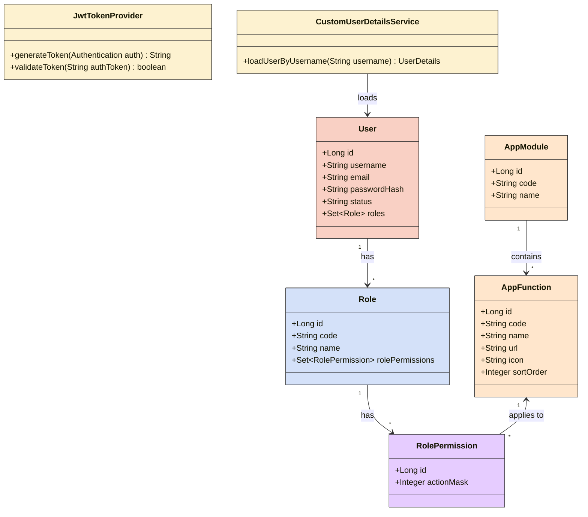
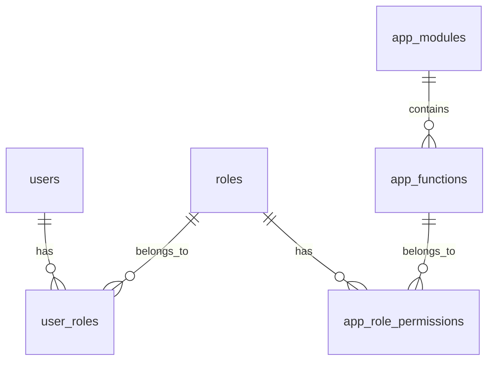
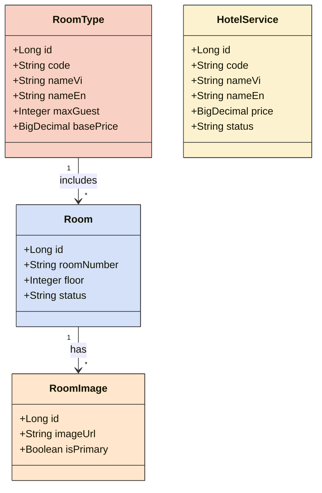
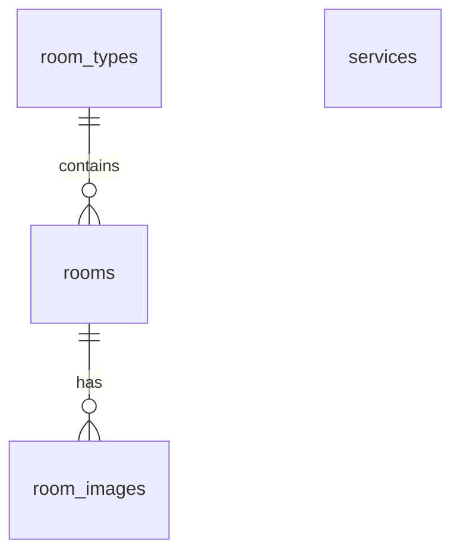

# CHƯƠNG 1
# TỔNG QUAN ĐỀ TÀI

## 1.1. LÝ DO CHỌN ĐỀ TÀI
Trong bối cảnh ngành du lịch và dịch vụ khách sạn đang trên đà phục hồi và phát triển mạnh mẽ sau đại dịch, việc áp dụng công nghệ thông tin vào quản lý và vận hành không còn là một lựa chọn mà đã trở thành yếu tố bắt buộc để cạnh tranh. Tuy nhiên, nhiều khách sạn quy mô vừa và nhỏ (SME) hiện nay vẫn đang chật vật với các quy trình quản lý thủ công, sổ sách giấy tờ, hoặc sử dụng các phần mềm rời rạc, lỗi thời. Điều này không chỉ gây thất thoát doanh thu, sai sót trong nghiệp vụ đặt/trả phòng mà còn làm giảm trải nghiệm của khách hàng.

Nhận thấy nhu cầu cấp thiết về một giải pháp phần mềm quản trị toàn diện, tập trung và dễ sử dụng, nhóm quyết định chọn đề tài **"Xây dựng Hệ thống Quản lý Khách sạn (Hotel Management System)"**. Hệ thống được thiết kế dựa trên kiến trúc hiện đại (Spring Boot & Angular), tích hợp các tính năng thông minh (AI Chatbot) nhằm tối ưu hóa quy trình nghiệp vụ cho Lễ tân, Quản lý, đồng thời cung cấp trải nghiệm số hóa liền mạch cho khách lưu trú.

## 1.2. MỤC TIÊU NGHIÊN CỨU
### 1.2.1. Mục tiêu tổng quát
Phân tích, thiết kế và xây dựng thành công một hệ thống phần mềm quản lý khách sạn hoàn chỉnh (Full-stack), đáp ứng được các nghiệp vụ cốt lõi của một cơ sở lưu trú như: quản lý phòng, quản lý đặt phòng, xử lý thanh toán, và báo cáo thống kê doanh thu theo thời gian thực.

### 1.2.2. Mục tiêu cụ thể
- **Về mặt lý thuyết:** Tìm hiểu và ứng dụng thành thạo các quy trình phát triển phần mềm Agile/Scrum. Phân tích rõ ràng các yêu cầu nghiệp vụ (Business Requirements) của quy trình quản trị khách sạn.
- **Về mặt công nghệ:** Nắm vững và áp dụng kiến trúc phát triển ứng dụng nhiều tầng (N-tier architecture) bằng cách kết hợp Java Spring Boot 3 (Backend) và Angular 22 (Frontend).
- **Về mặt thực tiễn:** 
  - Triển khai thành công phân hệ Quản lý cốt lõi (Room, Reservation, Invoice).
  - Tích hợp biểu đồ thống kê trực quan bằng thư viện Chart.js.
  - Ứng dụng Trí tuệ Nhân tạo (AI Chatbot) để nâng cao trải nghiệm hỗ trợ khách hàng và tối ưu công việc của Lễ tân.

---

# CHƯƠNG 2
# CƠ SỞ LÝ THUYẾT

## 2.1. CÔNG NGHỆ BACKEND
Hệ thống sử dụng ngôn ngữ lập trình Java 21 và framework Spring Boot 3 để xây dựng các API (Application Programming Interface) theo tiêu chuẩn RESTful. Vấn đề bảo mật hệ thống được đảm bảo bằng Spring Security kết hợp với kỹ thuật xác thực qua JSON Web Token (JWT).

## 2.2. CÔNG NGHỆ FRONTEND
Phía máy khách (Client-side) được xây dựng dựa trên nền tảng Angular 22. Ứng dụng áp dụng kiến trúc Standalone Components nhằm giảm thiểu sự phụ thuộc vào các module dư thừa, kết hợp với bộ thư viện PrimeNG để thiết kế giao diện người dùng (UI) đồng nhất và chuyên nghiệp.

## 2.3. HỆ QUẢN TRỊ CƠ SỞ DỮ LIỆU
Hệ thống sử dụng Microsoft SQL Server làm hệ quản trị cơ sở dữ liệu quan hệ chính. Các thao tác tương tác với cơ sở dữ liệu được thực hiện gián tiếp thông qua JPA (Java Persistence API) và Hibernate.

---

# CHƯƠNG 3
# PHÂN TÍCH VÀ THIẾT KẾ HỆ THỐNG

## 3.1. THIẾT KẾ KIẾN TRÚC TỔNG THỂ CỦA MODULE XÁC THỰC
Module xác thực và phân quyền đóng vai trò là chốt chặn an ninh đầu tiên của hệ thống. Nhằm đảm bảo tính an toàn dữ liệu, module được thiết kế dựa trên cơ chế RBAC (Role-Based Access Control).

### 3.1.1. Biểu đồ lớp (Class Diagram)
Biểu đồ lớp dưới đây mô tả chi tiết các thực thể và các thành phần cấu hình bảo mật được cài đặt trong Spring Security.

Hình 3.1. Biểu đồ lớp của phân hệ Xác thực và Phân quyền

Biểu đồ lớp trên được thiết kế nhằm mục đích khái quát hóa toàn bộ cấu trúc hướng đối tượng của phân hệ bảo mật tại tầng Backend. Khối kiến trúc này giúp đảm bảo nguyên tắc phân chia trách nhiệm rõ ràng (Separation of Concerns) trong quá trình xác thực và cấp quyền cho người dùng.

Về mặt cấu trúc, biểu đồ định nghĩa các thực thể cốt lõi tham gia vào quá trình bảo mật, bao gồm lớp `User` (đại diện cho người dùng) và lớp `Role` (đại diện cho vai trò). Ở mức độ phân quyền chi tiết (Fine-grained Authorization), hệ thống sử dụng `AppModule` (Nhóm chức năng chính) và `AppFunction` (Các chức năng cụ thể). Bảng trung gian `RolePermission` đóng vai trò liên kết giữa Vai trò và Chức năng. Bên cạnh các lớp thực thể, hệ thống còn tích hợp các lớp xử lý nghiệp vụ bảo mật cốt lõi, tiêu biểu là `JwtTokenProvider` dùng để tạo và xác thực chữ ký điện tử, cùng với `CustomUserDetailsService` dùng để nạp thông tin người dùng từ cơ sở dữ liệu.

Phân tích sâu vào các mối quan hệ, có thể thấy mối quan hệ giữa người dùng và vai trò là quan hệ nhiều - nhiều, được thể hiện thông qua thuộc tính `roles` mang kiểu dữ liệu tập hợp (`Set`). Hệ thống không cấp quyền hạn trực tiếp cho từng cá nhân người dùng; thay vào đó, các quyền hạn thao tác sẽ được gán cho một hoặc nhiều vai trò cụ thể thông qua bảng `RolePermission`.

**Cơ chế Bitmask Authorization:**
Một điểm nhấn kỹ thuật quan trọng trong thiết kế này là việc sử dụng thuộc tính `actionMask` kiểu số nguyên (Integer) bên trong `RolePermission`. Thay vì phải tạo riêng lẻ từng quyền như (VIEW, ADD, EDIT, DELETE) thành các bản ghi khác nhau, hệ thống gộp chúng lại bằng phép toán thao tác bit (Bitwise). Ví dụ: VIEW = 1, ADD = 2, EDIT = 4, DELETE = 8. Nếu một vai trò có quyền Xem và Thêm, `actionMask` sẽ là 1 + 2 = 3. Cách tiếp cận này giúp giảm thiểu tối đa sự phình to của cơ sở dữ liệu, tối ưu hóa tốc độ truy vấn kiểm tra quyền, đồng thời tuân thủ đúng nguyên lý Kiểm soát truy cập dựa trên vai trò (Role-Based Access Control).

Qua các phân tích trên, có thể kết luận rằng kiến trúc lớp bảo mật này đã đáp ứng đầy đủ và chặt chẽ các tiêu chuẩn của framework Spring Security. Mô hình không chỉ đảm bảo tính toàn vẹn và bảo mật của dữ liệu người dùng mà còn hỗ trợ mạnh mẽ cho kỹ thuật phân quyền động (Dynamic RBAC) vô cùng linh hoạt.

### 3.1.2. Thiết kế Cơ sở dữ liệu (Database Design)
Việc lưu trữ thông tin phân quyền đòi hỏi một cấu trúc cơ sở dữ liệu chuẩn hóa nhằm hạn chế dư thừa dữ liệu.

Hình 3.2. Sơ đồ thực thể kết hợp (ERD) cho module RBAC

Bảng 3.1. Mô tả chi tiết các bảng trong cơ sở dữ liệu của phân hệ bảo mật

| Tên bảng | Chức năng | Khóa chính | Ràng buộc đặc biệt |
|----------|-----------|------------|--------------------|
| users | Lưu trữ thông tin định danh của người dùng | id | username (Unique), email (Unique) |
| roles | Danh mục các vai trò của hệ thống | id | code (Unique) |
| app_modules | Danh mục các phân hệ (Module) lớn của hệ thống | id | code (Unique) |
| app_functions | Danh mục các chức năng chi tiết nằm trong từng Module | id | code (Unique), Khóa ngoại tới app_modules |
| user_roles | Bảng trung gian ánh xạ giữa Users và Roles | user_id, role_id | Khóa ngoại tới users và roles |
| app_role_permissions | Bảng trung gian ánh xạ Roles và AppFunctions, lưu trữ `action_mask` | id | Khóa ngoại tới roles và app_functions |

### 3.1.3. Thiết kế kiến trúc cho phân hệ Quản lý Phòng và Dịch vụ
Sau khi thiết lập hệ thống phân quyền, module tiếp theo được xây dựng là hệ thống quản lý danh mục phòng và dịch vụ khách sạn. Đây là phần lõi lưu trữ toàn bộ các thông tin về khả năng cung ứng dịch vụ của khách sạn.

Biểu đồ lớp dưới đây thể hiện mối quan hệ giữa các thực thể chính trong phân hệ này:

Hình 3.3. Biểu đồ lớp của phân hệ Quản lý Phòng và Dịch vụ

Kiến trúc trên được thiết kế nhằm tách biệt rõ ràng giữa định nghĩa loại phòng (RoomType) và các phòng vật lý cụ thể (Room). Một loại phòng (ví dụ: Standard) có thể được áp dụng cho nhiều phòng khác nhau, giúp việc cấu hình giá cả và sức chứa trở nên linh hoạt. Hình ảnh mô tả cũng được liên kết trực tiếp vào từng phòng thực tế, cho phép khách hàng có cái nhìn chính xác nhất về không gian họ sẽ sử dụng. Các dịch vụ đi kèm (HotelService) được tổ chức thành một danh mục độc lập, sẵn sàng để liên kết vào các giao dịch đặt phòng sau này.

Về mặt cơ sở dữ liệu, sơ đồ thực thể kết hợp (ERD) được thể hiện như sau:

Hình 3.4. Sơ đồ thực thể kết hợp (ERD) cho module Phòng và Dịch vụ

Bảng 3.2. Mô tả chi tiết các bảng trong phân hệ Phòng và Dịch vụ

| Tên bảng | Chức năng | Khóa chính | Ràng buộc đặc biệt |
|----------|-----------|------------|--------------------|
| room_types | Lưu trữ thông tin chung về loại phòng và giá cơ bản | id | code (Unique) |
| rooms | Lưu trữ thông tin từng phòng vật lý, bao gồm số phòng, số tầng và trạng thái | id | room_number (Unique), room_type_id (Foreign Key) |
| room_images | Lưu trữ đường dẫn ảnh thực tế của từng phòng | id | room_id (Foreign Key) |
| services | Danh mục các dịch vụ phụ trợ do khách sạn cung cấp | id | code (Unique) |

### 3.1.4. Thiết kế phân hệ Đặt phòng và Thanh toán (Reservation & Payment Management)
Phân hệ Đặt phòng và Thanh toán là lõi giao dịch thương mại của hệ thống. Phân hệ này chịu trách nhiệm quản lý vòng đời của một phiên lưu trú, từ lúc khách hàng tạo yêu cầu đặt phòng (Booking), tiến hành nhận phòng (Check-in), sử dụng dịch vụ phát sinh, cho đến lúc trả phòng (Check-out) và xuất hóa đơn (Invoice).

**Các nghiệp vụ cốt lõi:**
- **Quản lý Đặt phòng (Reservation):** Hỗ trợ theo dõi trạng thái phòng, ghi nhận thông tin khách hàng, ngày dự kiến đến/đi và các yêu cầu đặc biệt.
- **Thanh toán (Payment):** Xử lý giao dịch tài chính, hỗ trợ đa phương thức thanh toán (Tiền mặt, Thẻ tín dụng, Chuyển khoản) và ghi nhận lịch sử giao dịch.
- **Hóa đơn (Invoice):** Tự động tổng hợp chi phí tiền phòng và các dịch vụ phát sinh để xuất hóa đơn điện tử minh bạch cho khách hàng.

Thiết kế này đảm bảo mọi giao dịch đều được lưu vết chặt chẽ, hỗ trợ tối đa cho bộ phận Lễ tân và Kế toán trong việc đối soát doanh thu.

### 3.1.5. Thiết kế kiến trúc phân hệ Đa cơ sở (Multi-Property Management)
Với định hướng trở thành một nền tảng (Platform) quản lý lưu trú quy mô lớn, hệ thống được thiết kế mở rộng sang mô hình Đa cơ sở (Multi-Property). 

**Mô hình cấp bậc địa điểm:**
Hệ thống quản lý cây địa lý linh hoạt (Locations) với cấu trúc cha - con (Tỉnh/Thành -> Quận/Huyện -> Phường/Xã), giúp tối ưu hóa khả năng tìm kiếm của khách hàng. Mỗi cơ sở lưu trú (Hotel/Property) sẽ được gán tọa độ và mã địa lý chuẩn xác.

**Quản lý chủ sở hữu và nhân sự:**
Thực thể `UserProperty` đóng vai trò bản lề, liên kết một người dùng (`User`) với một hoặc nhiều cơ sở lưu trú (`Hotel`). Thuộc tính `relationshipType` phân định rõ quyền hạn: OWNER (Chủ sở hữu cơ sở) hoặc STAFF (Nhân viên lễ tân/quản lý được thuê). Sự phân tách này giúp một cá nhân có thể đầu tư nhiều khách sạn khác nhau mà chỉ cần dùng duy nhất một tài khoản đăng nhập để theo dõi chéo.

### 3.1.6. Thiết kế phân hệ Gói dịch vụ (Subscription Feature Gate)
Để thương mại hóa nền tảng thông qua hình thức SaaS (Software as a Service), hệ thống tích hợp phân hệ Gói dịch vụ (Subscription).

**Cơ chế hoạt động:**
Khác với RBAC (Role-Based Access Control) thông thường chỉ chặn người dùng theo chức danh (Lễ tân không được làm Admin), Feature Gate kết hợp thêm giới hạn dịch vụ (Subscription-Based Access Control). 
- Các thực thể cốt lõi bao gồm: `SubscriptionPlan` (Gói: Free, Pro, Lifetime), `PlanFeature` (Giới hạn: Tối đa 10 phòng, Tối đa 5 ảnh).
- Khi người dùng tạo một cơ sở, hệ thống sẽ ánh xạ chủ sở hữu với gói cước hiện hành của họ thông qua `AccountSubscription`.

**Triển khai kỹ thuật:**
Cơ chế kiểm duyệt này được thực thi ở tầng Backend thông qua Annotation tùy chỉnh (ví dụ: `@RequireFeature`). Khi Owner hoặc Staff gọi API tạo phòng mới, Interceptor sẽ chạy ngầm, kiểm tra đếm số lượng phòng hiện tại trong cơ sở dữ liệu. Nếu vượt mức cho phép của `PlanFeature`, hệ thống sẽ trả về lỗi HTTP 403 Forbidden kèm thông báo yêu cầu nâng cấp gói, từ đó thúc đẩy doanh thu cho nền tảng.

## 3.2. THIẾT KẾ GIAO DIỆN
Trải nghiệm người dùng đóng vai trò cốt lõi trong việc đánh giá chất lượng của một hệ thống phần mềm. Do đó, quy trình thiết kế giao diện được thực hiện dựa trên các nguyên tắc thiết kế hiện đại, tập trung vào tính tương tác và sự thuận tiện trong thao tác nghiệp vụ.

Hệ thống sử dụng một khung giao diện thống nhất cho khu vực quản trị, được cấu thành từ thanh điều hướng bên trái (Sidebar) và vùng hiển thị dữ liệu chính. Thanh điều hướng được thiết kế tĩnh, cung cấp các lối tắt truy cập nhanh đến các phân hệ quản lý quan trọng như phòng, đặt phòng và người dùng. Trong khi đó, giao diện đăng nhập được thiết kế theo hình thức thẻ thông tin (Card) đặt tại trung tâm màn hình, kết hợp cùng hiệu ứng đổ bóng nhẹ nhằm thu hút sự tập trung của người dùng vào biểu mẫu xác thực.

Đối với phân hệ quản lý người dùng, giao diện được xây dựng dựa trên cấu trúc bảng dữ liệu (Data Table). Bảng dữ liệu cung cấp khả năng phân trang, sắp xếp và tích hợp các thao tác cập nhật trực tiếp trên từng hàng. Cách thiết kế này không chỉ giúp tối ưu hóa không gian hiển thị mà còn rút ngắn quy trình thao tác của nhân viên quản trị, từ đó nâng cao hiệu suất làm việc tổng thể.

### 3.2.1. Chiến lược xây dựng các thành phần dùng chung (Shared Components)
Để đảm bảo tính nhất quán của giao diện và giảm thiểu mã nguồn lặp lại, hệ thống áp dụng triệt để mẫu thiết kế Component-based của Angular thông qua việc xây dựng một bộ thư viện nội bộ các thành phần dùng chung (Shared Components). 

Các thành phần tiêu biểu bao gồm:
- **Data Table (`app-data-table`)**: Tích hợp sẵn cơ chế phân trang phía máy chủ (Server-side Pagination), sắp xếp, lọc toàn cục, và khả năng xử lý trạng thái rỗng (Empty State) với giao diện hiện đại.
- **Stat Card (`app-stat-card`)**: Thẻ thống kê trực quan hiển thị các số liệu tổng quan kèm biểu tượng và chỉ số tăng trưởng, sử dụng rộng rãi trên Dashboard.
- **Confirm Dialog**: Hộp thoại xác nhận thao tác tập trung, giúp chuẩn hóa trải nghiệm cảnh báo (xóa, hủy) trên toàn hệ thống.

Việc đóng gói các tính năng phức tạp vào Shared Components giúp các phân hệ nghiệp vụ sau này (như Quản lý phòng, Quản lý nhân viên) chỉ cần khai báo thông số đầu vào (Inputs) và lắng nghe sự kiện (Outputs) mà không cần quan tâm đến logic hiển thị bên dưới.

### 3.2.2. Thiết kế Giao diện Bảng điều khiển (Admin Dashboard)
Bảng điều khiển (Dashboard) đóng vai trò là trung tâm chỉ huy số, cung cấp cho quản lý cái nhìn toàn cảnh về tình trạng hoạt động của khách sạn theo thời gian thực.
Giao diện được phân bổ thành ba khu vực chính:
1. **Chỉ số tóm tắt (KPI Cards)**: Cung cấp tức thì các số liệu quan trọng nhất (như sự cố khẩn cấp, yêu cầu sửa chữa).
2. **Biểu đồ phân tích (Analytics Charts)**: Tích hợp thư viện Chart.js để biểu diễn biến động doanh thu và tỷ lệ lấp đầy phòng dưới dạng đồ thị trực quan.
3. **Danh sách tương tác nhanh**: Bảng danh sách các tác vụ hoặc yêu cầu bảo trì đang chờ xử lý, được ứng dụng kỹ thuật tải lười (Lazy Loading) để tối ưu hóa hiệu suất bộ nhớ. Mọi thao tác truy xuất ban đầu đều được thiết kế thông qua dữ liệu giả lập (Mock Data) nhằm chốt phương án hiển thị (UI) trước khi tiến hành tích hợp với Backend API.

### 3.2.3. Giao diện Quản lý Đặt phòng (Reservation Management)
Giao diện quản lý đặt phòng được thiết kế chuyên biệt để hỗ trợ nhân viên Lễ tân thao tác nhanh chóng và chính xác.
- **Danh sách đặt phòng:** Kế thừa thành phần dùng chung `DataTable` để hiển thị danh sách khách hàng đặt phòng với đầy đủ các tính năng lọc theo ngày, trạng thái (Chờ xác nhận, Đã Check-in, Đã Check-out).
- **Thao tác nhanh:** Tích hợp trực tiếp các nút chức năng nhận phòng, trả phòng và thanh toán ngay trên từng dòng dữ liệu, giúp giảm thiểu số lần chuyển trang và tối ưu hóa luồng công việc (Workflow) của nhân viên.

---

# CHƯƠNG 4
# CÀI ĐẶT VÀ KIỂM THỬ HỆ THỐNG

## 4.1. CÀI ĐẶT MÔI TRƯỜNG VÀ CƠ SỞ DỮ LIỆU
### 4.1.1. Cài đặt kỹ thuật Auditing
Để hỗ trợ việc truy vết dữ liệu (Data Tracking), toàn bộ các thực thể trong cơ sở dữ liệu đều được thiết kế để kế thừa từ lớp `AuditableEntity`. 

**Mô tả cài đặt:** Annotation `@EnableJpaAuditing` được kích hoạt ở cấp độ ứng dụng. Lớp `AuditableEntity` cung cấp bốn thuộc tính cơ bản: `created_at` (thời điểm khởi tạo), `updated_at` (thời điểm chỉnh sửa cuối), `created_by` (người tạo), và `updated_by` (người chỉnh sửa).

### 4.1.2. Cài đặt Giao diện Front-end
Giao diện của ứng dụng được xây dựng hoàn toàn dựa trên kiến trúc Standalone Components của Angular 22, loại bỏ hoàn toàn sự phụ thuộc vào khái niệm NgModules truyền thống. Việc này giúp cải thiện đáng kể tốc độ tải trang và quá trình biên dịch của trình duyệt. 

Để hiện thực hóa các bản thiết kế giao diện, hệ thống tích hợp bộ thư viện PrimeNG phiên bản 21. Các thành phần giao diện phức tạp như bảng dữ liệu, hộp thoại và các trường nhập liệu mật khẩu đều được cung cấp sẵn bởi PrimeNG, giúp giảm thiểu thời gian lập trình và đảm bảo tính đồng bộ về mặt thẩm mỹ. Ngoài ra, việc tổ chức tệp tin được phân chia rõ ràng giữa các thành phần dùng chung (SharedModule), thành phần bảo vệ tuyến đường (Guards) và các thành phần chức năng (Features), tạo tiền đề vững chắc cho các giai đoạn mở rộng tính năng trong tương lai.

## 4.2. KIỂM THỬ CHỨC NĂNG BẢO MẬT
### 4.2.1. Đánh giá kiểm thử
Hệ thống API đã được tích hợp công cụ `springdoc-openapi`. Bằng cách truy cập Swagger UI, người lập trình có thể kiểm chứng trực tiếp các điểm cuối (endpoints) mà không cần thông qua ứng dụng máy khách. Quá trình kiểm thử cho thấy bộ lọc `JwtAuthenticationFilter` hoạt động chính xác, từ chối mọi yêu cầu (HTTP 401 Unauthorized) không chứa Token hợp lệ.

## 4.3. KIẾN TRÚC TÌM KIẾM THEO KHU VỰC VÀ GEOLOCATION

### 4.3.1. Mô hình hành chính 2 cấp
Để tối ưu hóa trải nghiệm tìm kiếm, hệ thống đã loại bỏ cấp Quận/Huyện, rút gọn cấu trúc địa lý thành mô hình 2 cấp: Tỉnh/Thành phố -> Phường/Xã. Việc này được thực hiện thông qua module `LocationImportService`, tự động đọc và flatten dữ liệu JSON chuẩn. Các phường/xã trùng tên được phân biệt qua mã hành chính.

### 4.3.2. Geocoding và Khoảng cách (Haversine)
Mỗi cơ sở lưu trú được gắn tọa độ vĩ độ (latitude) và kinh độ (longitude). Khi người dùng cho phép định vị hoặc tìm kiếm một địa danh cụ thể, hệ thống gọi API phân giải địa chỉ thành tọa độ. Khoảng cách thực tế từ vị trí người dùng đến khách sạn được tính toán trực tiếp trong câu lệnh SQL native bằng công thức Haversine, đảm bảo hiệu năng tính toán cao và tránh lỗi N+1 query. Hệ thống tự động fallback về sắp xếp mặc định nếu không có tọa độ người dùng, không hiển thị lỗi 0 km.

---

# CHƯƠNG 5
# KẾT LUẬN VÀ HƯỚNG PHÁT TRIỂN

## 5.1. KẾT LUẬN
(Nội dung đang được cập nhật)

## 5.2. HƯỚNG PHÁT TRIỂN
(Nội dung đang được cập nhật)

## Chương X. Tự Động Bổ Sung Dữ Liệu Khách Sạn & Thuật Toán Deduplication

### 1. Vấn Đề Đặt Ra & Phương Pháp Giải Quyết
Trong quá trình khởi tạo một nền tảng OTA, vấn đề "Cold Start" (thiếu dữ liệu ban đầu) là một thách thức rất lớn. Việc yêu cầu hàng ngàn chủ cơ sở tự đăng ký từ đầu tốn rất nhiều nguồn lực.
Tuy nhiên, hệ thống không được phép thu thập dữ liệu trái phép (scraping) từ các bên thứ ba (OTA khác) vì vấn đề bản quyền và đạo đức.

**Giải pháp:**
Tích hợp API cung cấp Dữ Liệu Mở (Open Data) hoặc dịch vụ cung cấp thông tin POI hợp pháp (như Nominatim, Google Places) để tạo dựng danh mục cơ sở lưu trú nền tảng. Hệ thống sử dụng một Provider Abstraction Layer (interface AccommodationDataProvider), cho phép hoán đổi provider tùy theo cấu hình.

### 2. Thuật Toán Chống Trùng Lặp 5 Cấp (Deduplication)
Khi lấy dữ liệu từ Provider, một rủi ro lớn là nhập nhiều lần một cơ sở hoặc cơ sở đã tồn tại trong DB. Quá trình kiểm tra trùng được thực hiện ở 5 mức:
- **Mức 1 (External ID)**: Trùng mã định danh do Provider cung cấp (EXACT_DUPLICATE).
- **Mức 2 (Tên + Tỉnh + Phường)**: So khớp dựa trên tên chuẩn hóa (Normalized Name) trong cùng một khu vực hành chính (POSSIBLE_DUPLICATE).
- **Mức 3 (Điện thoại)**: Nếu Provider có cung cấp SĐT, kiểm tra trùng SĐT.
- **Mức 4 (Website)**: Trùng domain trang web chính thức.
- **Mức 5 (Không Gian - Geo Spatial)**: Sử dụng Haversine tính khoảng cách giữa hai cơ sở. Nếu khoảng cách dưới 50m và tên có độ tương đồng (String Distance) cao thì đưa vào POSSIBLE_DUPLICATE.

Tất cả các bản ghi tìm được đều lưu vào bảng tạm (property_import_items). Quản trị viên phải xác nhận (Link/Ignore) trước khi import chính thức.

### 3. Nhận Quyền Sở Hữu (Claim Ownership)
Dữ liệu tự động nhập chỉ tạo một *Hồ sơ Cơ sở (Property Profile)* ở trạng thái IMPORTED_PENDING_REVIEW, chưa có phòng, chưa có giá và chưa có người quản lý.
Chủ cơ sở có thể truy cập hệ thống, tìm khách sạn của mình và gửi yêu cầu PropertyClaimRequest. Sau khi xác minh pháp lý (giấy phép kinh doanh, v.v.), quản trị viên duyệt và hệ thống gán role OWNER cho tài khoản yêu cầu. Từ đó, chủ cơ sở có thể bán phòng.

## Chương X+1. Dữ liệu demo có kiểm soát và cổng quản lý cơ sở

Phase dữ liệu demo dùng dữ liệu địa giới đã import làm nguồn duy nhất để tạo tập kiểm thử có thể lặp lại. Mỗi bản ghi được đánh dấu `is_demo`, `data_source=DEMO` và `seed_key` duy nhất, vì vậy hệ thống có thể upsert mà không sửa cơ sở thật. Chế độ STANDARD tạo một số lượng hữu hạn theo tỉnh để local khởi động nhanh; FULL_COVERAGE xử lý theo Ward, theo batch và progress, phù hợp riêng cho demo/test. Tên thương hiệu, điện thoại, email, địa chỉ và ảnh đều là dữ liệu trình diễn có ghi nhãn, không sao chép từ OTA hoặc cơ sở thật.

Mô hình SaaS phân tách ba trục trạng thái: tài khoản người dùng, subscription và duyệt/vận hành cơ sở. `UserProperty` quyết định phạm vi dữ liệu mà Owner/Receptionist/Staff được xem; `AccountSubscription` và `PlanFeature` quyết định giới hạn cơ sở, loại phòng, phòng vật lý, ảnh và nhân viên. Các trạng thái NO_PLAN, FREE, STANDARD, BUSINESS, LIFETIME và EXPIRED được giữ độc lập để dữ liệu người dùng không bị xóa khi gói hết hạn.

Quy trình lưu trú dùng `ReservationDetail` để đặt RoomType và quantity trước khi biết số phòng vật lý. Khi check-in, nhân viên gán đủ phòng đúng loại trong `ReservationRoom`; dịch vụ lưu giá tại thời điểm sử dụng; check-out tổng hợp invoice rồi chuyển phòng sang DIRTY và tạo tác vụ dọn phòng. Phòng chỉ trở lại AVAILABLE sau khi tác vụ housekeeping hoàn tất, nhờ đó trạng thái tồn phòng phản ánh đúng vận hành thực tế.

Kiểm thử phase phải chứng minh seeder idempotent, không tác động dữ liệu thật, owner bị giới hạn đúng property/subscription, search có dấu và không dấu, availability/booking quantity đúng, check-in không gán chéo cơ sở, dịch vụ dùng giá snapshot, invoice được tạo và phòng đi qua chuỗi OCCUPIED -> DIRTY -> AVAILABLE. Báo cáo không được gọi STANDARD là bao phủ toàn bộ Ward và không xác nhận check-out nếu chưa kiểm tra cả invoice lẫn trạng thái phòng.
