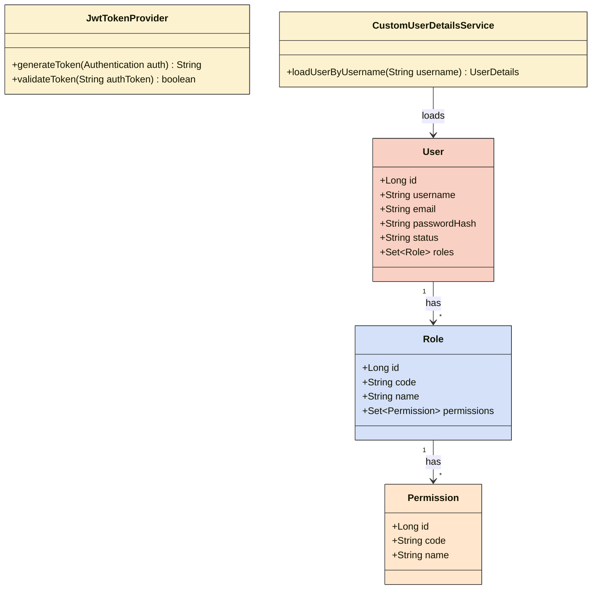
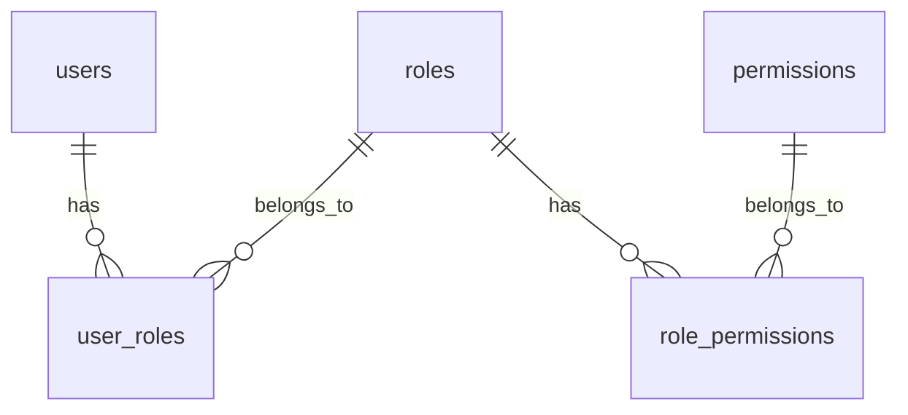
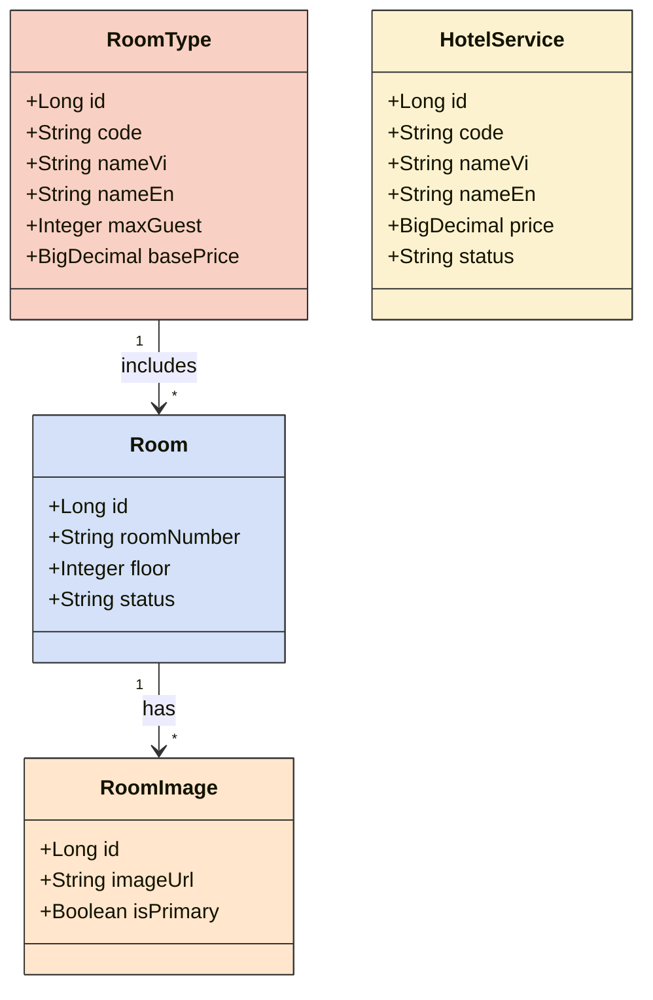
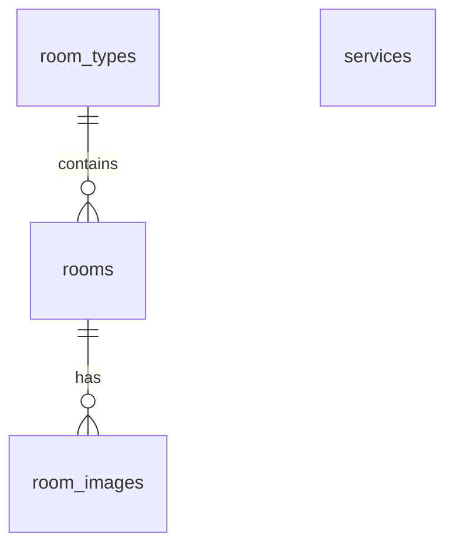

# CHƯƠNG 1
# TỔNG QUAN ĐỀ TÀI

## 1.1. LÝ DO CHỌN ĐỀ TÀI
(Nội dung đang được cập nhật)

## 1.2. MỤC TIÊU NGHIÊN CỨU
### 1.2.1. Mục tiêu tổng quát
(Nội dung đang được cập nhật)

### 1.2.2. Mục tiêu cụ thể
(Nội dung đang được cập nhật)

---

# CHƯƠNG 2
# CƠ SỞ LÝ THUYẾT

## 2.1. CÔNG NGHỆ BACKEND
Hệ thống sử dụng ngôn ngữ lập trình Java 21 và framework Spring Boot 3 để xây dựng các API (Application Programming Interface) theo tiêu chuẩn RESTful. Vấn đề bảo mật hệ thống được đảm bảo bằng Spring Security kết hợp với kỹ thuật xác thực qua JSON Web Token (JWT).

## 2.2. CÔNG NGHỆ FRONTEND
Phía máy khách (Client-side) được xây dựng dựa trên nền tảng Angular 22. Ứng dụng áp dụng kiến trúc Standalone Components nhằm giảm thiểu sự phụ thuộc vào các module dư thừa, kết hợp với bộ thư viện PrimeNG để thiết kế giao diện người dùng (UI) đồng nhất và chuyên nghiệp.

## 2.3. HỆ QUẢN TRỊ CƠ SỞ DỮ LIỆU
Hệ thống sử dụng Microsoft SQL Server làm hệ quản trị cơ sở dữ liệu quan hệ chính. Các thao tác tương tác với cơ sở dữ liệu được thực hiện gián tiếp thông qua JPA (Java Persistence API) và Hibernate.

---

# CHƯƠNG 3
# PHÂN TÍCH VÀ THIẾT KẾ HỆ THỐNG

## 3.1. THIẾT KẾ KIẾN TRÚC TỔNG THỂ CỦA MODULE XÁC THỰC
Module xác thực và phân quyền đóng vai trò là chốt chặn an ninh đầu tiên của hệ thống. Nhằm đảm bảo tính an toàn dữ liệu, module được thiết kế dựa trên cơ chế RBAC (Role-Based Access Control).

### 3.1.1. Biểu đồ lớp (Class Diagram)
Biểu đồ lớp dưới đây mô tả chi tiết các thực thể và các thành phần cấu hình bảo mật được cài đặt trong Spring Security.

Hình 3.1. Biểu đồ lớp của phân hệ Xác thực và Phân quyền

Biểu đồ lớp trên được thiết kế nhằm mục đích khái quát hóa toàn bộ cấu trúc hướng đối tượng của phân hệ bảo mật tại tầng Backend. Khối kiến trúc này giúp đảm bảo nguyên tắc phân chia trách nhiệm rõ ràng (Separation of Concerns) trong quá trình xác thực và cấp quyền cho người dùng.

Về mặt cấu trúc, biểu đồ định nghĩa các thực thể cốt lõi tham gia vào quá trình bảo mật, bao gồm lớp `User` (đại diện cho người dùng), lớp `Role` (đại diện cho vai trò) và lớp `Permission` (đại diện cho các quyền hạn cụ thể). Bên cạnh các lớp thực thể, hệ thống còn tích hợp các lớp xử lý nghiệp vụ bảo mật cốt lõi, tiêu biểu là `JwtTokenProvider` dùng để tạo và xác thực chữ ký điện tử, cùng với `CustomUserDetailsService` dùng để nạp thông tin người dùng từ cơ sở dữ liệu.

Phân tích sâu vào các mối quan hệ, có thể thấy mối quan hệ giữa người dùng và vai trò là quan hệ nhiều - nhiều, được thể hiện thông qua thuộc tính `roles` mang kiểu dữ liệu tập hợp (`Set`). Hệ thống không cấp quyền hạn trực tiếp cho từng cá nhân người dùng; thay vào đó, các quyền hạn thao tác sẽ được gán cho một hoặc nhiều vai trò cụ thể. Cách tiếp cận này tuân thủ đúng nguyên lý Kiểm soát truy cập dựa trên vai trò (Role-Based Access Control), giúp hệ thống có khả năng dễ dàng bảo trì và mở rộng khi quy mô quản trị tăng lên.

Qua các phân tích trên, có thể kết luận rằng kiến trúc lớp bảo mật này đã đáp ứng đầy đủ và chặt chẽ các tiêu chuẩn của framework Spring Security. Mô hình không chỉ đảm bảo tính toàn vẹn và bảo mật của dữ liệu người dùng mà còn hỗ trợ mạnh mẽ cho kỹ thuật xác thực không trạng thái (Stateless Authentication) thông qua việc trao đổi chuỗi định danh JSON Web Token.

### 3.1.2. Thiết kế Cơ sở dữ liệu (Database Design)
Việc lưu trữ thông tin phân quyền đòi hỏi một cấu trúc cơ sở dữ liệu chuẩn hóa nhằm hạn chế dư thừa dữ liệu.

Hình 3.2. Sơ đồ thực thể kết hợp (ERD) cho module RBAC

Bảng 3.1. Mô tả chi tiết các bảng trong cơ sở dữ liệu của phân hệ bảo mật

| Tên bảng | Chức năng | Khóa chính | Ràng buộc đặc biệt |
|----------|-----------|------------|--------------------|
| users | Lưu trữ thông tin định danh của người dùng | id | username (Unique), email (Unique) |
| roles | Danh mục các vai trò của hệ thống | id | code (Unique) |
| permissions | Danh mục các quyền hạn thao tác cụ thể | id | code (Unique) |
| user_roles | Bảng trung gian ánh xạ giữa Users và Roles | user_id, role_id | Khóa ngoại tới users và roles |
| role_permissions | Bảng trung gian ánh xạ giữa Roles và Permissions | role_id, permission_id | Khóa ngoại tới roles và permissions |

### 3.1.3. Thiết kế kiến trúc cho phân hệ Quản lý Phòng và Dịch vụ
Sau khi thiết lập hệ thống phân quyền, module tiếp theo được xây dựng là hệ thống quản lý danh mục phòng và dịch vụ khách sạn. Đây là phần lõi lưu trữ toàn bộ các thông tin về khả năng cung ứng dịch vụ của khách sạn.

Biểu đồ lớp dưới đây thể hiện mối quan hệ giữa các thực thể chính trong phân hệ này:

Hình 3.3. Biểu đồ lớp của phân hệ Quản lý Phòng và Dịch vụ

Kiến trúc trên được thiết kế nhằm tách biệt rõ ràng giữa định nghĩa loại phòng (RoomType) và các phòng vật lý cụ thể (Room). Một loại phòng (ví dụ: Standard) có thể được áp dụng cho nhiều phòng khác nhau, giúp việc cấu hình giá cả và sức chứa trở nên linh hoạt. Hình ảnh mô tả cũng được liên kết trực tiếp vào từng phòng thực tế, cho phép khách hàng có cái nhìn chính xác nhất về không gian họ sẽ sử dụng. Các dịch vụ đi kèm (HotelService) được tổ chức thành một danh mục độc lập, sẵn sàng để liên kết vào các giao dịch đặt phòng sau này.

Về mặt cơ sở dữ liệu, sơ đồ thực thể kết hợp (ERD) được thể hiện như sau:

Hình 3.4. Sơ đồ thực thể kết hợp (ERD) cho module Phòng và Dịch vụ

Bảng 3.2. Mô tả chi tiết các bảng trong phân hệ Phòng và Dịch vụ

| Tên bảng | Chức năng | Khóa chính | Ràng buộc đặc biệt |
|----------|-----------|------------|--------------------|
| room_types | Lưu trữ thông tin chung về loại phòng và giá cơ bản | id | code (Unique) |
| rooms | Lưu trữ thông tin từng phòng vật lý, bao gồm số phòng, số tầng và trạng thái | id | room_number (Unique), room_type_id (Foreign Key) |
| room_images | Lưu trữ đường dẫn ảnh thực tế của từng phòng | id | room_id (Foreign Key) |
| services | Danh mục các dịch vụ phụ trợ do khách sạn cung cấp | id | code (Unique) |

## 3.2. THIẾT KẾ GIAO DIỆN
Trải nghiệm người dùng đóng vai trò cốt lõi trong việc đánh giá chất lượng của một hệ thống phần mềm. Do đó, quy trình thiết kế giao diện được thực hiện dựa trên các nguyên tắc thiết kế hiện đại, tập trung vào tính tương tác và sự thuận tiện trong thao tác nghiệp vụ.

Hệ thống sử dụng một khung giao diện thống nhất cho khu vực quản trị, được cấu thành từ thanh điều hướng bên trái (Sidebar) và vùng hiển thị dữ liệu chính. Thanh điều hướng được thiết kế tĩnh, cung cấp các lối tắt truy cập nhanh đến các phân hệ quản lý quan trọng như phòng, đặt phòng và người dùng. Trong khi đó, giao diện đăng nhập được thiết kế theo hình thức thẻ thông tin (Card) đặt tại trung tâm màn hình, kết hợp cùng hiệu ứng đổ bóng nhẹ nhằm thu hút sự tập trung của người dùng vào biểu mẫu xác thực.

Đối với phân hệ quản lý người dùng, giao diện được xây dựng dựa trên cấu trúc bảng dữ liệu (Data Table). Bảng dữ liệu cung cấp khả năng phân trang, sắp xếp và tích hợp các thao tác cập nhật trực tiếp trên từng hàng. Cách thiết kế này không chỉ giúp tối ưu hóa không gian hiển thị mà còn rút ngắn quy trình thao tác của nhân viên quản trị, từ đó nâng cao hiệu suất làm việc tổng thể.

### 3.2.1. Chiến lược xây dựng các thành phần dùng chung (Shared Components)
Để đảm bảo tính nhất quán của giao diện và giảm thiểu mã nguồn lặp lại, hệ thống áp dụng triệt để mẫu thiết kế Component-based của Angular thông qua việc xây dựng một bộ thư viện nội bộ các thành phần dùng chung (Shared Components). 

Các thành phần tiêu biểu bao gồm:
- **Data Table (`app-data-table`)**: Tích hợp sẵn cơ chế phân trang phía máy chủ (Server-side Pagination), sắp xếp, lọc toàn cục, và khả năng xử lý trạng thái rỗng (Empty State) với giao diện hiện đại.
- **Stat Card (`app-stat-card`)**: Thẻ thống kê trực quan hiển thị các số liệu tổng quan kèm biểu tượng và chỉ số tăng trưởng, sử dụng rộng rãi trên Dashboard.
- **Confirm Dialog**: Hộp thoại xác nhận thao tác tập trung, giúp chuẩn hóa trải nghiệm cảnh báo (xóa, hủy) trên toàn hệ thống.

Việc đóng gói các tính năng phức tạp vào Shared Components giúp các phân hệ nghiệp vụ sau này (như Quản lý phòng, Quản lý nhân viên) chỉ cần khai báo thông số đầu vào (Inputs) và lắng nghe sự kiện (Outputs) mà không cần quan tâm đến logic hiển thị bên dưới.

### 3.2.2. Thiết kế Giao diện Bảng điều khiển (Admin Dashboard)
Bảng điều khiển (Dashboard) đóng vai trò là trung tâm chỉ huy số, cung cấp cho quản lý cái nhìn toàn cảnh về tình trạng hoạt động của khách sạn theo thời gian thực.
Giao diện được phân bổ thành ba khu vực chính:
1. **Chỉ số tóm tắt (KPI Cards)**: Cung cấp tức thì các số liệu quan trọng nhất (như sự cố khẩn cấp, yêu cầu sửa chữa).
2. **Biểu đồ phân tích (Analytics Charts)**: Tích hợp thư viện Chart.js để biểu diễn biến động doanh thu và tỷ lệ lấp đầy phòng dưới dạng đồ thị trực quan.
3. **Danh sách tương tác nhanh**: Bảng danh sách các tác vụ hoặc yêu cầu bảo trì đang chờ xử lý, được ứng dụng kỹ thuật tải lười (Lazy Loading) để tối ưu hóa hiệu suất bộ nhớ. Mọi thao tác truy xuất ban đầu đều được thiết kế thông qua dữ liệu giả lập (Mock Data) nhằm chốt phương án hiển thị (UI) trước khi tiến hành tích hợp với Backend API.

---

# CHƯƠNG 4
# CÀI ĐẶT VÀ KIỂM THỬ HỆ THỐNG

## 4.1. CÀI ĐẶT MÔI TRƯỜNG VÀ CƠ SỞ DỮ LIỆU
### 4.1.1. Cài đặt kỹ thuật Auditing
Để hỗ trợ việc truy vết dữ liệu (Data Tracking), toàn bộ các thực thể trong cơ sở dữ liệu đều được thiết kế để kế thừa từ lớp `AuditableEntity`. 

**Mô tả cài đặt:** Annotation `@EnableJpaAuditing` được kích hoạt ở cấp độ ứng dụng. Lớp `AuditableEntity` cung cấp bốn thuộc tính cơ bản: `created_at` (thời điểm khởi tạo), `updated_at` (thời điểm chỉnh sửa cuối), `created_by` (người tạo), và `updated_by` (người chỉnh sửa).

### 4.1.2. Cài đặt Giao diện Front-end
Giao diện của ứng dụng được xây dựng hoàn toàn dựa trên kiến trúc Standalone Components của Angular 22, loại bỏ hoàn toàn sự phụ thuộc vào khái niệm NgModules truyền thống. Việc này giúp cải thiện đáng kể tốc độ tải trang và quá trình biên dịch của trình duyệt. 

Để hiện thực hóa các bản thiết kế giao diện, hệ thống tích hợp bộ thư viện PrimeNG phiên bản 21. Các thành phần giao diện phức tạp như bảng dữ liệu, hộp thoại và các trường nhập liệu mật khẩu đều được cung cấp sẵn bởi PrimeNG, giúp giảm thiểu thời gian lập trình và đảm bảo tính đồng bộ về mặt thẩm mỹ. Ngoài ra, việc tổ chức tệp tin được phân chia rõ ràng giữa các thành phần dùng chung (SharedModule), thành phần bảo vệ tuyến đường (Guards) và các thành phần chức năng (Features), tạo tiền đề vững chắc cho các giai đoạn mở rộng tính năng trong tương lai.

## 4.2. KIỂM THỬ CHỨC NĂNG BẢO MẬT
### 4.2.1. Đánh giá kiểm thử
Hệ thống API đã được tích hợp công cụ `springdoc-openapi`. Bằng cách truy cập Swagger UI, người lập trình có thể kiểm chứng trực tiếp các điểm cuối (endpoints) mà không cần thông qua ứng dụng máy khách. Quá trình kiểm thử cho thấy bộ lọc `JwtAuthenticationFilter` hoạt động chính xác, từ chối mọi yêu cầu (HTTP 401 Unauthorized) không chứa Token hợp lệ.

---

# CHƯƠNG 5
# KẾT LUẬN VÀ HƯỚNG PHÁT TRIỂN

## 5.1. KẾT LUẬN
(Nội dung đang được cập nhật)

## 5.2. HƯỚNG PHÁT TRIỂN
(Nội dung đang được cập nhật)
