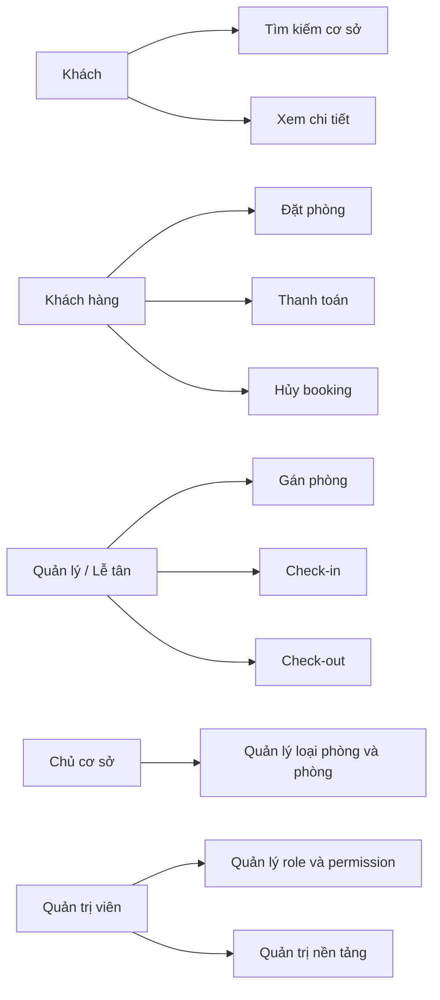
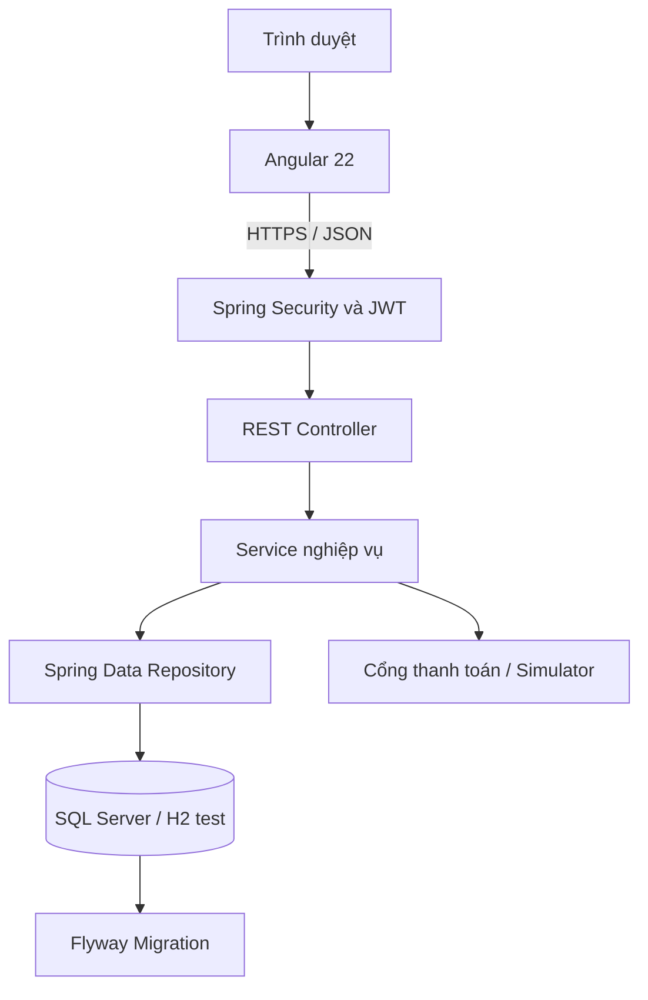
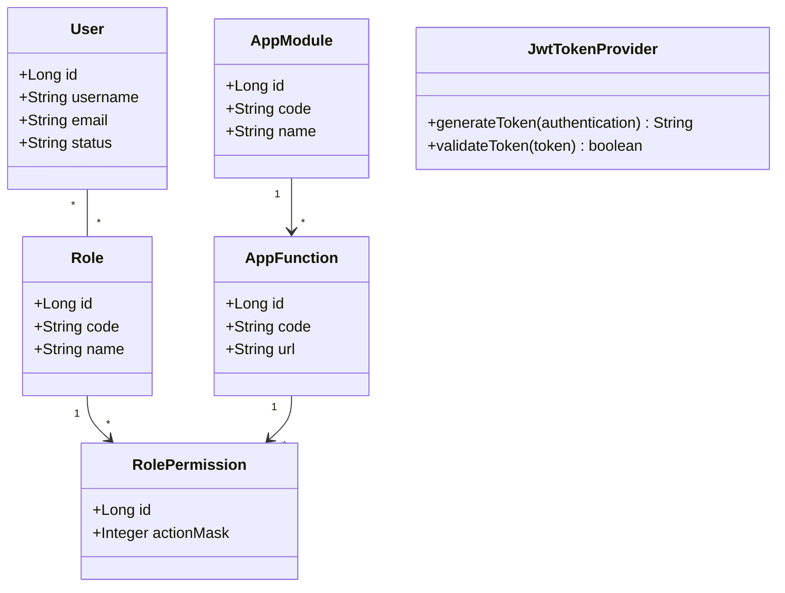
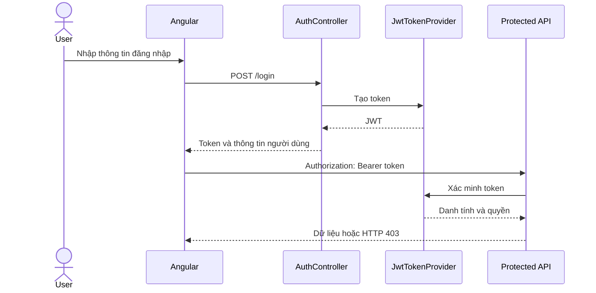
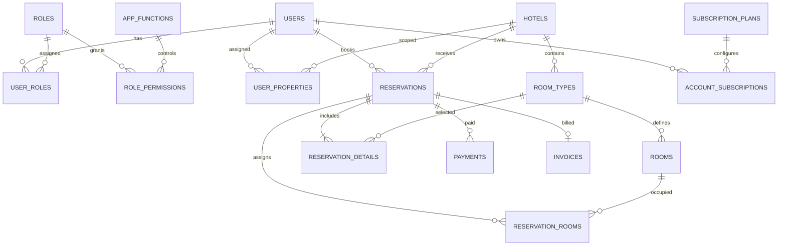
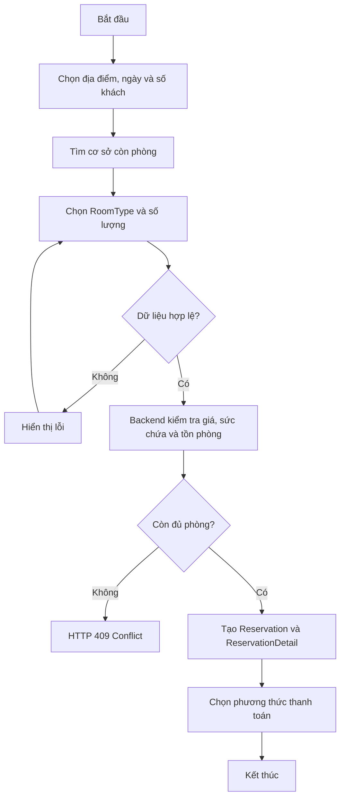
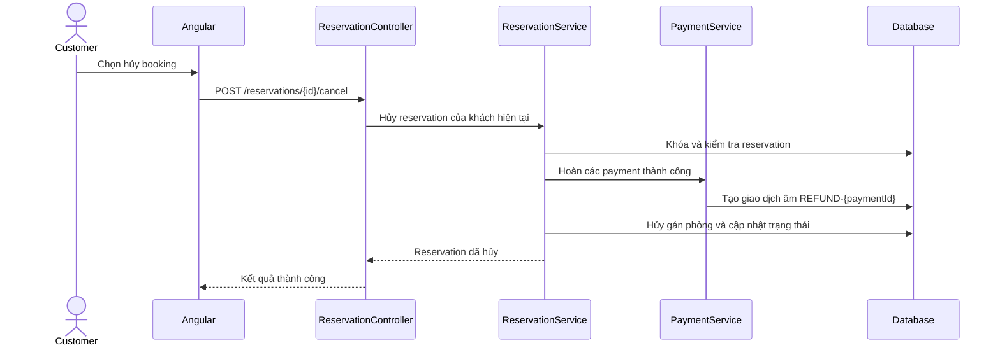
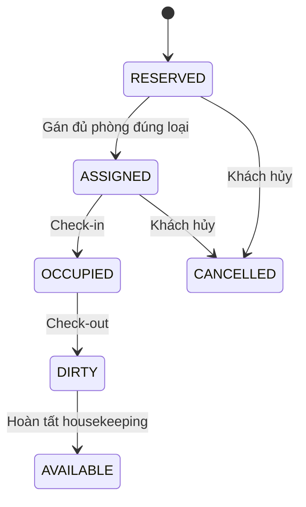

# CHƯƠNG 1
# TỔNG QUAN ĐỀ TÀI

## 1.1. LÝ DO CHỌN ĐỀ TÀI

Ngành du lịch và lưu trú ngày càng phụ thuộc vào khả năng cung cấp thông tin nhanh, quản lý tồn phòng chính xác và phục vụ khách hàng trên nhiều thiết bị. Tuy nhiên, nhiều cơ sở lưu trú quy mô vừa và nhỏ vẫn sử dụng bảng tính, sổ sách hoặc nhiều phần mềm rời rạc. Cách vận hành này dễ dẫn đến đặt phòng vượt mức, sai lệch trạng thái phòng, khó kiểm soát doanh thu và thiếu dữ liệu hỗ trợ quyết định.

Từ nhu cầu trên, đề tài **“Xây dựng hệ thống quản lý khách sạn và đặt phòng trực tuyến LuxeStay”** được thực hiện nhằm xây dựng một nền tảng thống nhất cho ba nhóm hoạt động: khách hàng tìm kiếm và đặt chỗ; chủ cơ sở quản lý tài nguyên lưu trú; quản trị viên vận hành nền tảng và phân quyền người dùng.

LuxeStay được định hướng theo mô hình phần mềm dịch vụ. Một tài khoản chủ cơ sở có thể quản lý nhiều cơ sở, trong khi giới hạn sử dụng được xác định bởi gói đăng ký. Hệ thống đồng thời giải quyết những vấn đề đặc thù của dữ liệu Việt Nam như tìm kiếm có dấu và không dấu, mô hình địa giới hai cấp và lưu trữ Unicode.

## 1.2. MỤC TIÊU NGHIÊN CỨU

### 1.2.1. Mục tiêu tổng quát

Xây dựng ứng dụng web full-stack hỗ trợ quản lý khách sạn và đặt phòng trực tuyến, bảo đảm tính đúng đắn của nghiệp vụ tồn phòng, phân quyền, thanh toán và vận hành lưu trú.

### 1.2.2. Mục tiêu cụ thể

- Xây dựng REST API bằng Java 21 và Spring Boot 3.
- Xây dựng giao diện responsive bằng Angular 22.
- Xác thực bằng JWT và kiểm soát quyền độc lập tại backend.
- Quản lý vai trò, chức năng và Action Mask.
- Hỗ trợ tìm kiếm cơ sở theo tỉnh, phường/xã, tên và địa chỉ tiếng Việt.
- Quản lý cơ sở, loại phòng, phòng vật lý, dịch vụ và ảnh.
- Thực hiện quy trình đặt phòng, gán phòng, check-in, sử dụng dịch vụ, check-out và dọn phòng.
- Ghi nhận thanh toán, xử lý callback idempotent, hoàn tiền khi hủy và lập hóa đơn.
- Quản lý nhiều cơ sở và giới hạn chức năng theo gói đăng ký.
- Xây dựng dữ liệu demo có kiểm soát, không sửa dữ liệu cơ sở thật.
- Kiểm thử các nghiệp vụ quan trọng ở tầng đơn vị, tích hợp và đầu cuối.

## 1.3. ĐỐI TƯỢNG VÀ PHẠM VI NGHIÊN CỨU

Đối tượng nghiên cứu gồm quy trình tìm kiếm và đặt phòng, quản lý tài nguyên lưu trú, xác thực và phân quyền, thanh toán, hóa đơn, đăng ký gói dịch vụ và quản trị cơ sở.

Các tác nhân chính gồm:

- **Khách chưa đăng nhập:** tìm kiếm, xem chi tiết cơ sở và xem loại phòng.
- **Khách hàng:** đặt phòng, thanh toán, theo dõi và hủy booking, xem hóa đơn.
- **Chủ cơ sở:** quản lý cơ sở được gán và theo dõi giới hạn gói.
- **Quản lý, lễ tân và nhân viên:** quản lý booking, phòng và quy trình lưu trú trong phạm vi được cấp.
- **Quản trị viên hệ thống:** quản lý người dùng, vai trò, quyền, cơ sở, dữ liệu nhập và subscription.

Phạm vi hiện tại chưa bao gồm nhiều loại phòng trong cùng một booking, đánh giá thực từ khách hàng, yêu thích, đối soát tài chính chuyên biệt và quy trình nâng/hạ/gia hạn gói đầy đủ.

## 1.4. PHƯƠNG PHÁP THỰC HIỆN

Đề tài được thực hiện theo các bước:

1. Khảo sát quy trình nghiệp vụ và xác định tác nhân.
2. Phân tích yêu cầu chức năng, dữ liệu và bảo mật.
3. Thiết kế kiến trúc nhiều tầng, REST API, cơ sở dữ liệu và giao diện.
4. Cài đặt theo từng phân hệ có thể kiểm thử độc lập.
5. Áp dụng migration để quản lý thay đổi cơ sở dữ liệu.
6. Kiểm thử đơn vị, tích hợp, giao diện và luồng đầu cuối.
7. Đối chiếu kết quả kiểm thử với yêu cầu trước khi tổng hợp báo cáo.

## 1.5. KẾT CẤU BÁO CÁO

Báo cáo gồm năm chương. Chương 1 trình bày bối cảnh, mục tiêu và phạm vi. Chương 2 giới thiệu cơ sở lý thuyết và công nghệ. Chương 3 phân tích yêu cầu và thiết kế hệ thống. Chương 4 mô tả cài đặt, giao diện và kết quả kiểm thử. Chương 5 tổng kết kết quả, hạn chế và hướng phát triển.

---

# CHƯƠNG 2
# CƠ SỞ LÝ THUYẾT

## 2.1. KIẾN TRÚC ỨNG DỤNG WEB NHIỀU TẦNG

Hệ thống được tổ chức thành frontend, backend và tầng dữ liệu. Frontend chịu trách nhiệm trình bày và tương tác. Backend cung cấp REST API, xác thực, phân quyền và xử lý nghiệp vụ. Tầng dữ liệu lưu trữ trạng thái bền vững và thực thi các ràng buộc toàn vẹn.

Cách phân chia này giúp giảm phụ thuộc giữa giao diện và nghiệp vụ, hỗ trợ kiểm thử từng tầng, đồng thời cho phép thay đổi cách trình bày mà không làm thay đổi quy tắc nghiệp vụ cốt lõi.

## 2.2. REST API VÀ DTO

REST tổ chức tài nguyên qua URL và sử dụng phương thức HTTP để biểu diễn thao tác. LuxeStay dùng DTO cho dữ liệu trao đổi nhằm tránh lộ cấu trúc thực thể, hạn chế JSON đệ quy và kiểm soát dữ liệu đầu vào, đầu ra.

Các mã trạng thái chính gồm:

- `200 OK`: yêu cầu thành công.
- `201 Created`: tạo tài nguyên thành công.
- `400 Bad Request`: dữ liệu đầu vào không hợp lệ.
- `401 Unauthorized`: chưa xác thực hoặc token không hợp lệ.
- `403 Forbidden`: không đủ quyền hoặc vượt giới hạn gói.
- `404 Not Found`: không tìm thấy tài nguyên.
- `409 Conflict`: xung đột tồn phòng hoặc trạng thái nghiệp vụ.

## 2.3. XÁC THỰC JWT VÀ PHÂN QUYỀN

JWT là chuỗi token có chữ ký, chứa thông tin nhận dạng và thời hạn. Sau khi đăng nhập, client gửi token trong tiêu đề `Authorization`. Backend xác minh chữ ký, thời hạn và dựng ngữ cảnh bảo mật cho từng yêu cầu.

Hệ thống kết hợp ba lớp kiểm soát:

1. **Role:** xác định nhóm người dùng.
2. **Permission và Action Mask:** xác định hành động VIEW, CREATE, UPDATE, DELETE, EXPORT hoặc APPROVE trên chức năng.
3. **Feature Gate:** giới hạn tài nguyên theo gói đăng ký.

Backend là nơi quyết định quyền cuối cùng. Route Guard phía Angular chỉ hỗ trợ trải nghiệm và không thay thế kiểm tra tại máy chủ.

## 2.4. QUẢN LÝ TỒN PHÒNG VÀ GIAO DỊCH

Tồn phòng được xác định theo loại phòng, khoảng ngày và số lượng đã giữ bởi các booking có hiệu lực. Khi tạo booking, backend phải kiểm tra lại giá, sức chứa và số phòng còn lại thay vì tin dữ liệu từ client.

Giao dịch cơ sở dữ liệu bảo đảm chuỗi thao tác được hoàn thành toàn bộ hoặc hoàn tác. Khóa bản ghi khi xử lý thanh toán, hủy booking và cập nhật tài nguyên giúp giảm nguy cơ hai yêu cầu đồng thời tạo dữ liệu không nhất quán.

## 2.5. IDEMPOTENCY TRONG THANH TOÁN

Một callback thanh toán có thể được cổng thanh toán gửi nhiều lần. Idempotency bảo đảm cùng một giao dịch chỉ tạo một kết quả nghiệp vụ. LuxeStay dùng mã giao dịch duy nhất và ràng buộc cơ sở dữ liệu để chống ghi nhận trùng.

Hoàn tiền được lưu bằng giao dịch âm có mã xác định từ giao dịch gốc. Cách lưu này giữ được lịch sử thay vì sửa hoặc xóa giao dịch đã thành công.

## 2.6. UNICODE VÀ TÌM KIẾM TIẾNG VIỆT

Dữ liệu tiếng Việt cần được lưu bằng kiểu Unicode. Hệ thống sử dụng các cột `NVARCHAR`, đọc dữ liệu nhập bằng UTF-8 và xử lý BOM. Giá trị tìm kiếm được chuẩn hóa để người dùng có thể nhập có dấu hoặc không dấu.

Mô hình địa giới gồm tỉnh/thành phố và phường/xã, không dùng quận/huyện. Cấu trúc này phù hợp tập dữ liệu hiện hành của dự án và giảm số bước chọn địa điểm.

## 2.7. CÔNG NGHỆ SỬ DỤNG

**Bảng 2.1. Công nghệ chính của hệ thống**

| Tầng | Công nghệ | Vai trò |
|---|---|---|
| Backend | Java 21, Spring Boot 3.2.5 | REST API và nghiệp vụ |
| Bảo mật | Spring Security, JWT | Xác thực và phân quyền |
| Dữ liệu | Spring Data JPA, Hibernate | Ánh xạ và truy cập dữ liệu |
| Migration | Flyway | Quản lý thay đổi schema |
| API | springdoc-openapi | Tài liệu và kiểm tra endpoint |
| Frontend | Angular 22, TypeScript 6 | Giao diện ứng dụng |
| UI | PrimeNG 21, Tailwind CSS 3 | Thành phần và định dạng |
| Biểu đồ | Chart.js 4 | Trực quan hóa số liệu |
| Kiểm thử | JUnit, Mockito, Spring Test, Playwright | Kiểm thử tự động |
| Triển khai | Docker Compose | Khởi tạo các dịch vụ |

Bảng 2.1 cho thấy hệ thống sử dụng các công nghệ phổ biến, có hệ sinh thái kiểm thử và hỗ trợ tốt cho kiến trúc web nhiều tầng.

---

# CHƯƠNG 3
# PHÂN TÍCH VÀ THIẾT KẾ HỆ THỐNG

## 3.1. PHÂN TÍCH TÁC NHÂN VÀ CHỨC NĂNG

**Bảng 3.1. Tác nhân và nhóm chức năng**

| Tác nhân | Nhóm chức năng |
|---|---|
| Khách chưa đăng nhập | Tìm kiếm, xem cơ sở, xem phòng |
| Khách hàng | Đặt phòng, thanh toán, hủy booking, xem lịch sử và hóa đơn |
| Chủ cơ sở | Quản lý cơ sở, loại phòng, phòng và giới hạn gói |
| Quản lý/Lễ tân | Quản lý booking, gán phòng, check-in, check-out |
| Nhân viên | Thực hiện chức năng được cấp trong phạm vi cơ sở |
| Quản trị viên | Người dùng, role, permission, cơ sở, import, claim và subscription |

Bảng 3.1 thể hiện chức năng được tách theo trách nhiệm. Quyền thực tế còn phụ thuộc Action Mask, phạm vi cơ sở và trạng thái subscription.

### 3.1.1. Use Case tổng quát

Hình 3.1. Sơ đồ Use Case tổng quát

Mục đích của Hình 3.1 là xác định ranh giới chức năng theo tác nhân. Khách hàng tương tác với luồng thương mại; nhân viên xử lý lưu trú; chủ cơ sở quản lý tài nguyên; quản trị viên kiểm soát nền tảng. Kết quả phân tích cho thấy mọi thao tác ghi dữ liệu cần được kiểm tra cả quyền và phạm vi tài nguyên.

## 3.2. KIẾN TRÚC TỔNG THỂ

Hình 3.2. Kiến trúc tổng thể của hệ thống

Hình 3.2 mô tả đường đi của yêu cầu từ giao diện đến dữ liệu. Controller tiếp nhận và chuẩn hóa yêu cầu; Service thực thi nghiệp vụ; Repository truy cập dữ liệu. Spring Security chặn yêu cầu trước Controller. Flyway quản lý phiên bản schema. Kiến trúc này giúp quy tắc nghiệp vụ không phụ thuộc giao diện.

## 3.3. THIẾT KẾ XÁC THỰC VÀ PHÂN QUYỀN

### 3.3.1. Biểu đồ lớp phân quyền

Hình 3.3. Biểu đồ lớp phân hệ xác thực và phân quyền

Mục đích của Hình 3.3 là mô tả cấu trúc RBAC động. `RolePermission` liên kết vai trò với chức năng và lưu `actionMask`. Bit mask cho phép kết hợp nhiều hành động trong một giá trị. `JwtTokenProvider` chịu trách nhiệm phát hành và xác minh token. Thiết kế hỗ trợ thay đổi menu và quyền từ dữ liệu mà không phải mã hóa cứng toàn bộ trong giao diện.

### 3.3.2. Trình tự xác thực yêu cầu

Hình 3.4. Biểu đồ tuần tự xác thực và gọi API

Hình 3.4 cho thấy JWT được kiểm tra trên từng yêu cầu. Token hợp lệ chỉ chứng minh danh tính; endpoint vẫn phải kiểm tra role, permission và phạm vi cơ sở. Kết luận, bảo vệ route phía client không phải lớp bảo mật cuối cùng.

## 3.4. THIẾT KẾ DỮ LIỆU NGHIỆP VỤ

Hình 3.5. Sơ đồ ERD rút gọn của hệ thống

Mục đích của Hình 3.5 là thể hiện các quan hệ dữ liệu quan trọng. `ReservationDetail` giữ loại phòng và số lượng khi đặt. `ReservationRoom` chỉ được tạo khi nhân viên gán phòng vật lý. Sự tách biệt này cho phép bán theo loại phòng trước khi biết số phòng cụ thể.

`UserProperty` giới hạn phạm vi cơ sở mà chủ sở hữu hoặc nhân viên được thao tác. `AccountSubscription` tách trạng thái gói khỏi trạng thái tài khoản và cơ sở. `Payment` giữ lịch sử giao dịch, kể cả hoàn tiền. Thiết kế bảo đảm dữ liệu vận hành không bị xóa khi subscription hết hạn.

## 3.5. THIẾT KẾ QUY TRÌNH ĐẶT VÀ HỦY PHÒNG

### 3.5.1. Activity Diagram đặt phòng

Hình 3.6. Biểu đồ hoạt động đặt phòng

Hình 3.6 mô tả hai lớp kiểm tra. Frontend phản hồi sớm cho lỗi nhập liệu; backend kiểm tra lại dữ liệu tại biên tin cậy. HTTP 409 được dùng khi tài nguyên đã thay đổi giữa lúc tìm kiếm và xác nhận.

### 3.5.2. Trình tự hủy và hoàn tiền

Hình 3.7. Biểu đồ tuần tự hủy booking và hoàn tiền

Mục đích của Hình 3.7 là bảo đảm hủy booking thuộc đúng khách hàng và hoàn tiền không bị lặp. Mã `REFUND-{paymentId}` cùng kiểm tra giao dịch tồn tại giúp thao tác hoàn tiền idempotent. Lịch sử tài chính được bảo toàn bằng bản ghi âm thay vì sửa giao dịch gốc.

## 3.6. THIẾT KẾ QUY TRÌNH VẬN HÀNH LƯU TRÚ

Hình 3.8. Sơ đồ trạng thái phòng trong quy trình lưu trú

Hình 3.8 phân biệt booking với trạng thái phòng vật lý. Check-in chặn phòng sai loại, sai cơ sở, đang có khách hoặc bảo trì. Check-out tạo hóa đơn, chuyển phòng sang `DIRTY` và tạo tác vụ dọn phòng. Phòng chỉ trở lại `AVAILABLE` sau khi housekeeping hoàn tất.

## 3.7. THIẾT KẾ TÌM KIẾM VÀ DỮ LIỆU ĐỊA GIỚI

Tìm kiếm công khai sử dụng mô hình tỉnh và phường/xã. Autocomplete trả kết quả theo nhóm và hỗ trợ điều hướng bàn phím. Search State giữ địa điểm, ngày, số khách và số phòng khi chuyển từ trang chủ sang kết quả.

Hệ thống chuẩn hóa chuỗi tiếng Việt để so khớp có dấu và không dấu. Kết quả có thể lọc theo tỉnh, phường/xã, loại cơ sở, giá, hạng sao và điểm đánh giá; sắp xếp và phân trang được thực hiện phía server.

## 3.8. THIẾT KẾ MULTI-PROPERTY VÀ SUBSCRIPTION

`UserProperty` ánh xạ tài khoản với cơ sở và loại quan hệ. Mọi truy vấn quản trị theo cơ sở phải dùng Active Property Context hoặc phạm vi được gán. Chủ cơ sở không được truy cập tài nguyên của cơ sở khác bằng cách thay ID trên URL.

Feature Gate kiểm tra trạng thái gói và lượng tài nguyên đã sử dụng. Các trạng thái hiện có gồm `FREE`, `NO_PLAN`, `STANDARD`, `BUSINESS`, `LIFETIME` và `EXPIRED`. Khi vượt giới hạn, backend trả HTTP 403 cùng thông báo nâng cấp; dữ liệu hiện có không bị xóa.

## 3.9. THIẾT KẾ DỮ LIỆU DEMO VÀ IMPORT

Dữ liệu demo dùng địa giới đã nhập làm nguồn, được đánh dấu `is_demo`, `data_source=DEMO` và `seed_key` duy nhất. Seeder dùng cơ chế upsert, có thể chạy lại và không sửa cơ sở thật. Chế độ STANDARD tạo tập hữu hạn phục vụ local; không được hiểu là bao phủ toàn bộ phường/xã.

Quy trình import dữ liệu mở đưa kết quả vào vùng tạm, thực hiện chống trùng theo mã ngoài, tên và địa giới, điện thoại, website và khoảng cách. Quản trị viên xem xét trước khi nhập chính thức. Cơ sở nhập chưa mặc nhiên có phòng, giá hoặc chủ sở hữu; chủ cơ sở phải gửi yêu cầu claim và được duyệt.

## 3.10. THIẾT KẾ GIAO DIỆN

Giao diện public ưu tiên tìm kiếm, xem cơ sở và đặt phòng trên desktop lẫn mobile. Các trạng thái loading, empty, error và retry được thể hiện rõ. Ảnh local có fallback khi tài nguyên lỗi.

Khu vực quản trị dùng sidebar, bảng dữ liệu và form nhất quán. Menu được tạo từ dữ liệu quyền thay vì hiển thị cố định. Những thành phần dùng chung gồm bảng dữ liệu, thẻ thống kê và hộp thoại xác nhận nhằm giảm mã lặp và chuẩn hóa thao tác.

---

# CHƯƠNG 4
# CÀI ĐẶT VÀ KIỂM THỬ HỆ THỐNG

## 4.1. CẤU TRÚC CÀI ĐẶT

Backend được tổ chức theo các nhóm `controllers`, `services`, `repositories`, `entities`, `dtos` và `security`. Controller không chứa nghiệp vụ phức tạp; Service điều phối giao dịch và kiểm tra quy tắc; Repository đóng gói truy vấn dữ liệu.

Frontend tổ chức theo `core`, `shared` và `features`. Core chứa dịch vụ dùng toàn ứng dụng, interceptor và guard. Shared chứa thành phần trình bày dùng lại. Features chứa màn hình theo nghiệp vụ.

Flyway quản lý các thay đổi schema. Các migration hiện hành bao gồm chuẩn hóa Unicode, ràng buộc tồn phòng theo phạm vi, dữ liệu demo, chỉ mục tìm kiếm, dữ liệu role/menu và ràng buộc idempotency cho payment.

## 4.2. CÀI ĐẶT XÁC THỰC VÀ PHÂN QUYỀN

Endpoint đăng nhập phát hành JWT sau khi kiểm tra thông tin tài khoản. Bộ lọc bảo mật đọc token và tạo `Authentication`. Annotation `@Permission` kiểm tra chức năng và hành động. Các endpoint nhạy cảm còn dùng `@PreAuthorize` để giới hạn role.

Menu của người dùng được trả từ API `my-menu`. Frontend chỉ dựng route và mục điều hướng được cấp, trong khi backend tiếp tục kiểm tra độc lập. `SUPER_ADMIN` có quyền nền tảng; yêu cầu thiếu quyền nhận HTTP 403.

## 4.3. CÀI ĐẶT TÌM KIẾM VÀ ĐẶT PHÒNG

Trang chủ cung cấp autocomplete theo địa điểm và cơ sở. Trang kết quả nhận bộ lọc, sắp xếp và phân trang từ URL hoặc Search State. Giá được hiển thị theo số đêm và số lượng phòng.

Khi xác nhận booking, backend kiểm tra:

- Ngày nhận và trả phòng.
- Số người lớn, trẻ em và sức chứa.
- RoomType thuộc đúng cơ sở.
- Số lượng phòng còn lại.
- Giá hiện hành và tổng tiền.

Booking hiện hỗ trợ một RoomType với `quantity > 1`. Nếu không đủ tồn phòng, API trả HTTP 409.

## 4.4. CÀI ĐẶT THANH TOÁN, HỦY VÀ HOÀN TIỀN

Hệ thống hỗ trợ tạo payment, URL VNPay, callback VNPay và callback simulator. Callback chỉ ghi nhận thành công khi mã giao dịch chưa tồn tại. Migration `V10__payment_idempotency_constraint.sql` bổ sung ràng buộc dữ liệu chống giao dịch trùng.

Khách hàng hủy booking qua endpoint chuyên biệt. Service kiểm tra quyền sở hữu, trạng thái được phép hủy, khóa reservation và tạo giao dịch hoàn tiền âm cho các payment thành công. Việc gọi lại không tạo thêm refund cho cùng payment.

## 4.5. CÀI ĐẶT VẬN HÀNH LƯU TRÚ

Nhân viên có thể xem phòng còn trống, gán nhiều phòng vật lý và thực hiện check-in. Backend từ chối phòng không thuộc cơ sở, sai RoomType, `OCCUPIED` hoặc `MAINTENANCE`.

Dịch vụ phát sinh được thêm trong thời gian lưu trú và lưu snapshot đơn giá. Check-out tổng hợp chi phí, tạo hóa đơn, cập nhật phòng thành `DIRTY` và tạo housekeeping task. Khi tác vụ hoàn tất, phòng chuyển thành `AVAILABLE/CLEAN`.

## 4.6. CÀI ĐẶT MULTI-PROPERTY VÀ FEATURE GATE

Active Property Context xác định cơ sở đang được quản lý. Repository và Service lọc dữ liệu theo các quan hệ trong `user_properties`. Feature Gate kiểm tra `AccountSubscription` và giới hạn của gói trước thao tác tạo tài nguyên.

Thiết kế này ngăn hai lỗi độc lập: người dùng thao tác ngoài phạm vi cơ sở và người dùng tạo vượt hạn mức gói. Việc chỉ ẩn nút trên frontend không được xem là kiểm soát hợp lệ.

## 4.7. GIAO DIỆN ĐÃ CÀI ĐẶT

**Bảng 4.1. Nhóm màn hình chính**

| Nhóm màn hình | Chức năng | Vai trò |
|---|---|---|
| Trang chủ và kết quả | Tìm kiếm, lọc, sắp xếp | Công khai |
| Chi tiết cơ sở | Xem ảnh, RoomType, giá và tồn phòng | Công khai |
| Checkout | Xác nhận khách, số phòng và chi phí | Khách hàng |
| Payment Simulator | Mô phỏng callback và kết quả thanh toán | Khách hàng/Test |
| Hồ sơ cá nhân | Thông tin, mật khẩu, booking và hóa đơn | Khách hàng |
| Dashboard quản trị | Chỉ số và điều hướng nghiệp vụ | Nhân viên quản trị |
| Role và Permission | Role, Action Mask và menu | Quản trị viên |
| RoomType và Room | Quản lý tài nguyên lưu trú | Chủ cơ sở/Nhân viên |
| Reservation | Gán phòng, check-in, dịch vụ, check-out | Lễ tân/Quản lý |

Bảng 4.1 tổng hợp màn hình đã có trong mã nguồn. Mỗi màn hình chỉ hiển thị chức năng phù hợp vai trò, nhưng quyền cuối cùng vẫn do backend quyết định.

Ảnh minh họa hiện có trong `docs/screenshots/` gồm trang tìm kiếm desktop/mobile, quản lý role và quản lý phòng. Khi xuất báo cáo Word hoặc PDF, ảnh phải được đặt dưới phần mô tả liên quan, có chú thích “Hình 4.x” và được tham chiếu trong nội dung.

## 4.8. CHIẾN LƯỢC KIỂM THỬ

Kiểm thử được chia thành:

- **Unit test:** kiểm tra Service với dependency giả lập.
- **Integration test:** khởi tạo Spring context, MockMvc và H2.
- **Frontend unit test:** kiểm tra component và service.
- **E2E test:** Playwright chạy các luồng public, customer, payment và admin.
- **Build verification:** biên dịch production để phát hiện lỗi kiểu và đóng gói.

Các trường hợp quan trọng gồm quyền truy cập, tìm kiếm Unicode, tồn phòng, booking nhiều phòng cùng loại, gán phòng đúng phạm vi, payment idempotency, hủy booking, hoàn tiền và giới hạn subscription.

## 4.9. KẾT QUẢ KIỂM THỬ

**Bảng 4.2. Kết quả kiểm thử được xác minh**

| Hạng mục | Kết quả | Thời điểm |
|---|---:|---|
| Backend Maven test | 49/49 pass | 19/07/2026 |
| Failure | 0 | 19/07/2026 |
| Error | 0 | 19/07/2026 |
| Skipped | 0 | 19/07/2026 |
| Frontend unit | 20/20 pass | Mốc báo cáo 15/07/2026 |
| Home Search Playwright | 10/10 pass | Mốc báo cáo 15/07/2026 |
| Public/Customer Playwright | 5/5 pass | Mốc báo cáo 15/07/2026 |
| Search Result Playwright | 2/2 pass | Mốc báo cáo 15/07/2026 |
| Admin Playwright | 3/3 pass | Mốc báo cáo 15/07/2026 |
| Angular production build | Pass, còn warning bundle/CommonJS | Mốc báo cáo 15/07/2026 |

Bảng 4.2 phân biệt kết quả vừa chạy với mốc lịch sử. Lệnh backend `mvn test` hoàn tất `BUILD SUCCESS` trong 1 phút 24 giây. Toàn bộ 49 test đều đạt, gồm 7 test `PaymentServiceImplTest`, 6 test `ReservationServiceTest` và 3 test `PaymentControllerIntegrationTest`.

Kết quả frontend trong bảng là bằng chứng lịch sử ngày 15/07/2026, chưa phải lần chạy lại sau thay đổi payment hiện hành. Vì vậy, báo cáo không khẳng định E2E payment mới đã đạt cho đến khi bộ Playwright được chạy lại.

## 4.10. ĐÁNH GIÁ KẾT QUẢ

Backend đã vượt qua toàn bộ test hiện hành và chứng minh các thay đổi payment, hủy booking, hoàn tiền và subscription không làm hỏng bộ kiểm thử. Quá trình build phát sinh cảnh báo Lombok `@Builder` tại một số entity subscription, cảnh báo H2 dialect, `open-in-view` và Java agent; không có lỗi biên dịch hoặc lỗi test.

Hệ thống đáp ứng các luồng cốt lõi từ tìm kiếm đến vận hành lưu trú. Tuy nhiên, cần tiếp tục chạy lại frontend unit, production build và toàn bộ Playwright trên worktree hiện hành để có bộ bằng chứng đồng nhất cho phiên bản cuối.

---

# CHƯƠNG 5
# KẾT LUẬN VÀ HƯỚNG PHÁT TRIỂN

## 5.1. KẾT LUẬN

Đề tài đã xây dựng được hệ thống quản lý khách sạn và đặt phòng trực tuyến trên kiến trúc Angular và Spring Boot. Hệ thống hỗ trợ tìm kiếm tiếng Việt, đặt nhiều phòng cùng loại, quản lý tồn phòng, gán phòng vật lý, check-in, dịch vụ phát sinh, check-out, hóa đơn và housekeeping.

Phân hệ bảo mật kết hợp JWT, role, Action Mask, phạm vi cơ sở và Feature Gate. Mô hình này phù hợp nền tảng nhiều cơ sở vì quyền thao tác và giới hạn thương mại được kiểm tra độc lập.

Phân hệ thanh toán đã có cơ chế chống callback trùng và hoàn tiền khi hủy. Ràng buộc cơ sở dữ liệu cùng kiểm tra tại Service bảo vệ tính nhất quán khi yêu cầu lặp lại. Kết quả backend ngày 19/07/2026 đạt 49/49 test, không có failure, error hoặc skipped.

Dữ liệu địa giới, tìm kiếm Unicode và seeder demo giúp hệ thống có dữ liệu trình diễn có thể lặp lại mà không sao chép từ OTA hoặc sửa cơ sở thật. Các báo cáo và mã nguồn cũng phân biệt rõ dữ liệu STANDARD với phạm vi bao phủ toàn bộ.

## 5.2. HẠN CHẾ

- Một booking mới hỗ trợ một RoomType với số lượng nhiều phòng.
- Khách chưa chọn dịch vụ bổ sung ngay tại checkout.
- Favorites và Customer Reviews chưa hoàn thiện.
- Điểm đánh giá chưa được tổng hợp từ quy trình review thật.
- Subscription chưa có đầy đủ lịch sử activate, renew, upgrade, downgrade và revoke.
- Đối soát thanh toán và báo cáo tài chính chuyên sâu chưa hoàn chỉnh.
- Giao diện Owner chưa bao phủ toàn bộ ảnh, nhân viên, dịch vụ và vận hành.
- Báo cáo doanh thu và công suất chưa đầy đủ theo cơ sở và khoảng ngày.
- Frontend và Playwright chưa được chạy lại sau thay đổi payment hiện hành.
- Một số cảnh báo build và cấu hình JPA cần được xử lý trước triển khai production.

## 5.3. HƯỚNG PHÁT TRIỂN

1. Hỗ trợ nhiều RoomType trong cùng một booking bằng cấu trúc giỏ phòng.
2. Bổ sung dịch vụ tùy chọn tại checkout và chính sách giá theo ngày.
3. Xây dựng Favorites, Review, duyệt nội dung và điểm đánh giá xác thực.
4. Hoàn thiện vòng đời subscription và lịch sử thay đổi gói.
5. Bổ sung đối soát payment, webhook có chữ ký và nhật ký kiểm toán.
6. Hoàn thiện Owner Portal cho ảnh, nhân viên, dịch vụ và báo cáo.
7. Xây dựng báo cáo doanh thu, công suất, tỷ lệ hủy theo cơ sở và thời gian.
8. Bổ sung lịch sử trạng thái phòng và tiện nghi theo RoomType.
9. Tăng kiểm thử đồng thời cho tồn phòng, callback và hoàn tiền.
10. Chuẩn hóa pipeline CI để chạy backend, frontend, build và Playwright trên mỗi thay đổi.

## 5.4. KẾT LUẬN CHUNG

LuxeStay đã đạt mục tiêu xây dựng nền tảng quản lý và đặt phòng có các nghiệp vụ cốt lõi, bảo mật nhiều lớp và khả năng quản lý nhiều cơ sở. Kiến trúc hiện tại tạo nền tảng phù hợp để tiếp tục phát triển thành sản phẩm SaaS hoàn chỉnh. Các giới hạn còn lại đã được xác định rõ, không được trình bày như chức năng hoàn thành và có thể triển khai theo từng giai đoạn mà không phải thay đổi nền tảng kiến trúc chính.

---

# TÀI LIỆU THAM KHẢO

1. Angular, “Angular Documentation,” https://angular.dev/.
2. Chart.js, “Chart.js Documentation,” https://www.chartjs.org/docs/.
3. Docker, “Docker Documentation,” https://docs.docker.com/.
4. Flyway, “Flyway Documentation,” https://documentation.red-gate.com/flyway/.
5. Oracle, “Java Platform, Standard Edition Documentation,” https://docs.oracle.com/en/java/javase/21/.
6. Playwright, “Playwright Documentation,” https://playwright.dev/docs/intro.
7. PrimeTek, “PrimeNG Documentation,” https://primeng.org/.
8. Spring, “Spring Boot Reference Documentation,” https://docs.spring.io/spring-boot/docs/3.2.5/reference/html/.
9. Spring, “Spring Security Reference,” https://docs.spring.io/spring-security/reference/.