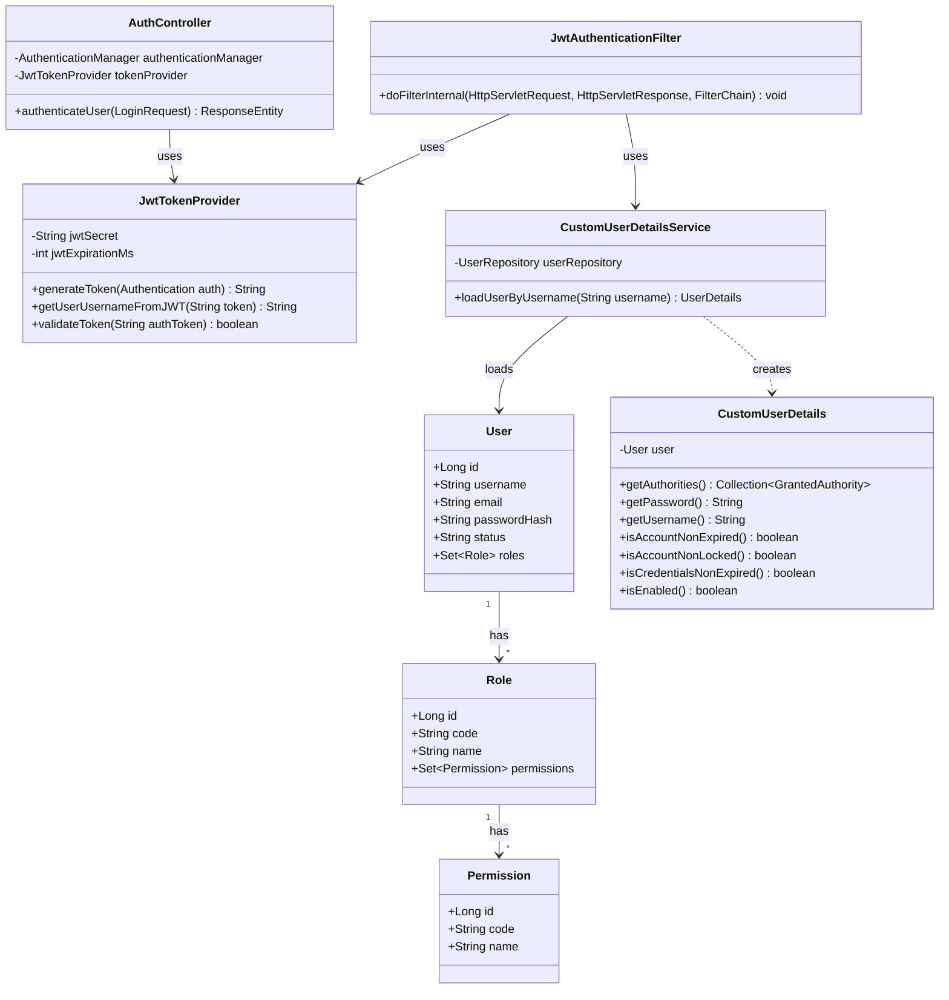
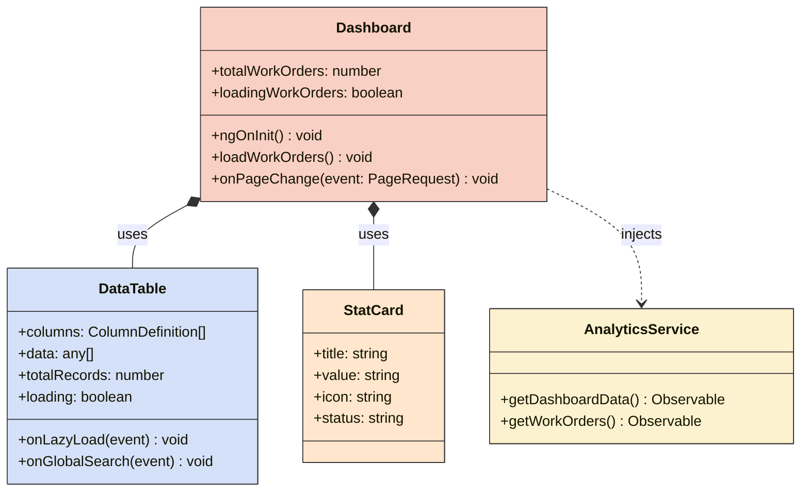
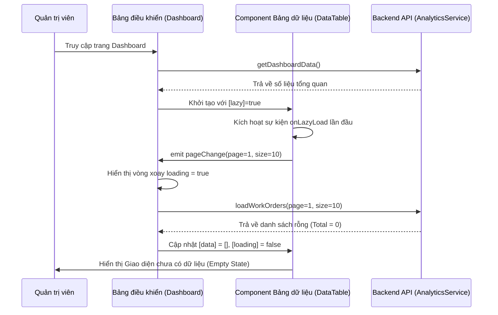

# BIỂU ĐỒ UML (UML DIAGRAMS)

## 1. Biểu đồ Lớp (Class Diagram) - Phase 1: Security

### Mục đích
Mô tả cấu trúc các lớp Java trong module xác thực và phân quyền (Security) ở Backend.

### Mô tả
Sơ đồ bao gồm các Entity (`User`, `Role`, `Permission`) và các thành phần cấu hình bảo mật của Spring Security (`JwtTokenProvider`, `JwtAuthenticationFilter`, `CustomUserDetailsService`, `CustomUserDetails`, `AuthController`).

### Phân tích
Lớp `CustomUserDetailsService` đóng vai trò là cầu nối giữa CSDL (`UserRepository`) và Spring Security (`UserDetails`). `JwtAuthenticationFilter` hoạt động như một màng lọc để kiểm tra Token JWT trước khi cho phép truy cập vào các Controller.

### Kết luận
Cấu trúc lớp được thiết kế chặt chẽ, tuân thủ đúng chuẩn của Spring Security để hỗ trợ Stateless Authentication qua JWT.

## 2. Biểu đồ Lớp (Class Diagram) - Phase 2: Shared Components & Dashboard

## 3. Biểu đồ Tuần tự (Sequence Diagram) - Lazy Loading Data Table

