# HỆ THỐNG BIỂU ĐỒ UML CHI TIẾT

Tài liệu này tập hợp toàn bộ các biểu đồ phân tích và thiết kế hệ thống chi tiết cho từng phân hệ nghiệp vụ, bao gồm: Use Case, Hoạt động (Activity), Tuần tự (Sequence) và Biểu đồ Lớp (Class). Toàn bộ các biểu đồ đều được đổ màu theo chuẩn nhận diện cấu trúc.

---

## 1. PHÂN HỆ XÁC THỰC VÀ PHÂN QUYỀN (AUTH & RBAC)

### 1.1. Biểu đồ Use Case
Mô tả các tính năng mà các tác nhân (Actors) có thể thực hiện liên quan đến tài khoản và quyền.

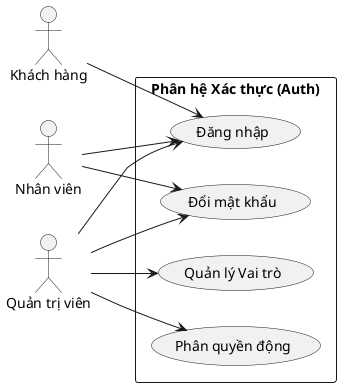

### 1.2. Biểu đồ Hoạt động (Activity Diagram) - Đăng nhập
Mô tả luồng xử lý từ lúc người dùng nhập tài khoản đến khi hệ thống cấp phát Token.

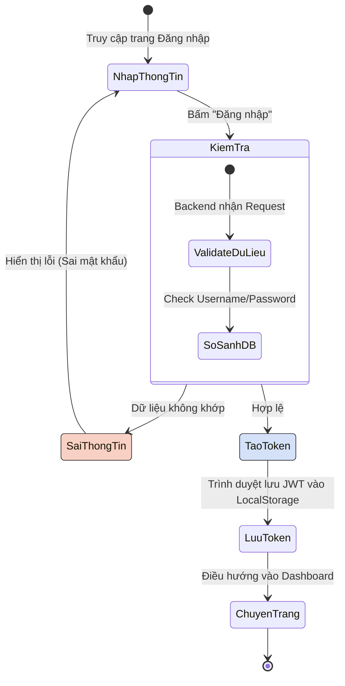

### 1.3. Biểu đồ Tuần tự (Sequence Diagram) - Luồng xác thực JWT

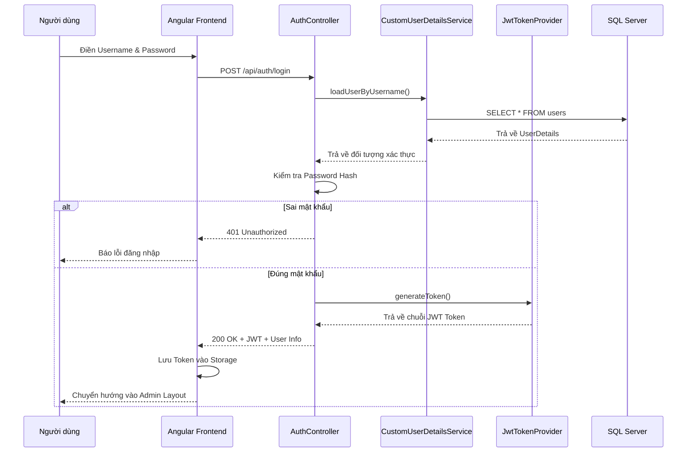

### 1.4. Biểu đồ Lớp (Class Diagram) - Security Phase

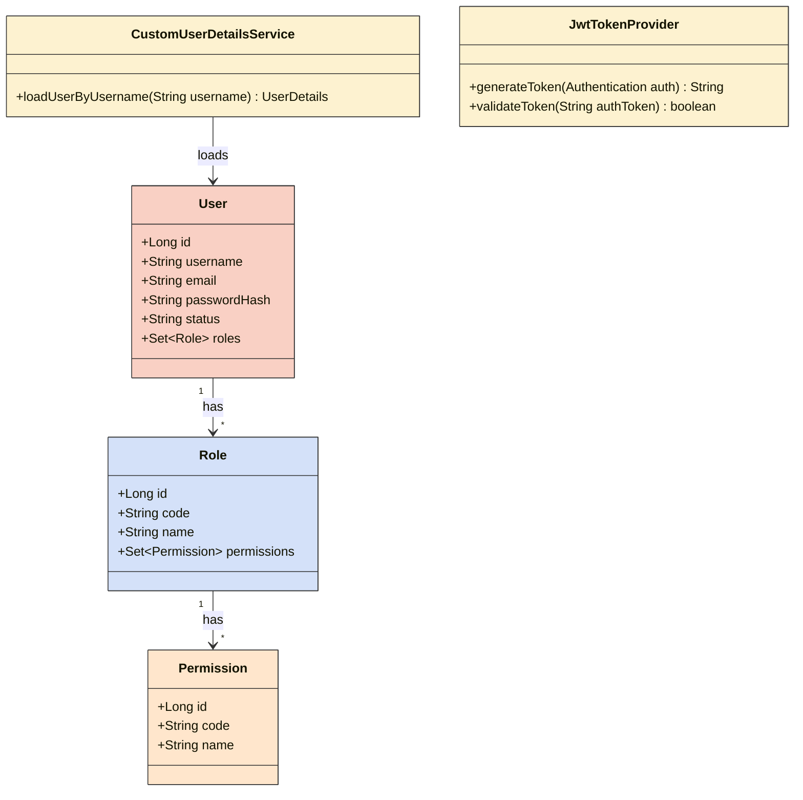

---

## 2. PHÂN HỆ QUẢN LÝ PHÒNG & DỊCH VỤ (ROOM MANAGEMENT)

### 2.1. Biểu đồ Use Case

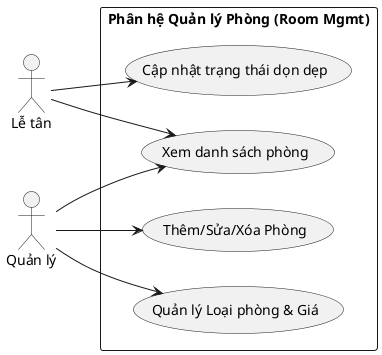

### 2.2. Biểu đồ Hoạt động (Activity Diagram) - Cập nhật trạng thái phòng

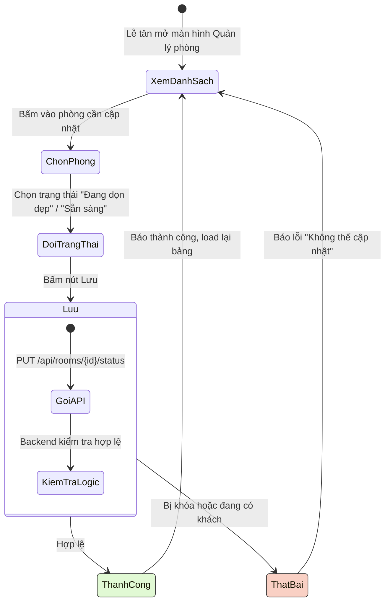

### 2.3. Biểu đồ Lớp (Class Diagram) - Room & Service

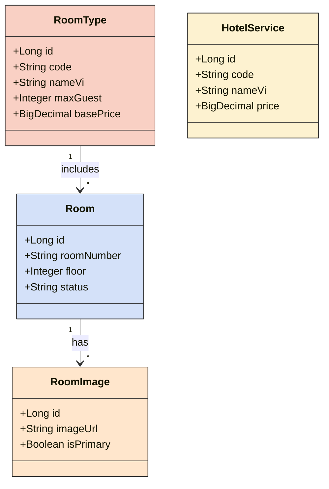

---

## 3. PHÂN HỆ ĐẶT PHÒNG & THANH TOÁN (RESERVATION & INVOICE)

### 3.1. Biểu đồ Use Case

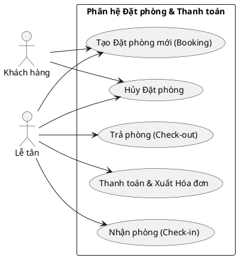

### 3.2. Biểu đồ Tuần tự (Sequence Diagram) - Quy trình Check-in

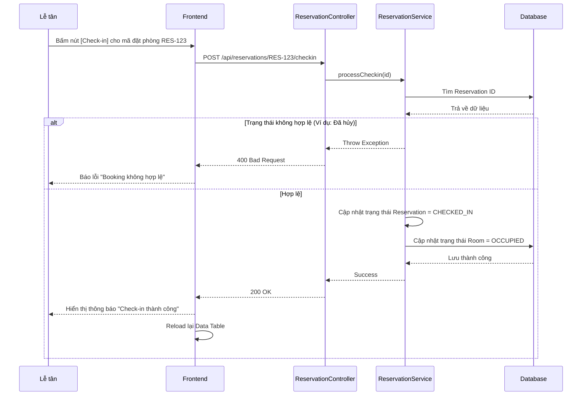

### 3.3. Biểu đồ Tuần tự (Sequence Diagram) - Xử lý Thanh toán & Xuất hóa đơn

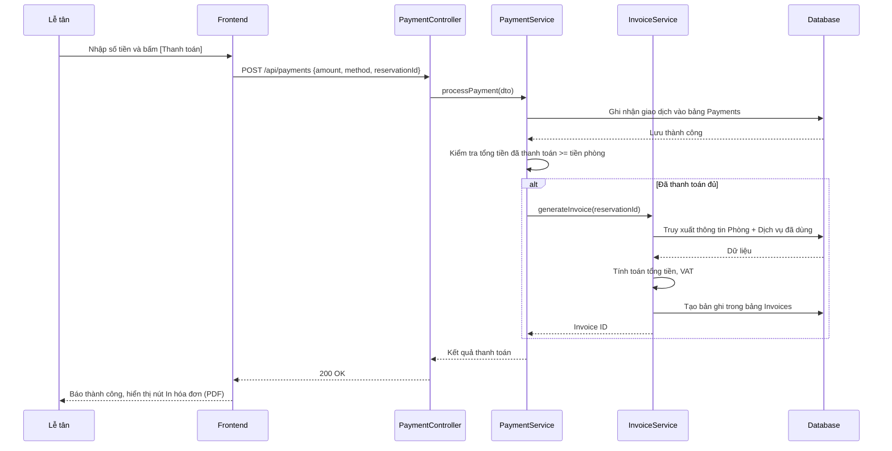

### 3.4. Biểu đồ Lớp (Class Diagram) - Reservation & Payment

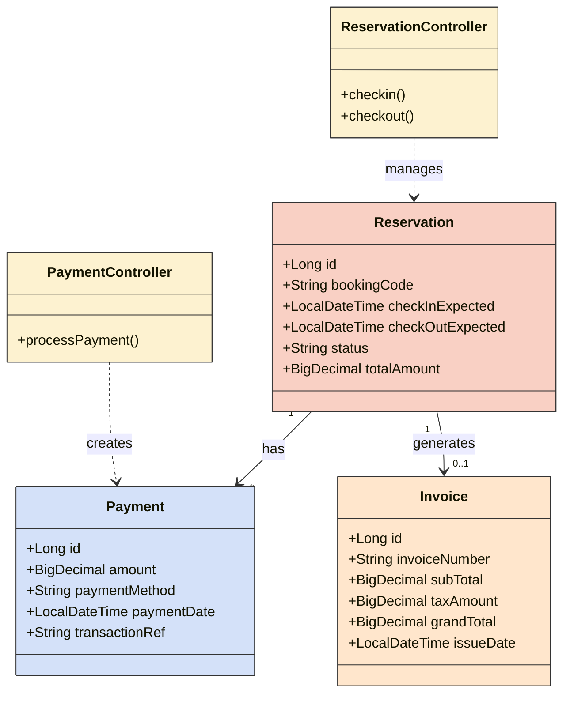
