# HỆ THỐNG BIỂU ĐỒ UML CHI TIẾT

Tài liệu này tập hợp toàn bộ các biểu đồ phân tích và thiết kế hệ thống chi tiết cho từng phân hệ nghiệp vụ, bao gồm: Use Case, Hoạt động (Activity), Tuần tự (Sequence) và Biểu đồ Lớp (Class). Toàn bộ các biểu đồ đều được đổ màu theo chuẩn nhận diện cấu trúc.

---

## 1. PHÂN HỆ QUẢN LÝ ĐA CƠ SỞ VÀ GÓI DỊCH VỤ (MULTI-PROPERTY & SUBSCRIPTION)

### 1.1. Biểu đồ Use Case (Tổng quan)
Mô tả các quyền hạn và chức năng chính của các nhóm người dùng trong nền tảng.

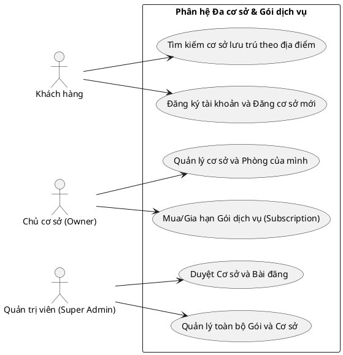

### 1.2. Biểu đồ Hoạt động (Activity Diagram) - Luồng đăng cơ sở và duyệt
Mô tả luồng từ khi người dùng tạo cơ sở đến khi hiển thị công khai.

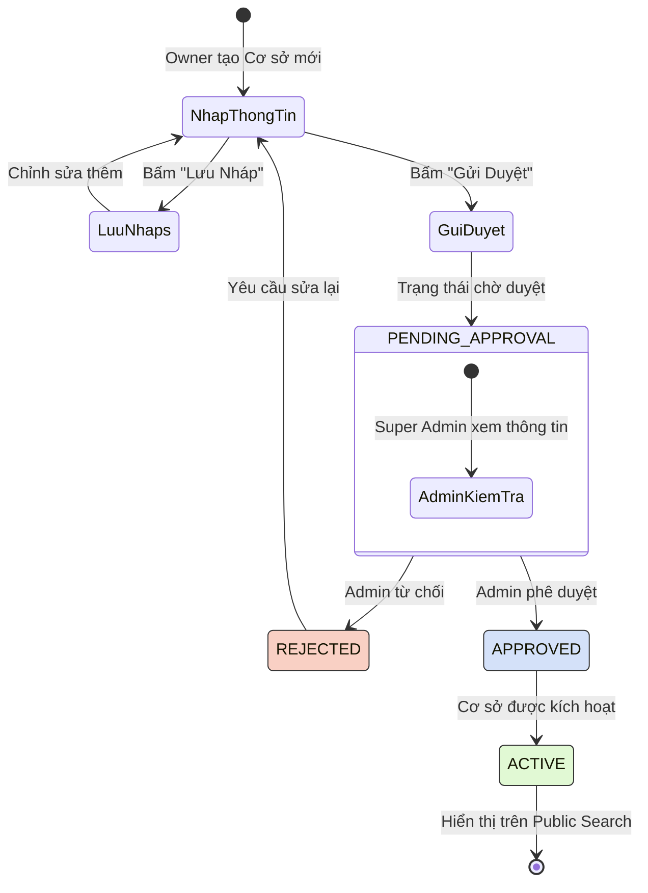

### 1.3. Biểu đồ Hoạt động (Activity Diagram) - Kích hoạt và Hết hạn gói
Mô tả luồng vòng đời của một gói Subscription.

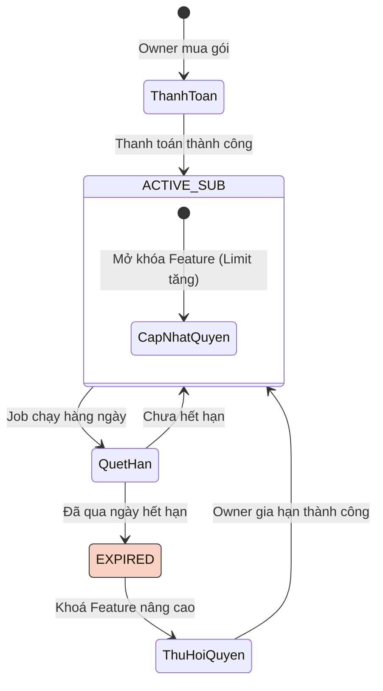

### 1.4. Biểu đồ Tuần tự (Sequence Diagram) - Load User Context (RBAC + Feature)
Mô tả luồng khi người dùng tải lại trang và hệ thống trả về thông tin quyền hạn tổng hợp.

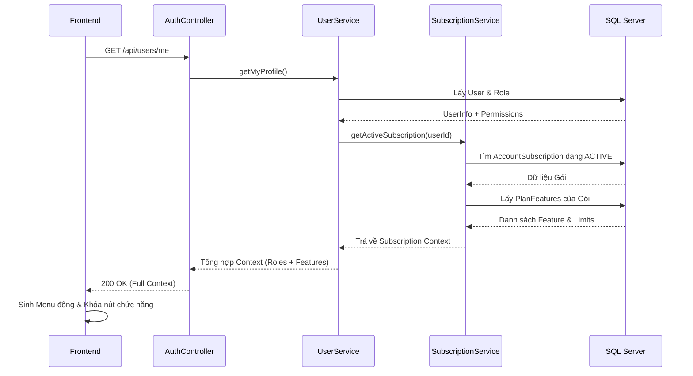

### 1.5. Biểu đồ Tuần tự (Sequence Diagram) - Kiểm tra Feature Authorization
Mô tả cơ chế chặn API nếu vượt quá giới hạn của gói.

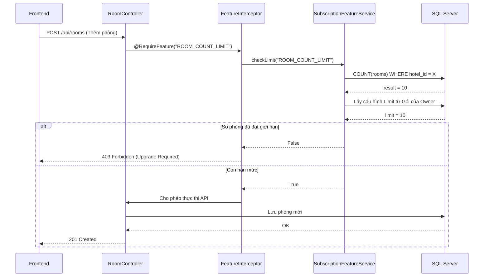

### 1.6. Biểu đồ Lớp (Class Diagram) - Property Management
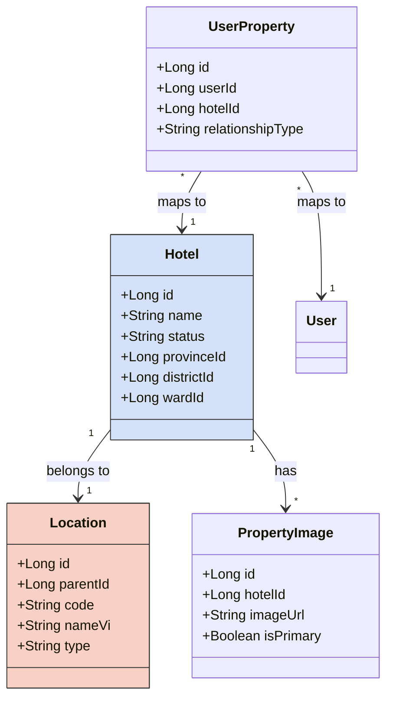

### 1.7. Biểu đồ Lớp (Class Diagram) - Subscription Management
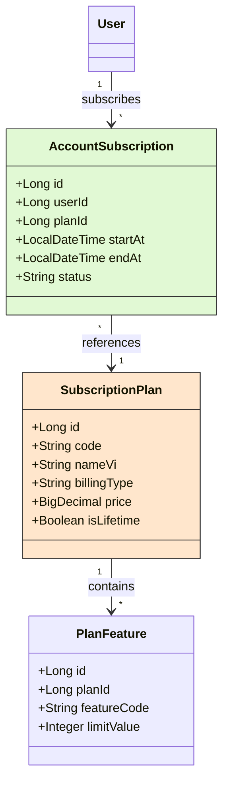

---

## 2. PHÂN HỆ XÁC THỰC VÀ PHÂN QUYỀN (AUTH & RBAC CƠ BẢN)

### 2.1. Biểu đồ Tuần tự (Sequence Diagram) - Luồng xác thực JWT

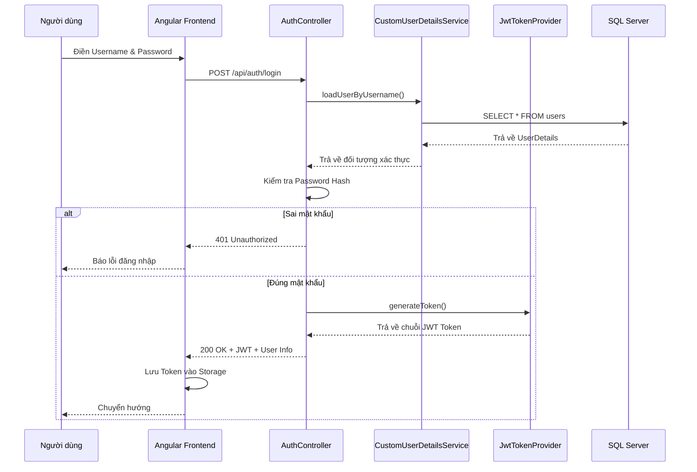

### 2.2. Biểu đồ Lớp (Class Diagram) - Security Phase

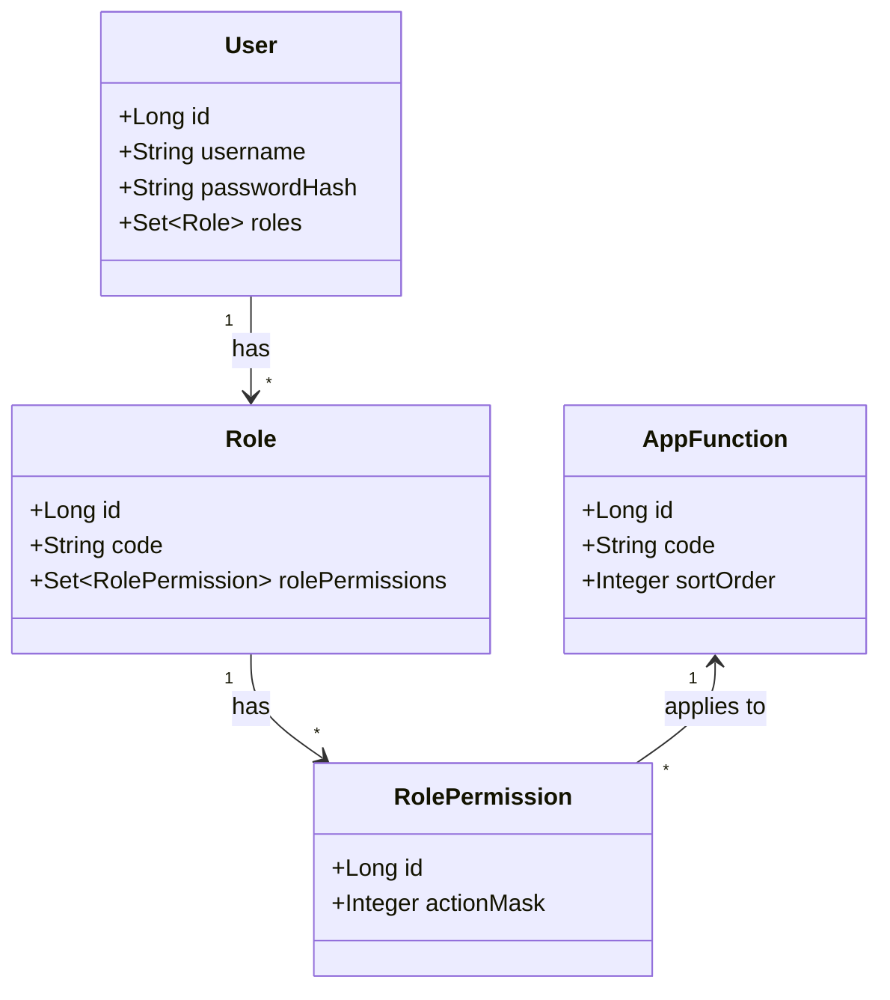

---

## 3. PHÂN HỆ ĐẶT PHÒNG & THANH TOÁN (RESERVATION & INVOICE)

### 3.1. Biểu đồ Tuần tự (Sequence Diagram) - Tìm kiếm phòng trống (Search)

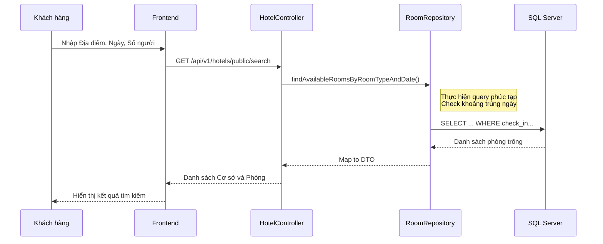

---

## 4. PHÂN HỆ TÌM KIẾM ĐỊA LÝ (GEOLOCATION SEARCH)

### 4.1. Biểu đồ Tuần tự (Sequence Diagram) - Autocomplete & Search theo Tỉnh/Phường

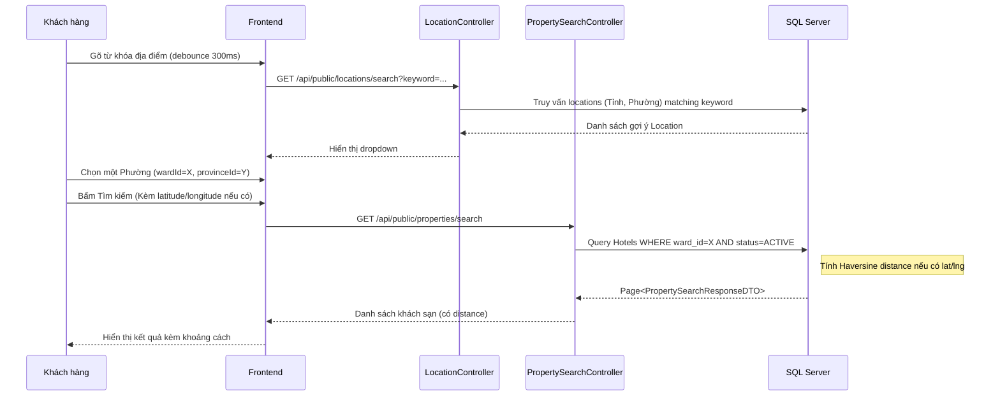

### 4.2. Biểu đồ Tuần tự (Sequence Diagram) - Import Data Tỉnh/Phường

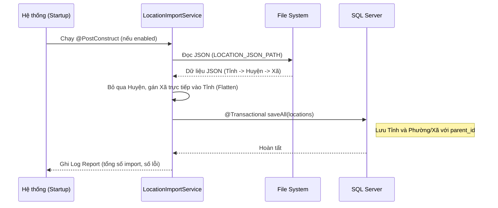

## 6. PHÂN HỆ IMPORT DỮ LIỆU TỰ ĐỘNG & CLAIM CƠ SỞ

### 6.1. Biểu đồ Use Case (Import & Claim)
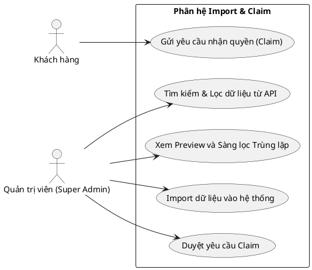

### 6.2. Biểu đồ Tuần tự (Sequence Diagram) - Luồng Deduplicate và Import
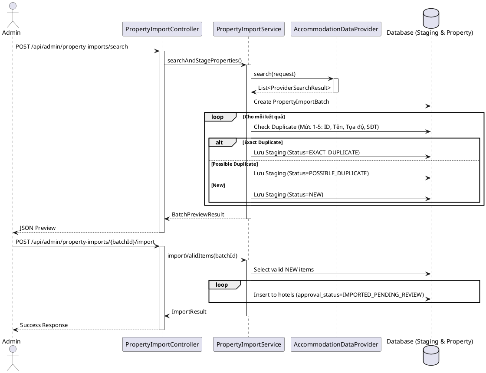

### 6.3. Biểu đồ Hoạt động (Activity Diagram) - Nhận quyền cơ sở
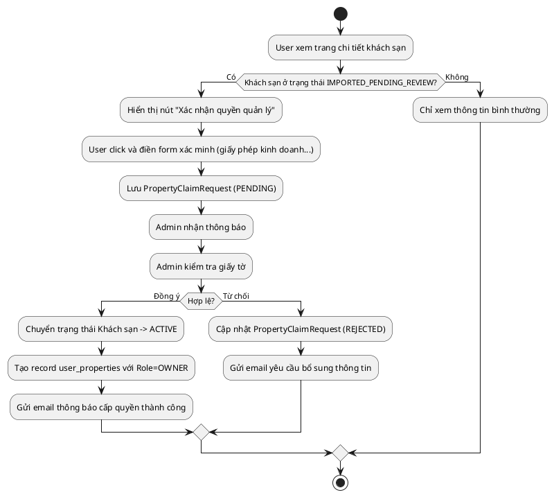
# Bổ sung UML: import, search và booking (2026-07-15)

## Import địa giới UTF-8 idempotent

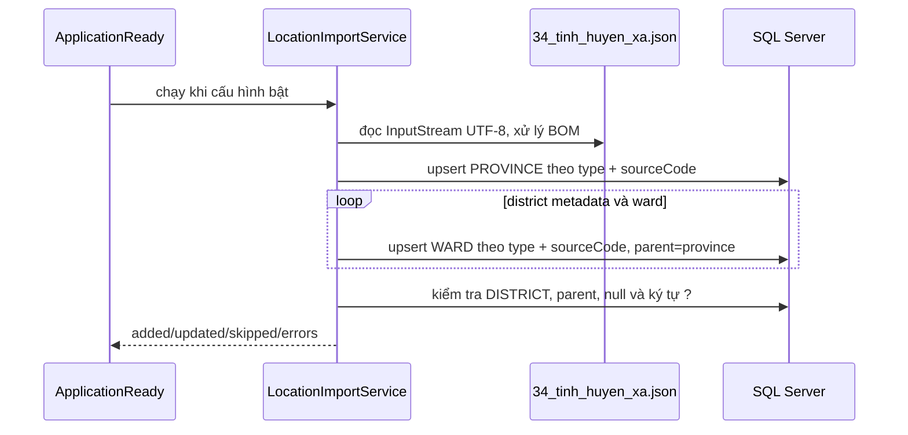

## Search không dấu và tồn phòng

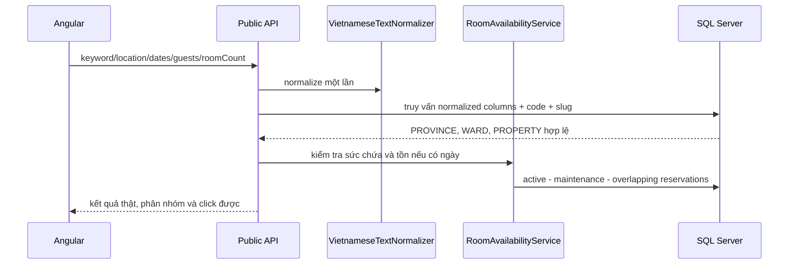

## Booking và gán phòng

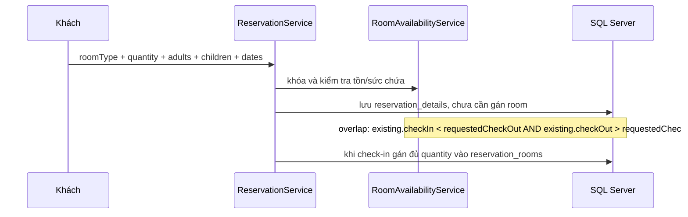

Owner lấy `activeProperty` từ user context phía server và không xem/sửa dữ liệu cơ sở khác. Super Admin được chọn property nhưng vẫn phải qua kiểm tra quyền. API không tin `hotelId` do frontend tự gửi.

# Bổ sung UML: seeder, subscription và vòng đời lưu trú (2026-07-15)

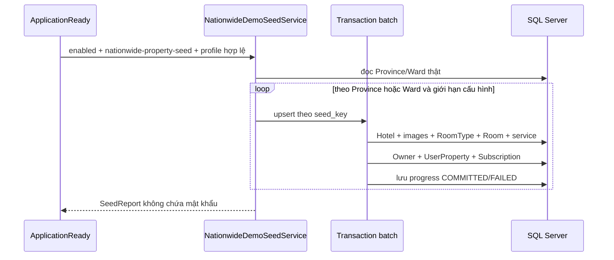

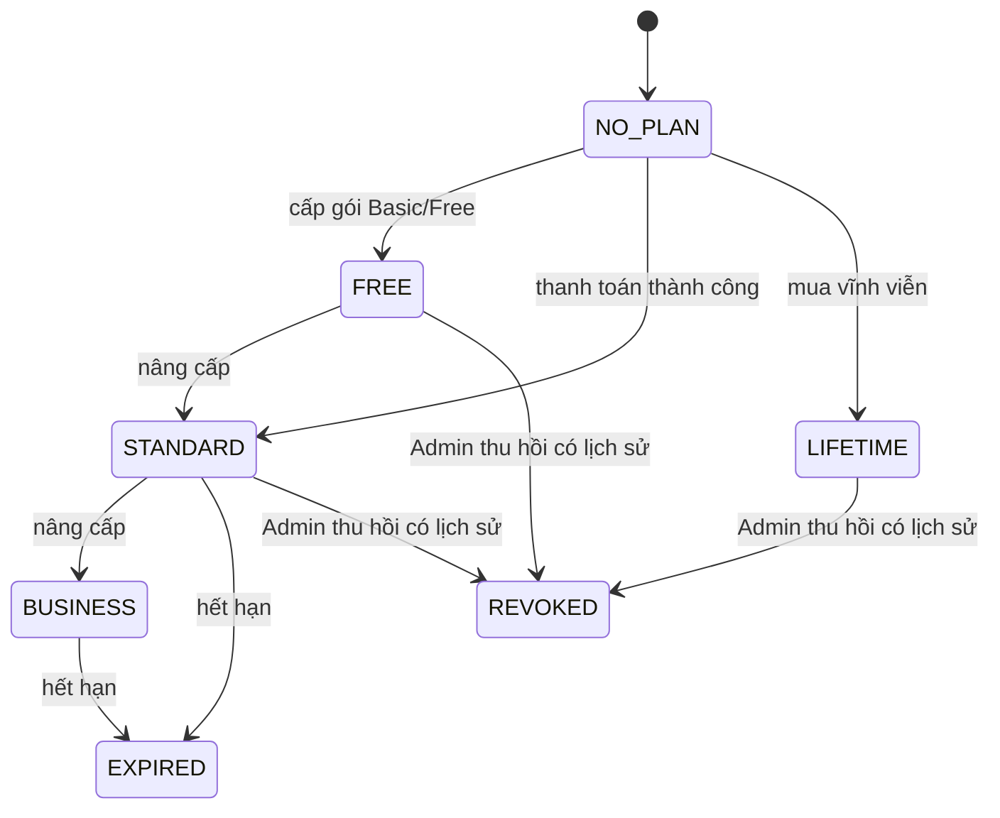

Account status, subscription status và property approval status là ba trạng thái độc lập. Quyền truy cập dữ liệu lấy từ `user_properties`; giới hạn chức năng lấy từ `plan_features`; không nhận `hotelId` frontend nếu hotel không thuộc context đăng nhập.

```mermaid
sequenceDiagram
    participant Staff as Lễ tân
    participant API as Reservation API
    participant Inventory as Availability Service
    participant DB as SQL Server
    Staff->>API: check-in reservation
    API->>Inventory: lấy phòng trống đúng Hotel + RoomType
    Staff->>API: assign đủ quantity
    API->>DB: ReservationRoom + Room=OCCUPIED + Reservation=CHECKED_IN
    Staff->>API: thêm dịch vụ theo giá snapshot
    API->>DB: ReservationService(quantity, unitPrice, amount)
    Staff->>API: check-out và payment
    API->>DB: tạo/cập nhật Invoice
    API->>DB: Reservation=CHECKED_OUT, Room=DIRTY
    API->>DB: tạo HousekeepingTask=PENDING
    Staff->>API: hoàn tất dọn phòng
    API->>DB: Room=AVAILABLE, housekeeping=CLEAN
```
