# UML LuxeStay - baseline bám source

Ngày xác minh: 2026-07-28

Nguồn: `frontend/src/app/app.routes.ts`, controller/service/security/entity backend, migration và kết quả test CURRENT trong `docs/audit/THESIS_TEST_EVIDENCE.md`.

Tài liệu này mô tả contract đang có. Các sơ đồ UML-20 đến UML-24 bổ sung canonical financial contexts của Feature 007; legacy payment/subscription classes remain compatibility projections and are not evidence that the two financial contexts are interchangeable. Các chức năng mixed RoomType, review và favorites vẫn được ghi là `DEFERRED` hoặc `PARTIAL`.

## 1. Use Case Diagram

### 1.1. Use Case tổng quát

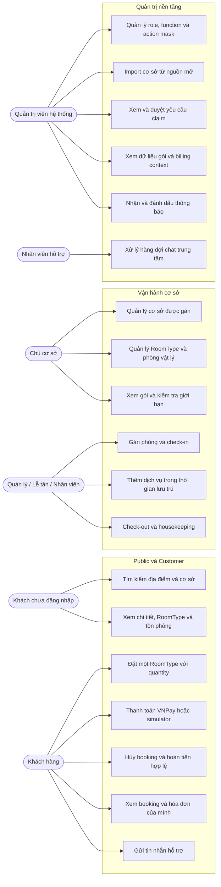
```mermaid
flowchart LR
    Guest([Khách chưa đăng nhập])
    Customer([Khách hàng])
    Owner([Chủ cơ sở])
    Staff([Quản lý / Lễ tân / Nhân viên])
    Admin([Quản trị viên hệ thống])
    Support([Nhân viên hỗ trợ])

    subgraph Public[Public và Customer]
        Search["Tìm kiếm địa điểm và cơ sở"]
        Detail["Xem chi tiết, RoomType và tồn phòng"]
        Book["Đặt một RoomType với quantity"]
        Pay["Thanh toán VNPay hoặc simulator"]
        Cancel["Hủy booking và hoàn tiền hợp lệ"]
        History["Xem booking và hóa đơn của mình"]
        CustomerChat["Gửi tin nhắn hỗ trợ"]
    end

    subgraph Operations[Vận hành cơ sở]
        Property["Quản lý cơ sở được gán"]
        Inventory["Quản lý RoomType và phòng vật lý"]
        Assign["Gán phòng và check-in"]
        StayService["Thêm dịch vụ trong thời gian lưu trú"]
        Checkout["Check-out và housekeeping"]
        FeatureLimit["Xem gói và kiểm tra giới hạn"]
    end

    subgraph Platform[Quản trị nền tảng]
        RBAC["Quản lý role, function và action mask"]
        Import["Import cơ sở từ nguồn mở"]
        Claim["Xem và duyệt yêu cầu claim"]
        Subscription["Xem dữ liệu gói và billing context"]
        SupportQueue["Xử lý hàng đợi chat trung tâm"]
        Notification["Nhận và đánh dấu thông báo"]
    end

    Guest --> Search
    Guest --> Detail
    Customer --> Book
    Customer --> Pay
    Customer --> Cancel
    Customer --> History
    Customer --> CustomerChat
    Owner --> Property
    Owner --> Inventory
    Owner --> FeatureLimit
    Staff --> Assign
    Staff --> StayService
    Staff --> Checkout
    Admin --> RBAC
    Admin --> Import
    Admin --> Claim
    Admin --> Subscription
    Support --> SupportQueue
    Admin --> Notification
```

**Hình UML-01. Use Case tổng quát của LuxeStay.**

- **Mục đích:** xác định ranh giới trách nhiệm giữa public/customer, vận hành cơ sở và quản trị nền tảng.
- **Mô tả:** actor chỉ nối tới chức năng có route/controller hiện diện; quyền thực tế còn phụ thuộc JWT, action mask, property scope và feature limit.
- **Phân tích:** frontend guard hỗ trợ điều hướng nhưng backend là authorization boundary. `CustomerChat`, notification và một số giao diện vận hành vẫn `PARTIAL` vì E2E xác thực đang bị chặn.
- **Kết luận:** không suy diễn route hoặc entity đơn lẻ thành chức năng end-to-end hoàn tất.

### 1.2. Use Case import và claim

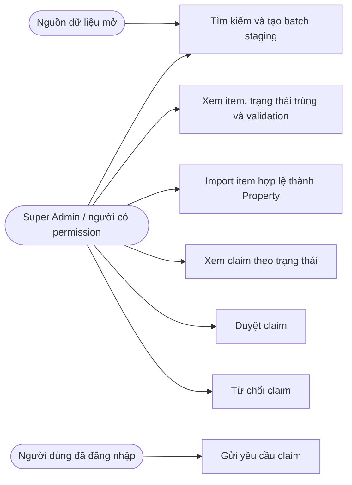
```mermaid
flowchart LR
    Admin([Super Admin / người có permission])
    User([Người dùng đã đăng nhập])
    Provider([Nguồn dữ liệu mở])

    SearchStage["Tìm kiếm và tạo batch staging"]
    ReviewItems["Xem item, trạng thái trùng và validation"]
    ImportItems["Import item hợp lệ thành Property"]
    RequestClaim["Gửi yêu cầu claim"]
    ReviewClaim["Xem claim theo trạng thái"]
    ApproveClaim["Duyệt claim"]
    RejectClaim["Từ chối claim"]

    Provider --> SearchStage
    Admin --> SearchStage
    Admin --> ReviewItems
    Admin --> ImportItems
    User --> RequestClaim
    Admin --> ReviewClaim
    Admin --> ApproveClaim
    Admin --> RejectClaim
```

**Hình UML-02. Use Case import và nhận quyền cơ sở.**

- **Mục đích:** tách quy trình tạo dữ liệu cơ sở khỏi quy trình xác nhận chủ sở hữu.
- **Mô tả:** import dùng permission `PROPERTY_IMPORT_*`; claim dùng `PROPERTY_CLAIM_VIEW/APPROVE` hoặc `SUPER_ADMIN`.
- **Phân tích:** `PropertyClaimController` hiện dùng requester/reviewer ID cố định thay vì principal. Vì vậy use case claim phản ánh ý định contract nhưng trạng thái triển khai là `PARTIAL/BLOCKED`.
- **Kết luận:** không dùng claim làm bằng chứng tenant ownership hoàn chỉnh cho tới khi principal mapping và test được bổ sung.

### 1.3. Use Case chat và notification

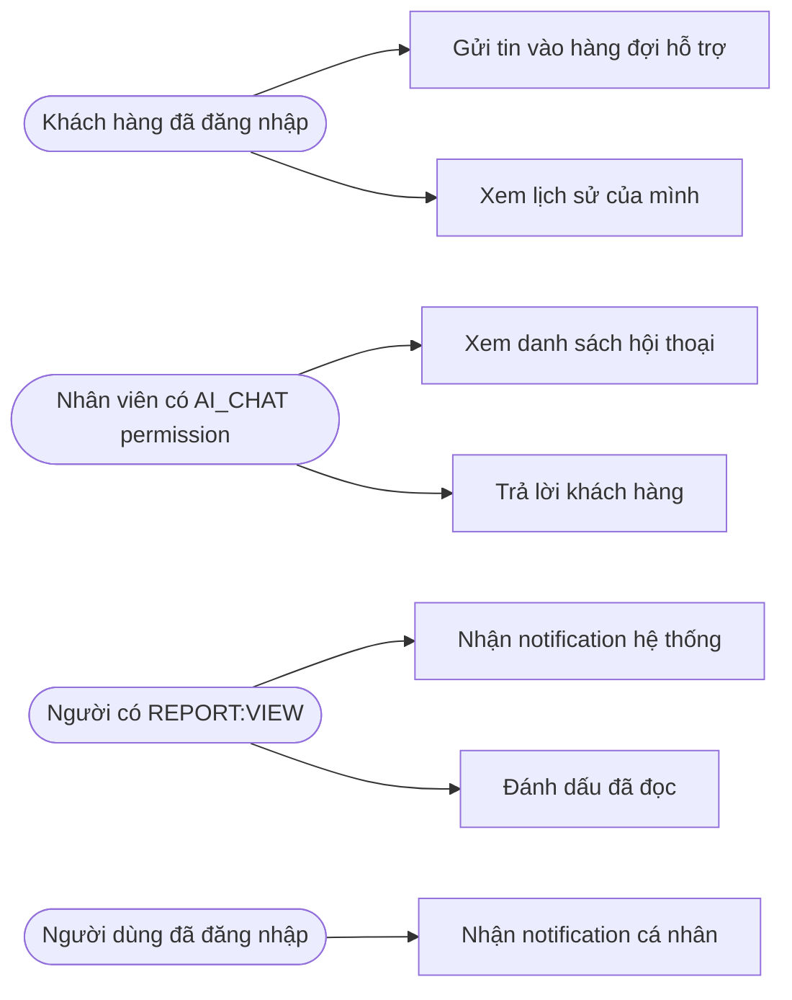
```mermaid
flowchart LR
    Customer([Khách hàng đã đăng nhập])
    Support([Nhân viên có AI_CHAT permission])
    Admin([Người có REPORT:VIEW])
    User([Người dùng đã đăng nhập])

    Send["Gửi tin vào hàng đợi hỗ trợ"]
    OwnHistory["Xem lịch sử của mình"]
    Queue["Xem danh sách hội thoại"]
    Reply["Trả lời khách hàng"]
    PersonalNotification["Nhận notification cá nhân"]
    AdminNotification["Nhận notification hệ thống"]
    MarkRead["Đánh dấu đã đọc"]

    Customer --> Send
    Customer --> OwnHistory
    Support --> Queue
    Support --> Reply
    User --> PersonalNotification
    Admin --> AdminNotification
    Admin --> MarkRead
```

**Hình UML-03. Use Case chat hỗ trợ và notification.**

- **Mục đích:** thể hiện hai WebSocket endpoint tách biệt và quyền subscription tương ứng.
- **Mô tả:** chat dùng `/ws-chat`; notification dùng `/ws`. Cả hai yêu cầu JWT ở STOMP `CONNECT`.
- **Phân tích:** backend controller/service/channel tests đã `CURRENT`; frontend authenticated E2E và delivery stability chưa được xác minh.
- **Kết luận:** hai capability giữ `PARTIAL`, không gọi là hoàn tất chỉ từ backend test.

## 2. Class Diagram

### 2.1. Auth và RBAC

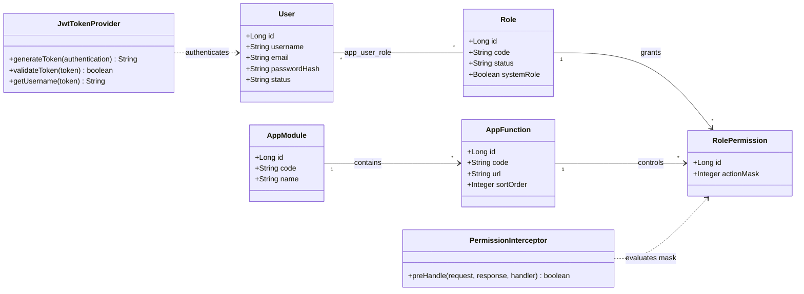
```mermaid
classDiagram
    direction LR
    class User {
        +Long id
        +String username
        +String email
        +String passwordHash
        +String status
    }
    class Role {
        +Long id
        +String code
        +String status
        +Boolean systemRole
    }
    class AppModule {
        +Long id
        +String code
        +String name
    }
    class AppFunction {
        +Long id
        +String code
        +String url
        +Integer sortOrder
    }
    class RolePermission {
        +Long id
        +Integer actionMask
    }
    class JwtTokenProvider {
        +generateToken(authentication) String
        +validateToken(token) boolean
        +getUsername(token) String
    }
    class PermissionInterceptor {
        +preHandle(request, response, handler) boolean
    }

    User "*" -- "*" Role : app_user_role
    AppModule "1" --> "*" AppFunction : contains
    Role "1" --> "*" RolePermission : grants
    AppFunction "1" --> "*" RolePermission : controls
    JwtTokenProvider ..> User : authenticates
    PermissionInterceptor ..> RolePermission : evaluates mask
```

**Hình UML-04. Class Diagram auth và RBAC.**

- **Mục đích:** mô tả cách danh tính, role, function và action mask phối hợp.
- **Mô tả:** quan hệ user-role là nhiều-nhiều; quyền chi tiết nằm ở `RolePermission.actionMask`.
- **Phân tích:** JWT xác định principal, còn `PermissionInterceptor` và annotation tại endpoint quyết định thao tác được phép.
- **Kết luận:** menu/guard frontend không thay thế kiểm tra quyền backend.

### 2.2. Property và inventory

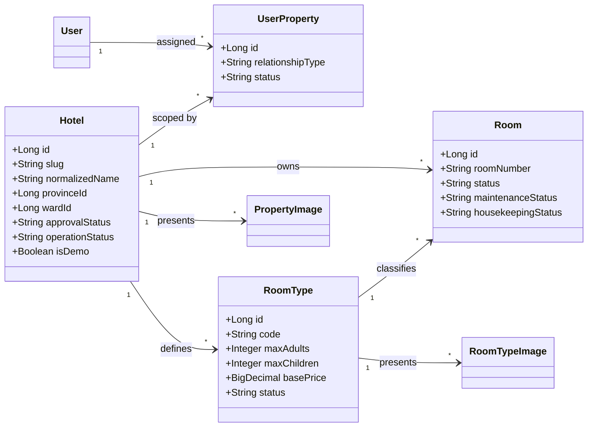
```mermaid
classDiagram
    direction LR
    class Hotel {
        +Long id
        +String slug
        +String normalizedName
        +Long provinceId
        +Long wardId
        +String approvalStatus
        +String operationStatus
        +Boolean isDemo
    }
    class UserProperty {
        +Long id
        +String relationshipType
        +String status
    }
    class RoomType {
        +Long id
        +String code
        +Integer maxAdults
        +Integer maxChildren
        +BigDecimal basePrice
        +String status
    }
    class Room {
        +Long id
        +String roomNumber
        +String status
        +String maintenanceStatus
        +String housekeepingStatus
    }
    class PropertyImage
    class RoomTypeImage
    User "1" --> "*" UserProperty : assigned
    Hotel "1" --> "*" UserProperty : scoped by
    Hotel "1" --> "*" RoomType : defines
    Hotel "1" --> "*" Room : owns
    RoomType "1" --> "*" Room : classifies
    Hotel "1" --> "*" PropertyImage : presents
    RoomType "1" --> "*" RoomTypeImage : presents
```

**Hình UML-05. Class Diagram property và inventory.**

- **Mục đích:** thể hiện multi-property, loại phòng và phòng vật lý.
- **Mô tả:** `UserProperty` là mapping phạm vi; `Room` chứa đồng thời trạng thái bán, bảo trì và housekeeping.
- **Phân tích:** `Hotel.provinceId/wardId` là cột ID hiện hành, không phải JPA relation trực tiếp tới `Location`; sơ đồ thể hiện liên kết nghiệp vụ, không giả vờ có annotation quan hệ.
- **Kết luận:** mọi mutation inventory phải kiểm tra property scope và giới hạn gói ở backend.

### 2.3. Reservation, payment và stay operations

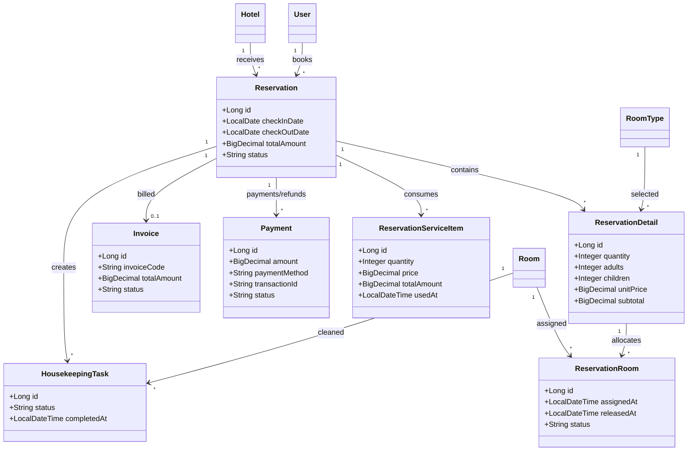
```mermaid
classDiagram
    class Reservation {
        +Long id
        +LocalDate checkInDate
        +LocalDate checkOutDate
        +BigDecimal totalAmount
        +String status
    }
    class ReservationDetail {
        +Long id
        +Integer quantity
        +Integer adults
        +Integer children
        +BigDecimal unitPrice
        +BigDecimal subtotal
    }
    class ReservationRoom {
        +Long id
        +LocalDateTime assignedAt
        +LocalDateTime releasedAt
        +String status
    }
    class ReservationServiceItem {
        +Long id
        +Integer quantity
        +BigDecimal price
        +BigDecimal totalAmount
        +LocalDateTime usedAt
    }
    class Payment {
        +Long id
        +BigDecimal amount
        +String paymentMethod
        +String transactionId
        +String status
    }
    class Invoice {
        +Long id
        +String invoiceCode
        +BigDecimal totalAmount
        +String status
    }
    class HousekeepingTask {
        +Long id
        +String status
        +LocalDateTime completedAt
    }

    User "1" --> "*" Reservation : books
    Hotel "1" --> "*" Reservation : receives
    Reservation "1" --> "*" ReservationDetail : contains
    RoomType "1" --> "*" ReservationDetail : selected
    ReservationDetail "1" --> "*" ReservationRoom : allocates
    Room "1" --> "*" ReservationRoom : assigned
    Reservation "1" --> "*" ReservationServiceItem : consumes
    Reservation "1" --> "*" Payment : payments/refunds
    Reservation "1" --> "0..1" Invoice : billed
    Reservation "1" --> "*" HousekeepingTask : creates
    Room "1" --> "*" HousekeepingTask : cleaned
```

**Hình UML-06. Class Diagram reservation, payment và lưu trú.**

- **Mục đích:** phân biệt đặt theo RoomType với gán phòng vật lý khi vận hành.
- **Mô tả:** `ReservationDetail` giữ quantity/price; `ReservationRoom` giữ phòng được cấp; payment refund là bản ghi âm riêng.
- **Phân tích:** schema có thể chứa nhiều detail nhưng request/UI hiện chỉ tạo một RoomType với quantity; mixed RoomType vẫn `DEFERRED`.
- **Kết luận:** không dùng khả năng biểu diễn của schema để tuyên bố contract nghiệp vụ chưa có.

### 2.4. Subscription, import, claim, chat và notification

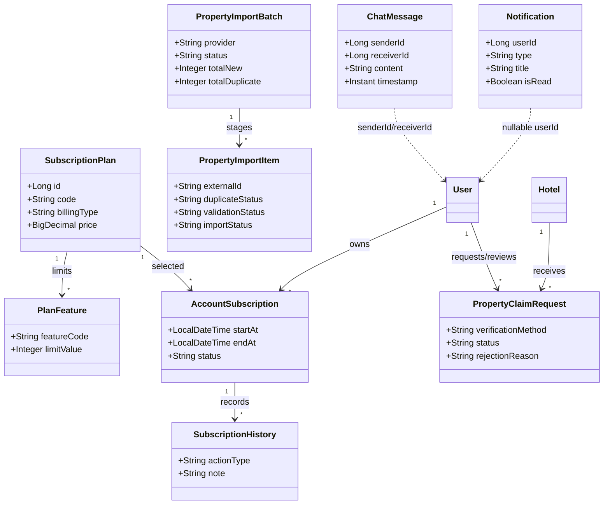
```mermaid
classDiagram
    class SubscriptionPlan {
        +Long id
        +String code
        +String billingType
        +BigDecimal price
    }
    class PlanFeature {
        +String featureCode
        +Integer limitValue
    }
    class AccountSubscription {
        +LocalDateTime startAt
        +LocalDateTime endAt
        +String status
    }
    class SubscriptionHistory {
        +String actionType
        +String note
    }
    class PropertyImportBatch {
        +String provider
        +String status
        +Integer totalNew
        +Integer totalDuplicate
    }
    class PropertyImportItem {
        +String externalId
        +String duplicateStatus
        +String validationStatus
        +String importStatus
    }
    class PropertyClaimRequest {
        +String verificationMethod
        +String status
        +String rejectionReason
    }
    class ChatMessage {
        +Long senderId
        +Long receiverId
        +String content
        +Instant timestamp
    }
    class Notification {
        +Long userId
        +String type
        +String title
        +Boolean isRead
    }

    SubscriptionPlan "1" --> "*" PlanFeature : limits
    User "1" --> "*" AccountSubscription : owns
    SubscriptionPlan "1" --> "*" AccountSubscription : selected
    AccountSubscription "1" --> "*" SubscriptionHistory : records
    PropertyImportBatch "1" --> "*" PropertyImportItem : stages
    Hotel "1" --> "*" PropertyClaimRequest : receives
    User "1" --> "*" PropertyClaimRequest : requests/reviews
    ChatMessage ..> User : senderId/receiverId
    Notification ..> User : nullable userId
```

**Hình UML-07. Class Diagram các capability nền tảng mở rộng.**

- **Mục đích:** ghi nhận entity hiện hữu nhưng phân biệt rõ entity với REST lifecycle.
- **Mô tả:** subscription history có trong dữ liệu; import dùng batch/item staging; chat và notification lưu ID người dùng dạng scalar.
- **Phân tích:** `SubscriptionController` chỉ có ba endpoint đọc. Claim controller chưa lấy requester/reviewer từ principal. Hai giới hạn này được giữ trong báo cáo.
- **Kết luận:** entity presence là evidence cấu trúc, không phải evidence hoàn tất chức năng.

## 3. Sequence Diagram

### 3.1. Đăng nhập JWT và gọi API được bảo vệ

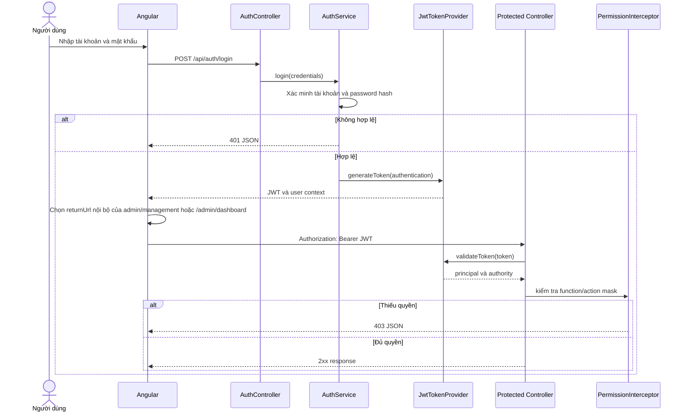
```mermaid
sequenceDiagram
    actor User as Người dùng
    participant UI as Angular
    participant Auth as AuthController
    participant Service as AuthService
    participant JWT as JwtTokenProvider
    participant API as Protected Controller
    participant Permission as PermissionInterceptor

    User->>UI: Nhập tài khoản và mật khẩu
    UI->>Auth: POST /api/auth/login
    Auth->>Service: login(credentials)
    Service->>Service: Xác minh tài khoản và password hash
    alt Không hợp lệ
        Service-->>UI: 401 JSON
    else Hợp lệ
        Service->>JWT: generateToken(authentication)
        JWT-->>UI: JWT và user context
        UI->>UI: Chọn returnUrl nội bộ của admin/management hoặc /admin/dashboard
        UI->>API: Authorization: Bearer JWT
        API->>JWT: validateToken(token)
        JWT-->>API: principal và authority
        API->>Permission: kiểm tra function/action mask
        alt Thiếu quyền
            Permission-->>UI: 403 JSON
        else Đủ quyền
            API-->>UI: 2xx response
        end
    end
```

**Hình UML-08. Sequence đăng nhập và authorization.**

- **Mục đích:** mô tả sự khác nhau giữa authentication và authorization.
- **Mô tả:** token hợp lệ tạo principal; đăng nhập từ `/admin/login` ưu tiên `returnUrl` nội bộ thuộc `/admin` hoặc `/management`, nếu không có thì chuyển tới `/admin/dashboard`; annotation/interceptor tiếp tục kiểm tra quyền nghiệp vụ.
- **Phân tích:** lỗi auth/authz dùng JSON 401/403; route guard không tham gia quyết định cuối cùng.
- **Kết luận:** một endpoint an toàn phải có cả token validation và kiểm tra quyền/phạm vi phù hợp.

### 3.2. Tìm kiếm và kiểm tra availability

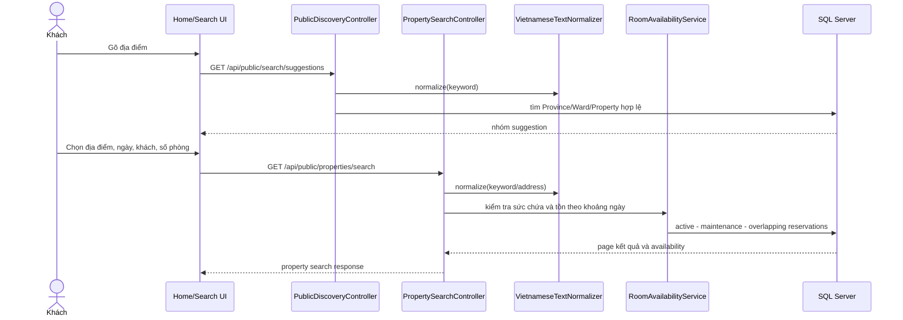
```mermaid
sequenceDiagram
    actor Guest as Khách
    participant UI as Home/Search UI
    participant Discovery as PublicDiscoveryController
    participant Search as PropertySearchController
    participant Normalize as VietnameseTextNormalizer
    participant Inventory as RoomAvailabilityService
    participant DB as SQL Server

    Guest->>UI: Gõ địa điểm
    UI->>Discovery: GET /api/public/search/suggestions
    Discovery->>Normalize: normalize(keyword)
    Discovery->>DB: tìm Province/Ward/Property hợp lệ
    DB-->>UI: nhóm suggestion
    Guest->>UI: Chọn địa điểm, ngày, khách, số phòng
    UI->>Search: GET /api/public/properties/search
    Search->>Normalize: normalize(keyword/address)
    Search->>Inventory: kiểm tra sức chứa và tồn theo khoảng ngày
    Inventory->>DB: active - maintenance - overlapping reservations
    DB-->>Search: page kết quả và availability
    Search-->>UI: property search response
```

**Hình UML-09. Sequence tìm kiếm và availability.**

- **Mục đích:** giải thích nguồn dữ liệu thật của autocomplete và tồn phòng.
- **Mô tả:** chuỗi tiếng Việt được chuẩn hóa; availability chỉ áp dụng khi có ngày/sức chứa.
- **Phân tích:** Playwright hiện có artifact lỗi dữ liệu/gợi ý Home Search nên frontend E2E vẫn `BLOCKED` dù backend integration test pass.
- **Kết luận:** báo cáo tách backend correctness khỏi tính ổn định của luồng trình duyệt.

### 3.3. Đặt phòng và thanh toán

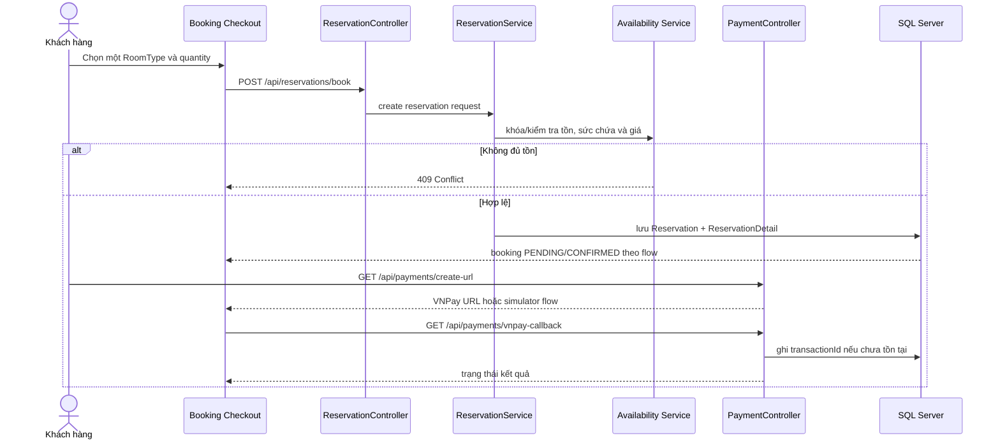
```mermaid
sequenceDiagram
    actor Customer as Khách hàng
    participant UI as Booking Checkout
    participant Reservation as ReservationController
    participant Service as ReservationService
    participant Inventory as Availability Service
    participant Payment as PaymentController
    participant DB as SQL Server

    Customer->>UI: Chọn một RoomType và quantity
    UI->>Reservation: POST /api/reservations/book
    Reservation->>Service: create reservation request
    Service->>Inventory: khóa/kiểm tra tồn, sức chứa và giá
    alt Không đủ tồn
        Inventory-->>UI: 409 Conflict
    else Hợp lệ
        Service->>DB: lưu Reservation + ReservationDetail
        DB-->>UI: booking PENDING/CONFIRMED theo flow
        Customer->>Payment: GET /api/payments/create-url
        Payment-->>UI: VNPay URL hoặc simulator flow
        UI->>Payment: GET /api/payments/vnpay-callback
        Payment->>DB: ghi transactionId nếu chưa tồn tại
        Payment-->>UI: trạng thái kết quả
    end
```

**Hình UML-10. Sequence booking và payment.**

- **Mục đích:** chỉ ra biên giao dịch nơi backend phải kiểm tra lại dữ liệu từ UI.
- **Mô tả:** request hiện đại diện một RoomType với quantity; callback dùng transaction ID chống trùng.
- **Phân tích:** payment simulator là công cụ test, không thay thế xác minh cổng thanh toán production.
- **Kết luận:** booking/payment giữ `PARTIAL` cho tới khi E2E callback ổn định.

### 3.4. Hủy booking và hoàn tiền idempotent

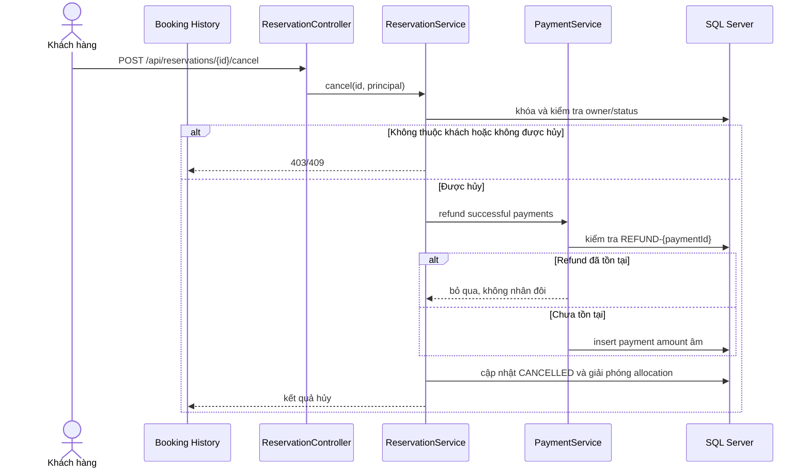
```mermaid
sequenceDiagram
    actor Customer as Khách hàng
    participant UI as Booking History
    participant Controller as ReservationController
    participant Reservation as ReservationService
    participant Payment as PaymentService
    participant DB as SQL Server

    Customer->>Controller: POST /api/reservations/{id}/cancel
    Controller->>Reservation: cancel(id, principal)
    Reservation->>DB: khóa và kiểm tra owner/status
    alt Không thuộc khách hoặc không được hủy
        Reservation-->>UI: 403/409
    else Được hủy
        Reservation->>Payment: refund successful payments
        Payment->>DB: kiểm tra REFUND-{paymentId}
        alt Refund đã tồn tại
            Payment-->>Reservation: bỏ qua, không nhân đôi
        else Chưa tồn tại
            Payment->>DB: insert payment amount âm
        end
        Reservation->>DB: cập nhật CANCELLED và giải phóng allocation
        Reservation-->>UI: kết quả hủy
    end
```

**Hình UML-11. Sequence hủy và hoàn tiền.**

- **Mục đích:** thể hiện ownership check và idempotency của refund.
- **Mô tả:** giao dịch hoàn tiền là bản ghi âm, không sửa payment gốc.
- **Phân tích:** unique transaction ID và kiểm tra service phối hợp ngăn callback/retry tạo giao dịch trùng.
- **Kết luận:** lịch sử tài chính được bảo toàn; E2E phía trình duyệt vẫn cần chạy lại.

### 3.5. Gán phòng, check-in, dịch vụ, check-out và housekeeping

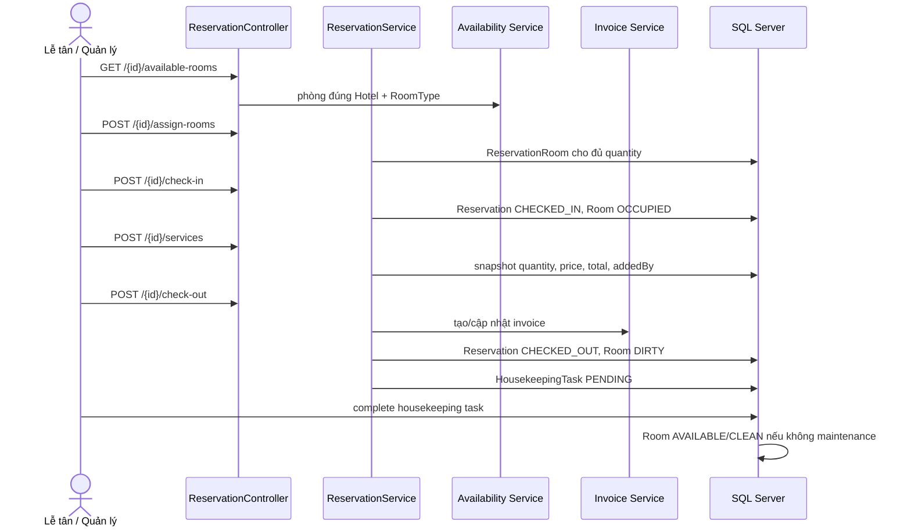
```mermaid
sequenceDiagram
    actor Staff as Lễ tân / Quản lý
    participant API as ReservationController
    participant Service as ReservationService
    participant Inventory as Availability Service
    participant Invoice as Invoice Service
    participant DB as SQL Server

    Staff->>API: GET /{id}/available-rooms
    API->>Inventory: phòng đúng Hotel + RoomType
    Staff->>API: POST /{id}/assign-rooms
    Service->>DB: ReservationRoom cho đủ quantity
    Staff->>API: POST /{id}/check-in
    Service->>DB: Reservation CHECKED_IN, Room OCCUPIED
    Staff->>API: POST /{id}/services
    Service->>DB: snapshot quantity, price, total, addedBy
    Staff->>API: POST /{id}/check-out
    Service->>Invoice: tạo/cập nhật invoice
    Service->>DB: Reservation CHECKED_OUT, Room DIRTY
    Service->>DB: HousekeepingTask PENDING
    Staff->>DB: complete housekeeping task
    DB->>DB: Room AVAILABLE/CLEAN nếu không maintenance
```

**Hình UML-12. Sequence vận hành lưu trú.**

- **Mục đích:** mô tả sự chuyển tiếp từ booking tới phòng vật lý và housekeeping.
- **Mô tả:** check-in yêu cầu đã gán đủ phòng; dịch vụ là thao tác nhân viên trong thời gian lưu trú.
- **Phân tích:** customer add-on tại checkout không có trong sequence vì chưa có contract.
- **Kết luận:** không đồng nhất `ReservationServiceItem` với chức năng khách tự mua dịch vụ.

### 3.6. Import và claim

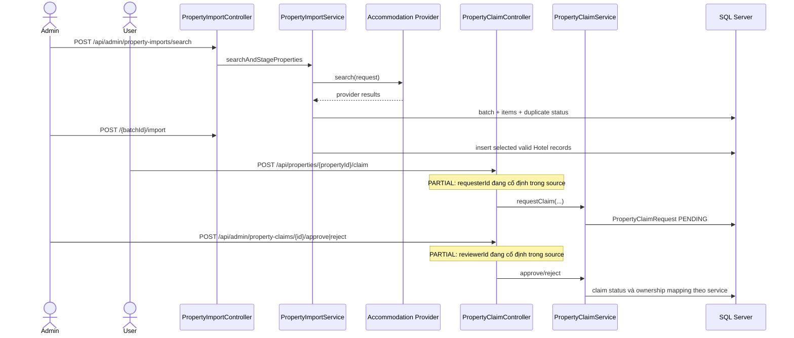
```mermaid
sequenceDiagram
    actor Admin
    actor User
    participant ImportController as PropertyImportController
    participant ImportService as PropertyImportService
    participant Provider as Accommodation Provider
    participant ClaimController as PropertyClaimController
    participant ClaimService as PropertyClaimService
    participant DB as SQL Server

    Admin->>ImportController: POST /api/admin/property-imports/search
    ImportController->>ImportService: searchAndStageProperties
    ImportService->>Provider: search(request)
    Provider-->>ImportService: provider results
    ImportService->>DB: batch + items + duplicate status
    Admin->>ImportController: POST /{batchId}/import
    ImportService->>DB: insert selected valid Hotel records
    User->>ClaimController: POST /api/properties/{propertyId}/claim
    Note over ClaimController: PARTIAL: requesterId đang cố định trong source
    ClaimController->>ClaimService: requestClaim(...)
    ClaimService->>DB: PropertyClaimRequest PENDING
    Admin->>ClaimController: POST /api/admin/property-claims/{id}/approve|reject
    Note over ClaimController: PARTIAL: reviewerId đang cố định trong source
    ClaimController->>ClaimService: approve/reject
    ClaimService->>DB: claim status và ownership mapping theo service
```

**Hình UML-13. Sequence import và claim.**

- **Mục đích:** phản ánh chính xác cả luồng hiện có lẫn điểm chặn bảo mật.
- **Mô tả:** import staging có permission rõ; claim đã có API/entity/service.
- **Phân tích:** ID cố định làm sai audit identity và có thể gán claim cho user khác, do đó không xếp COMPLETE.
- **Kết luận:** cần lấy requester/reviewer từ authenticated principal và bổ sung integration test trước bản nộp cuối.

### 3.7. Central support chat

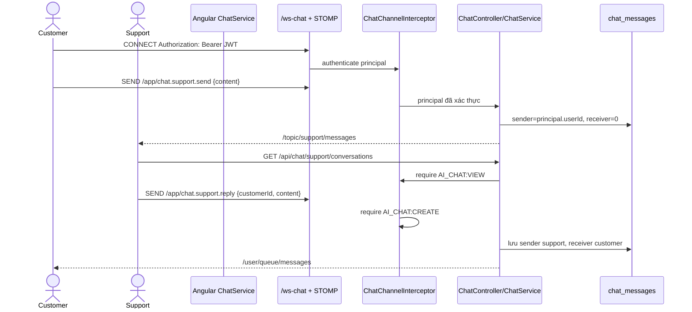
```mermaid
sequenceDiagram
    actor Customer
    actor Support
    participant Client as Angular ChatService
    participant WS as /ws-chat + STOMP
    participant Security as ChatChannelInterceptor
    participant Chat as ChatController/ChatService
    participant DB as chat_messages

    Customer->>WS: CONNECT Authorization: Bearer JWT
    WS->>Security: authenticate principal
    Customer->>WS: SEND /app/chat.support.send {content}
    Security->>Chat: principal đã xác thực
    Chat->>DB: sender=principal.userId, receiver=0
    Chat-->>Support: /topic/support/messages
    Support->>Chat: GET /api/chat/support/conversations
    Chat->>Security: require AI_CHAT:VIEW
    Support->>WS: SEND /app/chat.support.reply {customerId, content}
    Security->>Security: require AI_CHAT:CREATE
    Chat->>DB: lưu sender support, receiver customer
    Chat-->>Customer: /user/queue/messages
```

**Hình UML-14. Sequence chat hỗ trợ trung tâm.**

- **Mục đích:** chứng minh sender không được tin từ payload frontend.
- **Mô tả:** customer message dùng receiver `0` cho hàng đợi trung tâm; reply gửi theo user destination.
- **Phân tích:** mô hình chưa gắn conversation với property/reservation; đây là phạm vi thiết kế có chủ ý.
- **Kết luận:** chat backend đã có verification CURRENT nhưng capability tổng thể vẫn PARTIAL do E2E.

### 3.8. Notification cá nhân và hệ thống

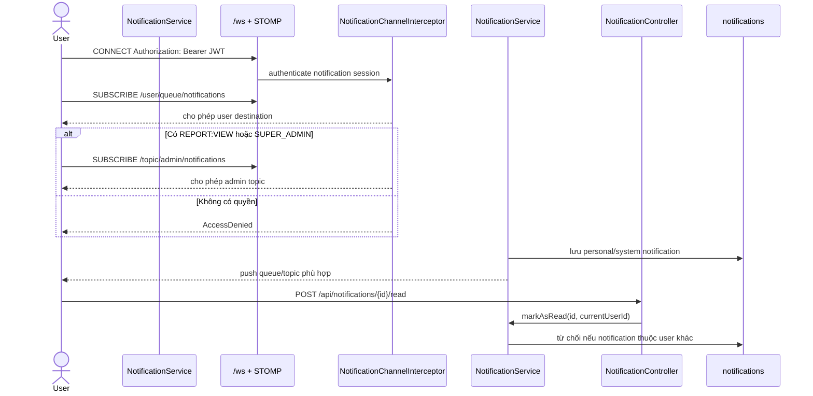
```mermaid
sequenceDiagram
    actor User
    participant Client as NotificationService
    participant WS as /ws + STOMP
    participant Security as NotificationChannelInterceptor
    participant Service as NotificationService
    participant API as NotificationController
    participant DB as notifications

    User->>WS: CONNECT Authorization: Bearer JWT
    WS->>Security: authenticate notification session
    User->>WS: SUBSCRIBE /user/queue/notifications
    Security-->>User: cho phép user destination
    alt Có REPORT:VIEW hoặc SUPER_ADMIN
        User->>WS: SUBSCRIBE /topic/admin/notifications
        Security-->>User: cho phép admin topic
    else Không có quyền
        Security-->>User: AccessDenied
    end
    Service->>DB: lưu personal/system notification
    Service-->>User: push queue/topic phù hợp
    User->>API: POST /api/notifications/{id}/read
    API->>Service: markAsRead(id, currentUserId)
    Service->>DB: từ chối nếu notification thuộc user khác
```

**Hình UML-15. Sequence notification.**

- **Mục đích:** mô tả authorization theo destination và ownership khi đánh dấu đã đọc.
- **Mô tả:** client không được publish message; personal queue mở cho principal, admin topic cần `REPORT:VIEW`.
- **Phân tích:** notification hệ thống có `userId=null`; endpoint REST hiện yêu cầu permission REPORT:VIEW nên phạm vi người dùng cần tiếp tục đối chiếu UI.
- **Kết luận:** backend tests pass; delivery/E2E vẫn là bằng chứng còn thiếu.

## 4. Activity Diagram (flowchart nghiệp vụ)

Trong khóa luận này, **Activity Diagram được dùng thay cho flowchart riêng** vì nó thể hiện đầy đủ trình tự xử lý, điều kiện rẽ nhánh, trạng thái lỗi và trách nhiệm nghiệp vụ. Không vẽ lại cùng một luồng dưới hai tên khác nhau. Bốn flow nghiệp vụ cần đưa vào bản DOCX là:

| Mã flow | Chức năng | Sơ đồ dùng trong báo cáo |
| --- | --- | --- |
| FLOW-01 | Tìm kiếm, kiểm tra phòng và đặt phòng | UML-16 |
| FLOW-02 | Hủy booking và hoàn tiền | UML-17 |
| FLOW-03 | Gán phòng, check-in, dịch vụ, check-out và housekeeping | UML-18 |
| FLOW-04 | Import, deduplicate và claim cơ sở | UML-19 |

Các thao tác CRUD nhỏ như thêm/sửa/xóa RoomType, phòng, dịch vụ, Role hoặc User được mô tả trong Use Case/Class/Sequence và bảng chức năng; không cần tạo flowchart riêng nếu không có quy trình rẽ nhánh đặc biệt.

### 4.1. Activity đặt phòng

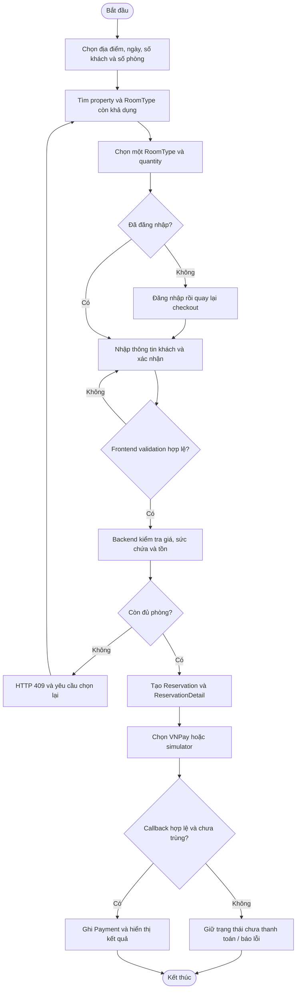
```mermaid
flowchart TD
    A([Bắt đầu]) --> B[Chọn địa điểm, ngày, số khách và số phòng]
    B --> C[Tìm property và RoomType còn khả dụng]
    C --> D[Chọn một RoomType và quantity]
    D --> E{Đã đăng nhập?}
    E -- Không --> F[Đăng nhập rồi quay lại checkout]
    F --> G
    E -- Có --> G[Nhập thông tin khách và xác nhận]
    G --> H{Frontend validation hợp lệ?}
    H -- Không --> G
    H -- Có --> I[Backend kiểm tra giá, sức chứa và tồn]
    I --> J{Còn đủ phòng?}
    J -- Không --> K[HTTP 409 và yêu cầu chọn lại]
    K --> C
    J -- Có --> L[Tạo Reservation và ReservationDetail]
    L --> M[Chọn VNPay hoặc simulator]
    M --> N{Callback hợp lệ và chưa trùng?}
    N -- Không --> O[Giữ trạng thái chưa thanh toán / báo lỗi]
    N -- Có --> P[Ghi Payment và hiển thị kết quả]
    O --> Q([Kết thúc])
    P --> Q
```

**Hình UML-16. Activity đặt phòng.**

- **Mục đích:** thể hiện validation hai lớp và nhánh cạnh tranh tồn phòng.
- **Mô tả:** frontend phản hồi sớm; backend kiểm tra lại ở transaction boundary.
- **Phân tích:** mixed RoomType không nằm trong activity hiện hành.
- **Kết luận:** HTTP 409 là kết quả hợp lệ khi tồn thay đổi, không phải lỗi validation giao diện.

### 4.2. Activity hủy và refund

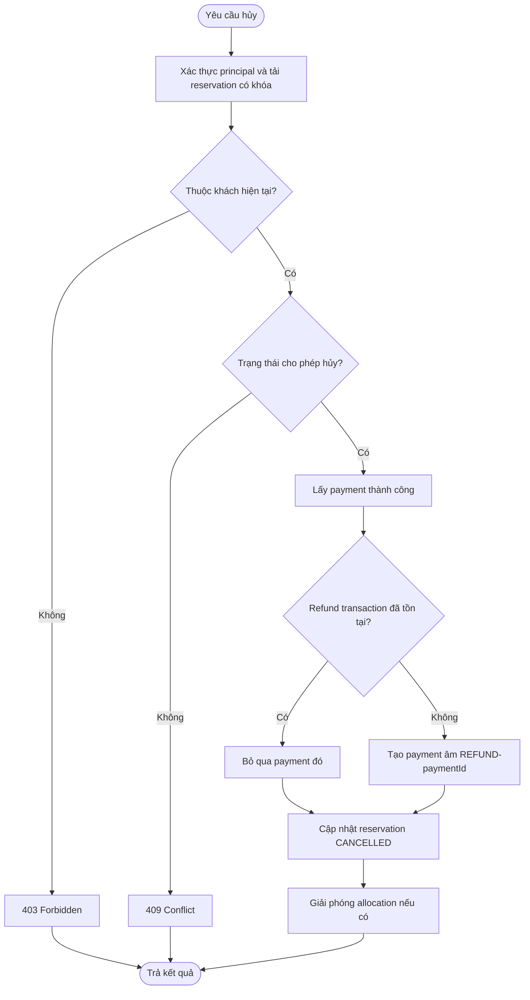
```mermaid
flowchart TD
    A([Yêu cầu hủy]) --> B[Xác thực principal và tải reservation có khóa]
    B --> C{Thuộc khách hiện tại?}
    C -- Không --> D[403 Forbidden]
    C -- Có --> E{Trạng thái cho phép hủy?}
    E -- Không --> F[409 Conflict]
    E -- Có --> G[Lấy payment thành công]
    G --> H{Refund transaction đã tồn tại?}
    H -- Có --> I[Bỏ qua payment đó]
    H -- Không --> J[Tạo payment âm REFUND-paymentId]
    I --> K[Cập nhật reservation CANCELLED]
    J --> K
    K --> L[Giải phóng allocation nếu có]
    L --> M([Trả kết quả])
    D --> M
    F --> M
```

**Hình UML-17. Activity hủy và hoàn tiền.**

- **Mục đích:** làm rõ ownership, state rule và retry safety.
- **Mô tả:** mỗi payment gốc có tối đa một refund transaction tương ứng.
- **Phân tích:** kiểm tra service kết hợp unique transaction ID ở database.
- **Kết luận:** retry không được làm thay đổi tổng tiền lần thứ hai.

### 4.3. Activity vòng đời lưu trú

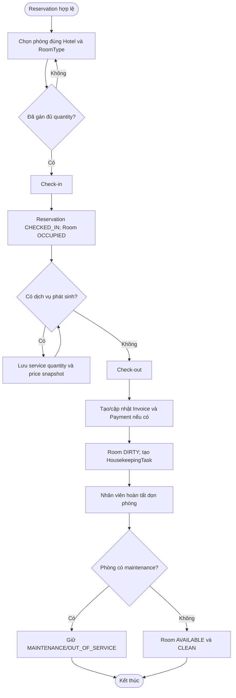
```mermaid
flowchart TD
    A([Reservation hợp lệ]) --> B[Chọn phòng đúng Hotel và RoomType]
    B --> C{Đã gán đủ quantity?}
    C -- Không --> B
    C -- Có --> D[Check-in]
    D --> E[Reservation CHECKED_IN; Room OCCUPIED]
    E --> F{Có dịch vụ phát sinh?}
    F -- Có --> G[Lưu service quantity và price snapshot]
    G --> F
    F -- Không --> H[Check-out]
    H --> I[Tạo/cập nhật Invoice và Payment nếu có]
    I --> J[Room DIRTY; tạo HousekeepingTask]
    J --> K[Nhân viên hoàn tất dọn phòng]
    K --> L{Phòng có maintenance?}
    L -- Có --> M[Giữ MAINTENANCE/OUT_OF_SERVICE]
    L -- Không --> N[Room AVAILABLE và CLEAN]
    M --> O([Kết thúc])
    N --> O
```

**Hình UML-18. Activity vòng đời lưu trú.**

- **Mục đích:** tách trạng thái reservation, room và housekeeping.
- **Mô tả:** phòng không trở lại AVAILABLE ngay tại check-out.
- **Phân tích:** service phát sinh là thao tác staff; khách chưa có checkout add-on flow.
- **Kết luận:** availability chỉ tăng lại sau housekeeping và kiểm tra maintenance.

### 4.4. Activity import và claim

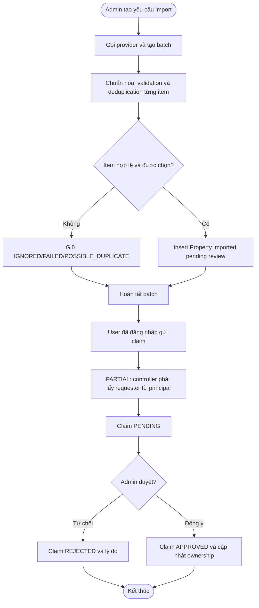
```mermaid
flowchart TD
    A([Admin tạo yêu cầu import]) --> B[Gọi provider và tạo batch]
    B --> C[Chuẩn hóa, validation và deduplication từng item]
    C --> D{Item hợp lệ và được chọn?}
    D -- Không --> E[Giữ IGNORED/FAILED/POSSIBLE_DUPLICATE]
    D -- Có --> F[Insert Property imported pending review]
    E --> G[Hoàn tất batch]
    F --> G
    G --> H[User đã đăng nhập gửi claim]
    H --> I[PARTIAL: controller phải lấy requester từ principal]
    I --> J[Claim PENDING]
    J --> K{Admin duyệt?}
    K -- Từ chối --> L[Claim REJECTED và lý do]
    K -- Đồng ý --> M[Claim APPROVED và cập nhật ownership]
    L --> N([Kết thúc])
    M --> N
```

**Hình UML-19. Activity import và claim.**

- **Mục đích:** thể hiện staging/deduplication trước khi tạo dữ liệu chính thức.
- **Mô tả:** claim là bước tách biệt sau import.
- **Phân tích:** bước principal mapping được ghi trực tiếp để không che giấu lỗ hổng source hiện tại.
- **Kết luận:** import có thể đánh giá độc lập; claim chưa đủ điều kiện COMPLETE.

## 5. Ma trận diagram và capability

| Diagram | Capability | Trạng thái evidence | Phần báo cáo |
| --- | --- | --- | --- |
| UML-01 đến UML-03 | AUTH, SEARCH, BOOK, OPS, RBAC, IMPORT, CHAT, NOTIF | CURRENT/PARTIAL theo capability matrix | Chương 3.1 |
| UML-04 đến UML-07 | RBAC, property/inventory, reservation/payment, subscription/import/chat | Source + backend CURRENT; UI/E2E tùy capability | Chương 3.3-3.4 |
| UML-08 đến UML-15 | Auth, search, booking, refund, stay, import/claim, chat, notification | CURRENT backend; Playwright BLOCKED | Chương 3.3, 3.5-3.9 |
| UML-16 đến UML-19 | Booking, refund, stay, import/claim | CURRENT backend; claim PARTIAL | Chương 3.5-3.9 |

## 6. Quy tắc cập nhật

Khi route, controller, entity, permission hoặc state thay đổi, phải cập nhật đồng thời `docs/API_SPEC.md`, `docs/ERD.md`, sơ đồ liên quan trong file này, `docs/audit/FEATURE_TRACEABILITY_MATRIX.md` và Chương 3-4 của `docs/THESIS.md`. Sơ đồ không render được hoặc chưa có evidence phải ghi lỗi trong `docs/audit/THESIS_DIAGRAM_QA.md` thay vì bỏ qua.
### 4.5 Receptionist admin authorization flow

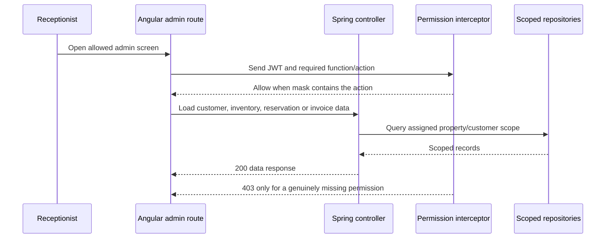
```mermaid
sequenceDiagram
    participant R as Receptionist
    participant UI as Angular admin route
    participant API as Spring controller
    participant P as Permission interceptor
    participant DB as Scoped repositories

    R->>UI: Open allowed admin screen
    UI->>P: Send JWT and required function/action
    P-->>UI: Allow when mask contains the action
    UI->>API: Load customer, inventory, reservation or invoice data
    API->>DB: Query assigned property/customer scope
    DB-->>API: Scoped records
    API-->>UI: 200 data response
    P-->>UI: 403 only for a genuinely missing permission
```

The receptionist portal uses customer-specific endpoints and an assignedible
property list. Optional service data is requested only when the account has
the corresponding service permission, so an unrelated 403 cannot eject the
user from an otherwise authorized screen.

## 7. Home Discovery và Merchandising (PLANNED - Feature 006 T102)

### 7.1. Sequence đề xuất chỗ nghỉ theo địa điểm

```mermaid
sequenceDiagram
    actor Guest as Khách
    participant Home as Angular Home
    participant State as HomeSearchStateService
    participant API as PublicDiscoveryController
    participant Rec as HomeRecommendationService
    participant Location as ProvinceCompatibilityService
    participant Search as PropertySearchService

    Guest->>Home: Mở trang chủ
    Home->>State: Đọc location, ngày và số khách hiện tại
    par Tải tab địa điểm
        Home->>API: GET /api/public/home/recommendation-destinations
        API->>Rec: destinations(preferredProvinceId, limit)
        Rec->>Location: Chuẩn hóa tỉnh hiện hành và supply tương thích
        Rec-->>API: Tối đa 5 địa điểm có property hợp lệ
        API-->>Home: Destination projections
    and Tải spotlight độc lập
        Home->>API: GET /api/public/home/spotlights
        API-->>Home: Placement projections hoặc danh sách rỗng
    end
    Guest->>Home: Chọn tab địa điểm
    Home->>API: GET /api/public/home/recommendations?provinceId=...
    API->>Rec: recommendations(query)
    Rec->>Search: Lọc approved/active/available và xếp hạng ổn định
    Search-->>Rec: Property + review + availability + server price
    Rec-->>API: Organic recommendation items
    API-->>Home: Cards sponsored=false
    Guest->>Home: Mở card hoặc Xem thêm
    Home->>State: Giữ location, ngày, stay type, khách và phòng
    Home-->>Guest: Điều hướng /hotel/:id hoặc /search
```

**Ràng buộc:** Hai request Home độc lập; lỗi spotlight không được ẩn recommendation. Frontend không tự tính giảm giá và không gọi danh sách là AI personalization.

### 7.2. Activity kiểm soát partner spotlight

```mermaid
flowchart TD
    A([Yêu cầu public spotlights]) --> B[Lọc placement surface HOME_PARTNER_SPOTLIGHT]
    B --> C{Status ACTIVE và đúng lịch?}
    C -- Không --> X[Loại khỏi response]
    C -- Có --> D{Còn quota và asset hợp lệ?}
    D -- Không --> X
    D -- Có --> E{Có property liên quan?}
    E -- Có --> F{Property APPROVED và ACTIVE?}
    F -- Không --> X
    F -- Có --> G[Áp dụng tenant scope và target allowlist]
    E -- Không --> H{Placement kind EDITORIAL cấp nền tảng?}
    H -- Không --> X
    H -- Có --> G
    G --> I{SPONSORED?}
    I -- Có --> J[Gắn disclosure Được tài trợ / Sponsored]
    I -- Không --> K[Gắn nhãn biên tập LuxeStay]
    J --> L[Sắp xếp theo priority và stable id]
    K --> L
    L --> M([Trả public projection])
```

**Trạng thái tài liệu:** Flow trên là thiết kế mục tiêu. Runtime implementation bắt đầu từ T103; persistence/management của spotlight phụ thuộc T025-T027, T032 và T110-T113.

## 8. Feature 007 financial context UML

### 8.1. UML-20 - bounded context class ownership

\`\`\`mermaid
classDiagram
    namespace PropertyCommerce {
        class PropertyPaymentConfiguration {
            +Long hotelId
            +PaymentEnvironment environment
            +Boolean enabled
            +DepositPolicy depositPolicy
            +List~PaymentMethod~ methods
        }
        class PropertyPaymentAttempt {
            +Long reservationId
            +PaymentState status
            +VndMoney expectedAmount
            +String idempotencyKey
            +transitionTo(state)
        }
        class PropertyFinancialTransaction {
            +TransactionType transactionType
            +Direction direction
            +VndMoney amount
            +Long originalTransactionId
            +String idempotencyIdentity
        }
        class BookingFinancialSummary {
            +BookingFinancialState financialState
            +VndMoney remainingBalance
            +recalculate()
        }
        class ReservationChargeLine {
            +ChargeType chargeType
            +VndMoney totalAmount
            +LocalDateTime serviceUsedAt
            +appendOnly()
        }
        class PropertyInvoice {
            +InvoiceStatus status
            +VndMoney totalAmount
            +finalize()
        }
        class PropertyInvoiceLine
        class PropertyInvoicePaymentAllocation
        class PropertyCreditNote
        class CheckoutOverride
        class PropertyRefundRequest
        class PropertyRefundAttempt
    }
    namespace PlatformBilling {
        class PlatformPaymentConfiguration {
            +String provider
            +PaymentEnvironment environment
            +Boolean enabled
            +String merchantReferenceMasked
        }
        class SubscriptionOrder {
            +Operation operation
            +SubscriptionOrderState status
            +String planVersion
            +VndMoney price
            +transitionTo(state)
        }
        class PlatformPaymentAttempt {
            +PaymentState status
            +VndMoney expectedAmount
            +String providerEventId
        }
        class PlatformFinancialTransaction {
            +TransactionType transactionType
            +Direction direction
            +VndMoney amount
            +String idempotencyIdentity
        }
        class SoftwareContract {
            +ContractStatus status
            +LocalDateTime effectiveFrom
            +LocalDateTime effectiveUntil
        }
        class SubscriptionEntitlement {
            +EntitlementStatus status
            +applyContract(contract)
        }
        class SubscriptionHistory {
            +ActionType actionType
            +String previousStateJson
            +String newStateJson
            +appendOnly()
        }
        class PlatformRefundRequest
        class PlatformRefundAttempt
    }
    class FinancialAuditEvent {
        +String context
        +String aggregateType
        +String previousState
        +String newState
        +String idempotencyIdentity
        +String correlationId
        +appendOnly()
    }

    PropertyPaymentConfiguration "1" --> "*" PropertyPaymentAttempt : config_snapshot
    PropertyPaymentAttempt "1" --> "*" PropertyFinancialTransaction : successful_effect
    PropertyFinancialTransaction "1" --> "*" PropertyFinancialTransaction : refund_or_credit
    ReservationChargeLine "*" --> "1" BookingFinancialSummary : contributes
    PropertyInvoice "1" --> "*" PropertyInvoiceLine : finalized_snapshot
    PropertyInvoice "1" --> "*" PropertyInvoicePaymentAllocation : allocates
    PropertyInvoicePaymentAllocation "*" --> "1" PropertyFinancialTransaction : source_debit
    PropertyInvoice "1" --> "*" PropertyCreditNote : post_finalization_correction
    PropertyRefundRequest "1" --> "*" PropertyRefundAttempt : provider_retry
    PropertyRefundRequest "*" --> "1" PropertyFinancialTransaction : original_debit

    PlatformPaymentConfiguration "1" --> "*" PlatformPaymentAttempt : system_merchant
    SubscriptionOrder "1" --> "*" PlatformPaymentAttempt : payment_attempt
    PlatformPaymentAttempt "1" --> "*" PlatformFinancialTransaction : successful_effect
    PlatformFinancialTransaction "1" --> "*" PlatformFinancialTransaction : refund_or_credit
    SubscriptionOrder "1" --> "1" SoftwareContract : applied_order
    SoftwareContract "1" --> "1" SubscriptionEntitlement : current_projection
    SubscriptionOrder "1" --> "*" SubscriptionHistory : lifecycle_evidence
    PlatformRefundRequest "*" --> "1" PlatformFinancialTransaction : original_debit
    PlatformRefundRequest "1" --> "*" PlatformRefundAttempt : provider_retry

    FinancialAuditEvent ..> PropertyPaymentAttempt : PROPERTY_COMMERCE
    FinancialAuditEvent ..> SubscriptionOrder : PLATFORM_BILLING
\`\`\`

The two namespaces share only money/value objects, provider verification primitives, idempotency support and audit infrastructure. They do not share merchant configuration, ledger repositories, refund aggregates or revenue queries.

### 8.2. UML-21 - payment and refund state machine

\`\`\`mermaid
stateDiagram-v2
    [*] --> CREATED
    CREATED --> PENDING
    CREATED --> PENDING_VERIFICATION
    CREATED --> CANCELLED
    CREATED --> EXPIRED
    PENDING --> PROCESSING
    PENDING --> SUCCESS
    PENDING --> FAILED
    PENDING --> CANCELLED
    PENDING --> EXPIRED
    PENDING_VERIFICATION --> SUCCESS
    PENDING_VERIFICATION --> FAILED
    PENDING_VERIFICATION --> CANCELLED
    PENDING_VERIFICATION --> EXPIRED
    PROCESSING --> SUCCESS
    PROCESSING --> FAILED
    PROCESSING --> CANCELLED
    PROCESSING --> EXPIRED
    SUCCESS --> PARTIALLY_REFUNDED
    SUCCESS --> REFUNDED
    PARTIALLY_REFUNDED --> PARTIALLY_REFUNDED
    PARTIALLY_REFUNDED --> REFUNDED
    REFUNDED --> REFUNDED
    FAILED --> FAILED
    CANCELLED --> CANCELLED
    EXPIRED --> EXPIRED
\`\`\`

\`FinancialTransitionPolicy.payment\` is the executable source for this graph. Equivalent callbacks are idempotent; illegal or conflicting callbacks are rejected and audited. A refund changes the attempt projection only after a new immutable credit transaction is recorded, and the original debit is never edited.

### 8.3. UML-22 - property checkout and invoice sequence

\`\`\`mermaid
sequenceDiagram
    actor Staff as Authorized property staff
    participant Checkout as PropertyCheckoutController
    participant Folio as FolioCalculationService
    participant Summary as BookingFinancialSummaryService
    participant Invoice as InvoiceFinalizationService
    participant Ledger as PropertyFinancialTransactionRepository
    participant Rooms as Reservation/Room/Housekeeping
    participant Audit as FinancialAuditService

    Staff->>Checkout: preview(reservationId)
    Checkout->>Folio: derive room + service + surcharge + tax + discount
    Folio-->>Checkout: server-owned charge lines and balance
    Staff->>Checkout: checkout(request, idempotency key)
    Checkout->>Summary: lock reservation and recalculate
    Summary->>Ledger: read successful debits and refund credits
    Ledger-->>Summary: immutable payment evidence
    alt debt without authorized override
        Summary-->>Checkout: stable underpayment error
        Checkout-->>Staff: 409 CHECKOUT_BALANCE_DUE
    else payable or approved override
        Checkout->>Invoice: finalize immutable invoice + lines
        Checkout->>Ledger: allocate prior payments; record any final payment
        Checkout->>Rooms: release assignment, dirty room, create housekeeping once
        Checkout->>Audit: append state transition with actor/reason
        Checkout-->>Staff: committed invoice, balance and room effect
    end
\`\`\`

All persistence steps share one transaction boundary. A failure rolls back reservation, payment, invoice, room and housekeeping mutations; immutable prior ledger rows remain unchanged.

### 8.4. UML-23 - platform subscription application sequence

\`\`\`mermaid
sequenceDiagram
    actor Owner as Property owner
    participant Order as PlatformBillingController
    participant Catalog as SubscriptionOrderService
    participant Attempt as PlatformPaymentAttemptService
    participant Callback as PlatformPaymentCallbackService
    participant Ledger as PlatformFinancialTransactionRepository
    participant Apply as SubscriptionApplicationService
    participant Contract as SoftwareContract/Entitlement
    participant History as SubscriptionHistory

    Owner->>Order: create order(planCode, idempotency key)
    Order->>Catalog: snapshot backend plan, price, duration and features
    Catalog-->>Owner: PENDING_PAYMENT order
    Owner->>Attempt: create system-merchant payment attempt
    Attempt-->>Owner: simulator/sandbox instructions
    Owner->>Callback: provider callback
    Callback->>Callback: verify signature, merchant, amount, currency, expiry and replay identity
    alt invalid, failed, cancelled or expired
        Callback-->>Owner: stable financial error; no entitlement effect
    else authoritative SUCCESS
        Callback->>Ledger: insert one platform debit by effect identity
        Callback->>Apply: lock order and apply once
        Apply->>Contract: create or supersede immutable contract
        Apply->>Contract: update current entitlement projection
        Apply->>History: append PURCHASED/RENEWED/UPGRADED history
        Apply-->>Owner: APPLIED order and entitlement
    end
\`\`\`

\`FinancialTransitionPolicy.subscription\` and the application service reject duplicate or cross-order effects. A platform callback cannot settle a reservation; a property callback cannot activate a contract.

### 8.5. UML-24 - context isolation and reporting

\`\`\`mermaid
flowchart LR
    PropertyEvent[Property payment/refund/invoice] --> PropertyLedger[(property_financial_transactions)]
    PlatformEvent[Platform subscription/refund/credit] --> PlatformLedger[(platform_financial_transactions)]
    PropertyLedger --> PropertyReport[PropertyRevenueService]
    PlatformLedger --> PlatformReport[PlatformRevenueService]
    PropertyReport --> PropertyAPI[management property-revenue API/export]
    PlatformReport --> PlatformAPI[admin platform-revenue API/export]
    PropertyAPI -. property permissions + hotel_id .-> PropertyUser[Owner/staff]
    PlatformAPI -. system permissions, no property filter .-> Admin[System admin]
    PropertyLedger -. no cross-context FK .-> PlatformLedger
    PlatformEvent -. never settles .-> Reservation[Reservation aggregate]
    PropertyEvent -. never activates .-> Entitlement[Subscription entitlement]
\`\`\`

Reports read successful immutable transactions, finalized invoice lines and credit/refund evidence. Invoice allocations are reconciliation evidence, not a second collected-money event. See [property reconciliation](audit/financial/PROPERTY_REVENUE_RECONCILIATION.md) and [platform reconciliation](audit/financial/PLATFORM_REVENUE_RECONCILIATION.md).

## 9. Feature 007 traceability and validation

| Requirement | Diagram/source contract | Evidence or current limitation |
| --- | --- | --- |
| FR-001 | UML-20, UML-24; context-owned packages and reports | [Platform Billing audit](audit/financial/PLATFORM_BILLING_AUDIT.md); [Property Commerce audit](audit/financial/PROPERTY_PAYMENT_AUDIT.md) |
| FR-002 | UML-20 property transaction type and folio classes | \`PropertyFinancialTransaction.TransactionType\`; migration \`V21\` |
| FR-003 | UML-20 platform transaction type and subscription classes | \`PlatformFinancialTransaction.TransactionType\`; migration \`V24\` |
| FR-004 | UML-21 \`PaymentState\` graph | \`FinancialTransitionPolicy.payment\`; illegal transitions rejected, equivalent transitions idempotent |
| FR-005 | UML-20 \`BookingFinancialSummary\` projection | \`BookingFinancialState\`; separate from reservation operational status |
| FR-006 | UML-20 audit dependency and UML-22/23 audit calls | \`FinancialAuditEvent\` append-only; material callback/refund/checkout transitions record actor/source/reason |

Implementation is simulator/deterministic-test ready; production payment remains fail-closed until external credentials and a separate readiness approval are supplied. The diagrams describe current canonical ownership and executable transitions, not a claim that every browser journey or production provider is enabled.

## 10. Diagram maintenance rules

When a financial entity, migration or transition policy changes, update ERD-06/07, UML-20/24 and the context architecture together. Keep legacy compatibility tables visibly separate, preserve append-only semantics, and link the change to the corresponding Feature 007 evidence and traceability row. See [Feature 007 plan](../specs/007-payment-billing-completion/plan.md) and [Feature 007 data model](../specs/007-payment-billing-completion/data-model.md).
