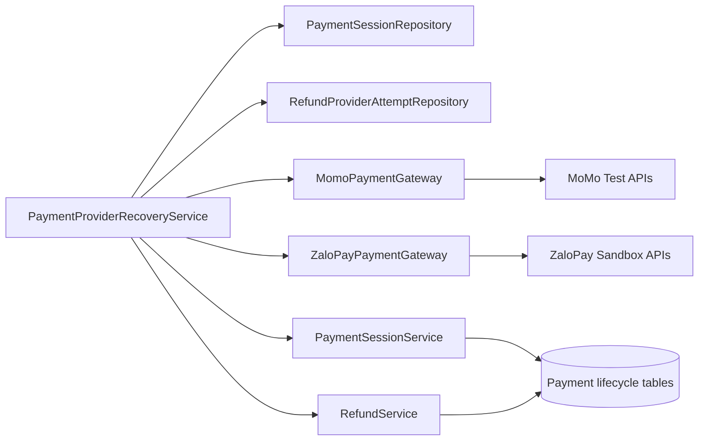

# Payment Provider Recovery

## Scope and assumptions

- Covers MoMo Test and ZaloPay Sandbox transaction query, refund submission, and refund query.
- Keeps the current Spring Boot monolith and relational lifecycle records; no broker, cache, or microservice is added.
- A scan handles at most 50 pending payment sessions and 50 refund attempts per provider-recovery cycle.
- Browser return URLs remain display-only. Verified callbacks or server-issued signed query requests with validated provider response bindings are authoritative.

## Components

## Consistency and idempotency

- Payment recovery reuses `PaymentSessionService.processProviderCallback`, so amount, provider reference, reservation lock, replay, points, hold, and reconciliation rules remain centralized.
- Refund references are deterministic and persisted before the external call. A timeout therefore leaves `PENDING_PROVIDER`; the next scan queries the same provider reference instead of creating a new refund.
- Refund terminal transitions reuse the pessimistic locks and transition policy in `RefundService`. Replayed success cannot duplicate the negative ledger, point reversal, or notification.
- Failed payment queries use the persisted expected amount because some providers return zero or omit amount on failure. Successful queries must carry the provider amount for server-side equality validation.

## Failure handling

| Failure | Behavior |
|---|---|
| Provider credentials absent | Skip provider work; preserve current state |
| Network timeout or malformed response | Keep refund pending and retry through query; log only opaque local identifiers |
| Unknown refund reference | Record explicit provider-reference failure; never create a successful refund ledger |
| Amount/reference mismatch | Reject the response and leave the lifecycle unchanged for investigation/retry |
| Duplicate scheduler execution | Deterministic provider IDs plus database transition locks make replay idempotent |
| Late payment success | Existing reconciliation policy records the charge without reviving cancelled/expired inventory |

## Configuration and rollout

- Credentials come only from environment variables documented in `.env.example`.
- Recovery is controlled by `PAYMENT_PROVIDER_RECOVERY_ENABLED`, `PAYMENT_PROVIDER_RECOVERY_SCAN_MS`, and `PAYMENT_PROVIDER_RECOVERY_MINIMUM_AGE_MS`.
- Test and E2E profiles disable the scheduler; gateway and orchestrator behavior is exercised with local mock provider responses.
- T101 remains the release gate for real sandbox credentials, public callbacks, request IDs, acknowledgements, and reconciliation evidence.
