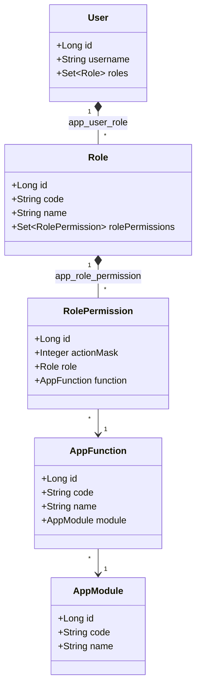
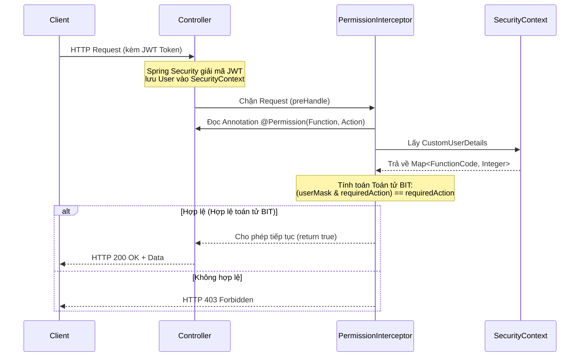

# Kiến Trúc Phân Quyền (Authorization Architecture)

Hệ thống sử dụng kiến trúc phân quyền động dựa trên mô hình **Module → Function → Action** kết hợp với **Bitwise Mask**, tương tự như các hệ thống ERP/HIS doanh nghiệp.

## 1. Cơ sở dữ liệu (Database Design)

Cơ sở dữ liệu được thiết kế thành các bảng chính như sau:

- `app_module`: Quản lý các phân hệ lớn của hệ thống (Ví dụ: SYSTEM, HOTEL, FINANCE).
- `app_function`: Quản lý các chức năng cụ thể nằm trong từng Module (Ví dụ: USER, ROOM, RESERVATION). Mỗi Function đại diện cho một màn hình hoặc nghiệp vụ.
- `app_role`: Quản lý các vai trò người dùng (Ví dụ: SUPER_ADMIN, RECEPTIONIST).
- `app_user_role`: Bảng trung gian n-n kết nối `users` và `app_role`.
- `app_role_permission`: Bảng quy định quyền hạn. Mỗi Role sẽ được cấp quyền trên từng Function thông qua cột `action_mask` (sử dụng toán tử bit).

### Bitwise Action Mask
Quyền hạn (Actions) được định nghĩa dưới dạng số nguyên lũy thừa của 2:
- VIEW = 1
- CREATE = 2
- UPDATE = 4
- DELETE = 8
- EXPORT = 16
- APPROVE = 32

Nếu một Role có quyền VIEW và CREATE, `action_mask` sẽ là 1 + 2 = 3. 
Toán tử bit `AND (&)` được sử dụng để kiểm tra: `(userMask & requiredAction) == requiredAction`.

## 2. UML Class Diagram

## 3. Luồng hoạt động (Sequence Diagram)

Quy trình kiểm tra phân quyền khi có một request tới API:

