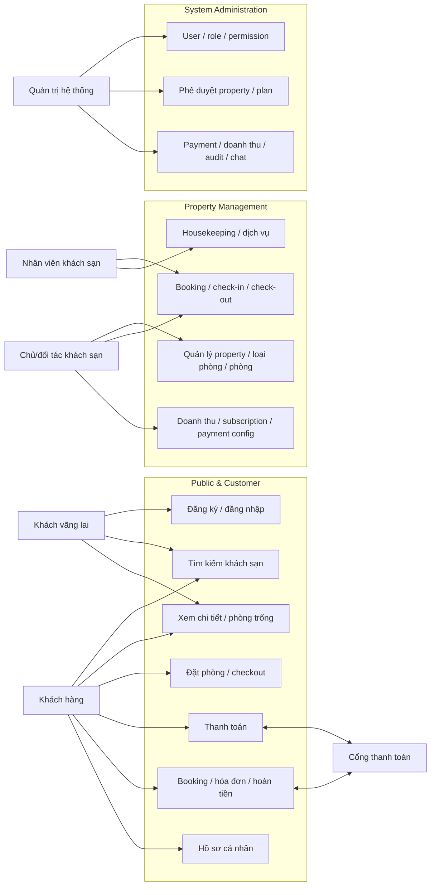
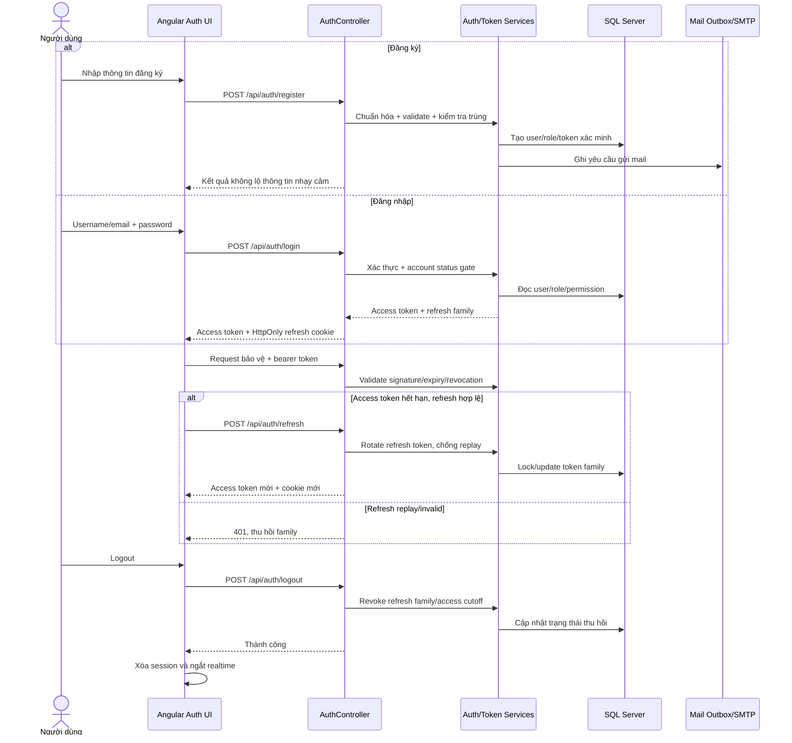
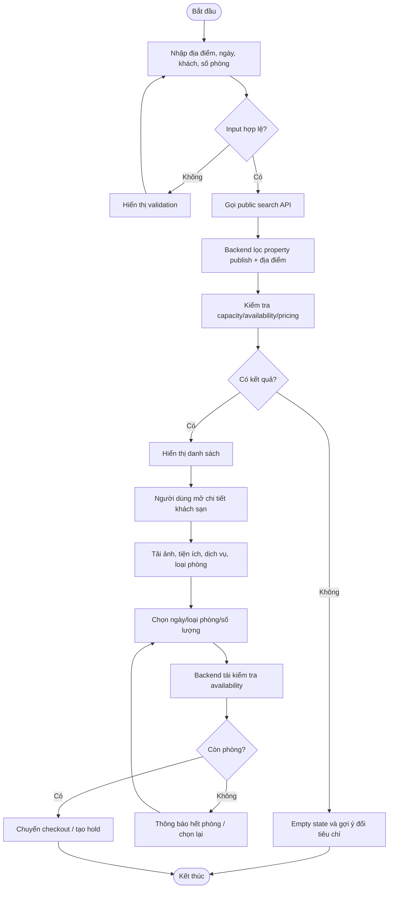
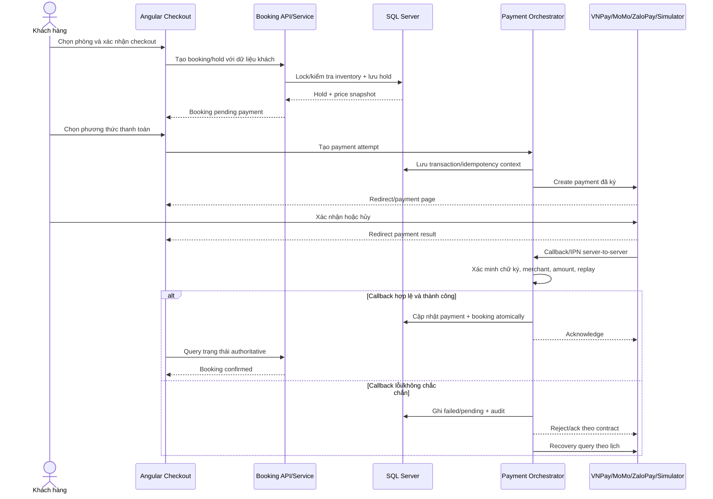
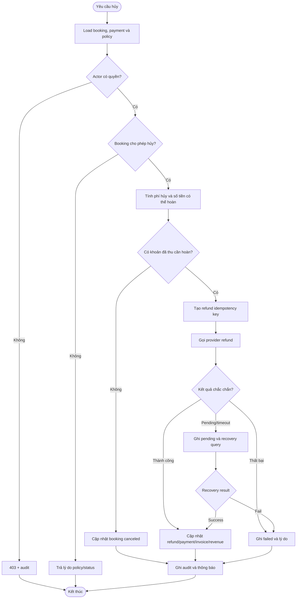
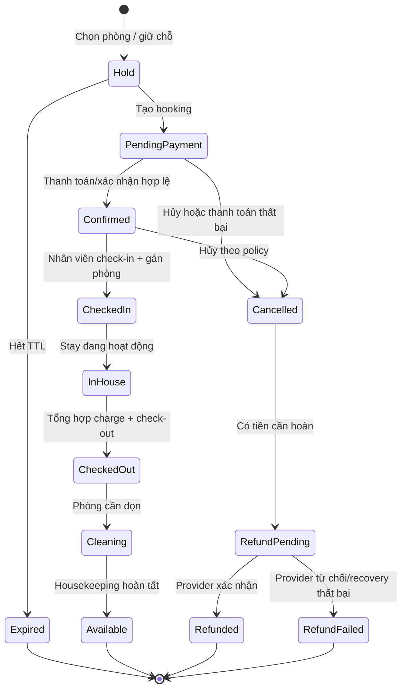
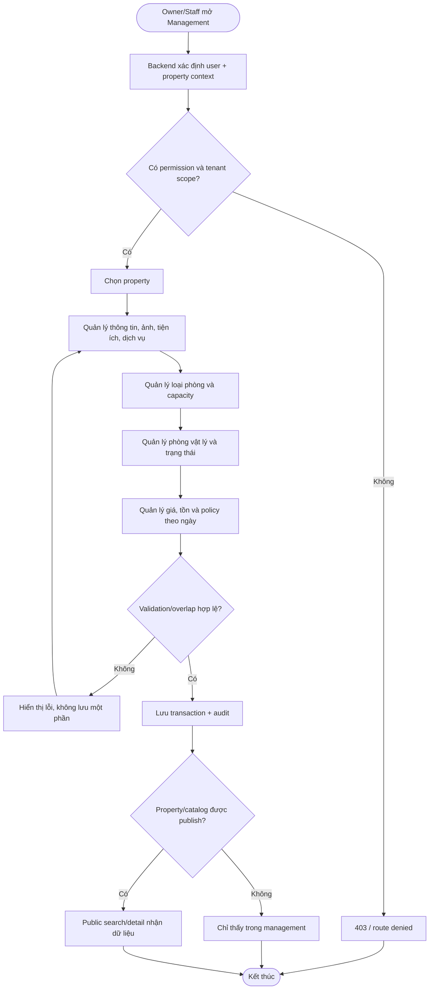
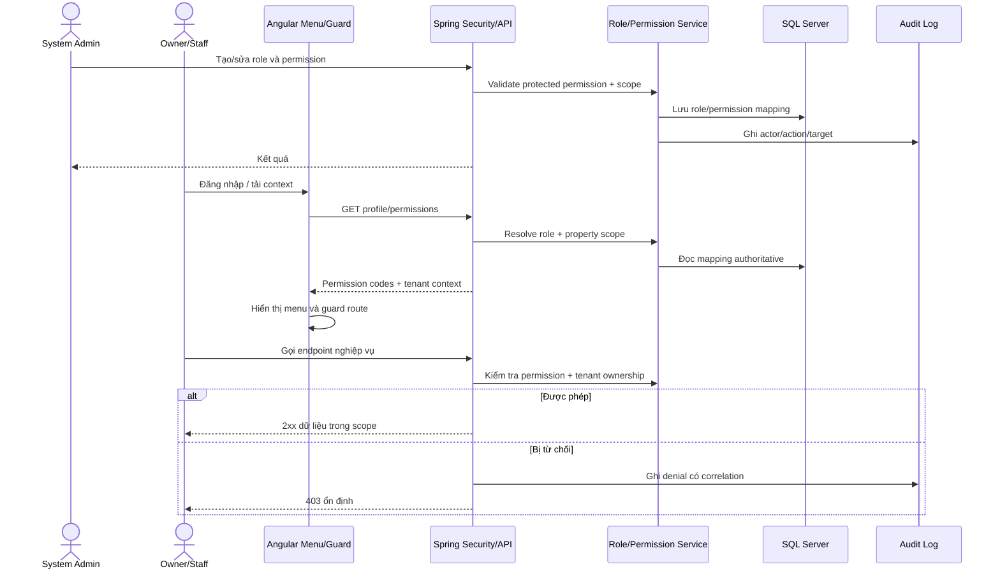
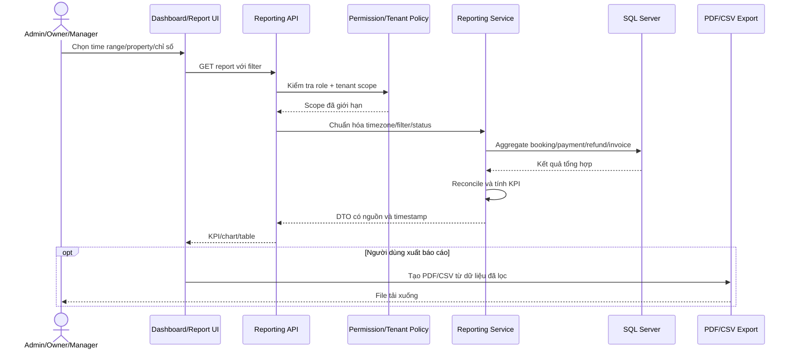

# Sơ đồ hệ thống và nghiệp vụ

Ngày tạo: 2026-08-05 
Định dạng: Mermaid. Source độc lập nằm trong `docs/hotel-report/diagrams/`.

> Chưa xuất PNG/SVG vì Mermaid CLI (`mmdc`) không được cài trong workspace tại thời điểm audit. Mỗi sơ đồ vẫn render trực tiếp trong Markdown; cột “File ảnh” được ghi là “chưa xuất”.

## D01 - Use Case tổng quan

**Mục đích:** thể hiện actor và nhóm chức năng thực tế của ba khu vực public/customer, property management và system administration. 
**Actor:** Guest, Customer, Staff, Owner/Partner, System Admin, Payment Provider. 
**Phạm vi:** toàn hệ thống ở mức capability; không thể hiện chi tiết endpoint. 
**Source:** `diagrams/D01-use-case-overview.mmd`. 
**File ảnh xuất:** chưa xuất.

## D02 - Sequence đăng ký, đăng nhập và phiên

**Mục đích:** mô tả credential registration/login, refresh rotation và logout/revocation. 
**Actor:** Người dùng, Angular Auth UI, Auth API, token services, database, mail outbox/SMTP. 
**Phạm vi:** auth session; OAuth provider là nhánh ngoài chưa đưa vào để sơ đồ dễ đọc. 
**Source:** `diagrams/D02-auth-sequence.mmd`. 
**File ảnh xuất:** chưa xuất.

## D03 - Activity tìm kiếm, chi tiết và phòng trống

**Mục đích:** mô tả luồng public từ search criteria đến checkout/hold. 
**Actor:** Guest/Customer, Angular search/detail UI, public API, availability/pricing services. 
**Phạm vi:** search, hotel detail, room selection; chưa gồm thanh toán. 
**Source:** `diagrams/D03-search-availability-activity.mmd`. 
**File ảnh xuất:** chưa xuất.

## D04 - Sequence booking và payment callback

**Mục đích:** thể hiện nguồn sự thật backend, hold/inventory, payment attempt và callback/IPN. 
**Actor:** Customer, checkout UI, booking service, payment orchestrator, database, provider. 
**Phạm vi:** tạo booking đến confirmed/failed/pending recovery. 
**Source:** `diagrams/D04-booking-payment-sequence.mmd`. 
**File ảnh xuất:** chưa xuất.

## D05 - Activity hủy booking và hoàn tiền

**Mục đích:** mô tả permission, cancellation policy, refund idempotency và recovery. 
**Actor:** Customer, staff/admin, cancellation/refund services, provider. 
**Phạm vi:** booking đã tồn tại; gồm nhánh không cần refund, success/fail/pending. 
**Source:** `diagrams/D05-cancellation-refund-activity.mmd`. 
**File ảnh xuất:** chưa xuất.

## D06 - Booking/stay/check-in/check-out lifecycle

**Mục đích:** thể hiện các trạng thái chính và quan hệ với housekeeping/refund. 
**Actor:** Customer, reception/staff, scheduler, provider, housekeeping. 
**Phạm vi:** state machine logic ở mức nghiệp vụ; tên enum thực tế có thể chi tiết hơn theo entity. 
**Source:** `diagrams/D06-stay-lifecycle.mmd`. 
**File ảnh xuất:** chưa xuất.

## D07 - Activity quản lý property, loại phòng và phòng

**Mục đích:** thể hiện tenant/permission gate và chuỗi catalog đến public publish. 
**Actor:** Owner, property manager/staff, system admin khi hỗ trợ. 
**Phạm vi:** property, ảnh/tiện ích/dịch vụ, room type, room, pricing/inventory. 
**Source:** `diagrams/D07-property-room-management.mmd`. 
**File ảnh xuất:** chưa xuất.

## D08 - Sequence role và permission

**Mục đích:** trace quyền từ cấu hình role đến menu/route và API/tenant gate. 
**Actor:** System Admin, Owner/Staff, Angular guard, Spring Security, RBAC service, database, audit log. 
**Phạm vi:** CRUD role/permission và authorization request. 
**Source:** `diagrams/D08-role-permission-sequence.mmd`. 
**File ảnh xuất:** chưa xuất.

## D09 - Sequence dashboard và reporting

**Mục đích:** mô tả filter/scope, aggregation, reconciliation và export. 
**Actor:** Admin/Owner/Manager, dashboard UI, reporting API/service, database, export client. 
**Phạm vi:** KPI, chart/table, revenue/payment/refund/invoice; không thay thế đặc tả công thức từng báo cáo. 
**Source:** `diagrams/D09-dashboard-reporting-sequence.mmd`. 
**File ảnh xuất:** chưa xuất.

## Lưu ý kiểm chứng

- D04/D05 mô tả contract an toàn bắt buộc; provider sandbox E2E chưa được chứng minh nên không được hiểu là luồng đã PASS.
- D06 là mô hình nghiệp vụ tổng hợp từ booking/stay/housekeeping/refund; khi dùng làm đặc tả triển khai phải ánh xạ lại tên enum/entity chính xác.
- D08 phản ánh yêu cầu least privilege; bốn route management bị 403 là finding cần sửa/test, không phải hành vi được xác nhận là đúng.
