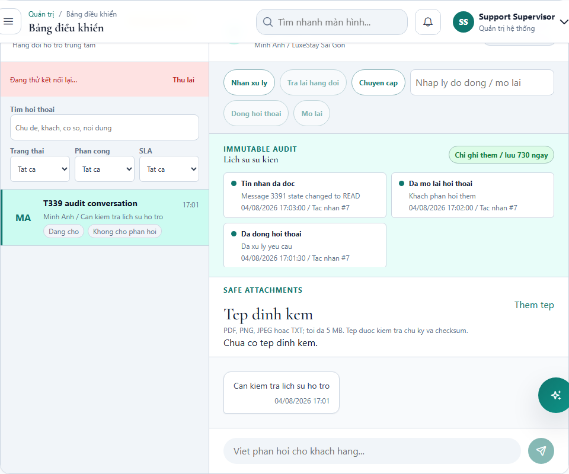

# T339 - Support conversation audit

Date: 2026-08-04
Branch: `codex/cross-cutting`

## Outcome

- Authorized supervisors can read the newest-first immutable event history for a selected support conversation from `/api/chat/support/conversations/{conversationId}/events`.
- The query verifies system or assigned-property access before reading events, caps each page at 100 rows and only exposes events inside the documented rolling 730-day retention window.
- `CLOSED`, `REOPENED`, `MESSAGE_DELIVERED` and `MESSAGE_READ` are appended to the existing support audit stream. Delivery/read events are emitted only when the persisted state actually changes.
- The entity rejects JPA update and delete callbacks, there is no event mutation endpoint, and the viewer identifies the stream as append-only.
- `/admin/chat` shows policy, loading/error/empty states, event details, actor reference, timestamps and pagination. Foreign conversation access remains privacy-safe `404` behavior.

## Authorization and isolation

- Endpoints require `AI_CHAT:VIEW`.
- Property-owned conversations call `PropertyAccessService.requireAccessibleOrNotFound(...)` before the event repository.
- System-owned conversations require the system-administrator context.
- Focused backend isolation proves a foreign conversation is rejected before event lookup; the browser contract also asserts a foreign event request returns `404`.

## Verification

| Layer | Command / coverage | Result |
|---|---|---|
| Backend compile | Focused `javac` compile of the changed support entity/repository/DTO/services/controller and two focused tests using `target/t327-classpath.txt` | PASS |
| Backend tests | `mvnw.cmd -q '-Dtest=ChatServiceTest,SupportConversationAuditServiceTest' surefire:test` | PASS - 14/14 |
| Angular tests | `npm test -- --watch=false --include='src/app/core/services/chat.service.spec.ts' --include='src/app/features/admin/chat-dashboard/chat-dashboard.spec.ts'` | PASS - 20/20 |
| Browser | `PLAYWRIGHT_PORT=4341 npx playwright test e2e/support-conversation-audit.spec.ts --project=chromium --workers=1` | PASS - 1/1 |
| Production build | `npm run build` | PASS |

The normal Maven compile remains independently blocked by pre-existing missing `SubscriptionPlanDTO` and `SubscriptionCatalogService` symbols in `PlatformBillingController`; the changed T339 Java sources and focused tests compile cleanly via the established isolated classpath.

## Visual evidence

The screenshot shows the selected conversation, the 730-day append-only policy and visible close, reopen and read-state events.

## Recovery

- Schema migration: N/A; T339 reuses the existing `support_conversation_events` table.
- Rollback: revert the T339 commit to remove the query endpoints/viewer and read-state audit append. Existing audit rows remain intact and require no destructive cleanup.
- Forward recovery: correct authorization, event mapping or presentation and redeploy; do not delete or rewrite recorded support events.
