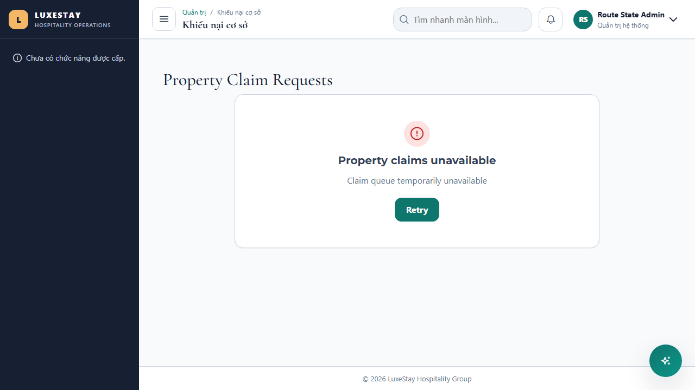
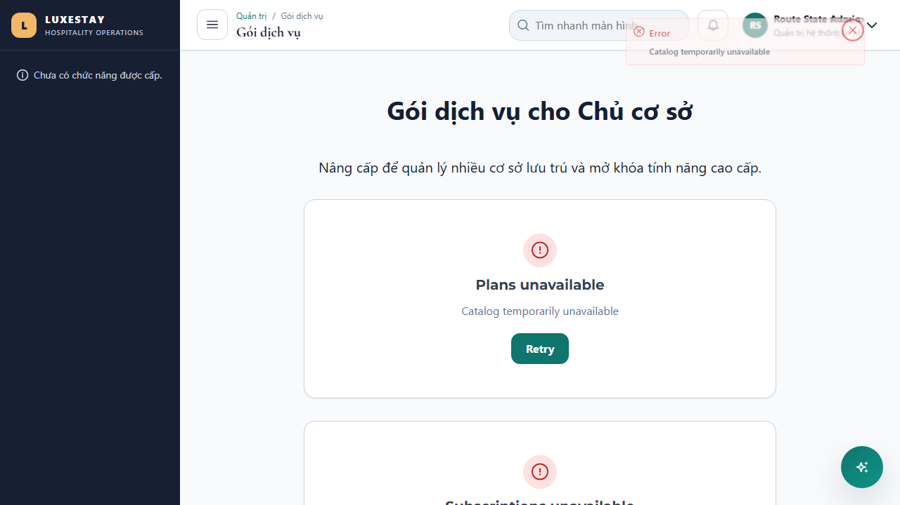
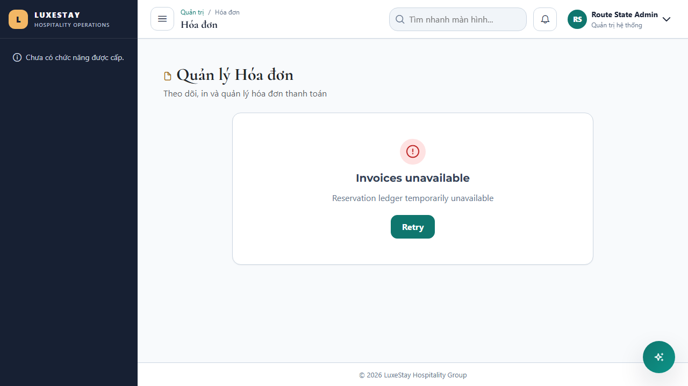

# T340 - Loading, error and empty-state presentation

Date: 2026-08-04
Branch: `codex/cross-cutting`

## Outcome

- Audited every canonical route in `frontend/src/app/app.routes.ts`; the route-by-route policy is recorded in `T340-route-state-inventory.md`.
- Replaced the routed console-only failures on property claims, property imports and subscription assignments with visible feedback and retry controls.
- Added consistent loading, error, empty and retry states to `/admin/property-claims`, `/admin/property-imports`, `/admin/plans` and `/admin/invoices`.
- Added visible mutation failures for claim review, import staging/items/import execution and invoice generation.
- Added explicit change-detection notifications so HTTP completion reliably replaces loading presentation in the zoneless runtime.

## Accessibility and retry behavior

- Shared `FeedbackStateComponent` provides named headings, status/alert semantics, non-verbal-hidden icons and keyboard-operable retry buttons.
- Empty states explain the next valid action rather than presenting an unexplained blank table.
- Retry keeps the current route and filter/form inputs; mutation failures do not imply success or clear server-authoritative data.
- This task changes presentation only. Backend authorization, tenant isolation and migrations are N/A.

## Verification

| Layer | Command / coverage | Result |
|---|---|---|
| Angular | `npm test -- --watch=false --include='src/app/features/admin/route-state-remediation.spec.ts'` | PASS - 4/4 routes |
| Chromium | `PLAYWRIGHT_PORT=4344 npx playwright test e2e/route-loading-error-empty-states.spec.ts --project=chromium --workers=1` | PASS - 1/1 journey, 4 routes |
| Production build | `npm run build` | PASS |

## Visual evidence

## Recovery

- Schema/configuration change: N/A.
- Rollback: revert the T340 commit to restore the previous route templates and handlers.
- Forward recovery: correct a route-specific state mapping and extend the corresponding component/browser assertion; no data rollback is required.
