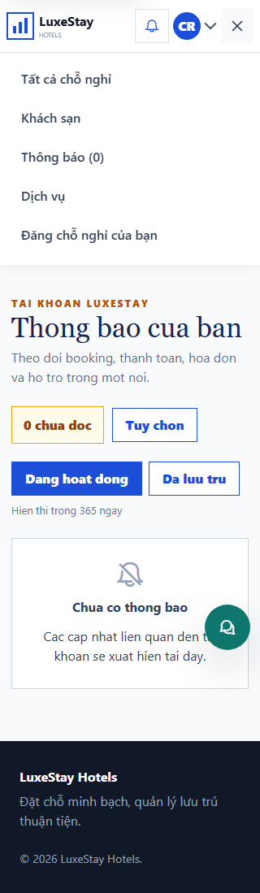
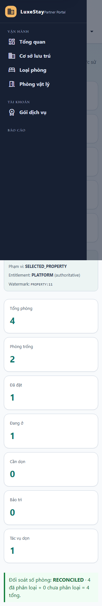
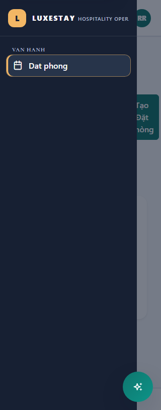
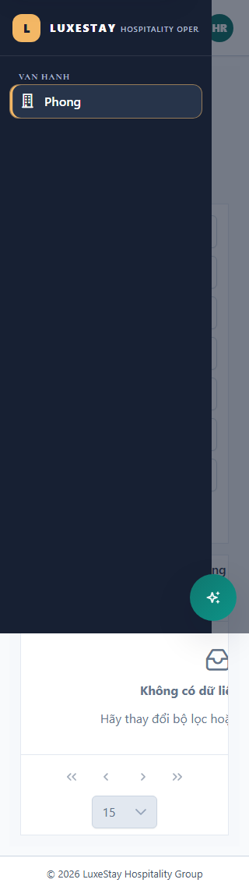
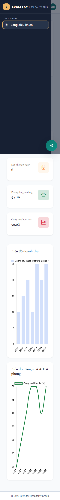

# T341 - Authenticated responsive role-route matrix

Date: 2026-08-04
Branch: `codex/cross-cutting`

## Outcome

- Added an authenticated Chromium matrix for customer, property owner, receptionist, housekeeping and system administrator journeys.
- Covered 320, 375, 768, 1024 and 1440 pixel widths for 25 role-width combinations.
- Fixed the 320px customer header and the 768px management header min-content overflow.
- Added global narrow-viewport containment for PrimeNG/Bootstrap tables, dialogs and overlay panes while preserving local horizontal scrolling.
- Hardened the browser harness so it waits for the expected routed component, rejects forbidden-page evidence and opens navigation through its explicit `aria-controls` target after responsive transitions settle.

## Authorization and isolation

- Each context uses the intended role and minimum view permission for its route.
- The test does not bypass Angular guards; it fails if `.forbidden-container` renders.
- Customer, management and admin sessions use separate browser contexts and close after their matrix completes.
- This task changes presentation and test fixtures only. Backend tenant isolation, schema and migrations are N/A.

## Verification

| Layer | Command / coverage | Result |
|---|---|---|
| Chromium | `PLAYWRIGHT_PORT=4351 npx playwright test e2e/authenticated-responsive-matrix.spec.ts --project=chromium --workers=1 --retries=0` | PASS - 1/1 journey, 25/25 role-width cases |
| Assertions | Expected routed component, no forbidden page, document width and active overlay bounds | PASS |
| Production build | `npm run build` | PASS (existing CSS budget/CommonJS warnings only) |

## Visual evidence

## Recovery

- Schema/configuration change: N/A.
- Rollback: revert the T341 implementation commit to remove the viewport guards and browser matrix.
- Forward recovery: add the affected role/route/width to the matrix and keep overflow local to its table or overlay rather than widening the document.
