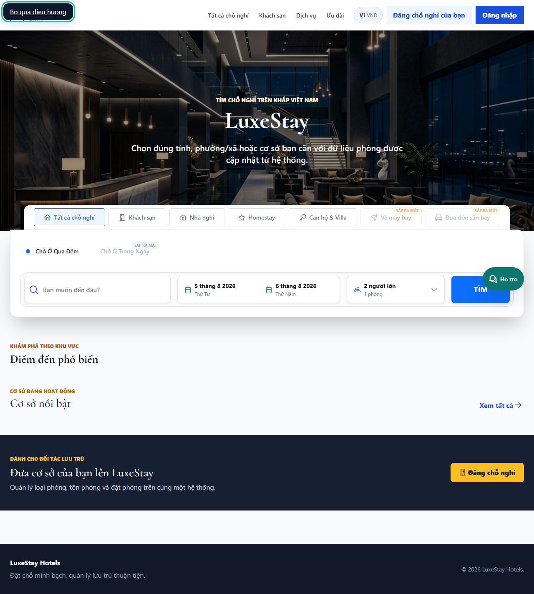
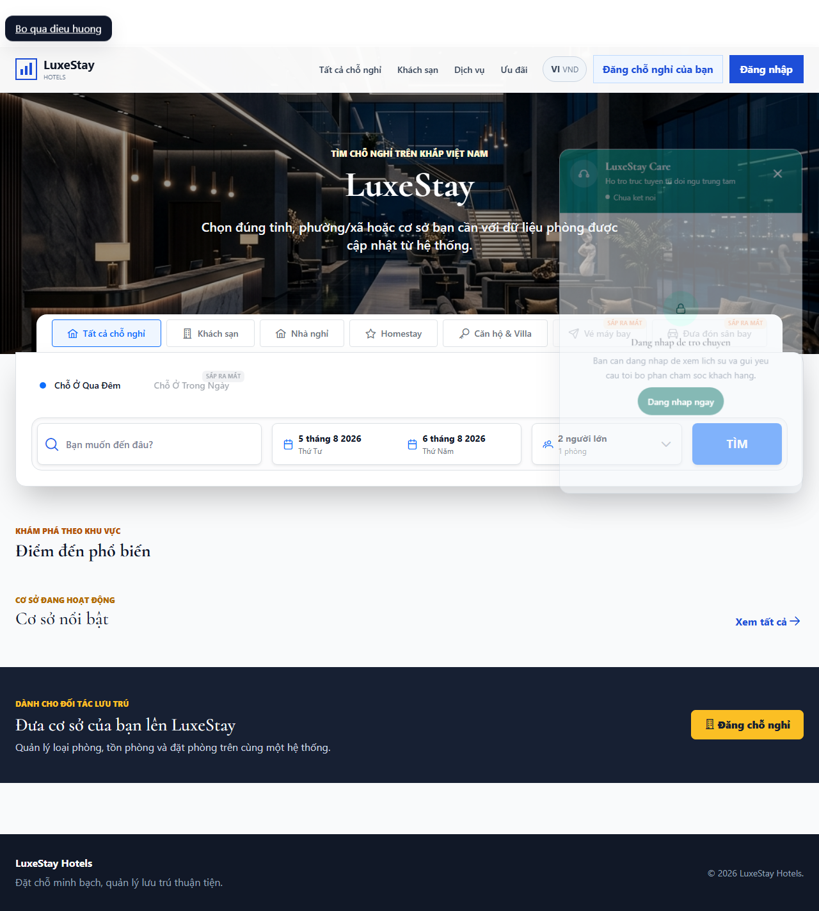
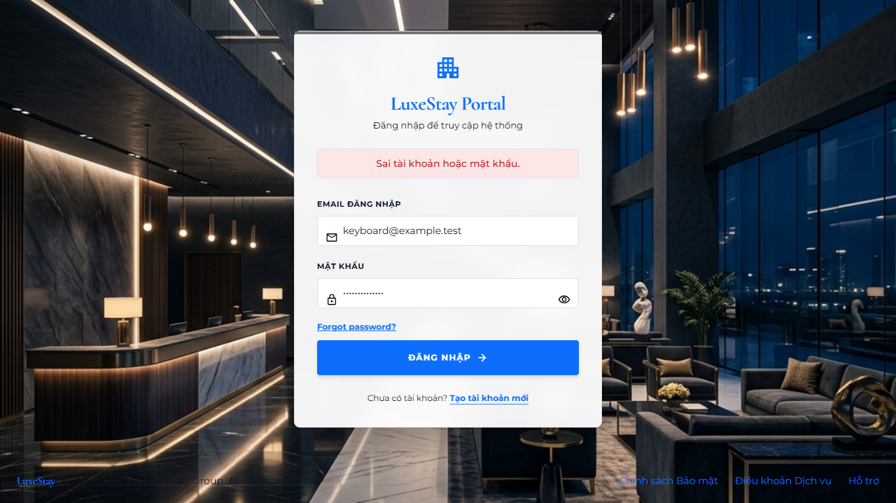
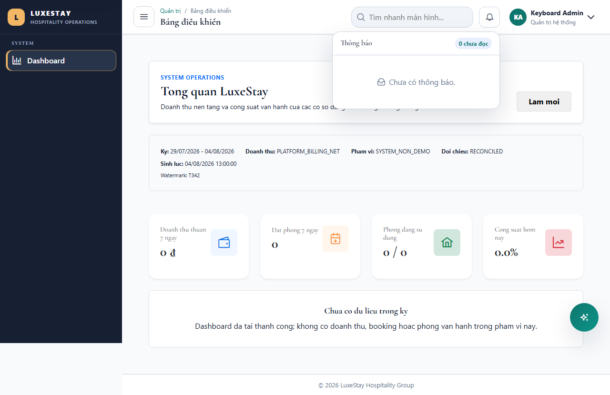

# T342 - Keyboard, focus, labels and live-region semantics

Date: 2026-08-04
Branch: `codex/cross-cutting`

## Outcome

- Added visible-on-focus skip links and focusable main landmarks to client, admin and management shells.
- Added route focus restoration after in-app navigation while preserving the skip link as the initial keyboard entry.
- Added shared error-focus behavior to login, admin login, booking checkout and shared route feedback.
- Enabled PrimeNG focus trapping for form/confirm dialogs and custom focus traps for customer support and AI dialogs.
- Restored focus to notification, profile, mobile navigation, chat and AI triggers after Escape or explicit close.
- Added live status semantics for chat connection/error states and assertive error announcements.
- Upgraded the shared data table with a named region/caption, labeled search/filter/export/action controls, column scopes and Enter/Space row activation.

## Authorization and isolation

- The authenticated browser journey uses the real Angular auth/permission guards with a minimum isolated `SUPER_ADMIN` fixture context.
- Focus behavior does not bypass route authorization or expose hidden actions; permission directives still decide which table actions render.
- Backend tenant isolation, financial policy, schema and migrations are unchanged.

## Verification

| Layer | Command / coverage | Result |
|---|---|---|
| Angular | Focus directives, shared data table, feedback/dialogs, client/management layouts and chat widget | PASS - 20/20 |
| Chromium | `PLAYWRIGHT_PORT=4352 npx playwright test e2e/keyboard-accessibility.spec.ts --project=chromium --workers=1 --retries=0` | PASS - 3/3 journeys |
| Production build | `npm run build` | PASS (existing CSS budget/CommonJS warnings only) |

## Visual evidence

## Recovery

- Schema/configuration change: N/A.
- Rollback: revert the T342 implementation commit to restore prior focus behavior and table markup.
- Forward recovery: reproduce the failing keyboard sequence in `keyboard-accessibility.spec.ts` and fix the shared focus primitive or affected overlay without weakening route permissions.
