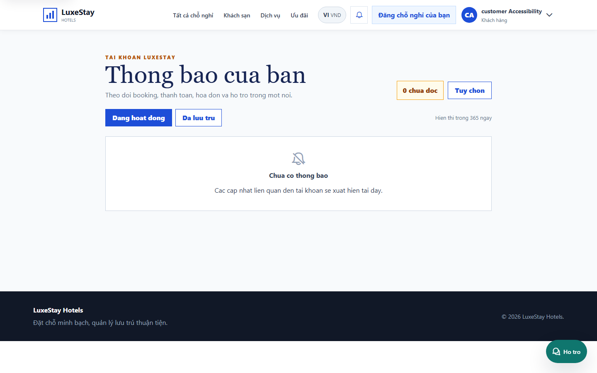
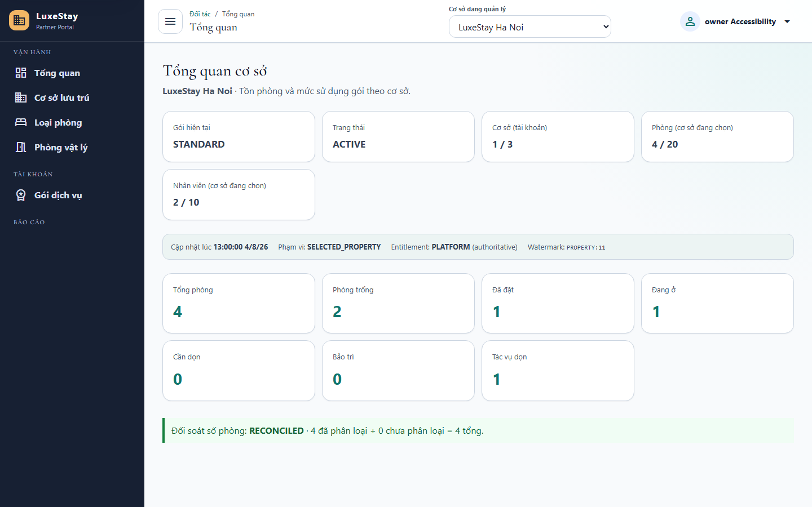
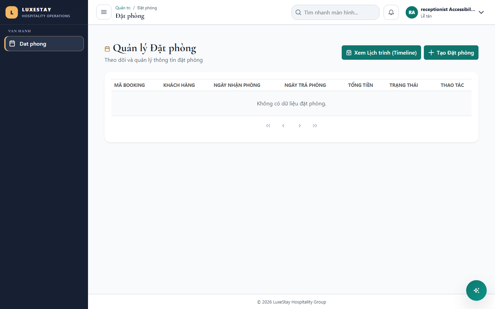
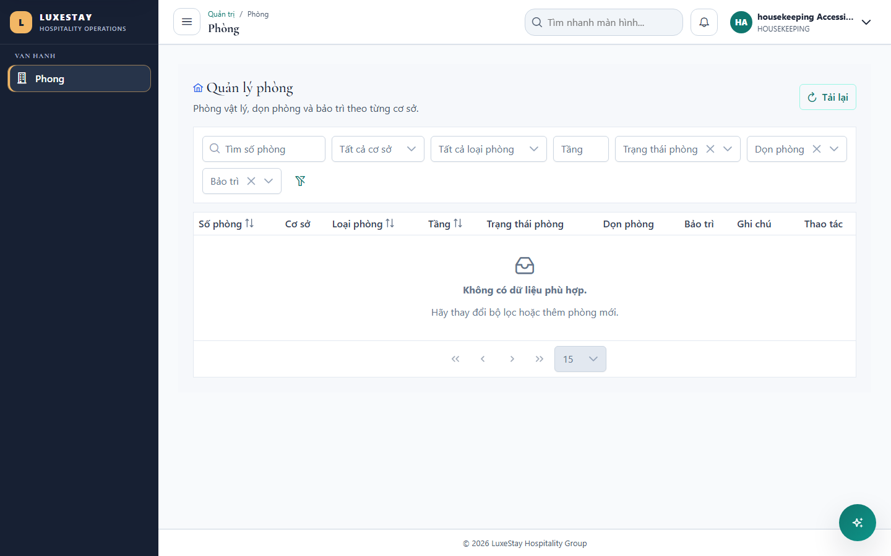
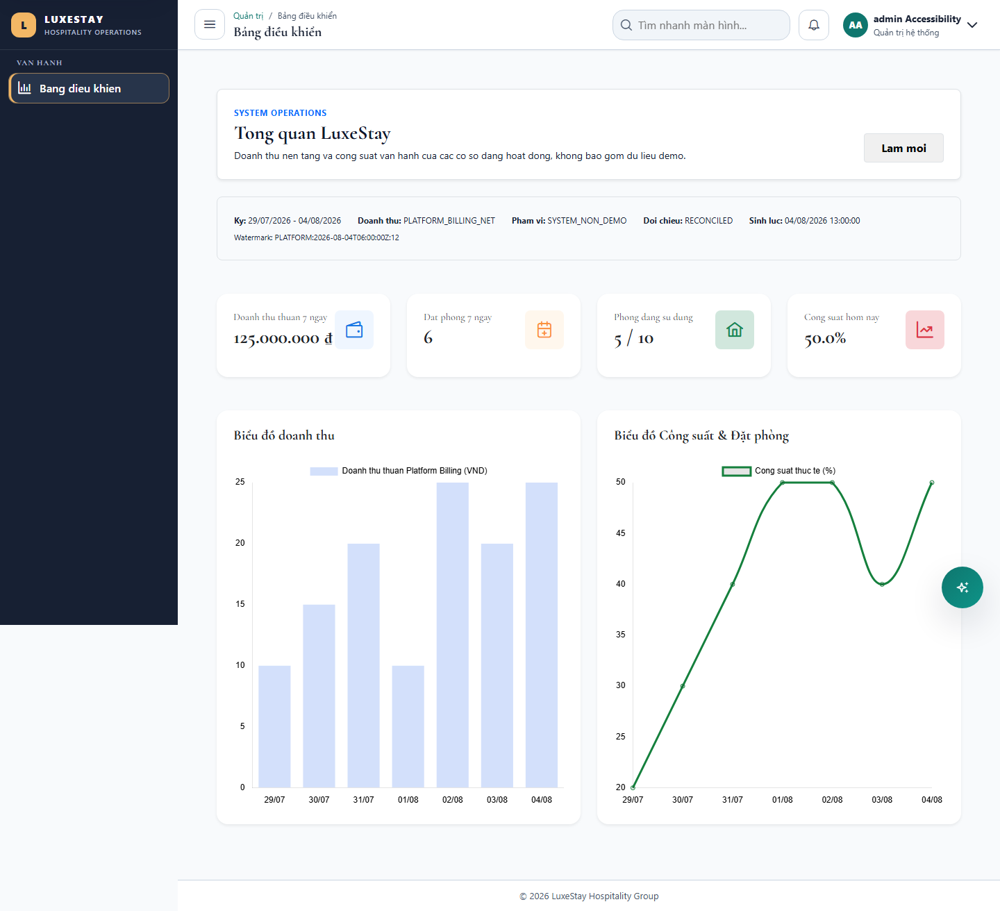

# T343 - Automated accessibility, contrast and screen-reader regression

Date: 2026-08-04
Branch: `codex/cross-cutting`

## Outcome

- Added an axe-core WCAG 2 A/AA release gate across customer, owner, receptionist, housekeeping and system-administrator routes.
- The gate fails every `critical` or `serious` violation and explicitly requires passing color-contrast evidence for each journey.
- Added Chromium accessibility-tree checks requiring a main landmark, a named heading and accessible names for every exposed interactive role.
- Raised the shared muted-text and PrimeNG primary colors to AA-safe values and added accessible names to both system-dashboard chart canvases.

## Role and route coverage

| Role | Route | Screen-reader proxy check | Result |
|---|---|---|---|
| Customer | `/notifications` | Main landmark, named notification heading, named navigation/settings/history controls | PASS |
| Property owner | `/management/dashboard` | Main landmark, named dashboard heading, named property selector and navigation | PASS |
| Receptionist | `/admin/reservations` | Main landmark, named reservation heading, timeline/create controls and table navigation | PASS |
| Housekeeping | `/admin/rooms` | Main landmark, named room heading, filters, reload control and table navigation | PASS |
| System administrator | `/admin/dashboard` | Main landmark, named dashboard heading, named refresh control and named revenue/occupancy chart images | PASS |

The proxy checklist was reviewed from Chromium's full accessibility tree together with the rendered screenshots. It verifies the name/role/value surface available to NVDA/Narrator without claiming a production assistive-technology certification.

## Authorization and isolation

- Every journey uses its intended role and minimum route permission through the real Angular guards.
- The suite rejects forbidden rendering and keeps each role in a separate browser context.
- APIs are deterministic role-scoped fixtures; this task changes no backend data, tenant policy, migration or financial behavior.

## Verification

| Layer | Command / coverage | Result |
|---|---|---|
| Chromium accessibility | `PLAYWRIGHT_PORT=4353 npx playwright test e2e/accessibility-regression.spec.ts --project=chromium --workers=1 --retries=0` | PASS - 1/1 suite, 5/5 critical role journeys |
| Axe severity gate | WCAG 2 A/AA/2.1/2.2 AA tags, including `color-contrast` | PASS - zero critical/serious violations on every route |
| Accessibility tree | Main landmark, named heading and no unnamed interactive roles | PASS - 5/5 routes |
| Accessibility regression group | Responsive matrix, keyboard suite and axe suite | PASS - 5/5 Playwright tests |
| Production build | `npm run build` | PASS (existing CSS budget/CommonJS warnings only) |
| Visual review | Five full-page desktop screenshots | PASS - no clipped, obscured or misleading state observed |

## Visual evidence

## Recovery

- Schema/configuration change: N/A.
- Rollback: revert the T343 implementation commit to remove the scanner dependency, route matrix and contrast/alternative-text fixes.
- Forward recovery: reproduce the affected role route in `accessibility-regression.spec.ts`, fix the shared token or component semantic, and retain the critical/serious release threshold.
